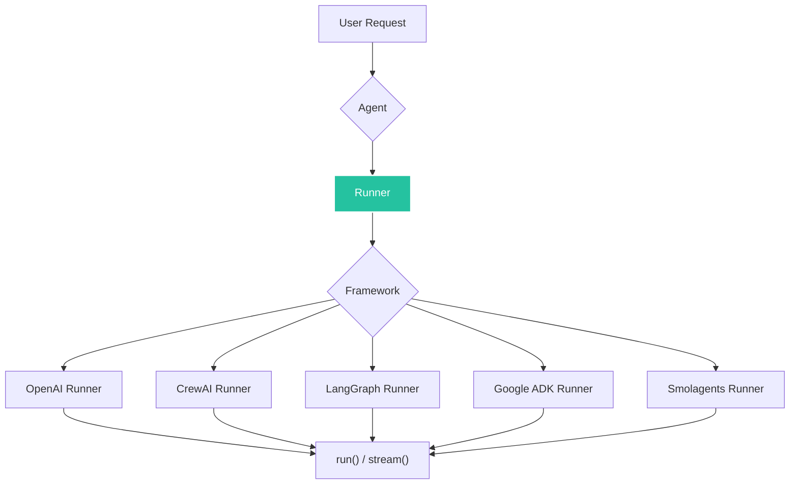
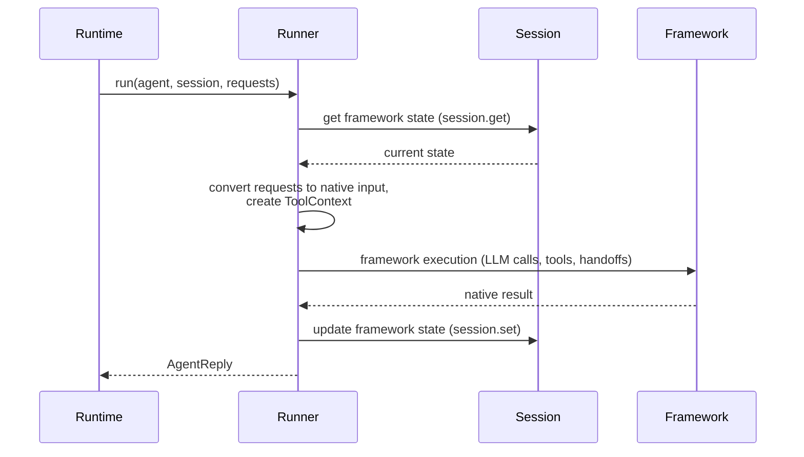

# Runner

The **Runner** encapsulates framework-specific execution strategies, providing a consistent interface for running agents across different frameworks. You can skip this section if you are not planning to contribute to Agent Kernel.

## Overview


```mermaid
graph TB
    A[User Request] --> B{Agent}
    B --> C[Runner]
    C --> D{Framework}
    D --> E[OpenAI Runner]
    D --> F[CrewAI Runner]
    D --> G[LangGraph Runner]
    D --> H[Google ADK Runner]
    D --> I[Smolagents Runner]

    E --> J["run() / stream()"]
    F --> J
    G --> J
    H --> J
    I --> J

    style C fill:#25c2a0,stroke:#fff,stroke-width:2px,color:#fff
```

## What is a Runner?

A Runner:
- **Executes** framework-specific agent logic (`run()`)
- **Streams** token deltas for frameworks that support it (`stream()`)
- **Converts** Agent Kernel request models to framework-native input, and framework output back to `AgentReply` models
- **Manages** framework session state within the Agent Kernel `Session`
- **Creates** the `ToolContext` so tools can access the runtime, agent, session, and requests

## Runner Interface

```python
from abc import ABC, abstractmethod
from typing import AsyncGenerator
from agentkernel.core import Session
from agentkernel.core.model import AgentReply, AgentRequest

class Runner(ABC):
    @abstractmethod
    async def run(self, agent: "Agent", session: Session, requests: list[AgentRequest]) -> AgentReply:
        """Execute the agent with the given requests within the session context."""

    @abstractmethod
    async def stream(self, agent: "Agent", session: Session, requests: list[AgentRequest]) -> AsyncGenerator[str, None]:
        """Yield token deltas for streaming execution (execution.mode: stream)."""
```

- `run()` takes a **list of typed requests** (`AgentRequestText`, `AgentRequestImage`, `AgentRequestFile`, `AgentRequestAny`), not a raw prompt string, and returns an `AgentReply`.
- `stream()` is an async generator of raw token strings. `Runtime.stream()` wraps each delta in a `StreamChunk` and passes it through post-hook filtering before it reaches the client.

## Framework Runners

| Runner | Framework | Native token streaming |
|--------|-----------|------------------------|
| `OpenAIRunner` | OpenAI Agents SDK | ✅ (`Runner.run_streamed`) |
| `LangGraphRunner` | LangGraph | ✅ (`astream_events`) |
| `GoogleADKRunner` | Google ADK | ✅ (SSE streaming mode) |
| `CrewAIRunner` | CrewAI | ❌ raises `NotImplementedError` |
| `SmolagentsRunner` | Smolagents | ❌ raises `NotImplementedError` |

Each runner follows the same shape internally:

```python
class OpenAIRunner(Runner):
    async def run(self, agent, session, requests):
        # 1. Restore framework-specific session state from the AK session
        # 2. Convert AgentRequest models to framework-native input
        # 3. Create ToolContext, execute the framework's run API
        # 4. Save updated framework state back into the session
        # 5. Convert the result to AgentReplyText / AgentReplyImage / AgentReplyAny
```

## Reply Types

Every runner returns an `AgentReply` from `run()`. The union covers three reply models:

| Type | Produced when | Payload |
|------|---------------|---------|
| `AgentReplyText` | The agent produces plain text (default) | `text: str` |
| `AgentReplyImage` | The agent produces text plus an image | `text: str`, `image_data: str` |
| `AgentReplyAny` | The agent is configured for structured output | `content: dict` |

All reply types carry the `prompt` that was sent to the agent.

### Structured replies: `AgentReplyAny` {#structured-replies}

When an agent is configured to produce structured output (see the per-framework
"Structured Output" sections under [Frameworks](../frameworks/overview)), the runner
detects it and returns an `AgentReplyAny` instead of coercing the result to a string:

```python
from agentkernel.core.model import AgentReplyAny

reply = await runner.run(agent, session, requests)
if isinstance(reply, AgentReplyAny):
    data = reply.content          # dict, no re-parsing needed
```

- `content` holds the structured result as a JSON-compatible dict. Pydantic model
  results are converted with `model_dump(mode="json")`.
- `str(reply)` returns the JSON-serialized content, so any consumer that renders
  replies as text (chat integrations, logging, tracing) works unchanged.
- Plain-text agents are unaffected and continue to return `AgentReplyText`.

:::info Streaming limitation
Structured output applies to **non-streaming** execution only. Streamed runs emit
token-by-token text deltas and are not parsed into structured replies.
:::

## Streaming Execution

When `execution.mode: stream` is configured, the pipeline calls `Runner.stream()` instead of `run()`:

```python
async for delta in runner.stream(agent, session, requests):
    print(delta, end="")   # raw token strings
```

In practice you rarely call this directly; use `AgentService.stream_multi()` or the REST API, which wrap the deltas in `StreamChunk` objects (`delta`, `done`, `error`, `session_id`) and run the post-hook `on_stream_chunk()` filter on every token:

```python
async for chunk in service.stream_multi(requests):
    if chunk.error:
        ...
    elif chunk.delta:
        print(chunk.delta, end="")
```

Frameworks without native token streaming (CrewAI, Smolagents) raise `NotImplementedError`; use the default synchronous mode (or `rest_sync` on AWS) with those frameworks.

## Execution Flow


```mermaid
sequenceDiagram
    participant RT as Runtime
    participant R as Runner
    participant S as Session
    participant F as Framework

    RT->>R: run(agent, session, requests)
    R->>S: get framework state (session.get)
    S-->>R: current state
    R->>R: convert requests to native input,<br/>create ToolContext
    R->>F: framework execution (LLM calls, tools, handoffs)
    F-->>R: native result
    R->>S: update framework state (session.set)
    R-->>RT: AgentReply
```

Note that hooks, session locking, and persistence are handled by `Runtime.run()` *around* the runner; the runner itself only deals with framework execution and state conversion. See [Execution Flow](../architecture/execution-flow) for the full pipeline.

## Using Runners

Runners are typically accessed through agents, and invoked via the Runtime (which applies hooks and persistence):

```python
from agentkernel.core import Runtime
from agentkernel.core.model import AgentRequestText

runtime = Runtime.current()
agent = runtime.agents().get("assistant")
session = runtime.sessions().get("user-123") or runtime.sessions().new("user-123")

# Preferred: run through the Runtime so hooks and persistence apply
reply = await runtime.run(agent, session, [AgentRequestText(prompt="Hello")])
```

For most applications, the higher-level [`AgentService`](../architecture/execution-flow#2-request-building-and-agent-resolution) is more convenient than touching runners at all.

## Session Integration

Runners work closely with Sessions to maintain state. Each framework stores its own state under its own key:

```python
async def run(self, agent, session, requests):
    # Get framework-specific state from the AK session
    framework_state = session.get("openai")   # e.g. "openai", "langgraph", ...

    if not framework_state:
        framework_state = self._create_state()

    result = await self._execute(agent, framework_state, requests)

    session.set("openai", framework_state)    # persisted by Runtime after the run
    return result
```

From inside a hook or a tool (i.e. while the agent is executing), read the currently-running
agent's framework state without naming its runner key explicitly via
[`session.get_framework_session()`](./session.md#framework-session-access).

### Per-run framework context {#per-run-framework-context}

In addition to their own internal state, runners honour one reserved session value, the
**framework context** — a framework-agnostic, per-run context/state dict carried across turns. Seed and
read it with `session.set_framework_context()` / `get_framework_context()` from a pre- or post-hook (see
[Session → Framework context / per-run state](./session.md#framework-context--per-run-state)). When a
context is set, a runner:

1. **Loads** a deep copy of the stored context before invoking the framework.
2. **Injects** it into the native framework call (mapped to each framework's own context/state
   mechanism).
3. **Writes back** the produced state — shallow-merged over the loaded copy (framework-touched
   top-level keys win, untouched caller keys are preserved) — but only after the native call
   **succeeds**, so a crashed or disconnected run leaves the previously stored context intact.

**How faithfully a caller dict round-trips is not uniform across frameworks:**

| Framework | Fidelity | Injected as | Written back |
|-----------|----------|-------------|--------------|
| OpenAI | **Full round-trip** | `Runner.run(..., context=ctx)` — tools mutate it in place | the same object, in full |
| Pydantic AI | **Full round-trip** | `agent.run(..., deps=ctx)` — native tools mutate it in place via `RunContext.deps` ([caveats](../frameworks/pydantic-ai.md#per-run-contextstate)) | the same object, in full |
| Google ADK | **Round-trips (filtered), accumulate-only** | merged into the ADK session `state` (AK-internal keys always win, so they cannot be displaced by a caller key) | the accumulated session state, minus AK-internal and `app:`/`user:`/`temp:`-prefixed keys — **tool-added keys survive**, and so does anything else written to the state ([caveats](../frameworks/google-adk.md#per-run-contextstate)) |
| Smolagents | **Round-trips (filtered)** | `agent.run(..., additional_args=ctx)` — which smolagents **also appends to the task prompt** ([caveat](../frameworks/smolagents.md#per-run-contextstate)) | `agent.state` **restricted to pre-seeded keys** — brand-new keys are dropped |
| LangGraph | **Declared channels only** | spread into the graph input alongside `messages` (written last, so a caller key cannot replace it) | only keys the graph's state schema declares as channels (prebuilt agents drop unknown keys) |
| CrewAI | **Unsupported** | not injected | none — a set context is **ignored**, with one warning logged per runner |

Because of this divergence, tool authors who want a context write to be portable across every
framework should **pre-seed every key they intend to write** before the run.

## Best Practices

### Async Execution

Always use `await` when calling runners:

```python
# Correct
reply = await runtime.run(agent, session, requests)

# Incorrect
reply = runtime.run(agent, session, requests)  # Returns coroutine
```

### Error Handling

Wrap execution in try-except:

```python
try:
    reply = await runtime.run(agent, session, requests)
except Exception as e:
    logger.error(f"Runner error: {e}")
    # Handle error appropriately
```

## Summary

- Runners execute framework-specific agent logic and expose both `run()` and `stream()`
- Each framework has its own Runner implementation
- OpenAI Agents SDK, LangGraph, and Google ADK support token streaming; CrewAI and Smolagents do not
- Runners convert typed requests/replies and manage framework session state
- Runners inject the reserved `framework_context` into the native call and write the produced state back on success (fidelity varies per framework)
- Always use async/await, and prefer `Runtime.run()`/`AgentService` over calling runners directly

## Next Steps

- [Session Management](./session)
- [Module Organization](./module)
- [Framework Integration](../frameworks/overview)
- [Execution Flow](../architecture/execution-flow)
