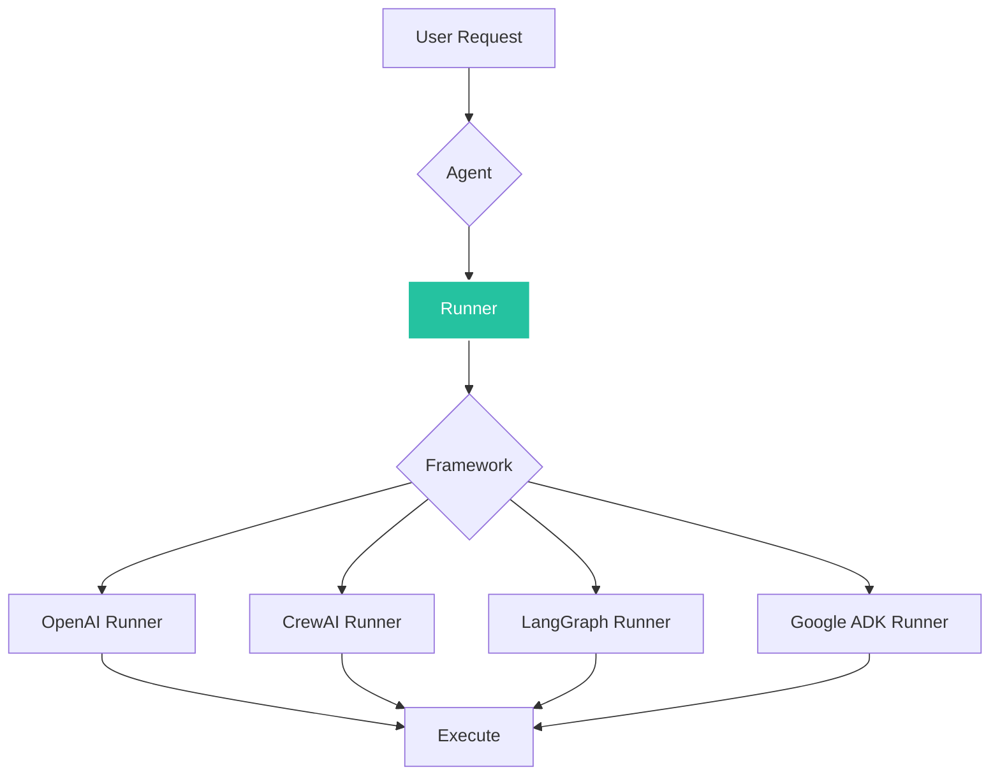
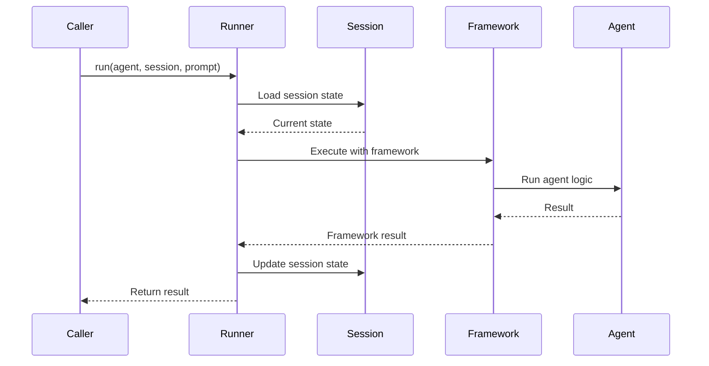

# Runner

The **Runner** encapsulates framework-specific execution strategies, providing a consistent interface for running agents across different frameworks. You can skip this section if you are not planning to contribute to Agent Kernel.

## Overview


```mermaid
graph TB
    A[User Request] --> B{Agent}
    B --> C[Runner]
    C --> D{Framework}
    D --> E[OpenAI Runner]
    D --> F[CrewAI Runner]
    D --> G[LangGraph Runner]
    D --> H[Google ADK Runner]
    
    E --> I[Execute]
    F --> I
    G --> I
    H --> I
    
    style C fill:#25c2a0,stroke:#fff,stroke-width:2px,color:#fff
```

## What is a Runner?

A Runner:
- **Executes** framework-specific agent logic
- **Manages** session state during execution
- **Handles** async/await execution patterns
- **Provides** consistent error handling

## Runner Interface

```python
from agentkernel.core import Runner, Session

class Runner(ABC):
    def __init__(self, name: str):
        self._name = name
    
    @abstractmethod
    async def run(self, agent: Any, session: Session, prompt: Any) -> Any:
        """Run the agent with the provided prompt"""
        pass
```

## Framework Runners

### OpenAI Runner

Executes OpenAI Agents SDK agents:

```python
from agentkernel.openai import OpenAIRunner

class OpenAIRunner(Runner):
    async def run(self, agent, session, prompt):
        # Get or create OpenAI session
        # Execute agent with prompt
        # Return result
```

### CrewAI Runner

Executes CrewAI agents:

```python
from agentkernel.crewai import CrewAIRunner

class CrewAIRunner(Runner):
    async def run(self, agent, session, prompt):
        # Execute CrewAI kickoff
        # Return result
```

### LangGraph Runner

Executes LangGraph compiled graphs:

```python
from agentkernel.langgraph import LangGraphRunner

class LangGraphRunner(Runner):
    async def run(self, agent, session, prompt):
        # Invoke graph with state
        # Handle streaming if enabled
        # Return result
```

## Reply Types

Every runner returns an `AgentReply` from `run()`. The union covers three reply models:

| Type | Produced when | Payload |
|------|---------------|---------|
| `AgentReplyText` | The agent produces plain text (default) | `text: str` |
| `AgentReplyImage` | The agent produces text plus an image | `text: str`, `image_data: str` |
| `AgentReplyAny` | The agent is configured for structured output | `content: dict` |

All reply types carry the `prompt` that was sent to the agent.

### Structured replies — `AgentReplyAny` {#structured-replies}

When an agent is configured to produce structured output (see the per-framework
"Structured Output" sections under [Frameworks](../frameworks/overview)), the runner
detects it and returns an `AgentReplyAny` instead of coercing the result to a string:

```python
from agentkernel.core.model import AgentReplyAny

reply = await runner.run(agent, session, requests)
if isinstance(reply, AgentReplyAny):
    data = reply.content          # dict — no re-parsing needed
```

- `content` holds the structured result as a JSON-compatible dict. Pydantic model
  results are converted with `model_dump(mode="json")`.
- `str(reply)` returns the JSON-serialized content, so any consumer that renders
  replies as text (chat integrations, logging, tracing) works unchanged.
- Plain-text agents are unaffected and continue to return `AgentReplyText`.

:::info Streaming limitation
Structured output applies to **non-streaming** execution only. Streamed runs emit
token-by-token text deltas and are not parsed into structured replies.
:::

## Execution Flow


```mermaid
sequenceDiagram
    participant C as Caller
    participant R as Runner
    participant S as Session
    participant F as Framework
    participant A as Agent
    
    C->>R: run(agent, session, prompt)
    R->>S: Load session state
    S-->>R: Current state
    R->>F: Execute with framework
    F->>A: Run agent logic
    A-->>F: Result
    F-->>R: Framework result
    R->>S: Update session state
    R-->>C: Return result
```

## Using Runners

Runners are typically accessed through agents:

```python
from agentkernel.core import Runtime

runtime = Runtime.get()
agent = runtime.get_agent("assistant")

# Get the runner from the agent
runner = agent.runner

# Execute
result = await runner.run(agent, session, prompt)
```

## Session Integration

Runners work closely with Sessions to maintain state:

```python
async def run(self, agent, session, prompt):
    # Get framework-specific session from AK session
    framework_session = session.get(f"{agent.name}_session")
    
    if not framework_session:
        # Create new framework session
        framework_session = self._create_session()
        session.set(f"{agent.name}_session", framework_session)
    
    # Execute with session
    result = await self._execute(agent, framework_session, prompt)
    
    # Session automatically persisted
    return result
```

## Best Practices

### Async Execution

Always use `await` when calling runners:

```python
# Correct
result = await runner.run(agent, session, prompt)

# Incorrect
result = runner.run(agent, session, prompt)  # Returns coroutine
```

### Error Handling

Wrap runner execution in try-except:

```python
try:
    result = await runner.run(agent, session, prompt)
except Exception as e:
    logger.error(f"Runner error: {e}")
    # Handle error appropriately
```

## Summary

- Runners execute framework-specific agent logic
- Each framework has its own Runner implementation
- Runners manage session state during execution
- Always use async/await pattern

## Next Steps

- [Session Management](./session)
- [Module Organization](./module)
- [Framework Integration](../frameworks/overview)
