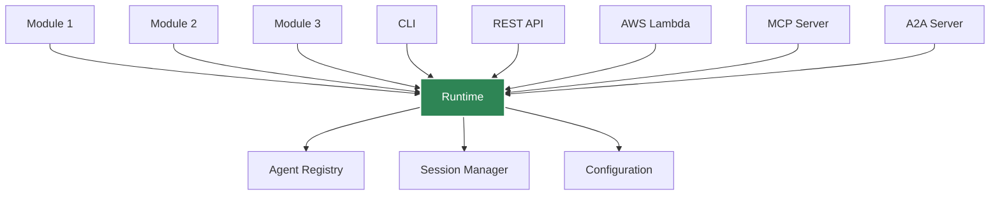
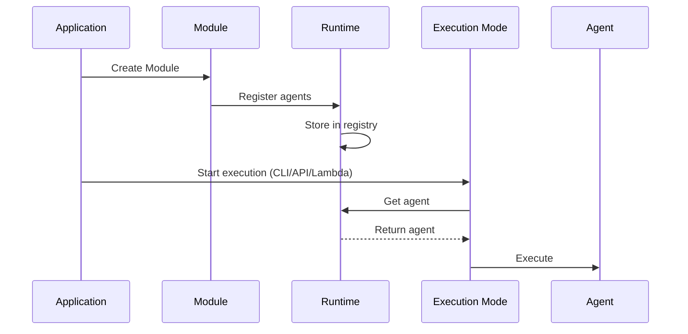

# Runtime

The **Runtime** is the global orchestrator that manages all agents, sessions, and execution across Agent Kernel. You can skip this section if you are not planning to contribute to Aent Kernel.

## Overview



## What is the Runtime?

The Runtime:
- **Maintains** global agent registry
- **Manages** sessions across requests
- **Provides** centralized configuration
- **Coordinates** execution across modes (CLI, API, Lambda)
- **Enables** service integration (MCP, A2A)

## Singleton Pattern

The Runtime uses a singleton pattern - there's only one instance:

```python
from agentkernel.core import Runtime

# Always returns the same instance
runtime1 = Runtime.current()
runtime2 = Runtime.current()

assert runtime1 is runtime2  # True
```

Alternatively you can use it as the context manager for advanced use cases (see below)

## Accessing Agents

### Get Agent by Name

```python
from agentkernel.core import Runtime

runtime = Runtime.current()
agent = runtime.agents().get("assistant")
```

### Get All Agents

```python
runtime = Runtime.current()
all_agents = runtime.agents()

for name, agent in all_agents.items():
    print(f"Agent: {name}")
```

### Check Agent Existence

```python
runtime = Runtime.current()

if "assistant" in runtime.agents():
    agent = runtime.agents()["assistant"]
else:
    print("Agent not found")
```

## Session Management

The Runtime manages sessions through a SessionStore:

```python
from agentkernel.core import Runtime

runtime = Runtime.current()

# Get existing session or create new one
session = runtime.sessions().get("user-123")
if session is None:
    session = runtime.sessions().new("user-123")

# Session is automatically persisted based on configuration
```

**Note**: For detailed information about session management, storage backends, and configuration, see the [Session Management](/docs/core-concepts/session) documentation.

## Configuration

Configuration is accessed through the AKConfig singleton:

```python
from agentkernel.core.config import AKConfig

config = AKConfig.get()

print(config.log_level)
print(config.session.type)  # 'in_memory', 'redis', or 'dynamodb'
```

## Execution Modes

The Runtime supports multiple execution modes:

### CLI Mode

```python
from agentkernel.cli import CLI

# CLI uses Runtime to discover and execute agents
CLI.main()
```

### REST API Mode

```python
from agentkernel.api import RESTAPI

# API server uses Runtime to route requests
RESTAPI.run()
```

### AWS Lambda Mode

```python
from agentkernel.aws import Lambda

# Lambda handler uses Runtime to process events
handler = Lambda.handler
```

### MCP Server Mode

```python
from agentkernel.mcp import MCP

# MCP server exposes agents via Runtime
server = MCP.get()  
```

## Runtime Lifecycle



## Advanced Usage

### Custom Runtime Context

For advanced use cases, you can create a custom runtime instance with specific configuration and use it as a context manager:

```python
from agentkernel.core import Runtime
from agentkernel.core.builder import SessionStoreBuilder

# Create a custom runtime instance
custom_runtime = Runtime(SessionStoreBuilder.build())

# Use it within a context
with custom_runtime:
    # Within this context, Runtime.current() returns custom_runtime
    agent = MyAgent("custom-agent")
    custom_runtime.register(agent)
    session = custom_runtime.sessions().new("session-1")
    
    # Execute agent with this runtime
    from agentkernel.core.model import AgentRequestText
    requests = [AgentRequestText(text="Hello")]
    result = await custom_runtime.run(agent, session, requests)
```

### Accessing the Current Runtime

The `Runtime.current()` static method returns the currently active runtime instance. If called within a runtime context manager, it returns that specific runtime; otherwise, it returns the global singleton:

```python
from agentkernel.core import Runtime
from agentkernel.core.runtime import GlobalRuntime

# Outside any context, returns GlobalRuntime
current = Runtime.current()
assert current == GlobalRuntime.instance()

# Inside a context, returns that runtime
with custom_runtime:
    current = Runtime.current()
    assert current == custom_runtime
```

This pattern is particularly useful when:
- Writing framework integrations that need access to the active runtime
- Building utilities that work with whichever runtime is currently active
- Testing with isolated runtime instances

### Custom Agent Registration

Manually register agents (advanced):

```python
from agentkernel.core import Runtime

runtime = Runtime.current()

# Manually register an agent
runtime.register(custom_agent)
```

## Integration Points

### MCP Integration

```python
# when MCP server is enabled
# AK_MCP_ENABLED=true
```

### A2A Integration

```python
# for all registered agents
# AK_A2A_ENABLED=true
```

### REST API Integration

```python
# GET /agents - list all agents
# POST /api/v1/chat - execute agent
```

## Best Practices

### Single Runtime Instance

Always use `Runtime.current()` for generic usecases:

```python
# Correct
runtime = Runtime.current()

# Don't instantiate directly unless you have a specific need
# runtime = Runtime(sessions)  # Only for advanced use cases
```

### Configuration Before Execution

Set environment variables before importing:

```python
import os
os.environ["AK_SESSION_STORAGE"] = "redis"
os.environ["AK_REDIS_URL"] = "redis://localhost:6379"

# Now import and use
from agentkernel.core import Runtime
runtime = Runtime.current()
```

## Summary

- Runtime is the global orchestrator
- Maintains agent registry
- Manages sessions
- Provides centralized configuration
- Supports multiple execution modes
- Use `Runtime.current()` to access the active runtime instance
- Can be used as a context manager for isolated runtime contexts
- Thread-safe runtime state management with internal locking

## Next Steps

- [Session Management](./session) - Detailed session configuration and lifecycle
- [Deployment Overview](../deployment/overview)
- [REST API](../api/rest-api)
- [Configuration](./configuration)
