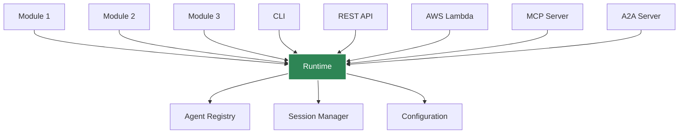
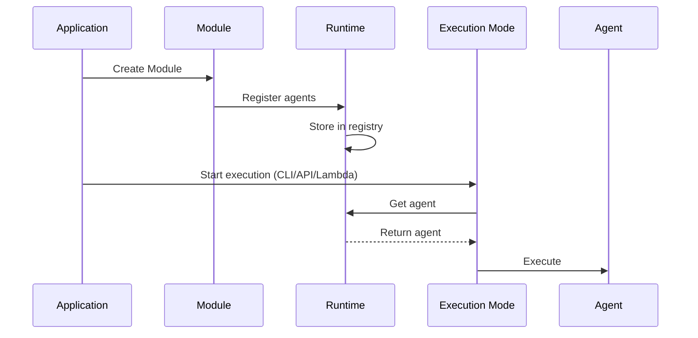

# Runtime

The **Runtime** is the global orchestrator that manages all agents, sessions, and execution across Agent Kernel. You can skip this section if you are not planning to contribute to Aent Kernel.

## Overview



## What is the Runtime?

The Runtime:
- **Maintains** global agent registry
- **Manages** sessions across requests
- **Provides** centralized configuration
- **Coordinates** execution across modes (CLI, API, Lambda)
- **Enables** service integration (MCP, A2A)

## Singleton Pattern

The Runtime uses a singleton pattern - there's only one instance:

```python
from agentkernel.core import Runtime

# Always returns the same instance
runtime1 = Runtime.get()
runtime2 = Runtime.get()

assert runtime1 is runtime2  # True
```

## Accessing Agents

### Get Agent by Name

```python
from agentkernel.core import Runtime

runtime = Runtime.get()
agent = runtime.get_agent("assistant")
```

### Get All Agents

```python
runtime = Runtime.get()
all_agents = runtime.get_all_agents()

for name, agent in all_agents.items():
    print(f"Agent: {name}")
```

### Check Agent Existence

```python
runtime = Runtime.get()

if runtime.has_agent("assistant"):
    agent = runtime.get_agent("assistant")
else:
    print("Agent not found")
```

## Session Management

The Runtime manages sessions through a SessionManager:

```python
from agentkernel.core import Runtime

runtime = Runtime.get()

# Get or create session
session = runtime.get_session("user-123")

# Session is automatically persisted based on configuration
```

**Note**: For detailed information about session management, storage backends, and configuration, see the [Session Management](/docs/core-concepts/session) documentation.

## Configuration

The Runtime provides access to global configuration:

```python
from agentkernel.core import Runtime, AKConfig

runtime = Runtime.get()
config = runtime.config

# Or access directly
config = AKConfig.get()

print(config.log_level)
print(config.session_storage)
```

## Execution Modes

The Runtime supports multiple execution modes:

### CLI Mode

```python
from agentkernel.cli import CLI

# CLI uses Runtime to discover and execute agents
CLI.main()
```

### REST API Mode

```python
from agentkernel.api import RESTAPI

# API server uses Runtime to route requests
RESTAPI.run()
```

### AWS Lambda Mode

```python
from agentkernel.aws import Lambda

# Lambda handler uses Runtime to process events
handler = Lambda.handler
```

### MCP Server Mode

```python
from agentkernel.mcp import MCP

# MCP server exposes agents via Runtime
server = MCP.get()  
```

## Runtime Lifecycle



## Advanced Usage

### Custom Agent Registration

Manually register agents (advanced):

```python
from agentkernel.core import Runtime

runtime = Runtime.get()

# Manually register an agent
runtime.register_agent(custom_agent)
```

## Integration Points

### MCP Integration

```python
# when MCP server is enabled
# AK_MCP_ENABLED=true
```

### A2A Integration

```python
# for all registered agents
# AK_A2A_ENABLED=true
```

### REST API Integration

```python
# GET /agents - list all agents
# POST /run - execute agent
```

## Best Practices

### Single Runtime Instance

Always use `Runtime.get()`:

```python
# Correct
runtime = Runtime.get()

# Don't try to instantiate
# runtime = Runtime()  # Won't work
```

### Configuration Before Execution

Set environment variables before importing:

```python
import os
os.environ["AK_SESSION_STORAGE"] = "redis"
os.environ["AK_REDIS_URL"] = "redis://localhost:6379"

# Now import and use
from agentkernel.core import Runtime
runtime = Runtime.get()
```

## Summary

- Runtime is the global orchestrator
- Maintains agent registry
- Manages sessions
- Provides centralized configuration
- Supports multiple execution modes
- Singleton pattern - use `Runtime.get()`

## Next Steps

- [Session Management](./session) - Detailed session configuration and lifecycle
- [Deployment Overview](../deployment/overview)
- [REST API](../api/rest-api)
- [Configuration](./configuration)
