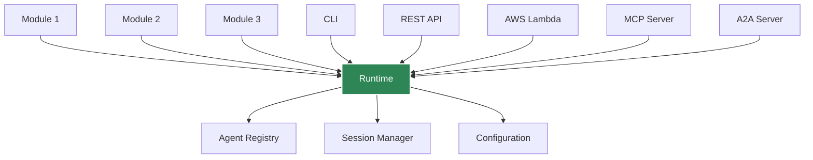
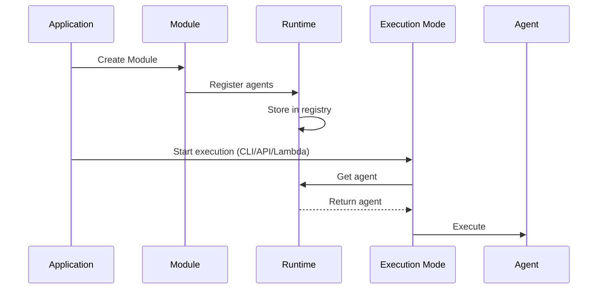

# Runtime

The **Runtime** is the global orchestrator that manages all agents, sessions, and execution across Agent Kernel. You can skip this section if you are not planning to contribute to Agent Kernel.

## Overview


```mermaid
graph TB
    A[Module 1] --> R[Runtime]
    B[Module 2] --> R
    C[Module 3] --> R
    
    R --> D[Agent Registry]
    R --> E[Session Manager]
    R --> F[Configuration]
    
    G[CLI] --> R
    H[REST API] --> R
    I[AWS Lambda] --> R
    J[MCP Server] --> R
    K[A2A Server] --> R
    
    style R fill:#2e8555,stroke:#fff,stroke-width:2px,color:#fff
```

## What is the Runtime?

The Runtime:
- **Maintains** global agent registry
- **Manages** sessions across requests
- **Executes** agents through `run()` (single reply) and `stream()` (one `StreamChunk` per typed stream event)
- **Applies** pre/post hooks around every execution, including system hooks (input/output guardrails, multimodal preprocessing)
- **Coordinates** execution across modes (CLI, API, Lambda, queue consumers)
- **Enables** service integration (MCP, A2A)

## The run() Pipeline

`Runtime.run(agent, session, requests)` is the central execution method used by every surface:

1. Acquires the session lock (`async with session`); concurrent requests for the same session are serialized, and `Session.current()` becomes available.
2. Runs **pre-hooks**: the agent's hooks first, then system hooks (input guardrails, multimodal). A pre-hook can rewrite the request list, or halt execution by returning an `AgentReply`; the agent never runs in that case.
3. Calls `agent.runner.run(agent, session, requests)` for framework execution.
4. Runs **post-hooks**: system hooks (output guardrails) first, then the agent's hooks. Each must return a valid `AgentReply`.
5. Persists the session via the configured `SessionStore`.
6. Clears the session's volatile cache in a `finally` block.

## The stream() Pipeline

`Runtime.stream(agent, session, requests)` is the streaming counterpart (used when `execution.mode: stream`). It shares the same pre-hook pipeline, then:

- Iterates `agent.runner.stream(...)`, which yields **typed events**. Only the text-carrying ones
  (`TextDelta`, `ReasoningDelta`) go through every post-hook's `on_stream_chunk()`; a hook returning
  `None` drops the whole chunk, event included, and a hook that edits the text has its edit written
  back into the event so `delta` and `event` cannot disagree.
- Yields one `StreamChunk` per surviving event — `event` always, and `delta` **only for `TextDelta`**.
  Reasoning is deliberately kept out of `delta`, which is what plain-text clients concatenate as the
  answer and what a recorded thread stores, so boundary and tool-call frames arrive with `delta=None`.
  Then a final `StreamChunk(done=True, session_id=...)`.
- If a pre-hook halts, yields a single `StreamChunk(error=..., done=True)`.
- Stores the session and clears the volatile cache in `finally`, same as `run()`.

```python
async for chunk in runtime.stream(agent, session, requests):
    if chunk.delta:
        print(chunk.delta, end="")
```

## Singleton Pattern

The Runtime uses a singleton pattern - there's only one instance:

```python
from agentkernel.core import Runtime

# Always returns the same instance
runtime1 = Runtime.current()
runtime2 = Runtime.current()

assert runtime1 is runtime2  # True
```

Alternatively you can use it as the context manager for advanced use cases (see below)

## Accessing Agents

### Get Agent by Name

```python
from agentkernel.core import Runtime

runtime = Runtime.current()
agent = runtime.agents().get("assistant")
```

### Get All Agents

```python
runtime = Runtime.current()
all_agents = runtime.agents()

for name, agent in all_agents.items():
    print(f"Agent: {name}")
```

### Check Agent Existence

```python
runtime = Runtime.current()

if "assistant" in runtime.agents():
    agent = runtime.agents()["assistant"]
else:
    print("Agent not found")
```

## Session Management

The Runtime manages sessions through a SessionStore:

```python
from agentkernel.core import Runtime

runtime = Runtime.current()

# Get existing session or create new one
session = runtime.sessions().get("user-123")
if session is None:
    session = runtime.sessions().new("user-123")

# Session is automatically persisted based on configuration
```

**Note**: For detailed information about session management, storage backends, and configuration, see the [Session Management](/docs/core-concepts/session) documentation.

## Configuration

Configuration is accessed through the AKConfig singleton:

```python
from agentkernel.core.config import AKConfig

config = AKConfig.get()

print(config.log_level)
print(config.session.type)  # 'in_memory', 'redis', or 'dynamodb'
```

## Execution Modes

The Runtime supports multiple execution modes:

### CLI Mode

```python
from agentkernel.cli import CLI

# CLI uses Runtime to discover and execute agents
CLI.main()
```

### REST API Mode

```python
from agentkernel.api import RESTAPI

# API server uses Runtime to route requests
RESTAPI.run()
```

### AWS Lambda Mode

```python
from agentkernel.aws import Lambda

# Lambda handler uses Runtime to process events
handler = Lambda.handler
```

### MCP Server Mode

```python
from agentkernel.mcp import MCP

# MCP server exposes agents via Runtime
server = MCP.get()  
```

## Runtime Lifecycle


```mermaid
sequenceDiagram
    participant App as Application
    participant M as Module
    participant R as Runtime
    participant Exec as Execution Mode
    
    App->>M: Create Module
    M->>R: Register agents
    R->>R: Store in registry
    App->>Exec: Start execution (CLI/API/Lambda)
    Exec->>R: Get agent
    R-->>Exec: Return agent
    Exec->>Agent: Execute
```

## Advanced Usage

### Custom Runtime Context

For advanced use cases, you can create a custom runtime instance with specific configuration and use it as a context manager:

```python
from agentkernel.core import Runtime
from agentkernel.core.builder import SessionStoreBuilder

# Create a custom runtime instance
custom_runtime = Runtime(SessionStoreBuilder.build())

# Use it within a context
with custom_runtime:
    # Within this context, Runtime.current() returns custom_runtime
    agent = MyAgent("custom-agent")
    custom_runtime.register(agent)
    session = custom_runtime.sessions().new("session-1")
    
    # Execute agent with this runtime
    from agentkernel.core.model import AgentRequestText
    requests = [AgentRequestText(prompt="Hello")]
    result = await custom_runtime.run(agent, session, requests)
```

### Accessing the Current Runtime

The `Runtime.current()` static method returns the currently active runtime instance. If called within a runtime context manager, it returns that specific runtime; otherwise, it returns the global singleton:

```python
from agentkernel.core import Runtime
from agentkernel.core.runtime import GlobalRuntime

# Outside any context, returns GlobalRuntime
current = Runtime.current()
assert current == GlobalRuntime.instance()

# Inside a context, returns that runtime
with custom_runtime:
    current = Runtime.current()
    assert current == custom_runtime
```

This pattern is particularly useful when:
- Writing framework integrations that need access to the active runtime
- Building utilities that work with whichever runtime is currently active
- Testing with isolated runtime instances

### Custom Agent Registration

Manually register agents (advanced):

```python
from agentkernel.core import Runtime

runtime = Runtime.current()

# Manually register an agent
runtime.register(custom_agent)
```

## Integration Points

### MCP Integration

```python
# when MCP server is enabled
# AK_MCP__ENABLED=true
```

### A2A Integration

```python
# for all registered agents
# AK_A2A__ENABLED=true
```

### REST API Integration

```python
# GET /api/v1/agents - list all agents
# POST /api/v1/chat - execute agent
```

## Best Practices

### Single Runtime Instance

Always use `Runtime.current()` for generic usecases:

```python
# Correct
runtime = Runtime.current()

# Don't instantiate directly unless you have a specific need
# runtime = Runtime(sessions)  # Only for advanced use cases
```

### Configuration Before Execution

Set environment variables before the configuration is first loaded:

```python
import os
os.environ["AK_SESSION__TYPE"] = "redis"
os.environ["AK_SESSION__REDIS__URL"] = "redis://localhost:6379"

# Now import and use
from agentkernel.core import Runtime
runtime = Runtime.current()
```

## Summary

- Runtime is the global orchestrator
- Maintains agent registry
- Manages sessions
- `run()` executes with the full hook pipeline; `stream()` yields one `StreamChunk` per stream event
- Provides centralized configuration
- Supports multiple execution modes
- Use `Runtime.current()` to access the active runtime instance
- Can be used as a context manager for isolated runtime contexts
- Thread-safe runtime state management with internal locking

## Next Steps

- [Session Management](./session) - Detailed session configuration and lifecycle
- [Deployment Overview](../deployment/overview)
- [REST API](../api/rest-api)
- [Configuration](./configuration)
