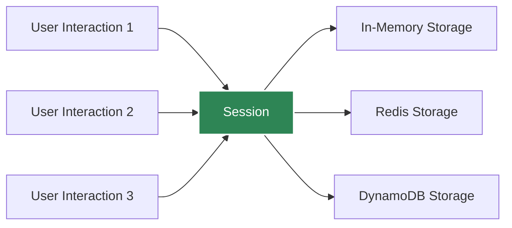
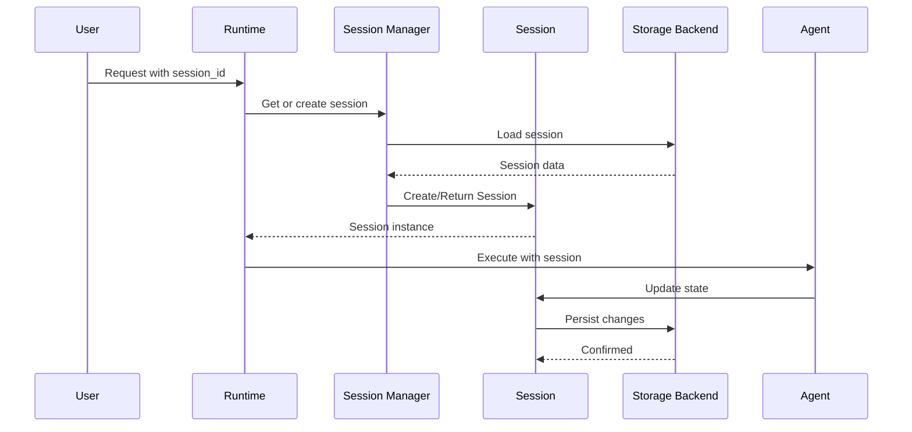

# Session

The **Session** manages conversation state across multiple agent interactions, providing memory and context persistence. Sessions are automatically created and managed.

## Overview



## What is a Session?

A Session:
- **Tracks** conversation history across interactions
- **Persists** state between agent invocations
- **Manages** thread context
- **Supports** multiple storage backends

## Creating Sessions

### In CLI

Sessions are automatically managed:

```python
from agentkernel.cli import CLI

# CLI automatically creates unique session per user
# Session ID is generated automatically
CLI.main()
```

### In API

Sessions are created per 'session_id' and hence indirectly controlled by the API user:

```bash
POST /run
{
  "agent": "assistant",
  "message": "Hello!",
  "session_id": "user-123-conversation-1"
}
```

### Programmatically [Advanced usage]

```python
from agentkernel.core import Session

# Create a new session
session = Session(id="custom-session-id")

# Use with runner
result = await runner.run(agent, session, prompt)
```

## Storage Backends

### In-Memory Storage (Default)

Fast but volatile:

```bash
export AK_SESSION__TYPE=in_memory
```

```python
# Sessions lost when process restarts
# Good for development and testing
```

### Redis Storage

Persistent and scalable:

```bash
export AK_SESSION__TYPE=redis
export AK_SESSION__REDIS__URL=redis://localhost:6379
```

```python
# Sessions persist across restarts
# Good for production
# Supports distributed deployments
```

### DynamoDB Storage

Serverless and fully managed:

```bash
export AK_SESSION__TYPE=dynamodb
export AK_SESSION__DYNAMODB__TABLE_NAME=agent-kernel-sessions
```

```python
# Serverless, auto-scaling storage
# Good for AWS serverless deployments
# No infrastructure to manage
# Pay-per-use pricing
```

## Session Lifecycle



## Session Data

Sessions store framework-specific data:

```python
# Each framework stores its own session data
session.set("openai_assistant_session", openai_session_obj)
session.set("langgraph_state", graph_state)
session.set("crewai_context", crew_context)

# Access later
openai_session = session.get("openai_assistant_session")
```

## Multi-Agent Sessions

Sessions can track multiple agents:

```python
# Same session, different agents
session = Session(id="user-123")

# Agent 1 execution
result1 = await agent1.runner.run(agent1, session, prompt1)
# session.set("agent1_session", ...)

# Agent 2 execution (same session)
result2 = await agent2.runner.run(agent2, session, prompt2)
# session.set("agent2_session", ...)

# Both agents share the same session
# But maintain separate framework-specific state
```

## Thread Management

Sessions support conversation threads:

```python
# Each user conversation gets a unique session
session_id = f"user-{user_id}-thread-{thread_id}"
session = Session(id=session_id)

# Conversation history maintained in session
# Agents have full context of previous interactions
```

## Configuration

Configure session behavior via environment variables:

```bash
# Storage type
export AK_SESSION__TYPE=redis  # Options: 'in_memory', 'redis', 'dynamodb'

# Redis configuration
export AK_SESSION__REDIS__URL=redis://localhost:6379
export AK_SESSION__REDIS__PASSWORD=your-password
export AK_SESSION__REDIS__TTL=3600  # 1 hour
export AK_SESSION__REDIS__PREFIX=ak:sessions:

# DynamoDB configuration
export AK_SESSION__DYNAMODB__TABLE_NAME=agent-kernel-sessions
export AK_SESSION__DYNAMODB__TTL=3600  # 1 hour (0 to disable)
```

## Best Practices

### Unique Session IDs

Use descriptive, unique session IDs:

```python
# Good
session_id = f"user-{user_id}-conversation-{conv_id}"

# Less useful
session_id = "session1"
```

### Session Cleanup

Clean up old sessions in production:

```python
# Redis and DynamoDB sessions can have TTL (time-to-live)
# Configure via AK_SESSION__REDIS__TTL or AK_SESSION__DYNAMODB__TTL
# Sessions automatically expire after inactivity
```

### Context Preservation

Let the framework handle context:

```python
# Don't manually manage conversation history
# Framework runners handle this via session storage

# Just provide prompts
result = await runner.run(agent, session, new_prompt)
# Runner automatically includes previous context
```

## Advanced Usage

### Custom Session Data

Store application-specific data:

```python
# Store custom metadata
session.set("user_preferences", {"language": "en", "theme": "dark"})
session.set("conversation_topic", "mathematics")

# Retrieve later
prefs = session.get("user_preferences")
```

### Session Inspection

Debug session contents:

```python
# List all keys in session
keys = session.get_all_keys()
for key in keys:
    value = session.get(key)
    print(f"{key}: {value}")
```

## Summary

- Sessions manage conversation state and history
- Support in-memory, Redis, and DynamoDB storage
- Automatically handled by Runners
- Enable multi-turn conversations
- Store framework-specific state

## Next Steps

- [Module Organization](./module)
- [Runtime Orchestration](./runtime)
- [Memory Management](../advanced/memory-management)
- [Deployment Configuration](./configuration)
