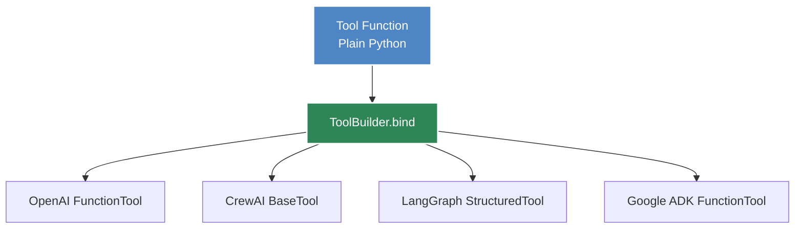

# Tools

Tools allow agents to perform actions and access external data. Agent Kernel provides a **framework-agnostic** way of writing tool functions that work across all supported frameworks — OpenAI Agents SDK, CrewAI, LangGraph, Google ADK, and Smolagents.

## Overview



## Writing Tool Functions

Tool functions are written as regular Python functions. They can be synchronous or asynchronous. The function's name, docstring, and parameter types are used to generate the tool's metadata for the agent framework.

```python
def get_weather(city: str) -> str:
    """Returns the weather for a given city."""
    return f"Weather in {city}: sunny, 25°C"

async def search_database(query: str, limit: int = 10) -> str:
    """Searches the database for matching records."""
    results = await db.search(query, limit=limit)
    return str(results)
```

:::tip
Write clear docstrings for your tool functions — they are used as the tool description that helps the LLM understand when and how to use the tool.
:::

## Binding Tools to Agents

Each framework provides a `ToolBuilder` class that converts your plain Python functions into framework-specific tool definitions. Use the `bind()` class method to transform a list of functions:

import Tabs from '@theme/Tabs';
import TabItem from '@theme/TabItem';

<Tabs>
<TabItem value="openai" label="OpenAI Agents" default>

```python
from agents import Agent
from agentkernel.openai import OpenAIToolBuilder

weather_agent = Agent(
    name="weather",
    instructions="You provide weather information upon request.",
    tools=OpenAIToolBuilder.bind([get_weather]),
)
```

</TabItem>
<TabItem value="crewai" label="CrewAI">

```python
from crewai import Agent
from agentkernel.crewai import CrewAIToolBuilder

weather_agent = Agent(
    role="weather",
    goal="You provide weather information upon request",
    backstory="Use the get_weather tool for weather-related questions.",
    tools=CrewAIToolBuilder.bind([get_weather]),
)
```

</TabItem>
<TabItem value="langgraph" label="LangGraph">

```python
from langgraph.prebuilt import create_react_agent
from agentkernel.langgraph import LangGraphToolBuilder

weather_agent = create_react_agent(
    name="weather",
    tools=LangGraphToolBuilder.bind([get_weather]),
    model=model,
    prompt="Use the get_weather tool for weather-related questions.",
)
```

</TabItem>
<TabItem value="adk" label="Google ADK">

```python
from google.adk.agents import Agent
from agentkernel.adk import GoogleADKToolBuilder

weather_agent = Agent(
    name="weather",
    model="gemini-2.0-flash-exp",
    description="You provide weather information upon request",
    instruction="Use the get_weather tool for weather-related questions.",
    tools=GoogleADKToolBuilder.bind([get_weather]),
)
```

</TabItem>
</Tabs>

## Accessing Context from Tools

Tool functions do **not** declare a context parameter. Instead, you access the execution context from within a tool function by calling `ToolContext.get()`:

```python
from agentkernel.core import ToolContext

def get_weather(city: str) -> str:
    """Returns the weather for a given city."""
    # Access the execution context
    ctx = ToolContext.get()

    session = ctx.session      # The current session
    runtime = ctx.runtime      # The runtime instance
    agent = ctx.agent          # The agent making the tool call
    requests = ctx.requests    # The list of requests being processed

    return f"Weather in {city}: sunny, 25°C"
```

The `ToolContext` is automatically set by the framework runner before each agent invocation and is available anywhere in the call stack during tool execution.

### `ToolContext` Properties

| Property | Type | Description |
|----------|------|-------------|
| `id` | `str` | Unique identifier for this context instance |
| `runtime` | `Runtime` | The runtime instance under which the agent is executing |
| `agent` | `Agent` | The agent instance making the tool call |
| `session` | `Session` | The session associated with the current invocation |
| `requests` | `list[AgentRequest]` | The list of requests being processed |

:::note
`ToolContext.get()` raises a `RuntimeError` if called outside of an agent invocation (i.e., when no context has been set).
:::

## Binding Multiple Tools

You can bind multiple tool functions at once by passing them all in a single list:

```python
def get_weather(city: str) -> str:
    """Returns the weather for a given city."""
    return f"Weather in {city}: sunny"

def get_time(timezone: str) -> str:
    """Returns the current time in a given timezone."""
    return f"Current time in {timezone}: 14:30"

async def search_web(query: str) -> str:
    """Searches the web for information."""
    results = await perform_search(query)
    return str(results)

# Bind all tools together
tools = OpenAIToolBuilder.bind([get_weather, get_time, search_web])
```

Both synchronous and asynchronous functions can be mixed in the same list. The builder preserves the async/sync semantics of each function.

## Complete Example

Here's a full example showing an agent with custom tools:

```python
from agents import Agent as OpenAIAgent
from agentkernel.cli import CLI
from agentkernel.core import ToolContext
from agentkernel.openai import OpenAIModule, OpenAIToolBuilder


def get_weather(city: str) -> str:
    """Returns the current weather for a given city."""
    # Optionally access context
    session = ToolContext.get().session
    return f"The weather in {city} is sunny, 25°C"


def get_news(topic: str, count: int = 5) -> str:
    """Returns the latest news articles on a topic."""
    return f"Top {count} news articles about {topic}: ..."


# Create the agent with bound tools
weather_agent = OpenAIAgent(
    name="weather",
    instructions="You provide weather and news information.",
    tools=OpenAIToolBuilder.bind([get_weather, get_news]),
)

OpenAIModule([weather_agent])

if __name__ == "__main__":
    CLI.main()
```

## Framework Portability

Because tool functions are written as plain Python, the same functions can be reused across frameworks. Only the `ToolBuilder` class changes:

```python
# Same tool function
def get_weather(city: str) -> str:
    """Returns the weather for a given city."""
    return f"Weather in {city}: sunny"

# Use with any framework
from agentkernel.openai import OpenAIToolBuilder
from agentkernel.crewai import CrewAIToolBuilder
from agentkernel.langgraph import LangGraphToolBuilder
from agentkernel.adk import GoogleADKToolBuilder

openai_tools = OpenAIToolBuilder.bind([get_weather])
crewai_tools = CrewAIToolBuilder.bind([get_weather])
langgraph_tools = LangGraphToolBuilder.bind([get_weather])
adk_tools = GoogleADKToolBuilder.bind([get_weather])
```

This makes it easy to migrate agents between frameworks without rewriting tool logic.

## Error Handling

| Scenario | Error |
|----------|-------|
| Passing a non-callable to `bind()` | `TypeError` |
| Calling `ToolContext.get()` outside of an agent invocation | `RuntimeError` |

## Next Steps

- [Agent](./agent) — Learn about agent wrapping and identification
- [Runner](./runner) — Understand execution strategies
- [Framework Integration](../frameworks/overview) — Framework-specific details
