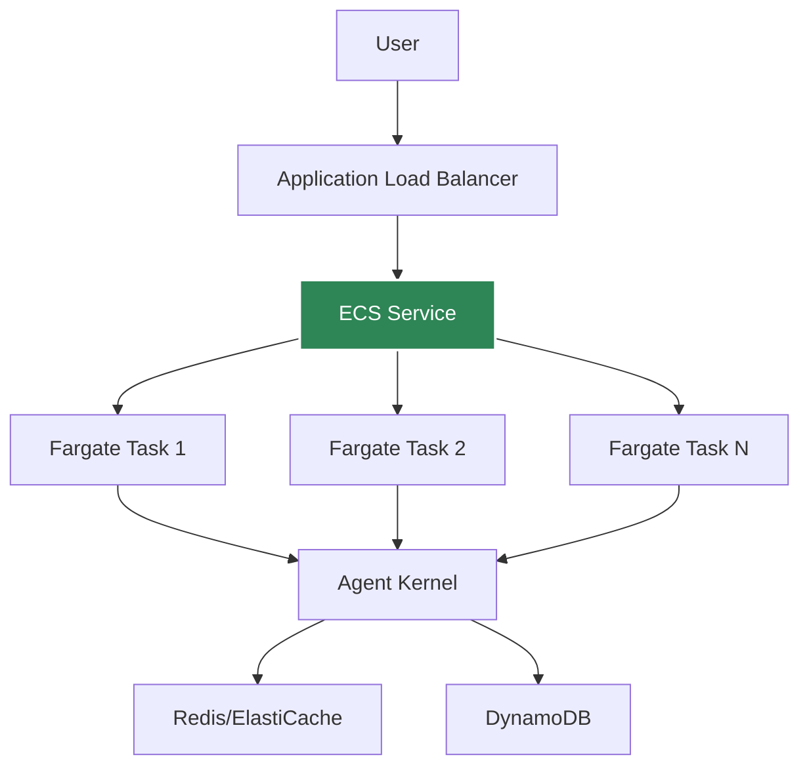
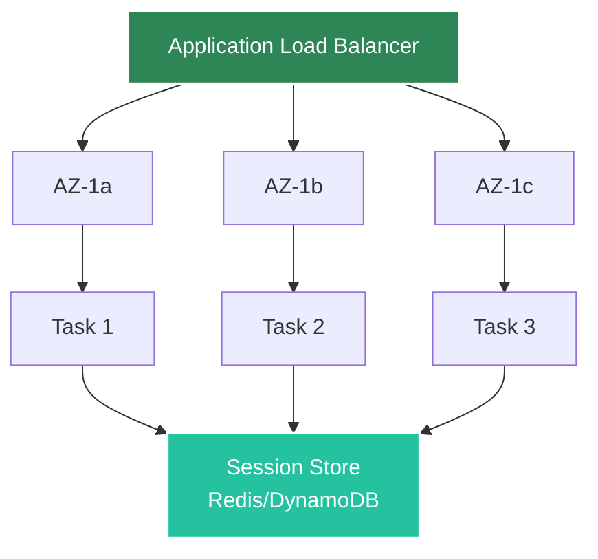

# AWS Containerized Deployment

Deploy agents to AWS ECS Fargate for consistent, low-latency execution.

## Architecture



## Prerequisites

- Docker installed
- AWS CLI configured
- ECR repository created
- Agent Kernel with AWS extras

## Deployment

Refer to [example ECS implementation](https://github.com/yaalalabs/agent-kernel/tree/develop/examples/aws-containerized/crewai) which leverages Agent Kernel's [terraform module](https://registry.terraform.io/modules/yaalalabs/ak-containerized/aws) for ECS deployment.

## Advantages

- **No cold starts** - containers always warm
- **Consistent performance** - predictable latency
- **Better for high traffic** - efficient resource usage
- **Full control** - customize container, resources, etc.
- **High availability** - multi-AZ deployment with automatic failover
- **Fault tolerant** - automatic recovery and health-based routing

## Fault Tolerance

AWS ECS deployment provides comprehensive fault tolerance features with extensive configurability.

### Multi-AZ Architecture

Tasks are automatically distributed across multiple Availability Zones:



**Benefits:**
- Survives entire AZ failures
- No single point of failure
- Automatic traffic distribution
- Geographic redundancy

### Automatic Task Recovery

ECS Service maintains desired task count with automatic recovery:

**Features:**
- Failed tasks automatically restarted
- Desired count maintained at all times
- Rolling deployments with zero downtime
- Gradual task replacement during updates

### Health Check Configuration

Application Load Balancer performs continuous health monitoring:

**How it works:**
1. ALB sends requests to `/health` endpoint every 30 seconds
2. Unhealthy tasks removed from load balancer rotation
3. Traffic routed only to healthy tasks
4. Failed tasks replaced automatically
5. Connection draining ensures graceful shutdown

### Auto-Scaling for Resilience (Available soon)

ECS Service auto-scaling maintains capacity during failures and load spikes.

**Auto-scaling triggers:**
- CPU utilization
- Memory utilization
- Request count per target
- Custom CloudWatch metrics

**Benefits:**
- Automatic capacity adjustment
- Handles traffic spikes
- Compensates for task failures
- Cost optimization during low traffic

### Network Resilience

**Connection Draining:**
- Existing connections complete before task termination
- Configurable timeout (default 30 seconds)
- Prevents abrupt connection drops
- Graceful shutdown process

**Load Balancer Features:**
- Sticky sessions (optional) for stateful apps
- Cross-zone load balancing enabled
- Health-based routing
- Automatic DNS failover

### Recovery Time Objectives

**Typical Recovery Times:**
- Task failure detection: 5-30 seconds (health check interval)
- Task replacement: 30-60 seconds (container startup)
- Traffic rerouting: Immediate (ALB handles)
- **Total RTO**: < 2 minutes for most failures

**Recovery Point Objectives:**
- With DynamoDB: Continuous (multi-AZ replication)
- With Redis Cluster: < 1 second (automatic failover)

### Configuration Best Practices

**Minimum Task Count**: Run at least 2 tasks (3+ recommended)
   ```hcl
   ecs_desired_count = 3
   ```

### Testing Fault Tolerance

**Simulate Failures:**
```bash
# Stop a task to test auto-recovery
aws ecs stop-task --cluster my-cluster --task task-id

# Kill a container to test health checks
docker stop container-id

# Simulate AZ failure (in test environment)
# Manually stop all tasks in one AZ
```

**Validate:**
- Tasks automatically restarted
- No service interruption
- Load balanced across remaining tasks
- Metrics show recovery

[Learn more about fault tolerance →](../core-concepts/fault-tolerance)

## Session Storage

For containerized deployments, use Redis or DynamoDB for session persistence:

### ElastiCache Redis (Traditional Approach)

```bash
export AK_SESSION__TYPE=redis
export AK_SESSION__REDIS__URL=redis://elasticache-endpoint:6379
```

**Benefits:**
- High performance
- Low latency
- In-memory speed
- Shared cache across tasks

**Use when:**
- You need sub-millisecond latency
- High throughput requirements
- Already using Redis infrastructure

### DynamoDB (Serverless Option)

```bash
export AK_SESSION__TYPE=dynamodb
export AK_SESSION__DYNAMODB__TABLE_NAME=agent-kernel-sessions
export AK_SESSION__DYNAMODB__TTL=3600  # 1 hour
```

**Benefits:**
- Fully managed, serverless
- Auto-scaling
- No infrastructure to maintain
- Pay-per-use pricing
- No VPC complexity

**Use when:**
- You want serverless infrastructure
- Moderate latency is acceptable (single-digit milliseconds)
- Simplified infrastructure management
- AWS-native integration preferred

**Requirements:**
- DynamoDB table with partition key `session_id` (String) and sort key `key` (String)
- ECS Task IAM role with DynamoDB permissions
- The Terraform module automatically creates the table and configures permissions when `create_dynamodb_memory_table = true`

## Monitoring

Use CloudWatch Container Insights:
- CPU/Memory utilization
- Task count
- Network metrics
- Application logs

## Health Checks

Agent Kernel provides a health endpoint:

```python
# Automatically available at /health
# Returns 200 OK if healthy
```

## Application Endpoints

Users can expose their own API endpoints alongside the Agent Kernel endpoints without having to do any custom implementation. Refer to [example](https://github.com/yaalalabs/agent-kernel/tree/develop/examples/aws-containerized/crewai).


## Best Practices

- Use at least 2 tasks for high availability
- Configure auto-scaling based on traffic
- Use Redis for session persistence when latency is critical
- Use DynamoDB for session persistence for serverless-style infrastructure
- Enable Container Insights for monitoring
- Set up log aggregation
- Use secrets manager for API keys

## Example Deployment

See [examples/aws-containerized](https://github.com/yaalalabs/agent-kernel/tree/develop/examples/aws-containerized)
