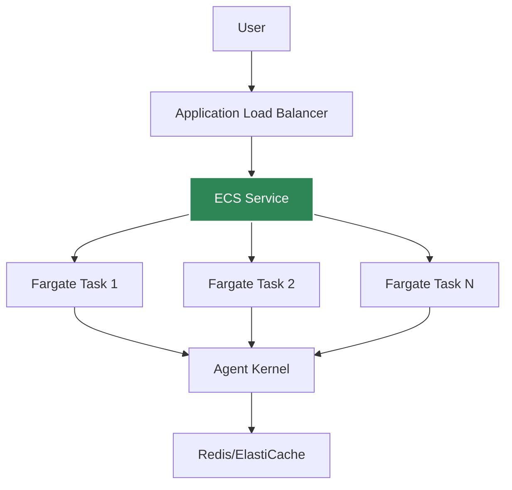

# AWS Containerized Deployment

Deploy agents to AWS ECS Fargate for consistent, low-latency execution.

## Architecture



## Prerequisites

- Docker installed
- AWS CLI configured
- ECR repository created
- Agent Kernel with AWS extras

## Deployment

### 1. Create Dockerfile

```dockerfile
FROM python:3.12-slim

WORKDIR /app

COPY requirements.txt .
RUN pip install -r requirements.txt

COPY my_agent.py .

ENV AK_MODE=api
ENV AK_API_PORT=8000

CMD ["python", "my_agent.py", "--mode", "api", "--port", "8000"]
```

### 2. Build and Push

```bash
# Build
docker build -t my-agent .

# Tag
docker tag my-agent:latest {account}.dkr.ecr.us-east-1.amazonaws.com/my-agent:latest

# Push
docker push {account}.dkr.ecr.us-east-1.amazonaws.com/my-agent:latest
```

### 3. Deploy to ECS

```bash
ak-deploy --profile containerized --region us-east-1
```

Or use the provided CDK/Terraform templates.

## ECS Configuration

### Task Definition

```json
{
  "family": "agent-kernel-task",
  "cpu": "512",
  "memory": "1024",
  "networkMode": "awsvpc",
  "containerDefinitions": [{
    "name": "agent",
    "image": "{account}.dkr.ecr.us-east-1.amazonaws.com/my-agent:latest",
    "portMappings": [{
      "containerPort": 8000,
      "protocol": "tcp"
    }],
    "environment": [
      {"name": "AK_SESSION_STORAGE", "value": "redis"},
      {"name": "AK_REDIS_URL", "value": "redis://..."}
    ]
  }]
}
```

### Service Configuration

```yaml
service:
  desiredCount: 2
  loadBalancer:
    type: application
    targetGroup:
      port: 8000
      healthCheck:
        path: /health
        interval: 30
  autoScaling:
    minCapacity: 2
    maxCapacity: 10
    targetCPUUtilization: 70
```

## Advantages

- **No cold starts** - containers always warm
- **Consistent performance** - predictable latency
- **Better for high traffic** - efficient resource usage
- **Full control** - customize container, resources, etc.

## Session Storage

Use ElastiCache Redis:

```bash
export AK_SESSION_STORAGE=redis
export AK_REDIS_URL=redis://elasticache-endpoint:6379
```

## Monitoring

Use CloudWatch Container Insights:
- CPU/Memory utilization
- Task count
- Network metrics
- Application logs

## Health Checks

Agent Kernel provides a health endpoint:

```python
# Automatically available at /health
# Returns 200 OK if healthy
```

Configure ALB health check:

```yaml
healthCheck:
  path: /health
  interval: 30
  timeout: 5
  healthyThreshold: 2
  unhealthyThreshold: 3
```

## Best Practices

- Use at least 2 tasks for high availability
- Configure auto-scaling based on traffic
- Use Redis for session persistence
- Enable Container Insights for monitoring
- Set up log aggregation
- Use secrets manager for API keys

## Example Deployment

See [examples/aws-containerized](https://github.com/yaalalabs/agent-kernel/tree/main/examples/aws-containerized)
