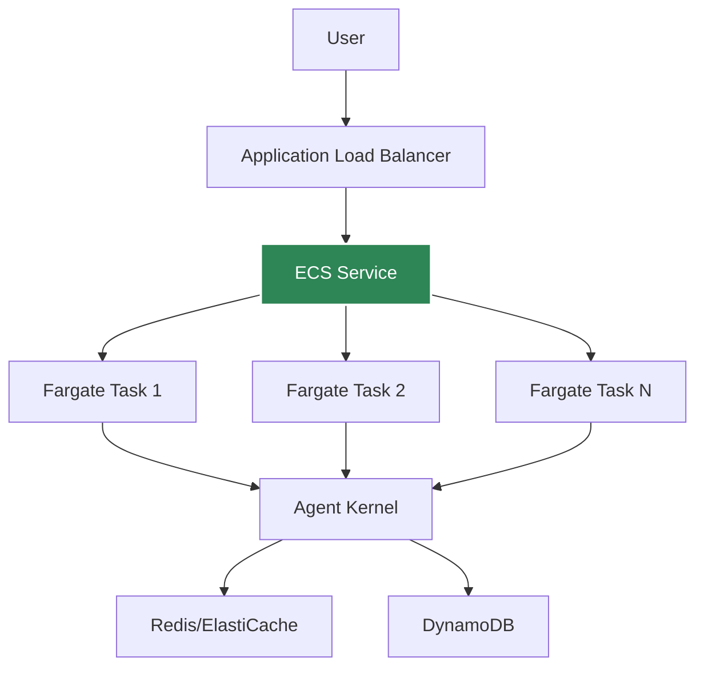

# AWS Containerized Deployment

Deploy agents to AWS ECS Fargate for consistent, low-latency execution.

## Architecture



## Prerequisites

- Docker installed
- AWS CLI configured
- ECR repository created
- Agent Kernel with AWS extras

## Deployment

Refer to [example ECS implementation](https://github.com/yaalalabs/agent-kernel/tree/develop/examples/aws-containerized/crewai) which leverages Agent Kernel's [terraform module](https://registry.terraform.io/modules/yaalalabs/ak-containerized/aws) for ECS deployment.

## Advantages

- **No cold starts** - containers always warm
- **Consistent performance** - predictable latency
- **Better for high traffic** - efficient resource usage
- **Full control** - customize container, resources, etc.

## Session Storage

For containerized deployments, use Redis or DynamoDB for session persistence:

### ElastiCache Redis (Traditional Approach)

```bash
export AK_SESSION__TYPE=redis
export AK_SESSION__REDIS__URL=redis://elasticache-endpoint:6379
```

**Benefits:**
- High performance
- Low latency
- In-memory speed
- Shared cache across tasks

**Use when:**
- You need sub-millisecond latency
- High throughput requirements
- Already using Redis infrastructure

### DynamoDB (Serverless Option)

```bash
export AK_SESSION__TYPE=dynamodb
export AK_SESSION__DYNAMODB__TABLE_NAME=agent-kernel-sessions
export AK_SESSION__DYNAMODB__TTL=3600  # 1 hour
```

**Benefits:**
- Fully managed, serverless
- Auto-scaling
- No infrastructure to maintain
- Pay-per-use pricing
- No VPC complexity

**Use when:**
- You want serverless infrastructure
- Moderate latency is acceptable (single-digit milliseconds)
- Simplified infrastructure management
- AWS-native integration preferred

**Requirements:**
- DynamoDB table with partition key `session_id` (String) and sort key `key` (String)
- ECS Task IAM role with DynamoDB permissions
- The Terraform module automatically creates the table and configures permissions when `create_dynamodb_memory_table = true`

## Monitoring

Use CloudWatch Container Insights:
- CPU/Memory utilization
- Task count
- Network metrics
- Application logs

## Health Checks

Agent Kernel provides a health endpoint:

```python
# Automatically available at /health
# Returns 200 OK if healthy
```

## Application Endpoints

Users can expose their own API endpoints alongside the Agent Kernel endpoints without having to do any custom implementation. Refer to [example](https://github.com/yaalalabs/agent-kernel/tree/develop/examples/aws-containerized/crewai).


## Best Practices

- Use at least 2 tasks for high availability
- Configure auto-scaling based on traffic
- Use Redis for session persistence when latency is critical
- Use DynamoDB for session persistence for serverless-style infrastructure
- Enable Container Insights for monitoring
- Set up log aggregation
- Use secrets manager for API keys

## Example Deployment

See [examples/aws-containerized](https://github.com/yaalalabs/agent-kernel/tree/develop/examples/aws-containerized)
