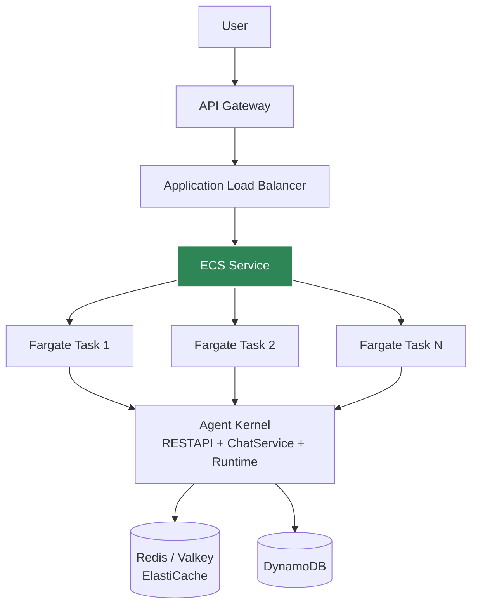
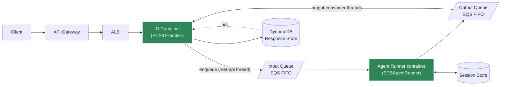
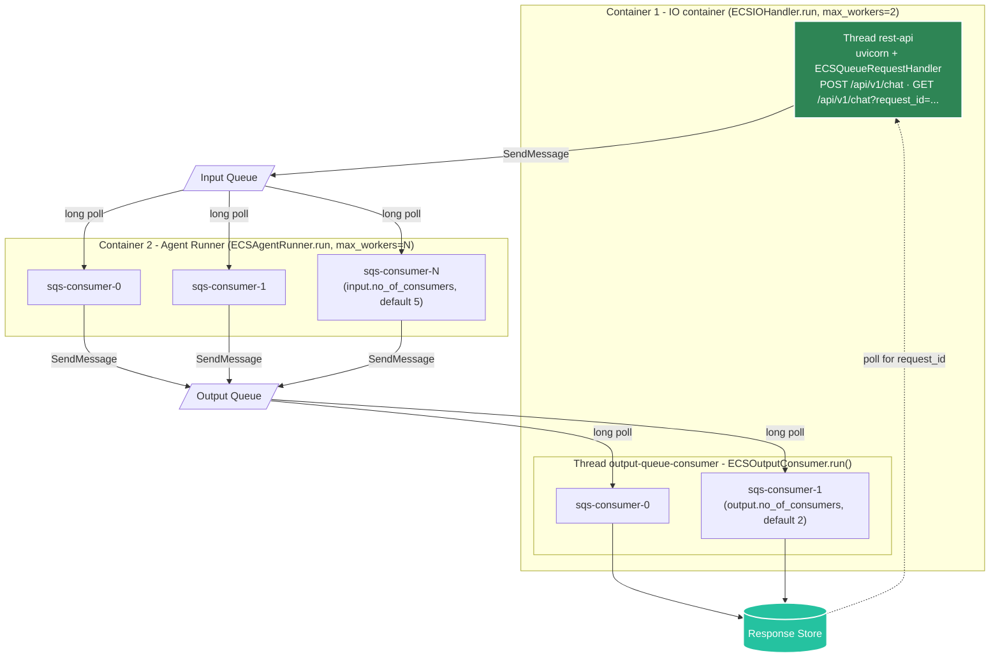
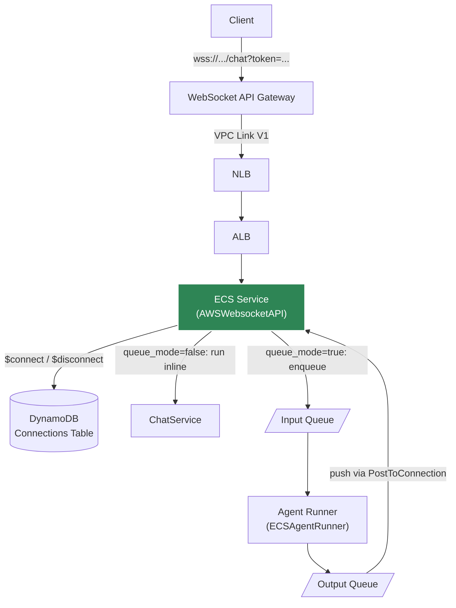
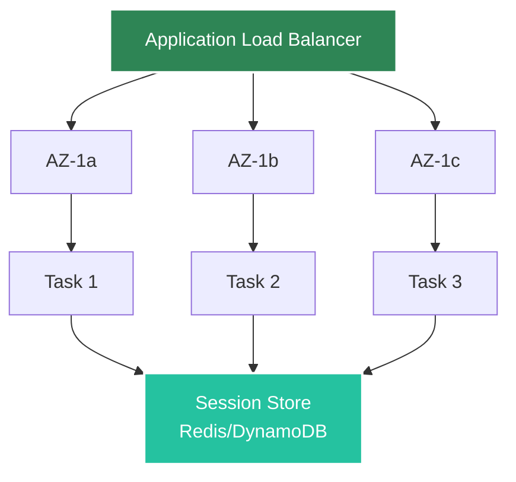

# AWS Containerized Deployment

Deploy agents to AWS ECS Fargate for consistent, low-latency execution.

Three topologies are supported:

| Mode | Containers | Selected by | Best for |
|------|-----------|-------------|----------|
| **Simple REST** | One (runs `RESTAPI`) | `queue_mode = false` (default) in Terraform; app entrypoint `RESTAPI.run` | Moderate traffic, simplest setup |
| **Scalable queue mode** | Two (IO container + Agent Runner service) | `queue_mode = true`, `execution_mode = "rest_sync"` or `"rest_async"` in Terraform; entrypoints `ECSIOHandler.run` + `ECSAgentRunner.run`; `execution.queues.*` config | High throughput, long-running agents, backpressure control |
| **WebSocket mode** | One (direct) or two (queue, same split as above) | `execution_mode = "async"` (or `"stream"`, accepted but not yet implemented) in Terraform | Real-time, bidirectional, connection-based interactions |

:::note Protocol support
ECS containers serve JSON REST by default. **SSE token streaming** (`execution.mode: stream`) is available in the **Simple REST** topology (single container running `RESTAPI`) with streaming-capable frameworks. **WebSocket mode** (`execution_mode = "async"`) is also available on ECS via a WebSocket API Gateway — see [WebSocket Mode](#websocket-mode) below. `"stream"` validates as a Terraform value but the containerized WebSocket handler does not yet implement token-by-token delivery; use `"async"` until containerized WebSocket streaming lands.
:::

## Simple REST Architecture

A single ECS service runs the built-in FastAPI server; request handling and agent execution happen in the same container.


```mermaid
graph TB
    A[User] --> B[API Gateway]
    B --> LB[Application Load Balancer]
    LB --> C[ECS Service]
    C --> D[Fargate Task 1]
    C --> E[Fargate Task 2]
    C --> F[Fargate Task N]

    D --> G["Agent Kernel<br/>RESTAPI + ChatService + Runtime"]
    E --> G
    F --> G

    G --> H[(Redis / Valkey<br/>ElastiCache)]
    G --> I[(DynamoDB)]

    style C fill:#2e8555,stroke:#fff,stroke-width:2px,color:#fff
```

**Entrypoint (`app.py`)**:

```python
from agentkernel.api import RESTAPI
from agentkernel.openai import OpenAIModule

OpenAIModule([...])

runner = RESTAPI.run

if __name__ == "__main__":
    runner()
```

## Prerequisites

- Docker installed
- AWS CLI configured
- ECR repository created
- Agent Kernel with AWS extras

## Deployment

Refer to [example ECS implementation](https://github.com/yaalalabs/agent-kernel/tree/develop/examples/aws-containerized/crewai) which leverages Agent Kernel's [terraform module](https://registry.terraform.io/modules/yaalalabs/ak-containerized/aws) for ECS deployment.

## Scalable Queue Mode

For high-throughput or long-running agents, use the two-container queue architecture.
The IO container and the Agent Runner are separate ECS services sharing SQS FIFO queues, so request ingestion and agent execution scale independently.


```mermaid
graph LR
    A[Client] --> B[API Gateway]
    B --> C[ALB]
    C --> D["IO Container<br/>(ECSIOHandler)"]

    D -->|"enqueue (rest-api thread)"| E[/Input Queue<br/>SQS FIFO/]
    E --> G["Agent Runner container<br/>(ECSAgentRunner)"]
    G --> F[/Output Queue<br/>SQS FIFO/]
    F -->|"output-consumer threads"| D
    D --> H[(DynamoDB<br/>Response Store)]
    H -.->|poll| D

    G <--> S[(Session Store)]

    style D fill:#2e8555,stroke:#fff,stroke-width:2px,color:#fff
    style G fill:#2e8555,stroke:#fff,stroke-width:2px,color:#fff
```

### Multi-Threading Design

Both containers are internally multi-threaded, managed by `ThreadRunner` (one daemon `threading.Thread` per task, gated by a semaphore, with uniform crash/shutdown handling):


```mermaid
graph TB
    subgraph IO["Container 1 - IO container (ECSIOHandler.run, max_workers=2)"]
        T1["Thread rest-api<br/>uvicorn + ECSQueueRequestHandler<br/>POST /api/v1/chat · GET /api/v1/chat?request_id=..."]
        subgraph OC["Thread output-queue-consumer - ECSOutputConsumer.run()"]
            OC1[sqs-consumer-0]
            OC2["sqs-consumer-1<br/>(output.no_of_consumers, default 2)"]
        end
    end

    subgraph AR["Container 2 - Agent Runner (ECSAgentRunner.run, max_workers=N)"]
        AR1[sqs-consumer-0]
        AR2[sqs-consumer-1]
        AR3["sqs-consumer-N<br/>(input.no_of_consumers, default 5)"]
    end

    T1 -->|SendMessage| IQ[/Input Queue/]
    IQ -->|long poll| AR1
    IQ -->|long poll| AR2
    IQ -->|long poll| AR3
    AR1 -->|SendMessage| OQ[/Output Queue/]
    AR2 -->|SendMessage| OQ
    AR3 -->|SendMessage| OQ
    OQ -->|long poll| OC1
    OQ -->|long poll| OC2
    OC1 --> RS[(Response Store)]
    OC2 --> RS
    RS -.->|poll for request_id| T1

    style T1 fill:#2e8555,stroke:#fff,stroke-width:2px,color:#fff
    style RS fill:#25c2a0,stroke:#fff,stroke-width:2px,color:#fff
```

- Each `sqs-consumer-*` thread runs an independent blocking long-poll loop (`poll → process → delete`), checking a shared `ThreadRunner.shutdown_event` between iterations.
- Consumer thread counts are configured per queue: `execution.queues.input.no_of_consumers` (default **5**, Agent Runner) and `execution.queues.output.no_of_consumers` (default **2**, IO container). These settings are ECS-only; Lambda ignores them.
- `execution.queues.batch_size` controls `MaxNumberOfMessages` per SQS receive call; it is injected by Terraform and should never be set in `config.yaml`.

**Failure and shutdown propagation**: if any consumer thread crashes, `ThreadRunner` triggers a graceful shutdown: it sets the shared `shutdown_event`, the sibling consumer threads finish their in-flight message and exit their loops, and then `os._exit(1)` is called so ECS restarts the task cleanly. The `rest-api` thread (uvicorn) never checks `shutdown_event` and is marked `awaited_on_shutdown=False`, so the drain doesn't wait on it; it is simply terminated when `os._exit(1)` fires. Per-message processing errors do **not** kill a consumer thread; the message is left undeleted and retried after the SQS visibility timeout.

### Container 1: IO container (`ECSIOHandler`)

`ECSIOHandler.run()` starts two peer tasks via `ThreadRunner`:

- **`rest-api` thread**: `RESTAPI.run(handlers=[ECSQueueRequestHandler()])`, FastAPI/uvicorn.
  - `POST /api/v1/chat`: validates `session_id` + `prompt`, generates a `request_id` (UUID), and enqueues to the Input Queue with `MessageGroupId = session_id` and `MessageDeduplicationId = request_id`. In `rest_sync` mode it then polls the response store for that `request_id` and returns the reply on the same connection (504 if it never arrives); in `rest_async` mode it returns `{"status": "ACCEPTED", "request_id": ...}` immediately.
  - `GET /api/v1/chat?request_id=...&session_id=...` (`rest_async` only, 404 otherwise): reads the response store by `request_id` and returns the body, or a `NOT_FOUND` error if nothing has been written yet; `session_id` is optional and used only for logging, not validated against the stored reply.
  - The IO container registers **no agents**; agent validation and execution happen only in the Agent Runner.
- **`output-queue-consumer` thread**: `ECSOutputConsumer.run()` spawns `execution.queues.output.no_of_consumers` (default **2**) long-poll threads on the Output Queue, each writing `{session_id, request_id, body}` records to the response store. On permanent failure (message exceeded `max_receive_count`), it writes an error record to the store so the waiting HTTP caller gets an error instead of hanging.

**Entrypoint (`app_rest_service.py`)** (no agent definitions):

```python
from agentkernel.aws import ECSIOHandler

runner = ECSIOHandler.run

if __name__ == "__main__":
    runner()
```

### Container 2: Agent Runner (`ECSAgentRunner`)

Extends `ECSSQSConsumer` (which in turn extends the shared `QueueConsumer` base also used by Lambda's `LambdaSQSConsumer`): runs `execution.queues.input.no_of_consumers` (default **5**) independent threads, each polling the Input Queue in a blocking loop, executing the agent through the full `Runtime.run()` pipeline (hooks, guardrails, session persistence), and putting the result on the Output Queue with the same `request_id`. On permanent failure it forwards an error body to the Output Queue so the client still receives a response.

**Entrypoint (`app_agent_runner.py`)**:

```python
from agentkernel.aws import ECSAgentRunner
from agentkernel.openai import OpenAIModule

OpenAIModule([...])  # register agents here only

handler = ECSAgentRunner.run

if __name__ == "__main__":
    handler()
```

### Terraform

Enable queue mode in the `yaalalabs/ak-containerized/aws` module:

```hcl
queue_mode     = true
execution_mode = "rest_sync"   # or "rest_async"

rest_service = {
  package_path  = "../dist-rest-service"
  command       = ["python", "app_rest_service.py"]
  cpu           = 256
  memory        = 512
  desired_count = 1
}

agent_runner = {
  package_path  = "../dist-agent-runner"
  command       = ["python", "app_agent_runner.py"]
  cpu           = 1024
  memory        = 2048
  desired_count = 1
  environment_variables = {
    OPENAI_API_KEY = var.openai_api_key
  }
}

scaling_config = {
  enabled            = true
  min_count          = 1
  max_count          = 10
  backlog_target     = 5
  scale_in_cooldown  = 180
  scale_out_cooldown = 60
}
```

For the full example see [examples/aws-containerized/openai-dynamodb-scalable](https://github.com/yaalalabs/agent-kernel/tree/develop/examples/aws-containerized/openai-dynamodb-scalable).

For queue mode internals see [Queue Mode Guide](../advanced/queue-mode-guide.md).

## WebSocket Mode

Set `execution_mode = "async"` to front the ECS service with a **WebSocket API Gateway**
instead of (or alongside) the HTTP API. Since WebSocket API Gateway only supports a
**VPC Link V1** integration, and V1 requires a Network Load Balancer target, the
`rest-service` module adds an internal NLB in front of the existing ALB whenever WebSocket
mode is enabled — the same ECS service serves both REST and WebSocket ingress.

Both queue topologies from above are supported:

- **Direct** (`queue_mode = false`): the single container authenticates `$connect`, runs the
  agent inline via `ChatService`, and pushes the reply back over the same connection.
- **Queue** (`queue_mode = true`): the same two-container split as [Scalable Queue
  Mode](#scalable-queue-mode) — the IO container enqueues chat frames and its output-queue
  consumer pushes replies over the socket instead of writing to a response store; the Agent
  Runner is unchanged.


```mermaid
graph TB
    A[Client] -->|"wss://.../chat?token=..."| B[WebSocket API Gateway]
    B -->|VPC Link V1| N[NLB]
    N --> LB[ALB]
    LB --> C["ECS Service<br/>(AWSWebsocketAPI)"]

    C -->|"$connect / $disconnect"| D[(DynamoDB<br/>Connections Table)]
    C -->|"queue_mode=false: run inline"| E["ChatService"]
    C -->|"queue_mode=true: enqueue"| F[/Input Queue/]
    F --> G["Agent Runner<br/>(ECSAgentRunner)"]
    G --> H[/Output Queue/]
    H -->|"push via PostToConnection"| C

    style C fill:#2e8555,stroke:#fff,stroke-width:2px,color:#fff
```

### Connection Lifecycle and Wire Protocol

1. Client connects to `wss://<websocket_api_endpoint_url>/<stage>?token=<jwt>`.
2. API Gateway routes `$connect` to the container, which calls the registered `AuthValidator`
   (mandatory for WebSocket mode — construction fails without one). The token must resolve a
   `userId` claim; a non-2xx response rejects the socket. On success, `user_id` ↔
   `connection_id` is stored in the DynamoDB connections table.
3. The client sends JSON frames with a top-level `route` field — the API's
   `route_selection_expression` is `$request.body.route`:
   ```json
   {"route": "chat", "body": {"session_id": "...", "agent": "triage", "prompt": "..."}}
   ```
4. The framework resolves `user_id` from `connection_id` (no re-auth per frame), runs the route,
   and pushes a reply via `PostToConnection` — `CHAT_RESPONSE` for the chat route, or
   `SYSTEM_RESPONSE` for custom routes that return a `dict`.
5. `$disconnect` removes the connection record. Unmatched route keys fall through to
   `$default`, which returns a `SYSTEM_RESPONSE` error (`"Route not found"`).

### Custom Routes

Register additional routes beyond the built-in chat route with `AWSWebsocketAPI.register`:

```python
from agentkernel.aws import AWSWebsocketAPI

@AWSWebsocketAPI.register("status")   # bare route name — no leading slash, no HTTP verb
async def status(ctx: dict) -> dict:
    # ctx = {"message": <raw JSON body>, "user_id": ...} — no BaseRequest schema imposed
    return {"status": "OK", "user_id": ctx["user_id"]}
```

A `dict` return is broadcast as a `SYSTEM_RESPONSE`; `None` broadcasts nothing. Raising
`WSRouteError(status_code, message)` short-circuits with that HTTP status; any other exception
is logged, an error is best-effort broadcast to the client, and 500 is returned. Every custom
route must **also** be declared in Terraform via `ws_routes` — Python cannot create the API
Gateway route/integration, so both sides must agree. `ws_chat_route` is Terraform-only — it
names the API Gateway route key that forwards to the container's hardcoded `/ws/chat`
endpoint; the container never reads it from config, so renaming it needs no Python change.

### Terraform

```hcl
module "containerized_agents" {
  source  = "yaalalabs/ak-containerized/aws"
  version = "0.7.0"

  # ... product_alias / env_alias / module_name / region / vpc_id / private_subnet_ids ...

  rest_service = {
    package_path   = "../dist"
    container_port = 8000
    environment_variables = {
      OPENAI_API_KEY = var.openai_api_key
    }
  }

  queue_mode     = false          # or true for the two-container queue variant
  execution_mode = "async"        # "stream" validates but is not implemented on ECS yet
  ws_chat_route  = "chat"         # optional, defaults to "chat"
  ws_routes = [                   # every @AWSWebsocketAPI.register(...) route, declared here too
    { route = "status" },
  ]

  create_dynamodb_memory_table = true
}
```

**What gets created in addition to the resources above:** a WebSocket API Gateway (routes
`$connect`, `$disconnect`, `$default`, the configured chat route, and any `ws_routes`), an
internal NLB + VPC Link V1, a DynamoDB connections table (hash `user_id`, range
`connection_id`, GSI `connection_id-index`, TTL), and IAM for the REST service task role
(`execute-api:ManageConnections` + connections-table CRUD/Query). The DynamoDB response store
is simply never created in WebSocket mode — replies are always pushed over the connection
instead of stored. `gateway_endpoints` specifically has a Terraform validation rule rejecting
it in `async`/`stream` modes.

For the full examples see [examples/aws-containerized/openai-websocket](https://github.com/yaalalabs/agent-kernel/tree/develop/examples/aws-containerized/openai-websocket)
(direct mode) and [examples/aws-containerized/openai-websocket-scalable](https://github.com/yaalalabs/agent-kernel/tree/develop/examples/aws-containerized/openai-websocket-scalable)
(queue mode).

## Advantages

- **No cold starts** - containers always warm
- **Consistent performance** - predictable latency
- **Better for high traffic** - efficient resource usage
- **Full control** - customize container, resources, etc.
- **High availability** - multi-AZ deployment with automatic failover
- **Fault tolerant** - automatic recovery and health-based routing

## Fault Tolerance

AWS ECS deployment provides comprehensive fault tolerance features with extensive configurability.

### Multi-AZ Architecture

Tasks are automatically distributed across multiple Availability Zones:


```mermaid
graph TB
    A[Application Load Balancer] --> B[AZ-1a]
    A --> C[AZ-1b]
    A --> D[AZ-1c]
    
    B --> E[Task 1]
    C --> F[Task 2]
    D --> G[Task 3]
    
    E --> H[Session Store<br/>Redis/DynamoDB]
    F --> H
    G --> H
    
    style A fill:#2e8555,stroke:#fff,stroke-width:2px,color:#fff
    style H fill:#25c2a0,stroke:#fff,stroke-width:2px,color:#fff
```

**Benefits:**
- Survives entire AZ failures
- No single point of failure
- Automatic traffic distribution
- Geographic redundancy

### Automatic Task Recovery

ECS Service maintains desired task count with automatic recovery:

**Features:**
- Failed tasks automatically restarted
- Desired count maintained at all times
- Rolling deployments with zero downtime
- Gradual task replacement during updates

### Health Check Configuration

Application Load Balancer performs continuous health monitoring:

**How it works:**
1. ALB sends requests to `/health` endpoint every 30 seconds
2. Unhealthy tasks removed from load balancer rotation
3. Traffic routed only to healthy tasks
4. Failed tasks replaced automatically
5. Connection draining ensures graceful shutdown

### Auto-Scaling for Resilience

ECS Service auto-scaling maintains capacity during failures and load spikes.

In queue mode, the Agent Runner scales automatically based on queue depth using a custom CloudWatch metric (`Custom/ECS/BacklogPerTask`). A Lambda function runs every minute, computes `BacklogPerTask = QueueDepth / max(RunningTasks, 1)`, and a Target Tracking policy adjusts the task count to keep this metric at or below `backlog_target`.

Enable this in the `scaling_config` block; see [Scalable Queue Mode](#scalable-queue-mode) for configuration details.

**Auto-scaling triggers:**
- Queue backlog per task (queue mode, recommended)
- CPU utilization
- Memory utilization
- Custom CloudWatch metrics

**Benefits:**
- Automatic capacity adjustment
- Handles traffic spikes
- Compensates for task failures
- Cost optimization during low traffic

### Network Resilience

**Connection Draining:**
- Existing connections complete before task termination
- Configurable timeout (default 30 seconds)
- Prevents abrupt connection drops
- Graceful shutdown process

**Load Balancer Features:**
- Sticky sessions (optional) for stateful apps
- Cross-zone load balancing enabled
- Health-based routing
- Automatic DNS failover

### Recovery Time Objectives

**Typical Recovery Times:**
- Task failure detection: 5-30 seconds (health check interval)
- Task replacement: 30-60 seconds (container startup)
- Traffic rerouting: Immediate (ALB handles)
- **Total RTO**: < 2 minutes for most failures

**Recovery Point Objectives:**
- With DynamoDB: Continuous (multi-AZ replication)
- With Redis Cluster: < 1 second (automatic failover)

### Configuration Best Practices

**Minimum Task Count**: Run at least 2 tasks (3+ recommended)
   ```hcl
   ecs_desired_count = 3
   ```

### Testing Fault Tolerance

**Simulate Failures:**
```bash
# Stop a task to test auto-recovery
aws ecs stop-task --cluster my-cluster --task task-id

# Kill a container to test health checks
docker stop container-id

# Simulate AZ failure (in test environment)
# Manually stop all tasks in one AZ
```

**Validate:**
- Tasks automatically restarted
- No service interruption
- Load balanced across remaining tasks
- Metrics show recovery

[Learn more about fault tolerance →](/docs/core-concepts/fault-tolerance)

## Session Storage

For containerized deployments, use Redis, Valkey, or DynamoDB for session persistence.

:::tip
For detailed session storage configuration and best practices, see the [Session Management](/docs/core-concepts/session#storage-backends) documentation.
:::

### ElastiCache Redis (Recommended for Performance)

```bash
export AK_SESSION__TYPE=redis
export AK_SESSION__REDIS__URL=redis://elasticache-endpoint:6379
export AK_SESSION__CACHE__SIZE=256  # Enable in-memory caching
```

**Benefits:**
- High performance (sub-millisecond latency)
- Low latency
- In-memory speed
- Shared cache across tasks

**Use when:**
- You need sub-millisecond latency
- High throughput requirements
- Already using Redis infrastructure

[See Redis configuration details →](/docs/core-concepts/session#redis-storage)

### ElastiCache for Valkey

```bash
export AK_SESSION__TYPE=valkey
export AK_SESSION__VALKEY__URL=valkey://elasticache-endpoint:6379  # valkeys:// for SSL
export AK_SESSION__CACHE__SIZE=256  # Enable in-memory caching
```

Provision the cluster with `create_valkey_cluster = true`; the module injects
`AK_SESSION__VALKEY__URL` into the task definition. Note that the env var alone does not switch the
backend: the `config.yaml` baked into the image must set `session.type: valkey`. Valkey is the
open-source Redis fork, offered on ElastiCache at a lower price point and wire-compatible with
Redis. Requires the `agentkernel[valkey]` extra.

[See Valkey configuration details →](../core-concepts/session.md#valkey-storage)

### DynamoDB (Serverless Option)

```bash
export AK_SESSION__TYPE=dynamodb
export AK_SESSION__DYNAMODB__TABLE_NAME=agent-kernel-sessions
export AK_SESSION__DYNAMODB__TTL=604800  # 7 days
```

**Benefits:**
- Serverless, fully managed
- No infrastructure management
- Auto-scaling
- Multi-AZ by default

**Use when:**
- Simplicity and low operational overhead preferred
- Variable workload patterns
- AWS-native infrastructure
- Moderate latency is acceptable (single-digit milliseconds)

[See DynamoDB configuration details →](/docs/core-concepts/session#dynamodb-storage)

**Requirements:**
- DynamoDB table with partition key `session_id` (String) and sort key `key` (String)
- ECS Task IAM role with DynamoDB permissions
- The Terraform module automatically creates the table and configures permissions when `create_dynamodb_memory_table = true`

## Monitoring

Use CloudWatch Container Insights:
- CPU/Memory utilization
- Task count
- Network metrics
- Application logs

## Health Checks

Agent Kernel provides a health endpoint:

```python
# Automatically available at /health
# Returns 200 OK if healthy
```

## Application Endpoints

Users can expose their own API endpoints alongside the Agent Kernel endpoints without having to do any custom implementation. Refer to [example](https://github.com/yaalalabs/agent-kernel/tree/develop/examples/aws-containerized/crewai).

## Authentication

For production deployments, implement authentication to secure your Agent Kernel endpoints.

### Environment Variable Configuration

You can configure environment variables in your Terraform configuration like shown below:

```hcl
module "container_app" {
  source = "yaalalabs/ak-containerized/aws"
  
  # ... other configuration ...
  
  environment_variables = {
    # Authentication configuration
    SOME_VALUE = "some-value"
    
    # Other app configuration
    OPENAI_API_KEY = var.openai_api_key
  }
}
```

### Application Implementation

In your containerized application, implement your custom authentication logic by extending the `AuthValidator` class. You may use the environment variables:

> NOTE: the `validate()` function must return a `ValidationResult` object.

```python
import os
import jwt
from agentkernel.api import RESTAPI
from agentkernel.auth import AuthValidator, ValidationContext, ValidationResult
from typing import Optional

class CustomAuthValidator(AuthValidator):
    def validate(self, token: str, context: Optional[ValidationContext] = None) -> ValidationResult:
        """Validate authentication token and return result."""
        payload = jwt.decode(token, options={"verify_signature": False})
        print("Payload", payload)
        email = payload.get("email", "")
        if email == "test@test.com":
            return ValidationResult(is_valid=True, subject="test_user")
        return ValidationResult(is_valid=False, error_msg="Invalid token")

# Add authentication to REST API
RESTAPI.add_auth_handlers(auth_validators=[CustomAuthValidator()])
```

### Example Implementation

See [examples/aws-containerized/crewai-auth](https://github.com/yaalalabs/agent-kernel/tree/develop/examples/aws-containerized/crewai-auth) for a complete authentication example.


## Best Practices

- Use at least 2 tasks for high availability
- Configure auto-scaling based on traffic
- Use Redis for session persistence when latency is critical
- Use DynamoDB for session persistence for serverless-style infrastructure
- Enable Container Insights for monitoring
- Set up log aggregation
- Use secrets manager for API keys
- **Implement authentication for all production deployments**
- **Use environment-specific authentication configurations**
- **Monitor authentication failures for security incidents**

## Example Deployment

See [examples/aws-containerized](https://github.com/yaalalabs/agent-kernel/tree/develop/examples/aws-containerized), including
[openai-websocket](https://github.com/yaalalabs/agent-kernel/tree/develop/examples/aws-containerized/openai-websocket) and
[openai-websocket-scalable](https://github.com/yaalalabs/agent-kernel/tree/develop/examples/aws-containerized/openai-websocket-scalable)
for WebSocket mode.
