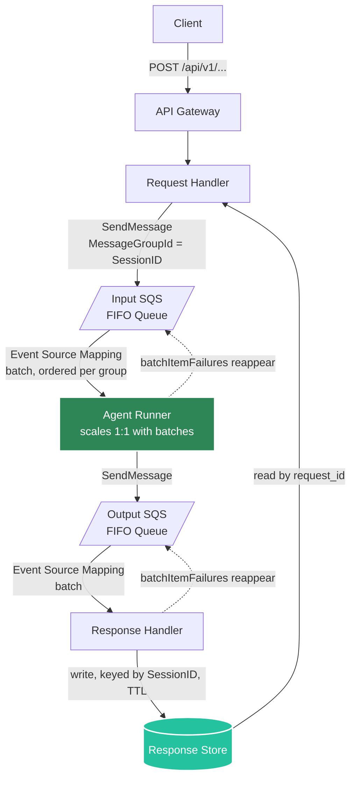
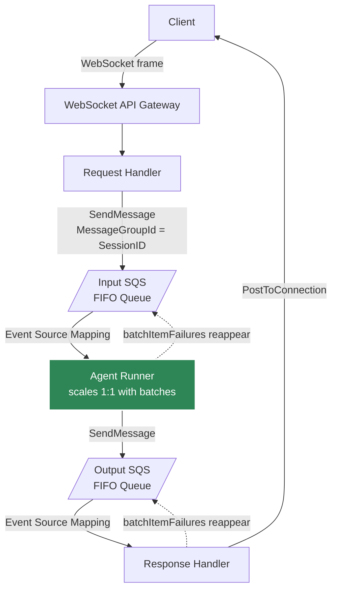
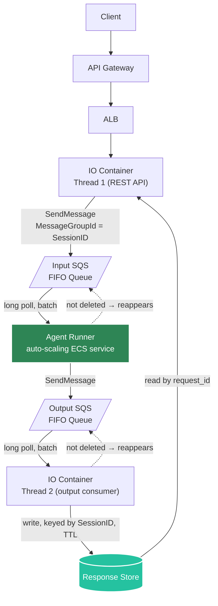
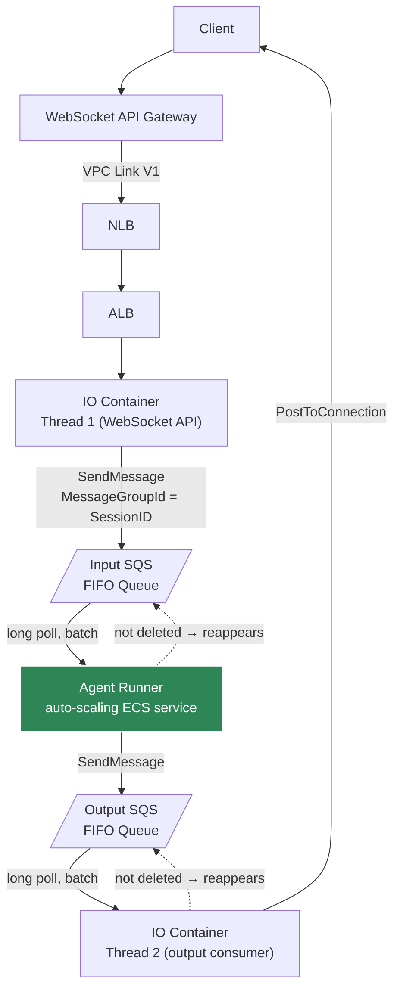

# AWS Queue Mode: Scalability Design

This page is the architecture and design reference behind Agent Kernel's AWS **queue mode**: the
SQS-backed pipeline that decouples request handling from agent execution so the two can scale
independently. It explains the *why* and the *shared contract* across the two processing methods
AWS ships today — **SQS + Lambda** (serverless) and **SQS + ECS** (containerized).

:::info Looking for hands-on configuration?
This page covers architecture and rationale. For runnable config, environment variables, entrypoint
code, and the local `in_memory` transport, see the [Queue Mode Guide](../advanced/queue-mode-guide).
For full Terraform deployment walkthroughs, see [AWS Serverless](./aws-serverless) and
[AWS Containerized](./aws-containerized).
:::

:::note Design vs. implementation
This design was written after SQS + Lambda and SQS + ECS were already running in production, to
capture their shared shape before a third method was added. A few details below are called out as
**"As implemented"** where the shipped code refined or diverged slightly from the original design.
:::

## Why a Shared Contract

SQS + Lambda and SQS + ECS were both built around the same shape:

```
Request Handler → Input Queue → Agent Runner → Output Queue → Response Handler
```

- On ECS, `ECSAgentRunner` / `ECSSQSConsumer` poll an input SQS queue and write results to an
  output queue, while `ECSIOHandler` runs the REST/WebSocket API and `ECSOutputConsumer` as two
  peer threads via `ThreadRunner`.
- On Lambda, `LambdaSQSConsumer` is push-triggered by an SQS Event Source Mapping and returns
  `{"batchItemFailures": ...}` for partial-batch retry.
- Both back their input/output queues with **SQS FIFO** queues using `MessageGroupId` /
  `MessageDeduplicationId`.
- All four client communication modes already have working examples across both methods (see
  `examples/aws-containerized/` and `examples/aws-serverless/`).

Without writing this shape down, every new processing method or communication mode risks
re-deriving its own queue contract, failure-handling behavior, and component boundaries instead of
reusing the one SQS + Lambda and SQS + ECS already validate in production. That's what this page
is: the reference contract any future processing method is expected to follow.

## Communication Modes

All processing methods below support the same four client communication modes, without changing
the shape of the input/output queues. Only how the response is delivered back to the client
differs per mode:

| Mode | What the client does | How it gets the response |
|------|----------------------|---------------------------|
| **REST Sync** | Sends a normal request and waits | Same HTTP response |
| **REST Async** (user polling) | `POST`s, gets a `request_id` back | Polls a `GET` endpoint later |
| **Streaming / SSE** | `POST`s once | Response streamed back in chunks |
| **Async** (WebSocket in/out) | Sends a WebSocket message | Response pushed back over the same connection |

:::note As implemented
On AWS, token streaming is delivered over a **WebSocket** connection (`execution_mode = "stream"`,
one `STREAM_CHUNK` push per token), not as chunked HTTP/SSE — API Gateway's Lambda and ALB
integrations can't stream SSE the way a long-lived process can. Plain SSE-over-HTTP is only
available outside queue mode, in the single-container "Simple REST" topology. The queue *contract*
for streaming is unchanged: the Agent Runner still emits one output-queue message per chunk.
:::

## SQS + Lambda (Serverless)

### Architecture

REST Sync, REST Async, and Streaming all share one shape:



Async (WebSocket) replaces the response-store hop with a direct push back to the connection:



### Request Flow

- **REST Sync** — Request Handler enqueues to the Input Queue, then polls the response store until
  the reply appears, and returns it on the same HTTP connection.
- **REST Async** — Same enqueue step, but the Request Handler returns immediately (202 +
  `request_id`); the client polls a separate `GET` route (same Lambda, routed by HTTP method) to
  retrieve the result later.
- **Streaming** — Same enqueue step; the Agent Runner emits response **chunks** to the Output
  Queue instead of one full reply. *As implemented*, chunk delivery on AWS goes out over WebSocket
  (`STREAM_CHUNK` per chunk), not a chunked HTTP response.
- **Async (WebSocket)** — The client sends a WebSocket frame instead of an HTTP request; the
  Request Handler enqueues it exactly like the other modes, and the Response Handler pushes the
  reply back over the open WebSocket connection instead of writing to the response store.

### Components

| Component | Role | As implemented |
|-----------|------|-----------------|
| **Request Handler** | Enqueues to the Input Queue; for REST Sync/Async also reads the response store | Lambda function, `modules/request-handler/` (Terraform) |
| **Input SQS Queue** | FIFO; `MessageGroupId = SessionID` preserves per-session order; `MessageDeduplicationId` prevents duplicate delivery; `MessageVisibilityTimeout` + `MessageRetentionPeriod` bound retries | `modules/queues/` |
| **Agent Runner** | Triggered by an Event Source Mapping, one Lambda invocation per batch; runs the agent and writes to the Output Queue; returns `batchItemFailures` so the ESM only retries the messages that actually failed | `LambdaSQSConsumer`, `modules/agent-runner/` |
| **Output SQS Queue** | Same FIFO/dedup/visibility properties as the Input Queue | `modules/queues/` |
| **Response Handler** | Reads the Output Queue and either writes to the response store (REST modes) or pushes over WebSocket (Async/Stream) | Separate Lambda, `modules/response-handler/` |
| **Response Store** | Holds replies keyed by session/request ID with a TTL, for the Request Handler to read | DynamoDB, Redis, or Valkey — configurable |

Both queues use `MessageDeduplicationId = request_id` so a retried message is never processed, or
appended to conversation history, twice.

### Failure Handling

- **Request Handler crashes on an inbound request** — not handled by the system; the caller gets a
  server error and must retry.
- **A message is processed but not deleted by the Agent Runner** — mitigated by session-level
  dedup (a hashed message ID stored with the session) plus `MessageDeduplicationId` on the Output
  Queue.
- **The Agent Runner Lambda crashes or is killed mid-message** — the message reappears once
  `MessageVisibilityTimeout` expires.
- **Some messages in a batch fail** — the failing IDs are returned as `batchItemFailures`; the ESM
  deletes the rest and leaves only the failed ones to be retried.
- **The Response Handler fails to write the response store** — if it crashes, the message reappears
  on the Output Queue; if only the write fails, it retries the write.
- **A message is processed but not deleted by the Response Handler** — not handled by the system;
  the caller may see the same response delivered more than once until the message is eventually
  removed (typically by the next retry).

## SQS + ECS (Containerized)

### Architecture



Async/Stream (WebSocket) replaces the response-store hop with a direct push. WebSocket API Gateway
only supports a VPC Link V1 integration, and V1 requires a Network Load Balancer target, so an
internal NLB sits in front of the existing ALB whenever WebSocket mode is enabled:



### Request Flow

Same four modes as SQS + Lambda, with the roles of Request Handler / Response Handler collapsed
into two threads of one **IO container** (`ECSIOHandler`, via `ThreadRunner`):

- **Thread 1** runs the REST or WebSocket API: enqueues requests and, for REST Sync/Async, reads
  the response store or returns a `request_id` immediately.
- **Thread 2** (`ECSOutputConsumer`) long-polls the Output Queue and writes to the response store,
  or pushes over WebSocket for Async/Stream modes.

The **Agent Runner** is a separate long-running ECS service (`ECSAgentRunner`) that long-polls the
Input Queue directly — there's no Event Source Mapping on ECS.

### Components

| Component | Role | As implemented |
|-----------|------|-----------------|
| **IO Container — Thread 1** | REST/WebSocket API: enqueue + response-store read (or immediate 202 for async) | `ECSQueueRequestHandler` / `ECSWebSocketRequestHandler` |
| **IO Container — Thread 2** | Polls the Output Queue, writes to the response store or pushes over WebSocket | `ECSOutputConsumer`, extends `ECSSQSConsumer` |
| **Input / Output SQS Queues** | Same FIFO/`MessageGroupId`/dedup/visibility-timeout properties as Lambda | `modules/queues/` (same Terraform module as Lambda) |
| **Agent Runner** | Long-polls the Input Queue, runs the agent, writes to the Output Queue | `ECSAgentRunner`, extends `ECSSQSConsumer` |
| **Response Store** | Holds replies by session/request ID with a TTL | DynamoDB, Redis, or Valkey |

**As implemented**, both the IO container's Thread 2 and the Agent Runner are themselves
multi-threaded: each runs several independent long-poll consumer threads against the same queue
(`ECSSQSConsumer` spins up `num_consumers` threads via `ThreadRunner`), not a single loop. Defaults
are **5** consumer threads for the Input Queue (Agent Runner) and **2** for the Output Queue (IO
container), both configurable via `execution.queues.{input,output}.no_of_consumers`.

Unlike Lambda, ECS has no `batchItemFailures` mechanism: a failed message is simply left
undeleted, and SQS redelivers it once the visibility timeout expires.

Also unlike Lambda, the app-level `max_receive_count` is deliberately provisioned **one below**
the SQS redrive policy's `maxReceiveCount`. That way, on its last allowed attempt the application
writes a graceful error to the response store *before* SQS moves the message to a dead-letter
queue — so a caller waiting on that response never just hangs.

### Failure Handling

- **REST Service (IO container) crashes on an inbound request** — not handled by the system; the
  caller gets a server error and must retry.
- **A message is processed but not deleted by the Agent Runner** — mitigated the same way as
  Lambda (session-level hashed-ID dedup, `MessageDeduplicationId` on the Output Queue).
- **The Agent Runner container crashes mid-message** — the message reappears once the visibility
  timeout expires.
- **A message fails processing** — it's simply not deleted, so it reappears after the visibility
  timeout for retry.
- **The IO container fails to write the response store** — if it crashes, the message reappears on
  the Output Queue; if only the write fails, it retries the write.
- **A message is processed but not deleted after writing the response store** — not handled by the
  system; the caller may see the same response more than once until the message is eventually
  removed.

*As implemented*, a crash in any single consumer thread triggers a coordinated, graceful shutdown:
`ThreadRunner` signals sibling threads in that pool to finish their current message, then the
process exits so ECS restarts the whole task — rather than one thread dying silently while others
keep running against a half-torn-down process.

### Scaling the Agent Runner

Load-based scaling (CPU / memory / ALB request count) is ECS's default, but it's a weak fit here:
agent workloads are dominated by waiting on outbound model-provider calls, not CPU, so queue
backlog can be high while CPU utilization stays flat.

Instead, the Agent Runner scales on **backlog per task**:

1. A scheduled Lambda reads `ApproximateNumberOfMessages` from the Input Queue and the Agent
   Runner's running task count every minute.
2. It computes `BacklogPerTask = queueDepth / max(runningTasks, 1)` and publishes it as a custom
   CloudWatch metric (`Custom/ECS/BacklogPerTask`).
3. An ECS Target Tracking policy scales the Agent Runner service to keep that metric at or below
   `backlog_target`.

This is provisioned automatically by the `scaling_config` block in the
`yaalalabs/ak-containerized/aws` Terraform module:

```hcl
scaling_config = {
  enabled            = true
  min_count          = 1
  max_count          = 10
  backlog_target     = 5
  scale_in_cooldown  = 180
  scale_out_cooldown = 60
}
```

`backlog_target` is the knob that trades latency for cost:

| Target | Behavior | Use case |
|--------|----------|----------|
| 5-10 | Aggressive scale-in, tolerates queue buildup | Cost-sensitive |
| 2-5 | Balanced | General purpose |
| 1 | Very aggressive scale-out | Low-latency, cost secondary |

Setting `min_count = 0` lets the Agent Runner fleet scale to zero between bursts, for spiky or
infrequent workloads.

## See Also

- [Queue Mode Guide](../advanced/queue-mode-guide) — pipeline internals, local `in_memory` transport, config reference, and entrypoint code
- [AWS Serverless Deployment](./aws-serverless) — Lambda Terraform walkthrough
- [AWS Containerized Deployment](./aws-containerized) — ECS Terraform walkthrough
- [Fault Tolerance](../core-concepts/fault-tolerance) — retry and resilience primitives across all deployment targets
