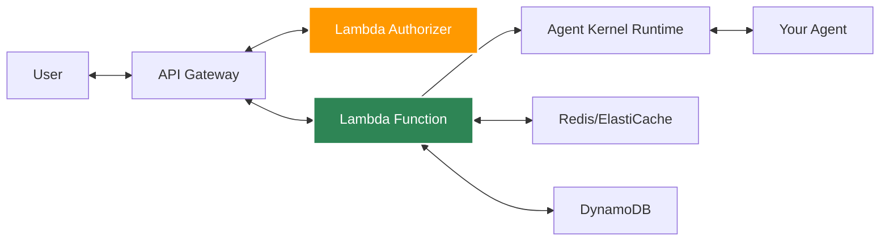
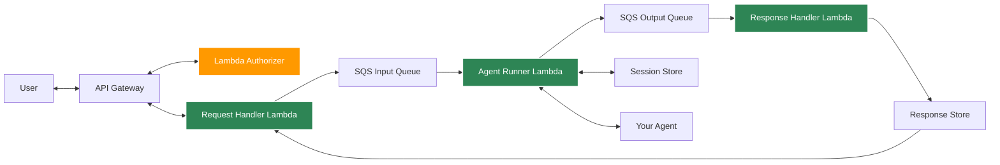
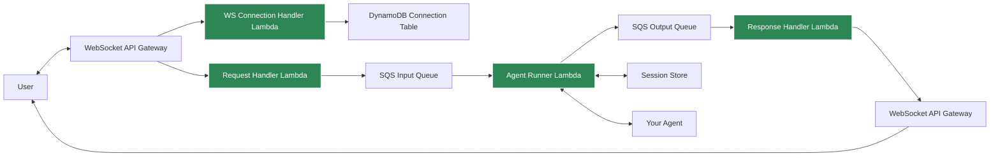
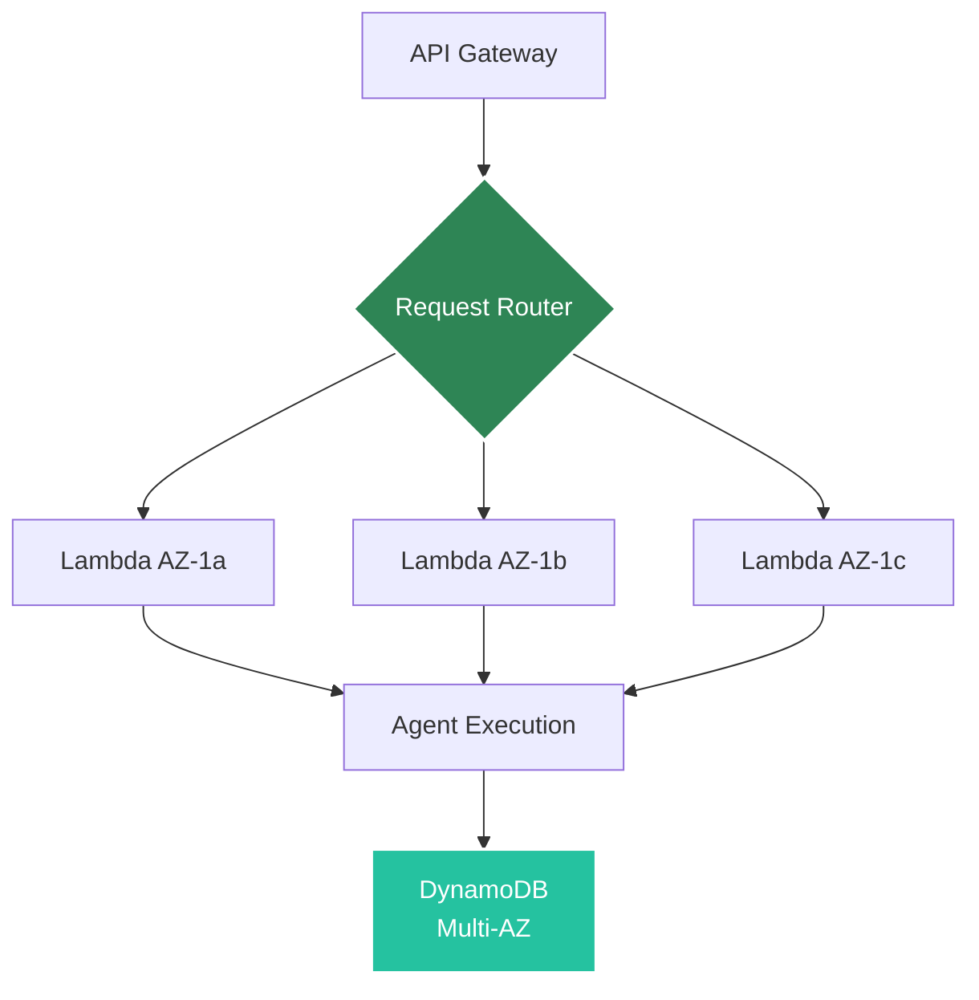

# AWS Serverless Deployment

Deploy agents to AWS Lambda for auto-scaling, serverless execution.

## Architecture

### Normal Mode: using request handler for chat processing


### Queue Based Execution: using queues to improve the scalability (recommended for prod)
#### REST SYNC and REST ASYNC modes


#### ASYNC (WebSocket) mode


The request handler receives the incoming API request, the agent runner executes the agent logic, and the response handler persists outbound messages to the configured response store. In queue-backed modes, the three-lambda split keeps request ingestion, execution, and response persistence independent.

In WebSocket (async) mode, a WebSocket API Gateway enables real-time bidirectional communication. The connection handler manages connection lifecycle ($connect/$disconnect routes) and stores connection metadata in DynamoDB. The request handler processes incoming WebSocket messages and routes them through the queue-based pipeline, with responses broadcast back through the WebSocket connection.

## Prerequisites

- AWS CLI configured
- AWS credentials with Lambda/API Gateway permissions
- Agent Kernel with AWS extras: `pip install agentkernel[aws]`
- For authentication: `pip install agentkernel[api,aws]`

## Deployment

### 1. Install Dependencies

The dependencies need to be installed in both the main Lambda package and the authorizer package:

**Main Lambda Package:**
```bash
pip install agentkernel[aws,openai]
```

**Authorizer Lambda Package:**
```bash
pip install agentkernel[api,aws]
```

**Example Deployment Scripts:**

For the main Lambda function (`deploy/deploy.sh`):
```bash
# Install main Lambda dependencies
uv pip install -r requirements.txt --target=dist/data
uv pip install --force-reinstall --target=dist/data agentkernel[openai,redis]
```

For the authorizer Lambda function (`auth_deployment/create_auth_package.sh`):
```bash
# Install authorizer dependencies
uv pip install --force-reinstall --no-deps agentkernel[api,aws] --target=auth_dist
```

### 2. Configure

Refer to [Terraform modules](https://registry.terraform.io/modules/yaalalabs/ak-serverless/aws) for configuration details.

### 3. Deploy

```bash
terraform init && terraform apply
```

## Lambda Handler

Your agent code remains the same, just import the Lambda handler:

```python
import json
from agents import Agent as OpenAIAgent
from agentkernel.openai import OpenAIModule
from agentkernel.aws import Lambda

agent = OpenAIAgent(name="assistant", ...)

OpenAIModule([agent])

@Lambda.register("/app", method="GET")
def custom_app_handler(event, context):
    return {"receivedEventPayload": dict(event), "response": "Hello! from AK 'app'"}

@Lambda.register("/app_info", method="POST")
def custom_app_info_handler(event, context):
    payload = json.loads(event.get("body") or "{}")
    return {"receivedEventPayload": dict(event), "request": payload, "response": "Hello! from AK 'app_info'"}

handler = Lambda.handler
```

## Lambda Environment Variables

The Lambda router automatically reads the following environment variables to correctly map incoming API paths:

- **API_BASE_PATH** – Base path mapping without leading slash. Example: `api` or `prod`
- **API_VERSION** – Version segment. Example: `v1`
- **AGENT_ENDPOINT** – The default chat endpoint segment. Example: `chat`

These environment variables are automatically configured by the Terraform module based on the `api_base_path`, `api_version`, and `agent_endpoint` variables in your Terraform configuration.

> **NOTE:** If you wrap our Lambda with your own API Gateway and deployment method, you are responsible for setting these environment variables. If they are not provided, only the default chat handler may work and custom routes may not resolve as expected.

> **NOTE: If you want to override base paths you have to define them in the `main.tf` file. Also note that the chat endpoint path which is defined in the `main.tf` file will be using our default chat lambda handler function, therefore it is not possible to define a custom lambda function for the default chat endpoint path**


## API Gateway Authentication

Authentication is now **mandatory** for WebSocket mode and recommended for REST modes. The serverless module supports custom token validation with Lambda authorizers.

### When Authentication is Enabled

Authentication infrastructure will only be created if you define an `authorizer` object with all required fields mentioned below in your `main.tf` file:

**Required Fields**:
- `function_name` - Name for the authorizer Lambda function
- `handler_path` - Path to the authorizer Lambda handler (e.g., `auth.handler`)
- `package_type` - Deployment type (`Image`, `LocalZip`, or `S3Zip`)
- `package_path` - Path to authorizer deployment package
- `module_name` - Authorizer module name

**Optional Fields**:
- `description` - Description of the authorizer function (defaults to "API Gateway Lambda Authorizer")
- `result_ttl_in_seconds` - Cache TTL for authorization results (default: 150)
- `timeout` - Authorizer Lambda timeout in seconds (default: 30)
- `memory_size` - Authorizer Lambda memory size in MB (default: 128)
- `layers` - List of Lambda layer ARNs to attach (default: [])
- `environment_variables` - Environment variables for authorizer

**Important Notes**:
- For WebSocket mode (`execution_mode = "async"`), authentication is mandatory and is handled by the WebSocket connection handler Lambda
- The bearer token must include a `userId` claim for WebSocket connections
- If the `authorizer` object is not provided or any required field is missing, no authorizer infrastructure will be created and your REST endpoints will be publicly accessible
- For WebSocket mode, the connection handler Lambda implements its own authentication logic

### Auth Lambda Handler

You need to create a separate auth lambda logic by extending the `AuthValidator` class:

```python
from typing import Optional
from agentkernel.api import AuthValidator, ValidationContext, ValidationResult
from agentkernel.aws import APIGatewayAuthorizer
import jwt

class CustomAuthTokenValidator(AuthValidator):
    def validate(self, token: str, context: Optional[ValidationContext] = None) -> ValidationResult:
        """Validate JWT token and return validation result."""
        payload = jwt.decode(token, options={"verify_signature": False})
        print("Payload", payload)
        email = payload.get("email", "")
        if email == "test@test.com":
            return ValidationResult(is_valid=True)
        return ValidationResult(is_valid=False)

# APIGatewayAuthorizer defines the auth lambda handler
handler = APIGatewayAuthorizer(validator=CustomAuthTokenValidator()).handle
```

### WebSocket Connection Handler Authentication

For WebSocket mode, authentication is handled by the WebSocket connection handler Lambda. The connection handler validates the bearer token during the `$connect` route:

```python
import jwt
from agentkernel.aws import WebsocketConnectionHandler
from agentkernel.auth import AuthValidator, ValidationResult

class CustomAuthTokenValidator(AuthValidator):
    def validate(self, token: str) -> ValidationResult:
        """Validate JWT token and return validation result."""
        try:
            payload = jwt.decode(token, options={"verify_signature": False})
            email = payload.get("email", "")
            user_id = payload.get("userId", "")
            if user_id == "user-1" and email == "test@test.com":
                return ValidationResult(is_valid=True, claims={"userId": user_id})
            return ValidationResult(is_valid=False, error_msg="Invalid user ID or email in token")
        except Exception as e:
            return ValidationResult(is_valid=False, error_msg=f"Token validation failed: {str(e)}")

handler = WebsocketConnectionHandler.set_auth_validator(CustomAuthTokenValidator()).handler
```

**Important: The bearer token must include a `userId` claim for WebSocket connections. This `userId` is used to map WebSocket connections to users in the DynamoDB connection table. The `userId` should be returned in the `claims` dictionary of the `ValidationResult`.**

### Terraform Configuration

To enable authentication, configure the authorizer in your `main.tf` by defining the `authorizer` object:

```hcl
module "serverless_agents" {
  # ... other configuration
  
  # Defining API Gateway Authorizer (optional - only creates if all required variables are defined)
  authorizer = {
    description           = "API Gateway Lambda Authorizer"
    function_name         = "gtwy-auth"
    handler_path          = "lambda.handler"
    package_path          = "../auth_deployment/auth_dist.zip"
    package_type          = "S3Zip"  # or "LocalZip" or "Image"
    module_name           = "auth"
    
    # Optional authorizer settings
    # result_ttl_in_seconds = 0
    # environment_variables = {
    #   "SOME_OTHER_KEY" = "Some Other Value"
    # }
  }
}
```

**Required Authorizer Fields (for auth infrastructure creation):**
- `function_name` - Name for the authorizer Lambda function
- `handler_path` - Path to the authorizer handler (e.g., `lambda.handler`)
- `package_type` - Package type (`LocalZip`, `S3Zip`, or `Image`)
- `package_path` - Path to authorizer package (required for all package types)
- `module_name` - Authorizer module name (required for all package types, especially S3Zip)

**Optional Authorizer Fields:**
- `description` - Description for authorizer Lambda function (default: "API Gateway Lambda Authorizer")
- `result_ttl_in_seconds` - Cache TTL for authorizer results (default: 150)
- `environment_variables` - Environment variables for authorizer Lambda

### Deployment Packages

You need two separate deployment packages:

1. **Main Lambda Package** - Contains your agent logic and backend code
2. **Auth Lambda Package** - Contains only the authentication logic (if enabled)

**File Structure Example:**
```
your-project/
├── lambda.py              # Main agent handler
├── lambda_auth.py         # Authorizer handler
├── build.sh               # Build script for dependencies
├── config.yaml            # Configuration file
├── requirements.txt       # Generated dependencies
├── pyproject.toml         # Python project configuration
├── deploy/
│   ├── deploy.sh          # Deployment script
│   ├── main.tf           # Terraform configuration
│   ├── variables.tf      # Terraform variables
│   ├── outputs.tf        # Terraform outputs
│   └── terraform.tfvars  # Terraform variable values
├── dist/                 # Main Lambda package directory
├── dist_auth/            # Authorizer package directory
└── dist_auth.zip         # Authorizer package zip file
```

**Creating the Deployment Packages:**
The deployment script automatically creates both packages:

```bash
#!/bin/bash
set -e # exit if any command in this script fails

# Create main lambda deployment package
echo "Creating main deployment package..."
create_deployment_package() {
    pushd ../
    rm -rf dist
    mkdir -p dist/data
    uv export --no-hashes > requirements.txt
    if [[ ${1-} != "local" ]]; then
      uv pip install -r requirements.txt --target=dist/data
    else
      uv pip install -r requirements.txt --target=dist/data  --find-links ../../../ak-py/dist
      uv pip install --force-reinstall --target=dist/data --find-links ../../../ak-py/dist agentkernel[openai,redis,auth] || true
    fi
    cp -r lambda.py config.yaml dist/data
    popd || exit 1
    cp Dockerfile ../dist/
}

# Create auth deployment package
echo "Creating auth deployment package..."
create_auth_deployment_package() {
    pushd ../
    rm -rf dist_auth dist_auth.zip
    mkdir -p dist_auth
    if [[ ${1-} != "local" ]]; then
        uv pip install --force-reinstall --no-deps agentkernel[api,aws,auth] --target=dist_auth
    else
        uv pip install --force-reinstall --no-deps agentkernel[api,aws,auth] --target=dist_auth --find-links ../../../ak-py/dist
    fi
    uv pip install --group auth --target=dist_auth
    cp -r lambda_auth.py dist_auth/
    cd dist_auth && zip -r ../dist_auth.zip .
    popd || exit 1
}

create_deployment_package $1
create_auth_deployment_package $1

# Deploy with Terraform
terraform init
terraform apply
```

The auth package script should run automatically when executing `./deploy.sh`. You can customize the script paths and structure, but you must provide two separate packages to the Terraform configuration via the `package_path` (for main Lambda) and `authorizer.package_path` (for auth Lambda) variables.

## Queue Mode

Queue mode is a Terraform configuration that enables SQS-driven asynchronous processing. When `queue_mode = true`, the infrastructure creates input and output SQS queues, an agent runner Lambda to process queued requests, and a response handler Lambda to store responses. When `queue_mode = false`, only the request handler Lambda is used for direct synchronous processing.

At runtime, queue mode is determined by whether queue URLs are configured in the execution configuration (`execution.queues.input.url`). This allows the same Lambda code to work in both modes based on configuration.

### Lambda Handlers

**If queue mode is disabled, only the request handler is needed. If queue mode is enabled, you need all these Lambda handlers: request handler, agent runner, and response handler. For WebSocket mode (execution_mode = "async"), you additionally need a WebSocket connection handler.**

#### 1. Request Handler

We can have our normal lambda handler (without having Agents and Modules) and also expose custom routes by registering additional handlers.

> **IMPORTANT NOTE: Agents must not be written and integrated with Modules (eg: `OpenAIModule`, `CrewAIModule`, etc) in this Lambda when using Queue Mode. These Agents and Modules must be defined in the Agent Runner when using Queue Mode**

```python
import json
from agentkernel.aws import Lambda

@Lambda.register("/app", method="GET")
def custom_app_handler(event, context):
    return {"receivedEventPayload": dict(event), "response": "Hello! from AK 'app'"}

@Lambda.register("/app_info", method="POST")
def custom_app_info_handler(event, context):
    payload = json.loads(event.get("body") or "{}")
    return {"receivedEventPayload": dict(event), "request": payload, "response": "Hello! from AK 'app_info'"}

handler = Lambda.handler
```

The AWS Lambda entrypoint accepts both of the following payload shapes.

```json
{
  "prompt": "Hello agent",
  "agent": "assistant",
  "session_id": "user-123"
}
```

```json
{
  "request_id": "req-123",
  "user_id": "user-123",
  "body": {
    "prompt": "Hello agent",
    "agent": "assistant",
    "session_id": "user-123"
  }
}
```

See [examples/aws-serverless/scalable-openai/lambda_request_handler.py](https://github.com/yaalalabs/agent-kernel/tree/develop/examples/aws-serverless/scalable-openai/lambda_request_handler.py) for the reference implementation.

#### 2. Agent Runner

This Lambda receives the queued request, runs the agent logic, and sends the result to the output queue.

```python
from agents import Agent
from agentkernel.aws import ServerlessAgentRunner
from agentkernel.openai import OpenAIModule

math_agent = Agent(
    name="math",
    handoff_description="Specialist agent for math questions",
    instructions="You provide help with math problems. Explain your reasoning at each step and include examples. If prompted for anything else you refuse to answer.",
)

history_agent = Agent(
    name="history",
    handoff_description="Specialist agent for historical questions",
    instructions="You provide assistance with historical queries. Explain important events and context clearly.",
)

triage_agent = Agent(
    name="triage",
    instructions="You determine which agent to use based on the user's question.",
    handoffs=[history_agent, math_agent],
)

OpenAIModule([triage_agent, math_agent, history_agent])

handler = ServerlessAgentRunner.handle
```

See [examples/aws-serverless/scalable-openai/lambda_agent_runner.py](https://github.com/yaalalabs/agent-kernel/tree/develop/examples/aws-serverless/scalable-openai/lambda_agent_runner.py) for the reference implementation.

#### 3. Response Handler

This Lambda reads the response from the output queue and stores it in the configured response store.

```python
from agentkernel.aws import ResponseHandler


handler = ResponseHandler.handle
```

See [examples/aws-serverless/scalable-openai/lambda_response_handler.py](https://github.com/yaalalabs/agent-kernel/tree/develop/examples/aws-serverless/scalable-openai/lambda_response_handler.py) for the reference implementation.

#### 4. WebSocket Connection Handler (for async/WebSocket mode)

This Lambda handles WebSocket connection lifecycle events (`$connect` and `$disconnect` routes), stores connection metadata in DynamoDB, and validates authentication tokens.

```python
import jwt
from agentkernel.aws import WebsocketConnectionHandler
from agentkernel.auth import AuthValidator, ValidationResult

class CustomAuthTokenValidator(AuthValidator):
    def validate(self, token: str) -> ValidationResult:
        """Validate JWT token and return validation result."""
        try:
            payload = jwt.decode(token, options={"verify_signature": False})
            email = payload.get("email", "")
            user_id = payload.get("userId", "")
            if user_id == "user-1" and email == "test@test.com":
                return ValidationResult(is_valid=True, claims={"userId": user_id})
            return ValidationResult(is_valid=False, error_msg="Invalid user ID or email in token")
        except Exception as e:
            return ValidationResult(is_valid=False, error_msg=f"Token validation failed: {str(e)}")

handler = WebsocketConnectionHandler.set_auth_validator(CustomAuthTokenValidator()).handler
```

See [examples/aws-serverless/websocket-openai-copy/lambda_ws_connection_handler.py](https://github.com/yaalalabs/agent-kernel/tree/develop/examples/aws-serverless/websocket-openai-copy/lambda_ws_connection_handler.py) for the reference implementation.

### Lambda Package Creation

The deployment script creates the Lambda artifacts before Terraform runs.

#### Request Handler Package

```bash
create_request_handler_deployment_package() {
    pushd ../
    rm -rf dist_request_handler dist_request_handler.zip
    mkdir -p dist_request_handler
    uv export --no-hashes > requirements.txt
    if [[ ${1-} != "local" ]]; then
      uv pip install -r requirements.txt --target=dist_request_handler
    else
      uv pip install --force-reinstall --target=dist_request_handler --find-links ../../../ak-py/dist agentkernel[aws,redis] || true
    fi
    cp -r lambda_request_handler.py config.yaml dist_request_handler/
    cd dist_request_handler && zip -r ../dist_request_handler.zip .
    popd || exit 1
}
```
This creates `dist_request_handler.zip`.

#### Agent Runner Package

```bash
create_agent_runner_deployment_package() {
    pushd ../
    rm -rf dist_agent_runner
    mkdir -p dist_agent_runner/data
    uv export --no-hashes > requirements.txt
    if [[ ${1-} != "local" ]]; then
      uv pip install -r requirements.txt --target=dist_agent_runner/data
    else
      uv pip install -r requirements.txt --target=dist_agent_runner/data --find-links ../../../ak-py/dist
      uv pip install --force-reinstall --target=dist_agent_runner/data --find-links ../../../ak-py/dist agentkernel[aws,openai,redis] || true
    fi
    cp -r lambda_agent_runner.py config.yaml dist_agent_runner/data
    popd || exit 1
    cp Dockerfile.agent_runner ../dist_agent_runner/Dockerfile
}
```
This creates `dist_agent_runner/`.

#### Response Handler Package

```bash
create_response_handler_deployment_package() {
    pushd ../
    rm -rf dist_response_handler dist_response_handler.zip
    mkdir -p dist_response_handler
    uv export --no-hashes > requirements.txt
    if [[ ${1-} != "local" ]]; then
      uv pip install -r requirements.txt --target=dist_response_handler
    else
      uv pip install --force-reinstall --target=dist_response_handler --find-links ../../../ak-py/dist agentkernel[aws,redis] || true
    fi
    cp -r lambda_response_handler.py config.yaml dist_response_handler/
    cd dist_response_handler && zip -r ../dist_response_handler.zip .
    popd || exit 1
}
```
This creates `dist_response_handler.zip`.

#### WebSocket Connection Handler Package (for async/WebSocket mode)

```bash
create_ws_connection_handler_deployment_package() {
    pushd ../
    rm -rf dist_ws_connection_handler dist_ws_connection_handler.zip
    mkdir -p dist_ws_connection_handler
    uv export --no-hashes > requirements.txt
    if [[ ${1-} != "local" ]]; then
      uv pip install -r requirements.txt --target=dist_ws_connection_handler
    else
      uv pip install --force-reinstall --target=dist_ws_connection_handler --find-links ../../../ak-py/dist agentkernel[aws,redis] || true
    fi
    cp -r lambda_ws_connection_handler.py config.yaml dist_ws_connection_handler/
    cd dist_ws_connection_handler && zip -r ../dist_ws_connection_handler.zip .
    popd || exit 1
}
```
This creates `dist_ws_connection_handler.zip`.

The example deployment script runs all package builders before Terraform applies the infrastructure.

### External Artifact Sources (Production)

For production deployments, it is recommended to build and publish Lambda artifacts in CI/CD before running terraform apply. Terraform can then deploy using immutable artifact references (`lambda_package_s3` or `ecr_image_uri`) rather than building artifacts locally.

| Field               | Applicable package types     | Description                                                                                                                                  |
| ------------------- | ---------------------------- | -------------------------------------------------------------------------------------------------------------------------------------------- |
| `package_path`      | `LocalZip`, `S3Zip`, `Image` | Path to a local ZIP file, source directory, or Docker build context. Terraform builds/uploads the artifact as needed.                        |
| `lambda_package_s3` | `S3Zip`                      | Existing ZIP artifact in S3: `{ bucket, key }`. Terraform deploys directly from the specified object.                                        |
| `ecr_image_uri`     | `Image`                      | Existing container image URI (for example, `account.dkr.ecr.region.amazonaws.com/repo:tag`). Terraform deploys the specified image directly. |


`package_path` and `lambda_package_s3`/`ecr_image_uri` are mutually exclusive — set only one per handler.

| Package Type | Development                                 | Production                                      |
| ------------ | ------------------------------------------- | ----------------------------------------------- |
| `LocalZip`   | `package_path`                              | Generally not recommended                       |
| `S3Zip`      | `package_path` (Terraform uploads artifact) | `lambda_package_s3` (CI/CD uploads artifact/ Already built and uploaded to S3) |
| `Image`      | `package_path` (Terraform builds image)     | `ecr_image_uri` (CI/CD builds and pushes image/ Already built and pushed to an ECR) |


**Example: scalable queue mode with S3 ZIPs and an ECR image**

```hcl
request_handler = {
  module_name      = "rqst-hdlr"
  function_name    = "request-handler"
  handler_path     = "lambda_request_handler.handler"
  package_type     = "S3Zip"
  lambda_package_s3 = {
    bucket = "my-lambda-packages-bucket"
    key    = "dist_request_handler.zip"
  }
  timeout     = 45
  memory_size = 256
  environment_variables = { OPENAI_API_KEY = var.openai_api_key }
}

agent_runner = {
  module_name   = "agent-runner"
  function_name = "agent-runner"
  handler_path  = "lambda_agent_runner.handler"
  package_type  = "Image"
  ecr_image_uri = "123456789012.dkr.ecr.us-west-2.amazonaws.com/agent-runner:latest"
  timeout       = 45
  memory_size   = 512
  environment_variables = { OPENAI_API_KEY = var.openai_api_key }
}

response_handler = {
  module_name      = "response-handler"
  function_name    = "response-handler"
  handler_path     = "lambda_response_handler.handler"
  package_type     = "S3Zip"
  lambda_package_s3 = {
    bucket = "my-lambda-packages-bucket"
    key    = "dist_response_handler.zip"
  }
  timeout     = 45
  memory_size = 256
}
```

This pattern is recommended for production: build and upload artifacts in CI/CD, then run `terraform apply` without any local build step. See [examples/aws-serverless/scalable-openai](https://github.com/yaalalabs/agent-kernel/tree/develop/examples/aws-serverless/scalable-openai) for a complete working example.

### API Endpoints

After deployment, the default chat route is:

```text
https://{api-id}.execute-api.us-east-1.amazonaws.com/agents/api/v1/chat
```

The payload examples below use `BaseRunRequest` unless noted otherwise.

#### `rest_sync`

`rest_sync` sends the request to SQS queue and immediately waits for the matching response from the response store. This mode requires both queues and response store to be configured.

**Request**

```bash
curl -X POST https://{api-id}.execute-api.us-east-1.amazonaws.com/agents/api/v1/chat \
  -H "Content-Type: application/json" \
  -H "Authorization: Bearer your-token" \
  -d '{
    "prompt": "Hello!",
    "agent": "assistant",
    "session_id": "user-123"
  }'
```

**Response**

```json
{
  "result": "Agent response here",
  "session_id": "user-123"
}
```

#### `rest_async`

`rest_async` uses two requests: one to submit the work, and a second GET request to poll for the response using the returned `request_id`. This mode requires both queues and response store to be configured.

**1. Submit request**

```bash
curl -X POST https://{api-id}.execute-api.us-east-1.amazonaws.com/agents/api/v1/chat \
  -H "Content-Type: application/json" \
  -d '{
    "prompt": "Hello!",
    "agent": "assistant",
    "session_id": "user-123"
  }'
```

**Submit response**

```json
{
  "status": "ACCEPTED",
  "request_id": "req-123"
}
```

**2. Poll for the response**

```bash
curl -X GET https://{api-id}.execute-api.us-east-1.amazonaws.com/agents/api/v1/chat \
  -H "Content-Type: application/json" \
  -d '{
    "request_id": "req-123"
  }'
```

**Poll response**

```json
{
  "result": "Agent response here",
  "session_id": "user-123"
}
```

If the response is not available yet, the poll endpoint returns a `NOT_FOUND` body with the same `request_id` so clients can retry.

#### `async` (WebSocket)

`async` mode uses a WebSocket API for real-time bidirectional communication. The WebSocket API supports multiple routes including the default `chat` route and custom routes.

**WebSocket Connection**

Connect to the WebSocket endpoint with a bearer token in the connection URL. The endpoint URL is constructed by combining the `websocket_api_endpoint_url` and `websocket_api_stage_name` outputs from the serverless module:

```bash
{websocket_api_endpoint_url}/{websocket_api_stage_name}?token=your-jwt-token
```

For example, if the outputs are:
- `websocket_api_endpoint_url = "wss://abc123.execute-api.us-east-1.amazonaws.com"`
- `websocket_api_stage_name = "prod"`

The connection URL would be:
```bash
wss://abc123.execute-api.us-east-1.amazonaws.com/prod?token=your-jwt-token
```

The bearer token must include a `userId` claim for authentication.

**Sending Messages**

Send messages to the `chat` route:

```json
{
  "route": "chat",
  "prompt": "Hello!",
  "agent": "assistant",
  "session_id": "user-123"
}
```

**Receiving Responses**

Responses are broadcast back through the WebSocket connection:

```json
{
  "route": "chat",
  "result": "Agent response here",
  "session_id": "user-123"
}
```

**Custom Routes**

You can register custom WebSocket routes in your request handler and define them in your Terraform configuration:

**1. Define routes in Terraform:**
```hcl
module "websocket_deployment" {
  # ... other configuration
  
  ws_routes = [
    { route = "notifications" },
    { route = "file_upload" },
    { route = "custom_handler" }
  ]
}
```

**2. Register handlers in your Lambda code:**
```python
from agentkernel.aws import Lambda

@Lambda.register("custom_handler")
def custom_handler(event, context):
    return {"response": "Custom route response"}

@Lambda.register("notifications")
def notifications_handler(event, context):
    return {"response": "Notification processed"}
```

**3. Send messages to custom routes:**
```json
{
  "route": "custom_handler",
  "data": "your data"
}
```

**Note**: Custom routes must be defined in both Terraform (`ws_routes`) and registered in your Lambda handler code to function properly.

### Execution Modes and Response Store

The AWS serverless runtime supports these execution modes:

- `rest_sync` - Synchronous REST: sends request to SQS queue and immediately waits for the matching response from the response store
- `rest_async` - Asynchronous REST: submits request to SQS queue via POST and returns immediately with ACCEPTED status and a request_id, then poll for response via GET using the same request_id
- `stream` - Streaming mode (not yet implemented)
- `async` - WebSocket API for real-time bidirectional communication (requires WebSocket connection handler, queues optional, response_store not used)

**Queue Mode Interaction**:
- When queues are configured (`execution.queues.input.url` is set), the request handler sends messages to the SQS input queue
- When queues are not configured, the request handler processes requests directly without queuing
- For WebSocket mode, queue mode can be enabled or disabled based on queue configuration
  - If queue mode is enabled: WebSocket messages are sent to SQS input queue with endpoint_url attribute for broadcasting
  - If queue mode is disabled: WebSocket messages are processed directly without queuing

When you use queue-backed execution, configure the `execution` block:

- `execution.mode` - selects the runtime mode (rest_sync, rest_async, stream, or async)
- `execution.queues.input.url` - input SQS queue for agent requests (required for rest_sync, rest_async, and optional for async/WebSocket)
- `execution.queues.output.url` - output SQS queue for agent responses (required for rest_sync, rest_async, and optional for async/WebSocket)
- `execution.queues.input.max_receive_count` - input queue receive retry threshold (default: 3)
- `execution.queues.output.max_receive_count` - output queue receive retry threshold (default: 3)
- `execution.response_store.retry_count` - number of response-store lookup attempts (default: 5)
- `execution.response_store.delay` - delay in seconds between lookup attempts (default: 5)
- `execution.response_store.type` - response-store backend selector configured in `config.yaml` only (required for rest_sync and rest_async)
- `execution.response_store.redis.url` - Redis URL for response storage
- `execution.response_store.redis.prefix` - Redis key prefix for response storage, default `ak:responses:`
- `execution.response_store.redis.ttl` - Redis TTL in seconds
- `execution.response_store.dynamodb.table_name` - DynamoDB table name for response storage
- `execution.response_store.dynamodb.ttl` - DynamoDB TTL in seconds

The response store is configured as a single object with one selected backend:

**Note**: When using WebSocket mode (`execution_mode = "async"`), the response store is not used since responses are broadcast directly through the WebSocket connection instead of being stored. The response store is required for `rest_sync` and `rest_async` modes.

```json
{
  "execution": {
    "mode": "rest_async",
    "queues": {
      "input": {
        "url": "https://sqs.us-east-1.amazonaws.com/123456789012/agent-input"
      }
    },
    "response_store": {
      "type": "redis",
      "retry_count": 5,
      "delay": 5,
      "redis": {
        "url": "redis://localhost:6379",
        "prefix": "ak:responses:",
        "ttl": 3600
      }
    }
  }
}
```

Set `response_store.type` to `redis` or `dynamodb`, then provide the matching backend block.

The response handler reads `request_id` from SQS message attributes and stores each response by request ID. For Redis, the message body is stored under the configured key prefix; for DynamoDB, the message is stored in the configured table. The `request_id` and optional `user_id` are carried as SQS message attributes, while the nested `body` is used as the message payload.

Example environment variables:

```bash
export AK_EXECUTION__MODE=rest_async
export AK_EXECUTION__QUEUES__INPUT__URL=https://sqs.us-east-1.amazonaws.com/123456789012/agent-input
export AK_EXECUTION__QUEUES__OUTPUT__URL=https://sqs.us-east-1.amazonaws.com/123456789012/agent-output
export AK_EXECUTION__QUEUES__INPUT__MAX_RECEIVE_COUNT=3
export AK_EXECUTION__QUEUES__OUTPUT__MAX_RECEIVE_COUNT=3
export AK_EXECUTION__RESPONSE_STORE__REDIS__URL=redis://localhost:6379
export AK_EXECUTION__RESPONSE_STORE__REDIS__PREFIX=ak:responses:
export AK_EXECUTION__RESPONSE_STORE__RETRY_COUNT=5
export AK_EXECUTION__RESPONSE_STORE__DELAY=5
```

### WebSocket Configuration

For WebSocket mode (`execution_mode = "async"`), you need to configure WebSocket API settings in your `config.yaml`:

```yaml
websocket_api:
  connection_table:
    table_name: "websocket-connections"
    ttl: 3600  # Connection TTL in seconds for automatic cleanup
  chat_route: "chat"  # Default route for chat messages
```

**Environment Variables**:

```bash
export AK_WEBSOCKET_API__CONNECTION_TABLE__TABLE_NAME=websocket-connections
export AK_WEBSOCKET_API__CONNECTION_TABLE__TTL=3600
export AK_WEBSOCKET_API__CHAT_ROUTE=chat
```

**WebSocket Configuration Parameters**:
- `connection_table.table_name` - DynamoDB table name for storing WebSocket connection mappings
- `connection_table.ttl` - TTL in seconds for automatic cleanup of stale connections
- `chat_route` - The default route name for chat messages (default: "chat")

**Terraform WebSocket Route Configuration**:

In your Terraform configuration, you can customize WebSocket routes:

```hcl
module "websocket_deployment" {
  source = "yaalalabs/ak-serverless/aws"
  
  execution_mode = "async"
  
  # Customize the default chat route name
  ws_chat_route = "conversation"
  
  # Add custom routes beyond the default chat route
  ws_routes = [
    { route = "notifications" },
    { route = "file_upload" },
    { route = "status_updates" }
  ]
  
  # ... other configuration
}
```

**Route Naming Rules**:
- Route names must contain only alphanumeric characters, hyphens (-), and underscores (_)
- Route names cannot contain '/' and cannot be empty or whitespace-only
- The `$` prefix is reserved for predefined routes (`$connect`, `$disconnect`, `$default`)
- Custom routes can only be defined when `execution_mode = "async"`

**Available Routes**:
- `$connect` - Handled by WebSocket connection handler (predefined)
- `$disconnect` - Handled by WebSocket connection handler (predefined)  
- `$default` - Fallback route for unmatched messages (predefined)
- `ws_chat_route` - Configurable default chat route (default: "chat")
- `ws_routes` - Additional custom routes as defined in Terraform

The DynamoDB connection table is automatically created by the Terraform module and stores user-to-connection-id mappings for broadcasting messages to the correct WebSocket connections.

### Important: Async Mode with API Gateway Disabled

> **⚠️ WARNING**: When using `execution_mode = "async"` (WebSocket mode) with `enable_api_gateway = false`, the default response handler will fail because it sends responses as WebSocket messages directly through the API Gateway. Without the WebSocket API Gateway, there is no endpoint to send these messages to.
>
> **Solution**: If you disable the API Gateway in async mode, you must provide a custom response handler implementation that handles responses differently (e.g., storing them in a database, sending to an external service, or using an alternative messaging system). Override the response handler Lambda to implement your custom response delivery mechanism.

## Cost Optimization

### Lambda Configuration

Memory: 512 MB
Timeout: 30

Refer to [Terraform modules](https://registry.terraform.io/modules/yaalalabs/ak-serverless/aws) to update the configurations.


### Cold Start Mitigation

- Use provisioned concurrency for critical endpoints
- Keep Lambda warm with scheduled pings
- Optimize package size

## Fault Tolerance

AWS Lambda deployment is inherently fault-tolerant with fully managed infrastructure.

### Serverless Resilience by Design

Lambda provides built-in fault tolerance without any configuration:



**Key Features:**
- Multi-AZ execution automatically
- No infrastructure to manage
- Automatic scaling to demand
- Built-in retry mechanisms
- AWS handles all failures

### Multi-AZ Architecture

**Automatic Distribution:**
- Lambda functions run across all availability zones
- No configuration required
- Survives entire AZ failures
- Transparent to application code

**Benefits:**
- Zone-level isolation
- Geographic redundancy
- No single point of failure
- AWS-managed failover

### Automatic Retry Logic

Lambda automatically retries failed invocations:

**Synchronous Invocations (API Gateway):**
```
1st attempt → Failure
↓
2nd attempt (immediate retry)
↓
3rd attempt (immediate retry)
↓
Error response to client
```

**Error Types with Automatic Retry:**
- Function errors (unhandled exceptions)
- Throttling errors (429)
- Service errors (5xx)
- Timeout errors

### Scaling and Availability

**Infinite Scaling:**
- Automatically scales to handle any number of requests
- Each request can run in isolated execution environment
- No capacity planning needed
- No manual intervention required

**Concurrency Management:**
```hcl
# Optional: Reserve capacity for critical functions
resource "aws_lambda_function" "agent" {
  reserved_concurrent_executions = 100
}

# Optional: Provisioned concurrency (eliminates cold starts)
resource "aws_lambda_provisioned_concurrency_config" "agent" {
  provisioned_concurrent_executions = 10
}
```

**Benefits:**
- Handle traffic spikes automatically
- No over-provisioning
- Pay only for actual usage
- No capacity limits (within AWS quotas)

### State Persistence with DynamoDB

Serverless-native state management with maximum resilience:

```bash
export AK_SESSION__TYPE=dynamodb
export AK_SESSION__DYNAMODB__TABLE_NAME=agent-kernel-sessions
```

**DynamoDB Fault Tolerance:**
- **Multi-AZ replication** - Data replicated across 3 AZs automatically
- **Point-in-time recovery (PITR)** - Restore to any second in last 35 days

:::tip
For detailed DynamoDB session configuration and best practices, see the [Session Management](https://github.com/yaalalabs/agent-kernel/tree/develop/docs/docs/core-concepts/session.md) documentation.
:::
- **Continuous backups** - Automatic and continuous
- **99.999% availability SLA** - Five nines uptime
- **Global tables** (optional) - Multi-region replication


### Recovery Time and Point Objectives

**Recovery Time Objective (RTO):**
- Function failure: < 1 second (automatic retry)
- AZ failure: 0 seconds (multi-AZ by default)
- Region failure: Requires multi-region setup

**Recovery Point Objective (RPO):**
- DynamoDB: Continuous (synchronous multi-AZ replication)
- Data loss: 0 (with proper DynamoDB configuration)

### Fault Tolerance Benefits

**Compared to Traditional Servers:**
- ✅ No server failures (serverless)
- ✅ No patching required (managed by AWS)
- ✅ No capacity planning
- ✅ Automatic scaling
- ✅ Built-in redundancy

**Compared to ECS:**
- ✅ Zero infrastructure management
- ✅ Infinite scaling
- ✅ Pay only for usage
- ⚠️ Higher latency (cold starts)
- ⚠️ 15-minute execution limit

[Learn more about fault tolerance →](https://github.com/yaalalabs/agent-kernel/tree/develop/docs/docs/core-concepts/fault-tolerance.md)

## Session Storage

For serverless deployments, use DynamoDB or ElastiCache Redis for session persistence:

### DynamoDB (Recommended for Serverless)

```bash
export AK_SESSION__TYPE=dynamodb
export AK_SESSION__DYNAMODB__TABLE_NAME=agent-kernel-sessions
export AK_SESSION__DYNAMODB__TTL=3600  # 1 hour
```

**Benefits:**
- Serverless, fully managed
- Auto-scaling
- No cold starts
- Pay-per-use
- AWS-native integration

**Requirements:**
- DynamoDB table with partition key `session_id` (String) and sort key `key` (String)
- Lambda IAM role with DynamoDB permissions (`dynamodb:GetItem`, `dynamodb:PutItem`, `dynamodb:UpdateItem`, `dynamodb:DescribeTable`)

### ElastiCache Redis

```bash
export AK_SESSION__TYPE=redis
export AK_SESSION__REDIS__URL=redis://elasticache-endpoint:6379
```

**Benefits:**
- High performance
- Shared cache across functions

**Note:** Redis requires VPC configuration for Lambda, which can impact cold start times.

## Monitoring

CloudWatch metrics automatically available:
- Invocation count
- Duration
- Errors
- Concurrent executions

## Best Practices

- Use DynamoDB for session storage (serverless-native)
- Alternatively, use Redis for session storage if already using ElastiCache
- Set appropriate timeout (30-60s for LLM calls)
- **Security**: Authentication is mandatory for WebSocket mode and recommended for REST modes - implement Lambda authorizers for REST API authentication
- **Performance**: If using authentication, cache authorizer results with appropriate TTL
- **Monitoring**: Monitor authorizer latency and error rates separately
- **Deployment**: Always create separate packages for each Lambda function (request handler, agent runner, response handler, WebSocket connection handler if applicable)
- **WebSocket**: Ensure your bearer token includes a `userId` claim for WebSocket connections
- **WebSocket**: Configure appropriate TTL for DynamoDB connection table to clean up stale connections
- **WebSocket**: Use custom routes to organize different message types in WebSocket mode

## Example Deployment

See [examples/aws-serverless](https://github.com/yaalalabs/agent-kernel/tree/develop/examples/aws-serverless)