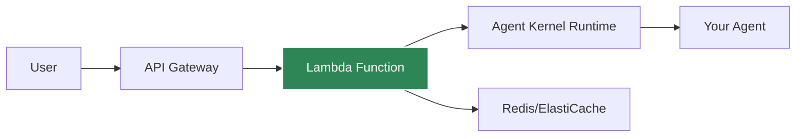

# AWS Serverless Deployment

Deploy agents to AWS Lambda for auto-scaling, serverless execution.

## Architecture



## Prerequisites

- AWS CLI configured
- AWS credentials with Lambda/API Gateway permissions
- Agent Kernel with AWS extras: `pip install agentkernel[aws]`

## Deployment

### 1. Install Dependencies

```bash
pip install agentkernel[aws,openai]
```

### 2. Configure

Create `ak-config.yaml`:

```yaml
deployment:
  profile: serverless
  region: us-east-1
  lambda:
    memory: 512
    timeout: 30
  api_gateway:
    stage: prod
session:
  storage: redis
  redis_url: ${REDIS_URL}
```

### 3. Deploy

```bash
ak-deploy --config ak-config.yaml
```

## Lambda Handler

Your agent code remains the same, just import the Lambda handler:

```python
from agents import Agent as OpenAIAgent
from agentkernel.openai import OpenAIModule
from agentkernel.aws import lambda_handler

agent = OpenAIAgent(name="assistant", ...)
module = OpenAIModule([agent])

# Lambda entry point
def handler(event, context):
    return lambda_handler(event, context)
```

## API Endpoints

After deployment:

```
POST https://{api-id}.execute-api.us-east-1.amazonaws.com/prod/chat
```

Body:

```json
{
  "agent": "assistant",
  "message": "Hello!",
  "session_id": "user-123"
}
```

## Cost Optimization

### Lambda Configuration

```yaml
lambda:
  memory: 512  # MB, affects price
  timeout: 30  # seconds
  reserved_concurrency: 10  # Optional limit
```

### Cold Start Mitigation

- Use provisioned concurrency for critical endpoints
- Keep Lambda warm with scheduled pings
- Optimize package size

## Session Storage

Use ElastiCache Redis for session persistence:

```bash
export AK_SESSION_STORAGE=redis
export AK_REDIS_URL=redis://elasticache-endpoint:6379
```

## Monitoring

CloudWatch metrics automatically available:
- Invocation count
- Duration
- Errors
- Concurrent executions

## Best Practices

- Use Redis for session storage (not in-memory)
- Set appropriate timeout (30-60s for LLM calls)
- Monitor cold starts
- Use VPC for Redis access
- Enable CloudWatch logs

## Example Deployment

See [examples/aws-serverless](https://github.com/yaalalabs/agent-kernel/tree/main/examples/aws-serverless)
