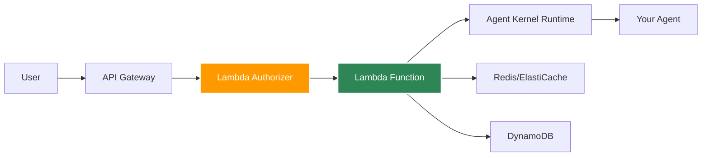
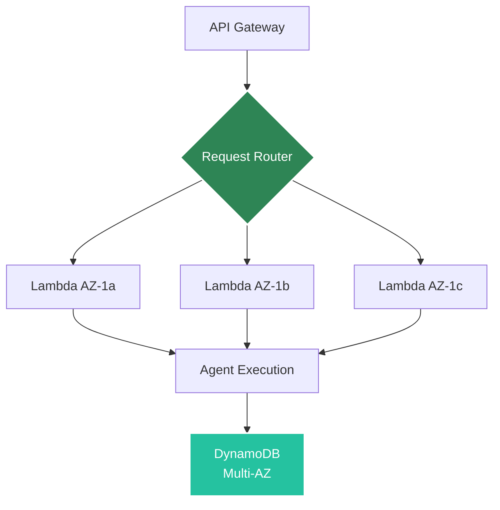

# AWS Serverless Deployment

Deploy agents to AWS Lambda for auto-scaling, serverless execution.

## Architecture



## Prerequisites

- AWS CLI configured
- AWS credentials with Lambda/API Gateway permissions
- Agent Kernel with AWS extras: `pip install agentkernel[aws]`
- For authentication: `pip install agentkernel[aws,auth]`

## Deployment

### 1. Install Dependencies

The dependencies need to be installed in both the main Lambda package and the authorizer package:

**Main Lambda Package:**
```bash
pip install agentkernel[aws,openai]
```

**Authorizer Lambda Package:**
```bash
pip install agentkernel[aws,auth]
```

**Example Deployment Scripts:**

For the main Lambda function (`deploy/deploy.sh`):
```bash
# Install main Lambda dependencies
uv pip install -r requirements.txt --target=dist/data
uv pip install --force-reinstall --target=dist/data agentkernel[openai,redis]
```

For the authorizer Lambda function (`auth_deployment/create_auth_package.sh`):
```bash
# Install authorizer dependencies
uv pip install --force-reinstall --no-deps agentkernel[aws,auth] --target=auth_dist
```

### 2. Configure

Refer to [Terraform modules](https://registry.terraform.io/modules/yaalalabs/ak-serverless/aws) for configuration details.

### 3. Deploy

```bash
terraform init && terraform apply
```

## Lambda Handler

Your agent code remains the same, just import the Lambda handler:

```python
from agents import Agent as OpenAIAgent
from agentkernel.openai import OpenAIModule
from agentkernel.aws import Lambda

agent = OpenAIAgent(name="assistant", ...)
OpenAIModule([agent])

handler = Lambda.handler
```

## API Endpoints

After deployment (Assuming the following URL):

```
POST https://{api-id}.execute-api.us-east-1.amazonaws.com/agents/chat
```

**With Authentication:**
If you configure a Lambda authorizer, include the Authorization header:

```bash
curl -X POST https://{api-id}.execute-api.us-east-1.amazonaws.com/agents/chat \
  -H "Content-Type: application/json" \
  -H "Authorization: Bearer your-token" \
  -d '{
    "agent": "assistant",
    "message": "Hello!",
    "session_id": "user-123"
  }'
```

**Without Authentication:**
```bash
curl -X POST https://{api-id}.execute-api.us-east-1.amazonaws.com/agents/chat \
  -H "Content-Type: application/json" \
  -d '{
    "agent": "assistant",
    "message": "Hello!",
    "session_id": "user-123"
  }'
```

Body:

```json
{
  "agent": "assistant",
  "message": "Hello!",
  "session_id": "user-123"
}
```

### Custom endpoints (multiple handlers)

You can attach additional API Gateway routes to the same Lambda by registering handlers per path and method:

```python
import json
from agentkernel.aws import Lambda

@Lambda.register("/app", method="GET")
def custom_app_handler(event, context):
    return {"response": "Hello! from AK 'app'"}

@Lambda.register("/app_info", method="POST")
def custom_app_info_handler(event, context):
    payload = json.loads(event.get("body") or "{}")
    return {"request": payload, "response": "Hello! from AK 'app_info'"}
```

> **NOTE: If you want to override base paths you have to define them in the `main.tf` file. Also note that the chat endpoint path which is defined in the `main.tf` file will be using our default chat lambda function, therefore it is not possible to define a custom lambda function for the default chat endpoint path**


### Lambda environment variables

The Lambda router automatically reads the following environment variables to correctly map incoming API paths:

- **API_BASE_PATH** – Base path mapping without leading slash. Example: `api` or `prod`
- **API_VERSION** – Version segment. Example: `v1`
- **AGENT_ENDPOINT** – The default chat endpoint segment. Example: `chat`

These environment variables are automatically configured by the Terraform module based on the `api_base_path`, `api_version`, and `agent_endpoint` variables in your Terraform configuration.

> **NOTE:** If you wrap our Lambda with your own API Gateway and deployment method, you are responsible for setting these environment variables. If they are not provided, only the default chat handler may work and custom routes may not resolve as expected.

## Cost Optimization

### Lambda Configuration

Memory: 512 MB
Timeout: 30

Refer to [Terraform modules](https://registry.terraform.io/modules/yaalalabs/ak-serverless/aws) to update the configurations.


### Cold Start Mitigation

- Use provisioned concurrency for critical endpoints
- Keep Lambda warm with scheduled pings
- Optimize package size

## Fault Tolerance

AWS Lambda deployment is inherently fault-tolerant with fully managed infrastructure.

### Serverless Resilience by Design

Lambda provides built-in fault tolerance without any configuration:



**Key Features:**
- Multi-AZ execution automatically
- No infrastructure to manage
- Automatic scaling to demand
- Built-in retry mechanisms
- AWS handles all failures

### Multi-AZ Architecture

**Automatic Distribution:**
- Lambda functions run across all availability zones
- No configuration required
- Survives entire AZ failures
- Transparent to application code

**Benefits:**
- Zone-level isolation
- Geographic redundancy
- No single point of failure
- AWS-managed failover

### Automatic Retry Logic

Lambda automatically retries failed invocations:

**Synchronous Invocations (API Gateway):**
```
1st attempt → Failure
↓
2nd attempt (immediate retry)
↓
3rd attempt (immediate retry)
↓
Error response to client
```

**Error Types with Automatic Retry:**
- Function errors (unhandled exceptions)
- Throttling errors (429)
- Service errors (5xx)
- Timeout errors

### Scaling and Availability

**Infinite Scaling:**
- Automatically scales to handle any number of requests
- Each request can run in isolated execution environment
- No capacity planning needed
- No manual intervention required

**Concurrency Management:**
```hcl
# Optional: Reserve capacity for critical functions
resource "aws_lambda_function" "agent" {
  reserved_concurrent_executions = 100
}

# Optional: Provisioned concurrency (eliminates cold starts)
resource "aws_lambda_provisioned_concurrency_config" "agent" {
  provisioned_concurrent_executions = 10
}
```

**Benefits:**
- Handle traffic spikes automatically
- No over-provisioning
- Pay only for actual usage
- No capacity limits (within AWS quotas)

### State Persistence with DynamoDB

Serverless-native state management with maximum resilience:

```bash
export AK_SESSION__TYPE=dynamodb
export AK_SESSION__DYNAMODB__TABLE_NAME=agent-kernel-sessions
```

**DynamoDB Fault Tolerance:**
- **Multi-AZ replication** - Data replicated across 3 AZs automatically
- **Point-in-time recovery (PITR)** - Restore to any second in last 35 days

:::tip
For detailed DynamoDB session configuration and best practices, see the [Session Management](/docs/core-concepts/session#dynamodb-storage) documentation.
:::
- **Continuous backups** - Automatic and continuous
- **99.999% availability SLA** - Five nines uptime
- **Global tables** (optional) - Multi-region replication


### Recovery Time and Point Objectives

**Recovery Time Objective (RTO):**
- Function failure: < 1 second (automatic retry)
- AZ failure: 0 seconds (multi-AZ by default)
- Region failure: Requires multi-region setup

**Recovery Point Objective (RPO):**
- DynamoDB: Continuous (synchronous multi-AZ replication)
- Data loss: 0 (with proper DynamoDB configuration)

### Fault Tolerance Benefits

**Compared to Traditional Servers:**
- ✅ No server failures (serverless)
- ✅ No patching required (managed by AWS)
- ✅ No capacity planning
- ✅ Automatic scaling
- ✅ Built-in redundancy

**Compared to ECS:**
- ✅ Zero infrastructure management
- ✅ Infinite scaling
- ✅ Pay only for usage
- ⚠️ Higher latency (cold starts)
- ⚠️ 15-minute execution limit

[Learn more about fault tolerance →](../core-concepts/fault-tolerance)

## Session Storage

For serverless deployments, use DynamoDB or ElastiCache Redis for session persistence:

### DynamoDB (Recommended for Serverless)

```bash
export AK_SESSION__TYPE=dynamodb
export AK_SESSION__DYNAMODB__TABLE_NAME=agent-kernel-sessions
export AK_SESSION__DYNAMODB__TTL=3600  # 1 hour
```

**Benefits:**
- Serverless, fully managed
- Auto-scaling
- No cold starts
- Pay-per-use
- AWS-native integration

**Requirements:**
- DynamoDB table with partition key `session_id` (String) and sort key `key` (String)
- Lambda IAM role with DynamoDB permissions (`dynamodb:GetItem`, `dynamodb:PutItem`, `dynamodb:UpdateItem`, `dynamodb:DescribeTable`)

### ElastiCache Redis

```bash
export AK_SESSION__TYPE=redis
export AK_SESSION__REDIS__URL=redis://elasticache-endpoint:6379
```

**Benefits:**
- High performance
- Shared cache across functions

**Note:** Redis requires VPC configuration for Lambda, which can impact cold start times.

## API Gateway Authentication (Optional)

Authentication is completely optional. If you want to secure your API Gateway endpoints, you can configure Lambda authorizers. The serverless module supports custom token validation:

### When Authentication is Enabled

Authentication infrastructure will only be created if you define an `authorizer` object with all required fields mentioned below in your `main.tf` file:

**Required Fields**:
- `function_name` - Name for the authorizer Lambda function
- `handler_path` - Path to the authorizer Lambda handler (e.g., `auth.handler`)
- `package_type` - Deployment type (`Image`, `LocalZip`, or `S3Zip`)
- `package_path` - Path to authorizer deployment package
- `module_name` - Authorizer module name

**Optional Fields**:
- `description` - Description of the authorizer function (defaults to "API Gateway Lambda Authorizer")
- `result_ttl_in_seconds` - Cache TTL for authorization results (default: 150)
- `environment_variables` - Environment variables for authorizer

If the `authorizer` object is not provided or any required field is missing, no authorizer infrastructure will be created and your endpoints will be publicly accessible.

### Auth Lambda Handler

You need to create a separate auth lambda logic by extending the `AuthValidator` class:

```python
from typing import Optional
from agentkernel.auth import AuthValidator, ValidationContext, ValidationResult, APIGatewayAuthorizer
import jwt

class CustomAuthTokenValidator(AuthValidator):
    def validate(self, token: str, context: Optional[ValidationContext] = None) -> ValidationResult:
        """Validate JWT token and return validation result."""
        payload = jwt.decode(token, options={"verify_signature": False})
        print("Payload", payload)
        email = payload.get("email", "")
        if email == "test@test.com":
            return ValidationResult(is_valid=True)
        return ValidationResult(is_valid=False)

# APIGatewayAuthorizer defines the auth lambda handler
handler = APIGatewayAuthorizer(validator=CustomAuthTokenValidator()).handle
```

### Terraform Configuration

To enable authentication, configure the authorizer in your `main.tf` by defining the `authorizer` object:

```hcl
module "serverless_agents" {
  # ... other configuration
  
  # Defining API Gateway Authorizer (optional - only creates if all required variables are defined)
  authorizer = {
    description           = "API Gateway Lambda Authorizer"
    function_name         = "gtwy-auth"
    handler_path          = "lambda.handler"
    package_path          = "../auth_deployment/auth_dist.zip"
    package_type          = "S3Zip"  # or "LocalZip" or "Image"
    module_name           = var.authorizer_module_name
    
    # Optional authorizer settings
    # result_ttl_in_seconds = 0
    # environment_variables = {
    #   "SOME_OTHER_KEY" = "Some Other Value"
    # }
  }
}
```

**Required Authorizer Fields (for auth infrastructure creation):**
- `function_name` - Name for the authorizer Lambda function
- `handler_path` - Path to the authorizer handler (e.g., `lambda.handler`)
- `package_type` - Package type (`LocalZip`, `S3Zip`, or `Image`)
- `package_path` - Path to authorizer package (required for all package types)
- `module_name` - Authorizer module name (required for all package types, especially S3Zip)

**Optional Authorizer Fields:**
- `description` - Description for authorizer Lambda function (default: "API Gateway Lambda Authorizer")
- `result_ttl_in_seconds` - Cache TTL for authorizer results (default: 150)
- `environment_variables` - Environment variables for authorizer Lambda

### Deployment Packages

You need two separate deployment packages:

1. **Main Lambda Package** - Contains your agent logic and backend code
2. **Auth Lambda Package** - Contains only the authentication logic (if enabled)

**File Structure Example:**
```
your-project/
├── lambda.py              # Main agent handler
├── lambda_auth.py         # Authorizer handler
├── build.sh               # Build script for dependencies
├── config.yaml            # Configuration file
├── requirements.txt       # Generated dependencies
├── pyproject.toml         # Python project configuration
├── deploy/
│   ├── deploy.sh          # Deployment script
│   ├── main.tf           # Terraform configuration
│   ├── variables.tf      # Terraform variables
│   ├── outputs.tf        # Terraform outputs
│   └── terraform.tfvars  # Terraform variable values
├── dist/                 # Main Lambda package directory
├── dist_auth/            # Authorizer package directory
└── dist_auth.zip         # Authorizer package zip file
```

**Creating the Deployment Packages:**
The deployment script automatically creates both packages:

```bash
#!/bin/bash
set -e # exit if any command in this script fails

# Create main lambda deployment package
echo "Creating main deployment package..."
create_deployment_package() {
    pushd ../
    rm -rf dist
    mkdir -p dist/data
    uv export --no-hashes > requirements.txt
    if [[ ${1-} != "local" ]]; then
      uv pip install -r requirements.txt --target=dist/data
    else
      uv pip install -r requirements.txt --target=dist/data  --find-links ../../../ak-py/dist
      uv pip install --force-reinstall --target=dist/data --find-links ../../../ak-py/dist agentkernel[openai,redis,auth] || true
    fi
    cp -r lambda.py config.yaml dist/data
    popd || exit 1
    cp Dockerfile ../dist/
}

# Create auth deployment package
echo "Creating auth deployment package..."
create_auth_deployment_package() {
    pushd ../
    rm -rf dist_auth dist_auth.zip
    mkdir -p dist_auth
    if [[ ${1-} != "local" ]]; then
      uv pip install --force-reinstall --no-deps agentkernel[aws,auth] --target=dist_auth
    else
      uv pip install --force-reinstall --no-deps agentkernel[aws,auth] --target=dist_auth --find-links ../../../ak-py/dist
    fi
    uv pip install --group auth --target=dist_auth
    cp -r lambda_auth.py dist_auth/
    cd dist_auth && zip -r ../dist_auth.zip .
    popd || exit 1
}

create_deployment_package $1
create_auth_deployment_package $1

# Deploy with Terraform
terraform init
terraform apply
```

The auth package script should run automatically when executing `./deploy.sh`. You can customize the script paths and structure, but you must provide two separate packages to the Terraform configuration via the `package_path` (for main Lambda) and `authorizer.package_path` (for auth Lambda) variables.

## Monitoring

CloudWatch metrics automatically available:
- Invocation count
- Duration
- Errors
- Concurrent executions

## Best Practices

- Use DynamoDB for session storage (serverless-native)
- Alternatively, use Redis for session storage if already using ElastiCache
- Set appropriate timeout (30-60s for LLM calls)
- **Security**: Authentication is optional - only implement Lambda authorizers if you need API authentication
- **Performance**: If using authentication, cache authorizer results with appropriate TTL
- **Monitoring**: Monitor authorizer latency and error rates separately
- **Deployment**: Always create two separate packages - one for main lambda and one for auth lambda (if authentication is enabled)

## Example Deployment

See [examples/aws-serverless](https://github.com/yaalalabs/agent-kernel/tree/develop/examples/aws-serverless)