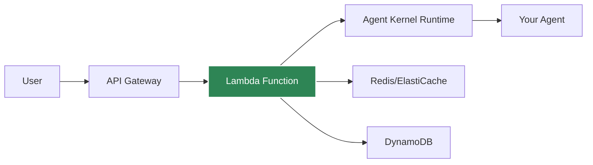

# AWS Serverless Deployment

Deploy agents to AWS Lambda for auto-scaling, serverless execution.

## Architecture



## Prerequisites

- AWS CLI configured
- AWS credentials with Lambda/API Gateway permissions
- Agent Kernel with AWS extras: `pip install agentkernel[aws]`

## Deployment

### 1. Install Dependencies

```bash
pip install agentkernel[aws,openai]
```

### 2. Configure

Refer to [Terraform modules](https://registry.terraform.io/modules/yaalalabs/ak-serverless/aws) for configuration details.

### 3. Deploy

```bash
terraform init && terraform deploy
```

## Lambda Handler

Your agent code remains the same, just import the Lambda handler:

```python
from agents import Agent as OpenAIAgent
from agentkernel.openai import OpenAIModule
from agentkernel.aws import Lambda

agent = OpenAIAgent(name="assistant", ...)
OpenAIModule([agent])

handler = Lambda.handler
## API Endpoints
```

After deployment:

```
POST https://{api-id}.execute-api.us-east-1.amazonaws.com/prod/chat
```

Body:

```json
{
  "agent": "assistant",
  "message": "Hello!",
  "session_id": "user-123"
}
```

## Cost Optimization

### Lambda Configuration

Memory: 512 MB
Timeout: 30

Refer to [Terraform modules](https://registry.terraform.io/modules/yaalalabs/ak-serverless/aws) to update the configurations.


### Cold Start Mitigation

- Use provisioned concurrency for critical endpoints
- Keep Lambda warm with scheduled pings
- Optimize package size

## Session Storage

For serverless deployments, use DynamoDB or ElastiCache Redis for session persistence:

### DynamoDB (Recommended for Serverless)

```bash
export AK_SESSION__TYPE=dynamodb
export AK_SESSION__DYNAMODB__TABLE_NAME=agent-kernel-sessions
export AK_SESSION__DYNAMODB__TTL=3600  # 1 hour
```

**Benefits:**
- Serverless, fully managed
- Auto-scaling
- No cold starts
- Pay-per-use
- AWS-native integration

**Requirements:**
- DynamoDB table with partition key `session_id` (String) and sort key `key` (String)
- Lambda IAM role with DynamoDB permissions (`dynamodb:GetItem`, `dynamodb:PutItem`, `dynamodb:UpdateItem`, `dynamodb:DescribeTable`)

### ElastiCache Redis

```bash
export AK_SESSION__TYPE=redis
export AK_SESSION__REDIS__URL=redis://elasticache-endpoint:6379
```

**Benefits:**
- High performance
- Shared cache across functions

**Note:** Redis requires VPC configuration for Lambda, which can impact cold start times.

## Monitoring

CloudWatch metrics automatically available:
- Invocation count
- Duration
- Errors
- Concurrent executions

## Best Practices

- Use DynamoDB for session storage (serverless-native)
- Alternatively, use Redis for session storage if already using ElastiCache
- Set appropriate timeout (30-60s for LLM calls)

## Example Deployment

See [examples/aws-serverless](https://github.com/yaalalabs/agent-kernel/tree/develop/examples/aws-serverless)