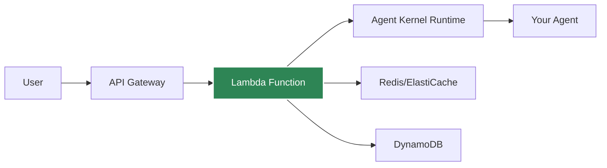
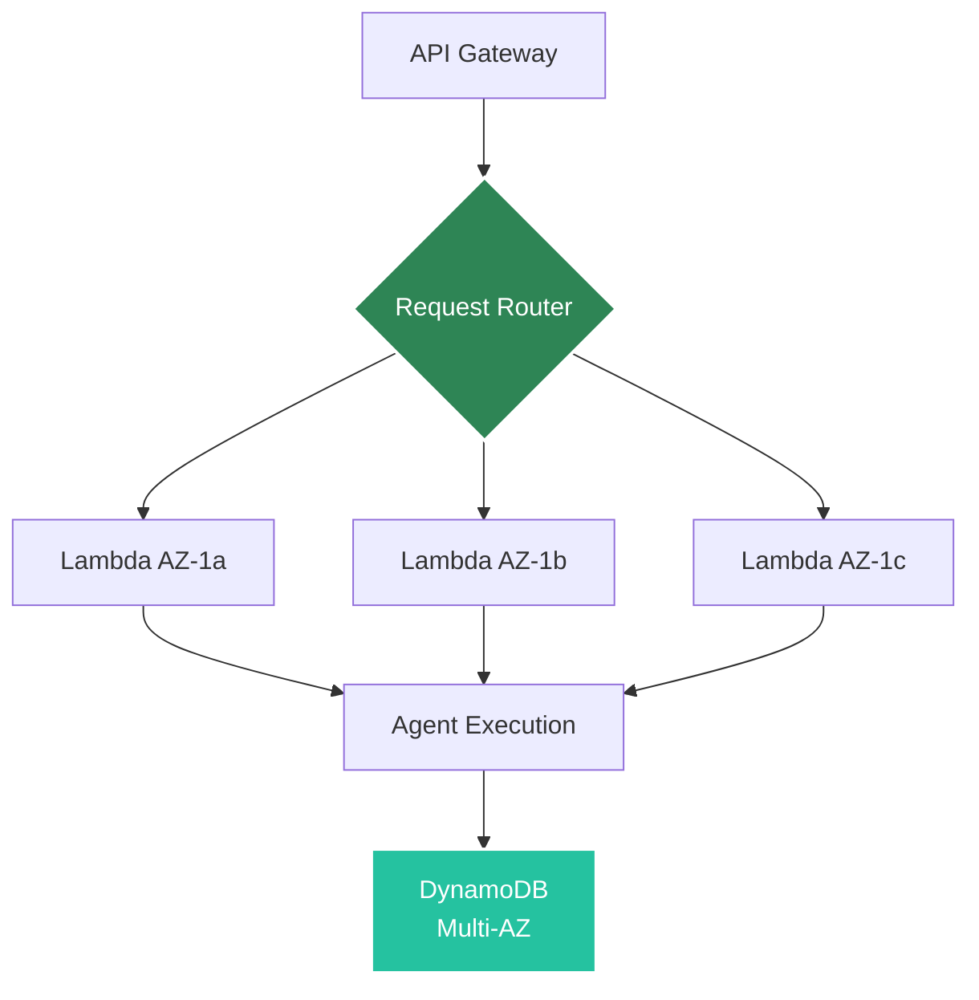

# AWS Serverless Deployment

Deploy agents to AWS Lambda for auto-scaling, serverless execution.

## Architecture



## Prerequisites

- AWS CLI configured
- AWS credentials with Lambda/API Gateway permissions
- Agent Kernel with AWS extras: `pip install agentkernel[aws]`

## Deployment

### 1. Install Dependencies

```bash
pip install agentkernel[aws,openai]
```

### 2. Configure

Refer to [Terraform modules](https://registry.terraform.io/modules/yaalalabs/ak-serverless/aws) for configuration details.

### 3. Deploy

```bash
terraform init && terraform apply
```

## Lambda Handler

Your agent code remains the same, just import the Lambda handler:

```python
from agents import Agent as OpenAIAgent
from agentkernel.openai import OpenAIModule
from agentkernel.aws import Lambda

agent = OpenAIAgent(name="assistant", ...)
OpenAIModule([agent])

handler = Lambda.handler
## API Endpoints
```

After deployment:

```
POST https://{api-id}.execute-api.us-east-1.amazonaws.com/prod/chat
```

Body:

```json
{
  "agent": "assistant",
  "message": "Hello!",
  "session_id": "user-123"
}
```

### Custom endpoints (multiple handlers)

You can attach additional API Gateway routes to the same Lambda by registering handlers per path and method:

```python
import json
from agentkernel.aws import Lambda

@Lambda.register("/app", method="GET")
def custom_app_handler(event, context):
    return {"response": "Hello! from AK 'app'"}

@Lambda.register("/app_info", method="POST")
def custom_app_info_handler(event, context):
    payload = json.loads(event.get("body") or "{}")
    return {"request": payload, "response": "Hello! from AK 'app_info'"}
```

> **NOTE: If you want to override base paths you have to define them in the `main.tf` file. Also note that the chat endpoint path which is defined in the `main.tf` file will be reserved for the chat endpoint, therefore it is not possible to define a custom lambda function for the default chat endpoint path**

## Cost Optimization

### Lambda Configuration

Memory: 512 MB
Timeout: 30

Refer to [Terraform modules](https://registry.terraform.io/modules/yaalalabs/ak-serverless/aws) to update the configurations.


### Cold Start Mitigation

- Use provisioned concurrency for critical endpoints
- Keep Lambda warm with scheduled pings
- Optimize package size

## Fault Tolerance

AWS Lambda deployment is inherently fault-tolerant with fully managed infrastructure.

### Serverless Resilience by Design

Lambda provides built-in fault tolerance without any configuration:



**Key Features:**
- Multi-AZ execution automatically
- No infrastructure to manage
- Automatic scaling to demand
- Built-in retry mechanisms
- AWS handles all failures

### Multi-AZ Architecture

**Automatic Distribution:**
- Lambda functions run across all availability zones
- No configuration required
- Survives entire AZ failures
- Transparent to application code

**Benefits:**
- Zone-level isolation
- Geographic redundancy
- No single point of failure
- AWS-managed failover

### Automatic Retry Logic

Lambda automatically retries failed invocations:

**Synchronous Invocations (API Gateway):**
```
1st attempt → Failure
↓
2nd attempt (immediate retry)
↓
3rd attempt (immediate retry)
↓
Error response to client
```

**Error Types with Automatic Retry:**
- Function errors (unhandled exceptions)
- Throttling errors (429)
- Service errors (5xx)
- Timeout errors

### Scaling and Availability

**Infinite Scaling:**
- Automatically scales to handle any number of requests
- Each request can run in isolated execution environment
- No capacity planning needed
- No manual intervention required

**Concurrency Management:**
```hcl
# Optional: Reserve capacity for critical functions
resource "aws_lambda_function" "agent" {
  reserved_concurrent_executions = 100
}

# Optional: Provisioned concurrency (eliminates cold starts)
resource "aws_lambda_provisioned_concurrency_config" "agent" {
  provisioned_concurrent_executions = 10
}
```

**Benefits:**
- Handle traffic spikes automatically
- No over-provisioning
- Pay only for actual usage
- No capacity limits (within AWS quotas)

### State Persistence with DynamoDB

Serverless-native state management with maximum resilience:

```bash
export AK_SESSION__TYPE=dynamodb
export AK_SESSION__DYNAMODB__TABLE_NAME=agent-kernel-sessions
```

**DynamoDB Fault Tolerance:**
- **Multi-AZ replication** - Data replicated across 3 AZs automatically
- **Point-in-time recovery (PITR)** - Restore to any second in last 35 days

:::tip
For detailed DynamoDB session configuration and best practices, see the [Session Management](/docs/core-concepts/session#dynamodb-storage) documentation.
:::
- **Continuous backups** - Automatic and continuous
- **99.999% availability SLA** - Five nines uptime
- **Global tables** (optional) - Multi-region replication


### Recovery Time and Point Objectives

**Recovery Time Objective (RTO):**
- Function failure: < 1 second (automatic retry)
- AZ failure: 0 seconds (multi-AZ by default)
- Region failure: Requires multi-region setup

**Recovery Point Objective (RPO):**
- DynamoDB: Continuous (synchronous multi-AZ replication)
- Data loss: 0 (with proper DynamoDB configuration)

### Fault Tolerance Benefits

**Compared to Traditional Servers:**
- ✅ No server failures (serverless)
- ✅ No patching required (managed by AWS)
- ✅ No capacity planning
- ✅ Automatic scaling
- ✅ Built-in redundancy

**Compared to ECS:**
- ✅ Zero infrastructure management
- ✅ Infinite scaling
- ✅ Pay only for usage
- ⚠️ Higher latency (cold starts)
- ⚠️ 15-minute execution limit

[Learn more about fault tolerance →](../core-concepts/fault-tolerance)

## Session Storage

For serverless deployments, use DynamoDB or ElastiCache Redis for session persistence:

### DynamoDB (Recommended for Serverless)

```bash
export AK_SESSION__TYPE=dynamodb
export AK_SESSION__DYNAMODB__TABLE_NAME=agent-kernel-sessions
export AK_SESSION__DYNAMODB__TTL=3600  # 1 hour
```

**Benefits:**
- Serverless, fully managed
- Auto-scaling
- No cold starts
- Pay-per-use
- AWS-native integration

**Requirements:**
- DynamoDB table with partition key `session_id` (String) and sort key `key` (String)
- Lambda IAM role with DynamoDB permissions (`dynamodb:GetItem`, `dynamodb:PutItem`, `dynamodb:UpdateItem`, `dynamodb:DescribeTable`)

### ElastiCache Redis

```bash
export AK_SESSION__TYPE=redis
export AK_SESSION__REDIS__URL=redis://elasticache-endpoint:6379
```

**Benefits:**
- High performance
- Shared cache across functions

**Note:** Redis requires VPC configuration for Lambda, which can impact cold start times.

## Monitoring

CloudWatch metrics automatically available:
- Invocation count
- Duration
- Errors
- Concurrent executions

## Best Practices

- Use DynamoDB for session storage (serverless-native)
- Alternatively, use Redis for session storage if already using ElastiCache
- Set appropriate timeout (30-60s for LLM calls)

## Example Deployment

See [examples/aws-serverless](https://github.com/yaalalabs/agent-kernel/tree/develop/examples/aws-serverless)