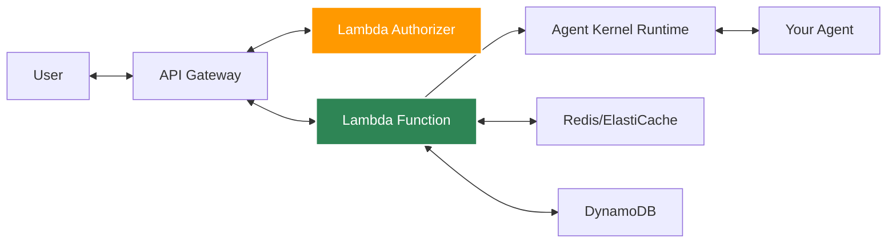
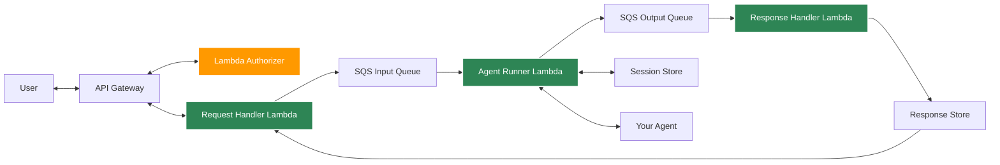
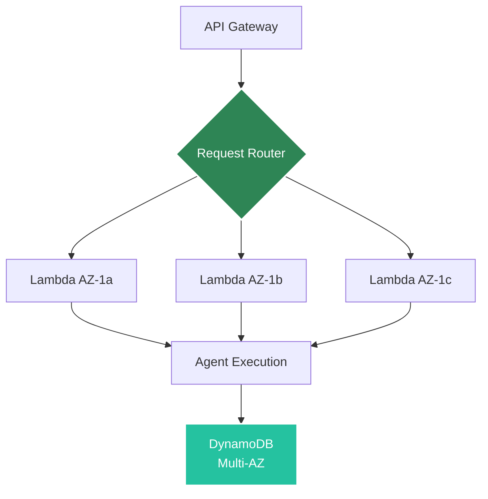

# AWS Serverless Deployment

Deploy agents to AWS Lambda for auto-scaling, serverless execution.

## Architecture

### Normal Mode: using request handler for chat processing


### Queue Based Execution: using queues to improve the scalability (recommended for prod)
#### REST SYNC and REST ASYNC modes


The request handler receives the incoming API request, the agent runner executes the agent logic, and the response handler persists outbound messages to the configured response store. In queue-backed modes, the three-lambda split keeps request ingestion, execution, and response persistence independent.

## Prerequisites

- AWS CLI configured
- AWS credentials with Lambda/API Gateway permissions
- Agent Kernel with AWS extras: `pip install agentkernel[aws]`
- For authentication: `pip install agentkernel[api,aws]`

## Deployment

### 1. Install Dependencies

The dependencies need to be installed in both the main Lambda package and the authorizer package:

**Main Lambda Package:**
```bash
pip install agentkernel[aws,openai]
```

**Authorizer Lambda Package:**
```bash
pip install agentkernel[api,aws]
```

**Example Deployment Scripts:**

For the main Lambda function (`deploy/deploy.sh`):
```bash
# Install main Lambda dependencies
uv pip install -r requirements.txt --target=dist/data
uv pip install --force-reinstall --target=dist/data agentkernel[openai,redis]
```

For the authorizer Lambda function (`auth_deployment/create_auth_package.sh`):
```bash
# Install authorizer dependencies
uv pip install --force-reinstall --no-deps agentkernel[api,aws] --target=auth_dist
```

### 2. Configure

Refer to [Terraform modules](https://registry.terraform.io/modules/yaalalabs/ak-serverless/aws) for configuration details.

### 3. Deploy

```bash
terraform init && terraform apply
```

## Lambda Handler

Your agent code remains the same, just import the Lambda handler:

```python
from agents import Agent as OpenAIAgent
from agentkernel.openai import OpenAIModule
from agentkernel.aws import Lambda

agent = OpenAIAgent(name="assistant", ...)
OpenAIModule([agent])

handler = Lambda.handler
```

The AWS Lambda entrypoint accepts both payload shapes, but the rest of this guide uses `BaseRunRequest` examples for request bodies.

Supported payloads:

```json
{
  "prompt": "Hello agent",
  "agent": "assistant",
  "session_id": "user-123"
}
```

```json
{
  "request_id": "req-123",
  "user_id": "user-123",
  "body": {
    "prompt": "Hello agent",
    "agent": "assistant",
    "session_id": "user-123"
  }
}
```

## API Endpoints

After deployment, the default chat route is:

```text
https://{api-id}.execute-api.us-east-1.amazonaws.com/agents/chat
```

The payload examples below use `BaseRunRequest` unless noted otherwise.

### `rest_sync`

`rest_sync` sends the request to SQS and waits for the matching response.

**Request**

```bash
curl -X POST https://{api-id}.execute-api.us-east-1.amazonaws.com/agents/chat \
  -H "Content-Type: application/json" \
  -H "Authorization: Bearer your-token" \
  -d '{
    "prompt": "Hello!",
    "agent": "assistant",
    "session_id": "user-123"
  }'
```

**Response**

```json
{
  "result": "Agent response here",
  "session_id": "user-123"
}
```

### `rest_async`

`rest_async` uses two requests: one to submit the work, and a second GET request to poll for the response using the returned `request_id`.

**1. Submit request**

```bash
curl -X POST https://{api-id}.execute-api.us-east-1.amazonaws.com/agents/chat \
  -H "Content-Type: application/json" \
  -d '{
    "prompt": "Hello!",
    "agent": "assistant",
    "session_id": "user-123"
  }'
```

**Submit response**

```json
{
  "status": "ACCEPTED",
  "request_id": "req-123"
}
```

**2. Poll for the response**

```bash
curl -X GET https://{api-id}.execute-api.us-east-1.amazonaws.com/agents/chat \
  -H "Content-Type: application/json" \
  -d '{
    "request_id": "req-123"
  }'
```

**Poll response**

```json
{
  "result": "Agent response here",
  "session_id": "user-123"
}
```

If the response is not available yet, the poll endpoint returns a `NOT_FOUND` body with the same `request_id` so clients can retry.

## Execution Modes and Response Store

The AWS serverless runtime currently supports these execution modes:

- `rest_sync` - POST request to SQS, then wait for the matching response in the response store
- `rest_async` - POST request to SQS, then poll later with GET and the same `request_id`

When you use queue-backed execution, configure the `execution` block:

- `execution.mode` - selects the runtime mode
- `execution.queues.input.url` - input SQS queue for agent requests
- `execution.queues.output.url` - output SQS queue for agent responses
- `execution.queues.input.max_receive_count` - input queue receive retry threshold
- `execution.queues.output.max_receive_count` - output queue receive retry threshold
- `execution.response_store.retry_count` - number of response-store lookup attempts
- `execution.response_store.delay` - delay in seconds between lookup attempts
- `execution.response_store.type` - response-store backend selector configured in `config.yaml` only
- `execution.response_store.redis.url` - Redis URL for response storage
- `execution.response_store.redis.prefix` - Redis key prefix for response storage, default `ak:responses:`
- `execution.response_store.redis.ttl` - Redis TTL in seconds
- `execution.response_store.dynamodb.table_name` - DynamoDB table name for response storage
- `execution.response_store.dynamodb.ttl` - DynamoDB TTL in seconds

The response store is configured as a single object with one selected backend:

```json
{
  "execution": {
    "mode": "rest_async",
    "queues": {
      "input": {
        "url": "https://sqs.us-east-1.amazonaws.com/123456789012/agent-input"
      }
    },
    "response_store": {
      "type": "redis",
      "retry_count": 5,
      "delay": 5,
      "redis": {
        "url": "redis://localhost:6379",
        "prefix": "ak:responses:",
        "ttl": 3600
      }
    }
  }
}
```

Set `response_store.type` to `redis` or `dynamodb`, then provide the matching backend block.

The response handler reads `request_id` from SQS message attributes and stores each response by request ID. For Redis, the message body is stored under the configured key prefix; for DynamoDB, the message is stored in the configured table. The `request_id` and optional `user_id` are carried as SQS message attributes, while the nested `body` is used as the message payload.

Example environment variables:

```bash
export AK_EXECUTION__MODE=rest_async
export AK_EXECUTION__QUEUES__INPUT__URL=https://sqs.us-east-1.amazonaws.com/123456789012/agent-input
export AK_EXECUTION__QUEUES__OUTPUT__URL=https://sqs.us-east-1.amazonaws.com/123456789012/agent-output
export AK_EXECUTION__QUEUES__INPUT__MAX_RECEIVE_COUNT=3
export AK_EXECUTION__QUEUES__OUTPUT__MAX_RECEIVE_COUNT=3
export AK_EXECUTION__RESPONSE_STORE__REDIS__URL=redis://localhost:6379
export AK_EXECUTION__RESPONSE_STORE__REDIS__PREFIX=ak:responses:
export AK_EXECUTION__RESPONSE_STORE__RETRY_COUNT=5
export AK_EXECUTION__RESPONSE_STORE__DELAY=5
```

## Lambda Handlers

If scalable mode is disabled, only the request handler is needed. If scalable mode is enabled, you need all three Lambda handlers: request handler, agent runner, and response handler.

### Authorizer Lambda

The authorizer is optional in both scalable and non-scalable deployments. Add it only when you want API Gateway authentication.

```python
from typing import Optional

import jwt
from agentkernel.api import AuthValidator, ValidationContext, ValidationResult
from agentkernel.aws import APIGatewayAuthorizer


class CustomAuthTokenValidator(AuthValidator):
    def validate(self, token: str, context: Optional[ValidationContext] = None) -> ValidationResult:
        payload = jwt.decode(token, options={"verify_signature": False})
        email = payload.get("email", "")
        return ValidationResult(is_valid=email == "test@test.com")


handler = APIGatewayAuthorizer(validator=CustomAuthTokenValidator()).handle
```

### 1. Request Handler

Use this handler for the default chat path. The same Lambda can also expose custom routes by registering additional handlers.

```python
from agents import Agent as OpenAIAgent
from agentkernel.aws import Lambda
from agentkernel.openai import OpenAIModule

agent = OpenAIAgent(name="assistant", ...)
OpenAIModule([agent])

handler = Lambda.handler
```

Custom endpoints example:

```python
import json
from agentkernel.aws import Lambda


@Lambda.register("/app", method="GET")
def custom_app_handler(event, context):
    return {"receivedEventPayload": dict(event), "response": "Hello! from AK 'app'"}


@Lambda.register("/app_info", method="POST")
def custom_app_info_handler(event, context):
    payload = json.loads(event.get("body") or "{}")
    return {"receivedEventPayload": dict(event), "request": payload, "response": "Hello! from AK 'app_info'"}


handler = Lambda.handler
```

See [examples/aws-serverless/scalable-openai/lambda_request_handler.py](https://github.com/yaalalabs/agent-kernel/tree/develop/examples/aws-serverless/scalable-openai/lambda_request_handler.py) for the reference implementation.

### 2. Agent Runner

This Lambda receives the queued request, runs the agent logic, and sends the result to the output queue.

```python
from agents import Agent
from agentkernel.aws import ServerlessAgentRunner
from agentkernel.openai import OpenAIModule

math_agent = Agent(
    name="math",
    handoff_description="Specialist agent for math questions",
    instructions="You provide help with math problems. Explain your reasoning at each step and include examples. If prompted for anything else you refuse to answer.",
)

history_agent = Agent(
    name="history",
    handoff_description="Specialist agent for historical questions",
    instructions="You provide assistance with historical queries. Explain important events and context clearly.",
)

triage_agent = Agent(
    name="triage",
    instructions="You determine which agent to use based on the user's question.",
    handoffs=[history_agent, math_agent],
)

OpenAIModule([triage_agent, math_agent, history_agent])

handler = ServerlessAgentRunner.handle
```

See [examples/aws-serverless/scalable-openai/lambda_agent_runner.py](https://github.com/yaalalabs/agent-kernel/tree/develop/examples/aws-serverless/scalable-openai/lambda_agent_runner.py) for the reference implementation.

### 3. Response Handler

This Lambda reads the response from the output queue and stores it in the configured response store.

```python
from agentkernel.aws import ResponseHandler


handler = ResponseHandler.handle
```

See [examples/aws-serverless/scalable-openai/lambda_response_handler.py](https://github.com/yaalalabs/agent-kernel/tree/develop/examples/aws-serverless/scalable-openai/lambda_response_handler.py) for the reference implementation.

## Lambda Package Creation

The deployment script creates the Lambda artifacts before Terraform runs.

### Request Handler Package

```bash
create_request_handler_deployment_package() {
    pushd ../
    rm -rf dist_request_handler dist_request_handler.zip
    mkdir -p dist_request_handler
    uv export --no-hashes > requirements.txt
    if [[ ${1-} != "local" ]]; then
      uv pip install -r requirements.txt --target=dist_request_handler
    else
      uv pip install --force-reinstall --target=dist_request_handler --find-links ../../../ak-py/dist agentkernel[aws,redis] || true
    fi
    cp -r lambda_request_handler.py config.yaml dist_request_handler/
    cd dist_request_handler && zip -r ../dist_request_handler.zip .
    popd || exit 1
}
```

This creates `dist_request_handler.zip`.

### Agent Runner Package

```bash
create_agent_runner_deployment_package() {
    pushd ../
    rm -rf dist_agent_runner
    mkdir -p dist_agent_runner/data
    uv export --no-hashes > requirements.txt
    if [[ ${1-} != "local" ]]; then
      uv pip install -r requirements.txt --target=dist_agent_runner/data
    else
      uv pip install -r requirements.txt --target=dist_agent_runner/data --find-links ../../../ak-py/dist
      uv pip install --force-reinstall --target=dist_agent_runner/data --find-links ../../../ak-py/dist agentkernel[aws,openai,redis] || true
    fi
    cp -r lambda_agent_runner.py config.yaml dist_agent_runner/data
    popd || exit 1
    cp Dockerfile.agent_runner ../dist_agent_runner/Dockerfile
}
```

This creates the `dist_agent_runner/` folder.

### Response Handler Package

```bash
create_response_handler_deployment_package() {
    pushd ../
    rm -rf dist_response_handler dist_response_handler.zip
    mkdir -p dist_response_handler
    uv export --no-hashes > requirements.txt
    if [[ ${1-} != "local" ]]; then
      uv pip install -r requirements.txt --target=dist_response_handler
    else
      uv pip install --force-reinstall --target=dist_response_handler --find-links ../../../ak-py/dist agentkernel[aws,redis] || true
    fi
    cp -r lambda_response_handler.py config.yaml dist_response_handler/
    cd dist_response_handler && zip -r ../dist_response_handler.zip .
    popd || exit 1
}
```

This creates `dist_response_handler.zip`.

### Optional Authorizer Package

If you enable authentication, build a separate authorizer package as well.

```bash
create_auth_deployment_package() {
    pushd ../
    rm -rf dist_auth dist_auth.zip
    mkdir -p dist_auth
    if [[ ${1-} != "local" ]]; then
        uv pip install --force-reinstall --no-deps agentkernel[api,aws,auth] --target=dist_auth
    else
        uv pip install --force-reinstall --no-deps agentkernel[api,aws,auth] --target=dist_auth --find-links ../../../ak-py/dist
    fi
    uv pip install --group auth --target=dist_auth
    cp -r lambda_auth.py dist_auth/
    cd dist_auth && zip -r ../dist_auth.zip .
    popd || exit 1
}
```

This creates `dist_auth.zip`.

The example deployment script runs all package builders before Terraform applies the infrastructure.

## Lambda Environment Variables

The Lambda router automatically reads the following environment variables to correctly map incoming API paths:

- **API_BASE_PATH** – Base path mapping without leading slash. Example: `api` or `prod`
- **API_VERSION** – Version segment. Example: `v1`
- **AGENT_ENDPOINT** – The default chat endpoint segment. Example: `chat`

These environment variables are automatically configured by the Terraform module based on the `api_base_path`, `api_version`, and `agent_endpoint` variables in your Terraform configuration.

> **NOTE:** If you wrap our Lambda with your own API Gateway and deployment method, you are responsible for setting these environment variables. If they are not provided, only the default chat handler may work and custom routes may not resolve as expected.

> **NOTE: If you want to override base paths you have to define them in the `main.tf` file. Also note that the chat endpoint path which is defined in the `main.tf` file will be using our default chat lambda handler function, therefore it is not possible to define a custom lambda function for the default chat endpoint path**

## Cost Optimization

### Lambda Configuration

Memory: 512 MB
Timeout: 30

Refer to [Terraform modules](https://registry.terraform.io/modules/yaalalabs/ak-serverless/aws) to update the configurations.


### Cold Start Mitigation

- Use provisioned concurrency for critical endpoints
- Keep Lambda warm with scheduled pings
- Optimize package size

## Fault Tolerance

AWS Lambda deployment is inherently fault-tolerant with fully managed infrastructure.

### Serverless Resilience by Design

Lambda provides built-in fault tolerance without any configuration:



**Key Features:**
- Multi-AZ execution automatically
- No infrastructure to manage
- Automatic scaling to demand
- Built-in retry mechanisms
- AWS handles all failures

### Multi-AZ Architecture

**Automatic Distribution:**
- Lambda functions run across all availability zones
- No configuration required
- Survives entire AZ failures
- Transparent to application code

**Benefits:**
- Zone-level isolation
- Geographic redundancy
- No single point of failure
- AWS-managed failover

### Automatic Retry Logic

Lambda automatically retries failed invocations:

**Synchronous Invocations (API Gateway):**
```
1st attempt → Failure
↓
2nd attempt (immediate retry)
↓
3rd attempt (immediate retry)
↓
Error response to client
```

**Error Types with Automatic Retry:**
- Function errors (unhandled exceptions)
- Throttling errors (429)
- Service errors (5xx)
- Timeout errors

### Scaling and Availability

**Infinite Scaling:**
- Automatically scales to handle any number of requests
- Each request can run in isolated execution environment
- No capacity planning needed
- No manual intervention required

**Concurrency Management:**
```hcl
# Optional: Reserve capacity for critical functions
resource "aws_lambda_function" "agent" {
  reserved_concurrent_executions = 100
}

# Optional: Provisioned concurrency (eliminates cold starts)
resource "aws_lambda_provisioned_concurrency_config" "agent" {
  provisioned_concurrent_executions = 10
}
```

**Benefits:**
- Handle traffic spikes automatically
- No over-provisioning
- Pay only for actual usage
- No capacity limits (within AWS quotas)

### State Persistence with DynamoDB

Serverless-native state management with maximum resilience:

```bash
export AK_SESSION__TYPE=dynamodb
export AK_SESSION__DYNAMODB__TABLE_NAME=agent-kernel-sessions
```

**DynamoDB Fault Tolerance:**
- **Multi-AZ replication** - Data replicated across 3 AZs automatically
- **Point-in-time recovery (PITR)** - Restore to any second in last 35 days

:::tip
For detailed DynamoDB session configuration and best practices, see the [Session Management](https://github.com/yaalalabs/agent-kernel/tree/develop/docs/docs/core-concepts/session.md) documentation.
:::
- **Continuous backups** - Automatic and continuous
- **99.999% availability SLA** - Five nines uptime
- **Global tables** (optional) - Multi-region replication


### Recovery Time and Point Objectives

**Recovery Time Objective (RTO):**
- Function failure: < 1 second (automatic retry)
- AZ failure: 0 seconds (multi-AZ by default)
- Region failure: Requires multi-region setup

**Recovery Point Objective (RPO):**
- DynamoDB: Continuous (synchronous multi-AZ replication)
- Data loss: 0 (with proper DynamoDB configuration)

### Fault Tolerance Benefits

**Compared to Traditional Servers:**
- ✅ No server failures (serverless)
- ✅ No patching required (managed by AWS)
- ✅ No capacity planning
- ✅ Automatic scaling
- ✅ Built-in redundancy

**Compared to ECS:**
- ✅ Zero infrastructure management
- ✅ Infinite scaling
- ✅ Pay only for usage
- ⚠️ Higher latency (cold starts)
- ⚠️ 15-minute execution limit

[Learn more about fault tolerance →](https://github.com/yaalalabs/agent-kernel/tree/develop/docs/docs/core-concepts/fault-tolerance.md)

## Session Storage

For serverless deployments, use DynamoDB or ElastiCache Redis for session persistence:

### DynamoDB (Recommended for Serverless)

```bash
export AK_SESSION__TYPE=dynamodb
export AK_SESSION__DYNAMODB__TABLE_NAME=agent-kernel-sessions
export AK_SESSION__DYNAMODB__TTL=3600  # 1 hour
```

**Benefits:**
- Serverless, fully managed
- Auto-scaling
- No cold starts
- Pay-per-use
- AWS-native integration

**Requirements:**
- DynamoDB table with partition key `session_id` (String) and sort key `key` (String)
- Lambda IAM role with DynamoDB permissions (`dynamodb:GetItem`, `dynamodb:PutItem`, `dynamodb:UpdateItem`, `dynamodb:DescribeTable`)

### ElastiCache Redis

```bash
export AK_SESSION__TYPE=redis
export AK_SESSION__REDIS__URL=redis://elasticache-endpoint:6379
```

**Benefits:**
- High performance
- Shared cache across functions

**Note:** Redis requires VPC configuration for Lambda, which can impact cold start times.

## Monitoring

CloudWatch metrics automatically available:
- Invocation count
- Duration
- Errors
- Concurrent executions

## Best Practices

- Use DynamoDB for session storage (serverless-native)
- Alternatively, use Redis for session storage if already using ElastiCache
- Set appropriate timeout (30-60s for LLM calls)
- **Security**: Authentication is optional - only implement Lambda authorizers if you need API authentication
- **Performance**: If using authentication, cache authorizer results with appropriate TTL
- **Monitoring**: Monitor authorizer latency and error rates separately
- **Deployment**: Always create two separate packages - one for main lambda and one for auth lambda (if authentication is enabled)

## Example Deployment

See [examples/aws-serverless](https://github.com/yaalalabs/agent-kernel/tree/develop/examples/aws-serverless)