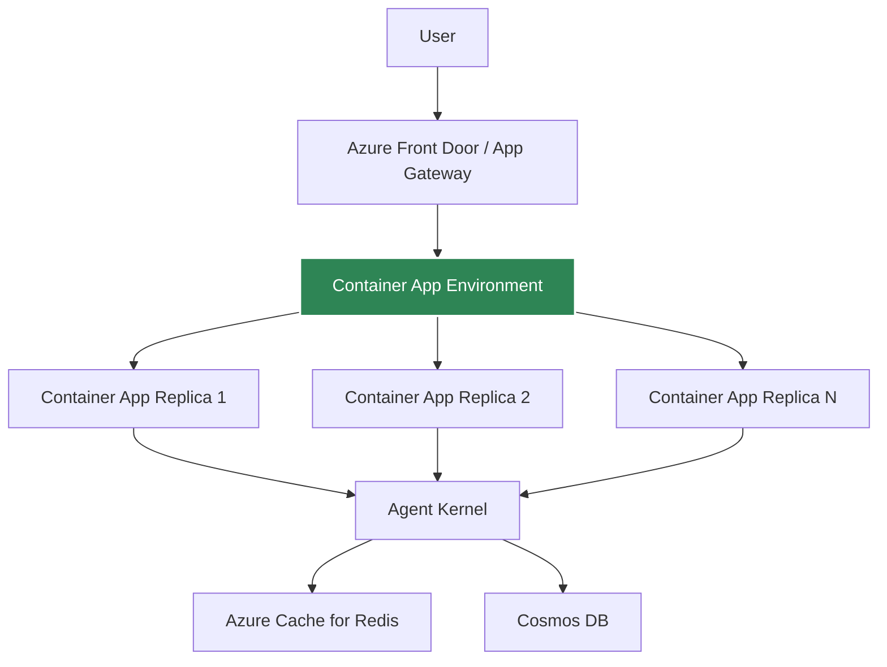
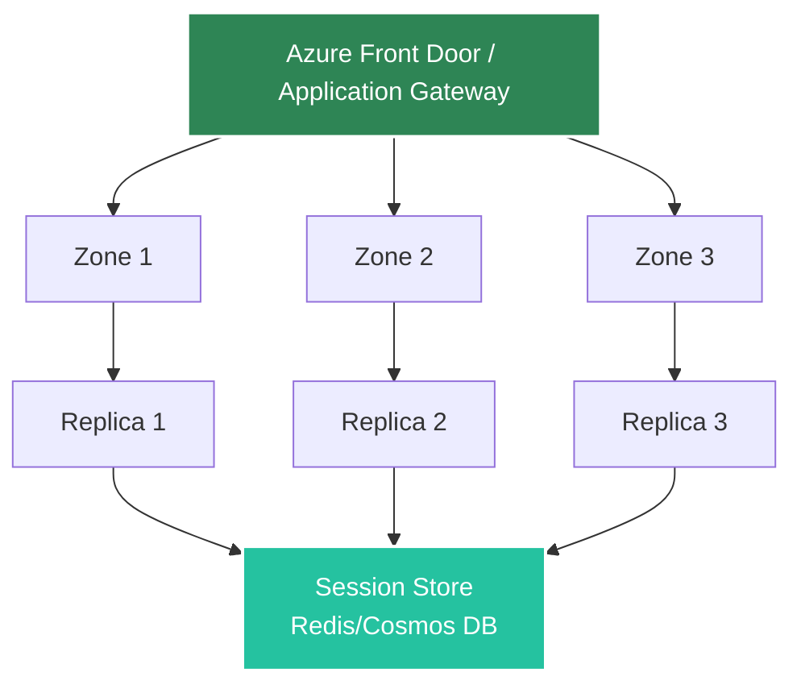

# Azure Containerized Deployment

Deploy agents to Azure Container Apps for consistent, low-latency execution.

## Architecture



## Prerequisites

- Docker installed
- Azure CLI configured
- Azure Container Registry (ACR) created
- Agent Kernel with Azure extras

## Deployment

Refer to [example Azure Container Apps implementation](https://github.com/yaalalabs/agent-kernel/tree/develop/examples/azure-containerized/crewai) which leverages Agent Kernel's [terraform module](https://registry.terraform.io/modules/yaalalabs/ak-containerized/azurerm) for Container Apps deployment.

## Advantages

- **No cold starts** - containers always warm
- **Consistent performance** - predictable latency
- **Better for high traffic** - efficient resource usage
- **Full control** - customize container, resources, etc.
- **High availability** - multi-zone deployment with automatic failover
- **Fault tolerant** - automatic recovery and health-based routing
- **KEDA scaling** - Event-driven autoscaling built-in

## Fault Tolerance

Azure Container Apps deployment provides comprehensive fault tolerance features with extensive configurability.

### Multi-Zone Architecture

Replicas are automatically distributed across availability zones:



**Benefits:**
- Survives entire zone failures
- No single point of failure
- Automatic traffic distribution
- Geographic redundancy

### Automatic Replica Recovery

Container Apps maintains desired replica count with automatic recovery:

**Features:**
- Failed replicas automatically restarted
- Desired count maintained at all times
- Rolling deployments with zero downtime
- Gradual replica replacement during updates
- Built-in revision management

### Health Check Configuration

Container Apps performs continuous health monitoring:

**How it works:**
1. Container Apps sends requests to `/health` endpoint periodically
2. Unhealthy replicas removed from load balancer rotation
3. Traffic routed only to healthy replicas
4. Failed replicas replaced automatically
5. Connection draining ensures graceful shutdown

### Auto-Scaling for Resilience

Container Apps auto-scaling maintains capacity during failures and load spikes with KEDA support.

**Auto-scaling triggers:**
- HTTP requests
- CPU utilization
- Memory utilization
- Custom metrics (KEDA scalers)
- Queue depth
- Event Grid events

**Benefits:**
- Automatic capacity adjustment
- Handles traffic spikes
- Compensates for replica failures
- Cost optimization during low traffic
- Scale to zero capability

### Network Resilience

**Connection Draining:**
- Existing connections complete before replica termination
- Configurable timeout
- Prevents abrupt connection drops
- Graceful shutdown process

**Load Balancer Features:**
- Built-in ingress controller
- Session affinity (optional) for stateful apps
- Cross-zone load balancing enabled
- Health-based routing
- Automatic DNS management

### Recovery Time Objectives

**Typical Recovery Times:**
- Replica failure detection: 5-30 seconds (health check interval)
- Replica replacement: 30-60 seconds (container startup)
- Traffic rerouting: Immediate (ingress handles)
- **Total RTO**: < 2 minutes for most failures

**Recovery Point Objectives:**
- With Cosmos DB: Near-zero (multi-region replication)
- With Redis Cluster: < 1 second (automatic failover)

### Configuration Best Practices

**Minimum Replica Count**: Run at least 2 replicas (3+ recommended)
   ```hcl
   min_replicas = 3
   max_replicas = 10
   ```

**Health Probes**: Configure liveness and readiness probes
   ```hcl
   liveness_probe {
     path = "/health"
     port = 8080
     interval_seconds = 10
     timeout = 3
     failure_threshold = 3
   }
   
   readiness_probe {
     path = "/health"
     port = 8080
     interval_seconds = 5
     timeout = 3
     failure_threshold = 3
   }
   ```

**Auto-Scaling Rules**: Set up appropriate scaling rules
   ```hcl
   scale_rule {
     name = "http-rule"
     http {
       concurrent_requests = 100
     }
   }
   ```

### Testing Fault Tolerance

**Simulate Failures:**
```bash
# Stop a replica to test auto-recovery
az containerapp replica delete --name my-app --replica-name replica-id

# Simulate zone failure (in test environment)
# Manually stop all replicas in one zone
```

**Validate:**
- Replicas automatically restarted
- No service interruption
- Load balanced across remaining replicas
- Metrics show recovery

[Learn more about fault tolerance →](../core-concepts/fault-tolerance)

## Session Storage

For containerized deployments, use Azure Cache for Redis or Cosmos DB for session persistence.

:::tip
For detailed session storage configuration and best practices, see the [Session Management](/docs/core-concepts/session#storage-backends) documentation.
:::

### Azure Cache for Redis (Recommended for Performance)

```bash
export AK_SESSION__TYPE=redis
export AK_SESSION__REDIS__URL=redis://your-redis-cache.redis.cache.windows.net:6379
export AK_SESSION__REDIS__SSL=flase
export AK_SESSION__CACHE__SIZE=256  # Enable in-memory caching
```

On Tls mode, the connection URL is `rediss://:password@hostname:port`
  
**Benefits:**
- High performance (sub-millisecond latency)
- Low latency
- In-memory speed
- Shared cache across replicas
- Enterprise-tier clustering support

**Use when:**
- You need sub-millisecond latency
- High throughput requirements
- Already using Redis infrastructure

[See Redis configuration details →](/docs/core-concepts/session#redis-storage)

### Cosmos DB (Serverless Option)

```bash
export AK_SESSION__TYPE=cosmosdb

export AK_SESSION__COSMOSDB__CONNECTION_STRING="AccountEndpoint=https://your-account.documents.azure.com:443/;AccountKey=your-key;"
export AK_SESSION__COSMOSDB__TABLE_NAME=sessions

```

**Benefits:**
- Fully managed, serverless
- Auto-scaling
- Multi-region replication
- No infrastructure to maintain
- Pay-per-use pricing

**Use when:**
- You want serverless infrastructure
- Moderate latency is acceptable (single-digit milliseconds)
- Simplified infrastructure management
- Azure-native integration preferred
- Global distribution required

**Requirements:**
- Cosmos DB account with database and container created
- Container App managed identity or connection string with appropriate permissions
- The Terraform module automatically creates the resources and configures permissions when enabled

## Monitoring

Use Azure Monitor Container Insights:
- CPU/Memory utilization
- Replica count
- Network metrics
- Application logs
- Request metrics

## Health Checks

Agent Kernel provides a health endpoint:

```python
# Automatically available at /health
# Returns 200 OK if healthy
```

## Application Endpoints

Users can expose their own API endpoints alongside the Agent Kernel endpoints without having to do any custom implementation. Refer to [example](https://github.com/yaalalabs/agent-kernel/tree/develop/examples/azure-containerized/crewai).

## Best Practices

- Use at least 2 replicas for high availability
- Configure auto-scaling based on traffic patterns
- Use Azure Cache for Redis for session persistence when latency is critical
- Use Cosmos DB for session persistence for serverless-style infrastructure
- Enable Container Insights for monitoring
- Set up log aggregation with Log Analytics
- Use Azure Key Vault for API keys and secrets
- Enable zone redundancy for production workloads
- Configure appropriate health probes

## Example Deployment

See [examples/azure-containerized](https://github.com/yaalalabs/agent-kernel/tree/develop/examples/azure-containerized)
