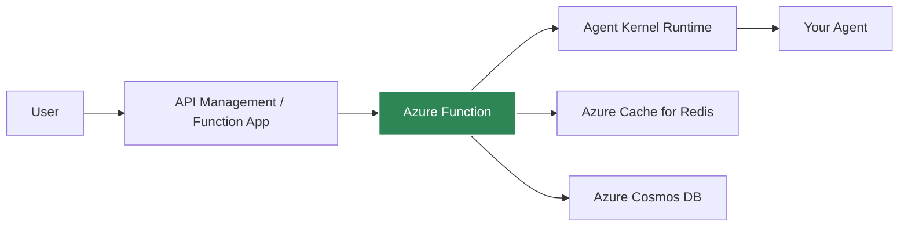
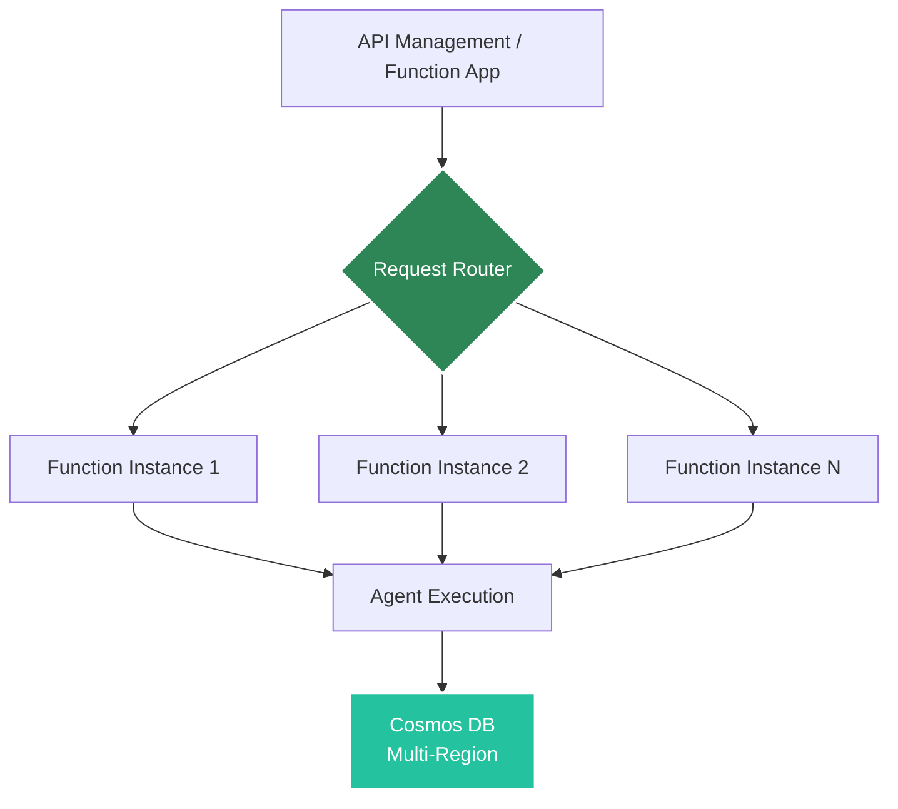

# Azure Serverless Deployment

Deploy agents to Azure Functions for auto-scaling, serverless execution.

## Architecture



## Prerequisites

- Azure CLI configured
- Azure subscription with appropriate permissions
- Agent Kernel with Azure extras: `pip install agentkernel[azure]`

## Deployment

### 1. Install Dependencies

```bash
pip install agentkernel[azure,openai]
```

### 2. Configure

Refer to [Terraform modules](https://registry.terraform.io/modules/yaalalabs/ak-serverless/azurerm) for configuration details.

### 3. Deploy

```bash
terraform init && terraform apply
```

## Azure Function Handler

Your agent code remains the same, just import the Azure Function handler:

```python
from agents import Agent as OpenAIAgent
from agentkernel.openai import OpenAIModule
from agentkernel.azure import AzureFunction

agent = OpenAIAgent(name="assistant", ...)
OpenAIModule([agent])

handler = AzureFunction.handler
```

## API Endpoints

After deployment:

```
POST https://{function-app-name}.azurewebsites.net/api/chat
```

Body:

```json
{
  "agent": "assistant",
  "message": "Hello!",
  "session_id": "user-123"
}
```

### Custom endpoints (multiple handlers)

You can attach additional HTTP routes to the same Function App by registering handlers per path and method:

```python
import json
from agentkernel.azure import AzureFunction

@AzureFunction.register("/app", method="GET")
def custom_app_handler(req):
    return {"response": "Hello! from AK 'app'"}

@AzureFunction.register("/app_info", method="POST")
def custom_app_info_handler(req):
    payload = req.get_json()
    return {"request": payload, "response": "Hello! from AK 'app_info'"}
```

> **NOTE: If you want to override base paths you have to define them in the `main.tf` file. Also note that the chat endpoint path which is defined in the `main.tf` file will be using our default chat function, therefore it is not possible to define a custom function for the default chat endpoint path**

## Cost Optimization

### Function Configuration

Memory: 512 MB
Timeout: 30 seconds

Refer to [Terraform modules](https://registry.terraform.io/modules/yaalalabs/ak-serverless/azurerm) to update the configurations.

### Cold Start Mitigation

- Use premium plans for instant scale and VNet integration
- Keep functions warm with scheduled health checks
- Optimize package size and dependencies

## Fault Tolerance

Azure Functions deployment is inherently fault-tolerant with fully managed infrastructure.

### Serverless Resilience by Design

Azure Functions provides built-in fault tolerance without any configuration:



**Key Features:**
- Multi-region execution capabilities
- No infrastructure to manage
- Automatic scaling to demand
- Built-in retry mechanisms
- Azure handles all failures

### Multi-Region Architecture

**Automatic Distribution:**
- Azure Functions can run across multiple regions
- Configured through Azure Front Door or Traffic Manager
- Survives entire region failures
- Geographic redundancy built-in

**Benefits:**
- Region-level isolation
- Geographic redundancy
- No single point of failure
- Azure-managed failover

### Automatic Retry Logic

Azure Functions automatically retries failed invocations:

**HTTP Trigger Functions:**
```
1st attempt → Failure
↓
2nd attempt (configurable retry)
↓
3rd attempt (configurable retry)
↓
Error response to client
```

**Error Types with Automatic Retry:**
- Function errors (unhandled exceptions)
- Throttling errors (429)
- Service errors (5xx)
- Timeout errors

### Scaling and Availability

**Dynamic Scaling:**
- Automatically scales to handle any number of requests
- Each request can run in isolated execution environment
- No capacity planning needed
- No manual intervention required

**Consumption Plan Benefits:**
- Automatic scale-out
- Pay only for actual execution time
- No idle capacity costs
- Integrated with Azure monitoring

### State Persistence with Cosmos DB

Serverless-native state management with maximum resilience:

```bash
export AK_SESSION__TYPE=cosmosdb

# Option 1: Using connection string (recommended)
export AK_SESSION__COSMOSDB__CONNECTION_STRING="AccountEndpoint=https://your-account.documents.azure.com:443/;AccountKey=your-key;"
export AK_SESSION__COSMOSDB__TABLE_NAME=sessions

# Option 2: Using endpoint and key separately
export AK_SESSION_COSMOSDB_TABLE_ENDPOINT="https://your-account.documents.azure.com:443/"
export AK_SESSION_COSMOSDB_PRIMARY_KEY="your-primary-key"
export AK_SESSION_COSMOSDB_TABLE_NAME=sessions
```

**Cosmos DB Fault Tolerance:**
- **Multi-region replication** - Data replicated across multiple regions automatically
- **Automatic failover** - Seamless failover to replica regions
- **Point-in-time recovery** - Restore to any point in time
- **Continuous backups** - Automatic and continuous
- **99.999% availability SLA** - Five nines uptime for multi-region accounts

:::tip
For detailed Cosmos DB session configuration and best practices, see the [Session Management](/docs/core-concepts/session#cosmosdb-storage) documentation.
:::

### Recovery Time and Point Objectives

**Recovery Time Objective (RTO):**
- Function failure: < 1 second (automatic retry)
- Region failure: < 30 seconds (automatic failover with multi-region setup)

**Recovery Point Objective (RPO):**
- Cosmos DB: Near-zero (synchronous multi-region replication)
- Data loss: Minimal with proper Cosmos DB configuration

### Fault Tolerance Benefits

**Compared to Traditional Servers:**
- ✅ No server failures (serverless)
- ✅ No patching required (managed by Azure)
- ✅ No capacity planning
- ✅ Automatic scaling
- ✅ Built-in redundancy

**Compared to Container Instances:**
- ✅ Zero infrastructure management
- ✅ Dynamic scaling
- ✅ Pay only for usage
- ⚠️ Higher latency (cold starts on Consumption plan)
- ⚠️ Execution time limits (5-10 minutes depending on plan)

[Learn more about fault tolerance →](../core-concepts/fault-tolerance)

## Session Storage

For serverless deployments, use Cosmos DB or Azure Cache for Redis for session persistence:

### Cosmos DB (Recommended for Serverless)

```bash
export AK_SESSION__TYPE=cosmosdb

# Option 1: Using connection string (recommended)
export AK_SESSION__COSMOSDB__CONNECTION_STRING="AccountEndpoint=https://your-account.documents.azure.com:443/;AccountKey=your-key;"
export AK_SESSION__COSMOSDB__TABLE_NAME=sessions

# Option 2: Using endpoint and key separately
export AK_SESSION_COSMOSDB_TABLE_ENDPOINT="https://your-account.documents.azure.com:443/"
export AK_SESSION_COSMOSDB_PRIMARY_KEY="your-primary-key"
export AK_SESSION_COSMOSDB_TABLE_NAME=sessions

# Legacy format also supported:
export AK_SESSION_COSMOSDB_CONNECTION_STRING="AccountEndpoint=https://your-account.documents.azure.com:443/;AccountKey=your-key;"
```

**Benefits:**
- Serverless, fully managed
- Auto-scaling
- Global distribution
- No cold starts
- Pay-per-use
- Azure-native integration

**Requirements:**
- Cosmos DB account with database and container created
- Function App managed identity or connection string with appropriate permissions

### Azure Cache for Redis

```bash
export AK_SESSION__TYPE=redis
export AK_SESSION__REDIS__URL=redis://your-redis-cache.redis.cache.windows.net:6380
export AK_SESSION__REDIS__SSL=true
```

**Benefits:**
- High performance
- Shared cache across functions
- Low latency

**Note:** Redis may require VNet integration for private endpoints, which works best with Premium plans.

## Monitoring

Azure Monitor metrics automatically available:
- Function execution count
- Function execution duration
- Function errors
- Active instances
- Memory usage

## Best Practices

- Use Cosmos DB for session storage (serverless-native)
- Alternatively, use Azure Cache for Redis for session storage if already provisioned
- Set appropriate timeout (30-60s for LLM calls)
- Enable Application Insights for detailed monitoring
- Use Premium plan for production workloads requiring VNet integration

## Example Deployment

See [examples/azure-serverless](https://github.com/yaalalabs/agent-kernel/tree/develop/examples/azure-serverless)
