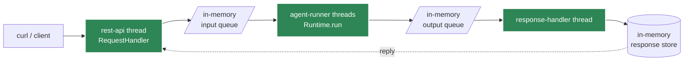

# Local Deployment

Run Agent Kernel locally for development and testing.

## CLI Mode

The simplest way to run agents locally:

```python
from agentkernel.cli import CLI

if __name__ == "__main__":
    CLI.main()
```

Run:

```bash
python my_agent.py
```


## CLI Features

- Agent selection
- Session management
- Conversation history
- Error display

## REST API Mode

Run as a local API server:

```python
from agentkernel.api import RESTAPI

if __name__ == "__main__":
    RESTAPI.run()
```

Run:

```bash
python my_agent.py
```

Test with curl:

```bash
curl -X POST http://localhost:8000/api/v1/chat \
  -H "Content-Type: application/json" \
  -d '{
    "agent": "general",
    "prompt": "Hello!",
    "session_id": "test-123"
  }'
```

### How it executes: the in-process queue pipeline

`RESTAPI.run()` boots Agent Kernel's [queue execution
pipeline](../architecture/overview#the-queue-execution-pipeline) with the default `in_memory`
transport: all five pipeline components run as threads in this one process:



You get the production queue semantics locally: per-session FIFO ordering with parallel
sessions, bounded retry with a permanent-failure error path, and request deduplication: with
zero backing services, and the same wire responses as before. The same app moves to a durable
broker (SQS on AWS today; Kafka/NATS on-prem or Kubernetes) purely by configuration. See the
[Queue Mode Guide](../advanced/queue-mode-guide#running-queue-mode-locally-in_memory) for the
config knobs and
[`examples/api/openai`](https://github.com/yaalalabs/agent-kernel/tree/develop/examples/api/openai)
for curl walkthroughs of all three modes.

### Async REST locally

Set `execution.mode: rest_async` (or `AK_EXECUTION__MODE=rest_async`) for accept-then-poll:
`POST /api/v1/chat` returns a `request_id` immediately, and
`GET /api/v1/chat?request_id=...` retrieves the reply once (subsequent polls return 404).
Previously an AWS-only mode, now identical locally.

### Streaming locally

Set `execution.mode: stream` in `config.yaml` (or `AK_EXECUTION__MODE=stream`) and the same endpoint returns a Server-Sent Events stream of token chunks, handy for testing streaming UIs locally. See [REST API: Streaming](../api/rest-api#streaming).

## Configuration

```bash
# Log level
export AK_LOGGING__AK__LEVEL=DEBUG

# Session storage
export AK_SESSION__TYPE=in_memory

# Port (API mode)
export AK_API__PORT=8000
```

## Development Workflow

1. **Write agent code**
2. **Test in CLI** - `python my_agent.py`
3. **Test API locally** - `python my_agent.py --mode api`
4. **Deploy to cloud** when ready
5. **Optionally create docker image** (Refer to `containerized` examples)

## Best Practices

- Use CLI for rapid iteration
- Test with API mode before deployment
- Use in-memory sessions for development
- Enable DEBUG logging during development
