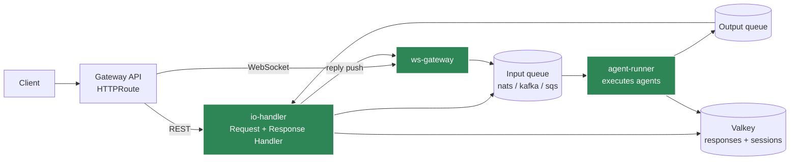

# On-Prem / Kubernetes Deployment

Deploy Agent Kernel's queue-execution pipeline to any Kubernetes cluster with the official
Helm chart: an `io-handler` Deployment (REST API + Response Handler), an `agent-runner`
Deployment (the consumers executing your agents), and an optional `ws-gateway` Deployment for
WebSocket delivery. Backing services (Valkey, NATS JetStream) ship as condition-gated
dependencies of their official charts, and deployment flavors (dev, baremetal, AWS EKS) are
values files over one set of templates.

The chart lives at
[`ak-deployment/ak-k8s`](https://github.com/yaalalabs/agent-kernel/tree/develop/ak-deployment/ak-k8s)
and is published as an OCI artifact.

## Topology



This is the same five-component [queue pipeline](../advanced/queue-mode-guide) that runs
in-process locally and over SQS on AWS, split into the two-process topology: the transport is
configuration, not code.

## Quick Start

Build your application images (the
[`examples/k8s/openai-queue-mode`](https://github.com/yaalalabs/agent-kernel/tree/develop/examples/k8s/openai-queue-mode)
example walks this end to end on k3d, microk8s, and k3s), load them into your cluster, then:

```bash
helm dependency build ak-deployment/ak-k8s/chart
helm install ak ak-deployment/ak-k8s/chart -f ak-deployment/ak-k8s/chart/values-dev.yaml \
  --set ioHandler.image.repository=<io image> \
  --set agentRunner.image.repository=<runner image> --set image.tag=<tag>

kubectl port-forward service/ak-agent-kernel-io 8000:80
curl -s -X POST http://localhost:8000/api/v1/chat \
  -H 'Content-Type: application/json' \
  -d '{"prompt": "Hello", "session_id": "s1", "agent": "triage"}'
```

The dev flavor runs single replicas over in-cluster NATS and Valkey with the JetStream
objects auto-provisioned at startup. The smallest install is the single-process profile
documented in `values-dev.yaml`: one pod, in-process queues, no backing services at all.

## The Application Image Contract

The chart runs *your* images: your `config.yaml` (baked into the image) declares what runs,
and the chart injects where it runs as `AK_*` environment variables, the same app/infra split
the ECS Terraform deployment uses.

| Deployment | Entry point |
|---|---|
| io-handler | `IOHandler.run()` |
| agent-runner | registers your agent modules, then `AgentRunner.run()` |
| ws-gateway | `WebSocketGateway.run(auth_validator=...)` |

## Flavors

Flavors never fork templates: every difference is a value.

| Values file | Posture |
|---|---|
| `values-dev.yaml` | Micro-cluster (k3d, kind, microk8s, k3s): single replicas, auto-provisioned JetStream, TLS off, port-forward entry |
| `values-baremetal.yaml` | Envoy Gateway class, cert-manager issuer annotations, NACK-managed JetStream objects, OpenEBS hostpath storage, MetalLB prerequisite |
| `values-eks.yaml` | AWS Load Balancer Controller gateway classes (ALB), ACM certificates, EBS gp3 storage, Pod Identity; `sqs`, `kafka`, and `nats` transports all valid |

Prerequisites (Gateway API CRDs and an implementation, MetalLB, cert-manager, KEDA, the NACK
controller, the Strimzi operator) are documented per flavor and deliberately never installed
by the chart.

## Transports

`transport.type` selects the broker; the pipeline semantics (per-session ordering, bounded
retry, dedup, permanent-failure replies) are identical over all of them:

- **`nats`** (default, recommended on-prem): JetStream work-queue streams with one durable
  consumer per partition. Dev clusters auto-provision; production manages the objects
  declaratively through the chart's NACK CRs and fails loudly on a missing object.
- **`kafka`**: pair with the Strimzi operator; the chart renders the cluster, node pool, and
  topics as CRs.
- **`sqs`**: no broker to operate; the EKS option via Pod Identity.

## WebSocket Modes (async / stream)

Enabling `wsGateway` adds the gateway tier for `async` and `stream` execution modes: gateway
pods own the client sockets, enqueue chat frames directly to the transport, and receive each
reply or token chunk from the Response Handler on an authenticated internal push endpoint,
addressed through a shared connection store on the session backend. Replies reach all of a
user's connections on whichever gateway pod holds them, and io/runner pods roll without
dropping a single connection. See the
[WebSocket delivery section of the Queue Mode Guide](../advanced/queue-mode-guide#websocket-delivery-on-the-pipeline-asyncstream)
for the mechanism and the
[chart README](https://github.com/yaalalabs/agent-kernel/tree/develop/ak-deployment/ak-k8s)
for the values.

## Sandbox Worker Tier

Enabling `sandboxWorker` adds the sandbox broker worker: it consumes sandbox execution
requests from the sandbox queues (same transport, its own queue names), runs them through a
sandbox provider (typically `kubernetes` pods with a read-only ServiceAccount as the security
boundary), and returns completions over the sandbox output queue into the shared response
store. The tier ships with its own ServiceAccount and RBAC, KEDA scaling on the sandbox input
backlog, and values-gated namespace hardening (Pod Security Admission, default-deny egress,
quotas).

The tier also installs **standalone**: when the rest of Agent Kernel runs outside the cluster
(Lambda mode, ECS), disable `ioHandler` and `agentRunner` and this chart deploys only the
sandbox worker; the agent side and the worker then meet solely on the shared sandbox queues
and response store. See the
[chart README's sandbox worker section](https://github.com/yaalalabs/agent-kernel/tree/develop/ak-deployment/ak-k8s)
for the values and the agent-side mirror configuration.

## Autoscaling

The `agent-runner` tier scales on queue depth via KEDA (Kafka consumer lag, NATS JetStream
pending, or SQS queue length, selected by the transport), because LLM-bound work idles the CPU
while requests back up. The `io-handler` tier scales on plain CPU. Runners drain gracefully on
SIGTERM: consumers stop claiming work and finish in-flight turns within
`terminationGracePeriodSeconds`.

## Observability and Air-Gap

Observability ships as documented recipes (kube-prometheus-stack, per-broker exporters, an
OpenTelemetry Collector funnel for the Langfuse/OpenLLMetry/Logfire tracing providers), not as
chart dependencies. Air-gapped installs set one `global.imageRegistry` override and mirror the
per-release `images.txt` manifest. Both are covered in the
[chart README](https://github.com/yaalalabs/agent-kernel/tree/develop/ak-deployment/ak-k8s).

## Next Steps

- [The end-to-end example (k3d / microk8s / k3s)](https://github.com/yaalalabs/agent-kernel/tree/develop/examples/k8s/openai-queue-mode)
- [Chart README: values, prerequisites, flavors, publishing](https://github.com/yaalalabs/agent-kernel/tree/develop/ak-deployment/ak-k8s)
- [Queue Mode Guide](../advanced/queue-mode-guide)
- [Deployment Overview](./overview)
