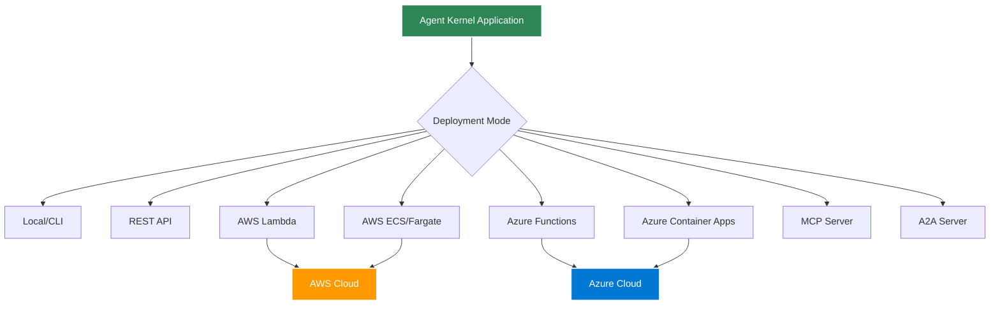

# Deployment Overview

Agent Kernel is a **multi-cloud AI agent runtime** that supports multiple deployment modes across AWS and Azure for different use cases.

## Deployment Modes



## Quick Comparison

| Mode | Best For | Scalability | Cold Start | Cost | Fault Tolerance |
|------|----------|-------------|------------|------|-----------------|
| **Local/CLI** | Development, testing | N/A | Instant | Free | Manual restart |
| **REST API** | Web apps, APIs | Manual scaling | Instant | Server costs | Manual |
| **AWS Lambda** | Variable load (AWS) | Auto-scaling | 1-3s | Pay per use | **High** - Auto-retry, multi-AZ |
| **AWS ECS** | Consistent load (AWS) | Auto-scaling | Instant | Running containers | **Very High** - Multi-AZ, auto-recovery |
| **Azure Functions** | Variable load (Azure) | Auto-scaling | 1-3s | Pay per use | **High** - Auto-retry, multi-region |
| **Azure Container Apps** | Consistent load (Azure) | Auto-scaling | Instant | Running containers | **Very High** - Multi-zone, auto-recovery |
| **MCP Server** | AI integrations | Manual | Instant | Server costs | Manual |
| **A2A Server** | Agent networks | Manual | Instant | Server costs | Manual |

## Local Development

Uses `agentkernel.CLI` module.

```bash
python my_agent.py
```

- Interactive CLI
- Instant feedback
- No deployment needed

[Learn more →](./local)

## REST API Server

Uses `agentkernel.RESAPI` module.

```
python my_agent.py
```


- HTTP endpoints
- Easy integration
- Self-hosted

[Learn more →](../api/rest-api)

## AWS Serverless

Uses Agent Kernel terraform modules

```bash
# Configure the modules and run
terraform init && terraform apply
```

- Lambda functions
- API Gateway
- Auto-scaling
- Pay per request

[Learn more →](./aws-serverless)

## AWS Containerized

Uses Agent Kernel terraform modules

```bash
# Configure the modules and run
terraform init && terraform apply
```

- ECS Fargate
- Application Load Balancer
- Consistent performance
- Lower latency

[Learn more →](./aws-containerized)

## Azure Serverless

Uses Agent Kernel terraform modules

```bash
# Configure the modules and run
terraform init && terraform apply
```

- Azure Functions
- API Management
- Auto-scaling
- Pay per request

[Learn more →](./azure-serverless)

## Azure Containerized

Uses Agent Kernel terraform modules

```bash
# Configure the modules and run
terraform init && terraform apply
```

- Azure Container Apps
- Azure Front Door / App Gateway
- Consistent performance
- Lower latency

[Learn more →](./azure-containerized)

## Choosing a Deployment Mode

### Development
→ **Local/CLI**: Fast iteration, no setup

### Small Web App
→ **REST API**: Simple, self-hosted

### Variable Traffic on AWS
→ **AWS Lambda**: Auto-scales, pay per use

### High Traffic on AWS
→ **AWS ECS**: Consistent performance

### Variable Traffic on Azure
→ **Azure Functions**: Auto-scales, pay per use

### High Traffic on Azure
→ **Azure Container Apps**: Consistent performance, KEDA-based scaling

### AI Integration
→ **MCP/A2A**: Protocol-based integration

## Multi-Cloud Strategy

Agent Kernel's **multi-cloud support** enables you to:

- **Deploy the same agent code** to AWS or Azure without modification
- **Avoid vendor lock-in** - switch clouds or run on multiple clouds
- **Optimize costs** - choose the best pricing model for each workload
- **Geographic redundancy** - distribute across cloud providers
- **Leverage cloud-specific services** - use the best of both platforms

## Fault Tolerance Considerations

Agent Kernel provides different levels of fault tolerance depending on your deployment mode:

### Production-Grade Fault Tolerance

**AWS ECS/Fargate** offers the highest level of fault tolerance on AWS:
- Multi-AZ task distribution for zone-level failures
- Automatic task replacement on failures
- Health check-based routing
- Configurable auto-scaling
- Rolling deployments with zero downtime
- Application Load Balancer with health monitoring

[Learn more about AWS ECS fault tolerance →](./aws-containerized#fault-tolerance)

**Azure Container Apps** offers the highest level of fault tolerance on Azure:
- Multi-zone replica distribution for zone-level failures
- Automatic replica replacement on failures
- Health check-based routing
- KEDA-based auto-scaling
- Rolling deployments with zero downtime
- Built-in ingress with health monitoring

[Learn more about Azure Container Apps fault tolerance →](./azure-containerized#fault-tolerance)

**AWS Lambda** provides built-in fault tolerance:
- Serverless architecture with automatic scaling
- Multi-AZ execution by default
- Automatic retry on failures
- No infrastructure management
- Inherently resilient to hardware failures

[Learn more about AWS serverless fault tolerance →](./aws-serverless#fault-tolerance)

**Azure Functions** provides built-in fault tolerance:
- Serverless architecture with automatic scaling
- Multi-region execution capabilities
- Automatic retry on failures
- No infrastructure management
- Inherently resilient to hardware failures

[Learn more about Azure serverless fault tolerance →](./azure-serverless#fault-tolerance)

### State Persistence

All production deployment modes support resilient state management:

**AWS Options:**
- **DynamoDB**: Multi-AZ replication, automatic backups, 99.999% SLA
- **Redis**: Cluster mode with automatic failover, replication

**Azure Options:**
- **Cosmos DB**: Multi-region replication, automatic backups, 99.999% SLA
- **Azure Cache for Redis**: Cluster mode with automatic failover, replication

[Learn more about fault tolerance →](../core-concepts/fault-tolerance)

## Next Steps

- [Local Deployment](./local)
- **AWS Deployments:**
  - [AWS Serverless](./aws-serverless)
  - [AWS Containerized](./aws-containerized)
- **Azure Deployments:**
  - [Azure Serverless](./azure-serverless)
  - [Azure Containerized](./azure-containerized)
- [Fault Tolerance](../core-concepts/fault-tolerance)
- [Configuration](../core-concepts/configuration)
