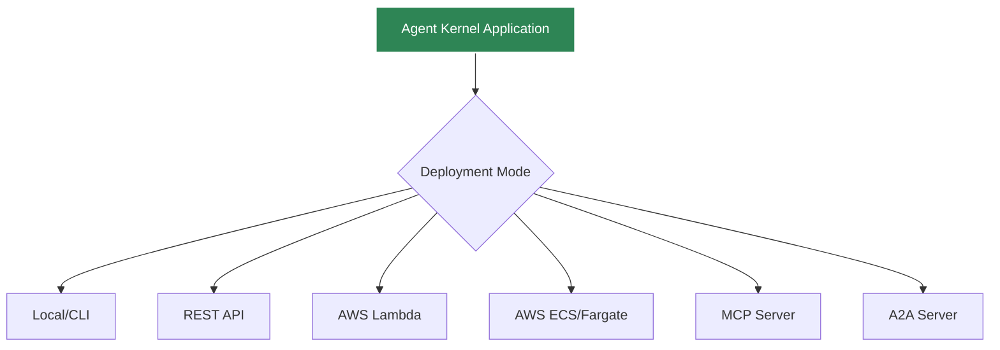

# Deployment Overview

Agent Kernel supports multiple deployment modes for different use cases.

## Deployment Modes



## Quick Comparison

| Mode | Best For | Scalability | Cold Start | Cost |
|------|----------|-------------|------------|------|
| **Local/CLI** | Development, testing | N/A | Instant | Free |
| **REST API** | Web apps, APIs | Manual scaling | Instant | Server costs |
| **AWS Lambda** | Variable load | Auto-scaling | 1-3s | Pay per use |
| **AWS ECS** | Consistent load | Auto-scaling | Instant | Running containers |
| **MCP Server** | AI integrations | Manual | Instant | Server costs |
| **A2A Server** | Agent networks | Manual | Instant | Server costs |

## Local Development

```bash
python my_agent.py
```

- Interactive CLI
- Instant feedback
- No deployment needed

[Learn more →](./local)

## REST API Server

```bash
python my_agent.py --mode api --port 8000
```

- HTTP endpoints
- Easy integration
- Self-hosted

[Learn more →](../api/rest-api)

## AWS Serverless

```bash
ak-deploy --profile serverless --region us-east-1
```

- Lambda functions
- API Gateway
- Auto-scaling
- Pay per request

[Learn more →](./aws-serverless)

## AWS Containerized

```bash
ak-deploy --profile containerized --region us-east-1
```

- ECS Fargate
- Application Load Balancer
- Consistent performance
- Lower latency

[Learn more →](./aws-containerized)

## Choosing a Deployment Mode

### Development
→ **Local/CLI**: Fast iteration, no setup

### Small Web App
→ **REST API**: Simple, self-hosted

### Variable Traffic
→ **AWS Lambda**: Auto-scales, pay per use

### High Traffic
→ **AWS ECS**: Consistent performance

### AI Integration
→ **MCP/A2A**: Protocol-based integration

## Next Steps

- [Local Deployment](./local)
- [AWS Serverless](./aws-serverless)
- [AWS Containerized](./aws-containerized)
- [Configuration](./configuration)
