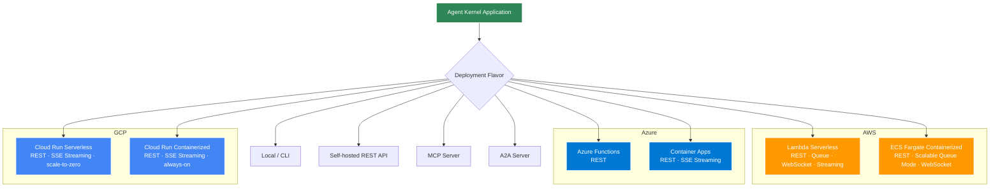
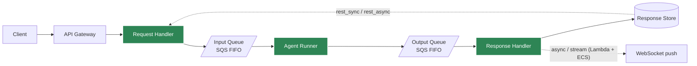

# Deployment Overview

Agent Kernel is a **multi-cloud AI agent runtime** that supports multiple deployment flavors across AWS, Azure, and GCP, from a single REST container to queue-backed, auto-scaling, WebSocket-streaming topologies.

## Deployment Flavors


```mermaid
graph TB
    A[Agent Kernel Application] --> B{Deployment Flavor}
    B --> C[Local / CLI]
    B --> D[Self-hosted REST API]
    B --> K[MCP Server]
    B --> L[A2A Server]

    subgraph AWS["AWS"]
        E[Lambda Serverless<br/>REST · Queue · WebSocket · Streaming]
        F[ECS Fargate Containerized<br/>REST · Scalable Queue Mode · WebSocket]
    end

    subgraph AZ["Azure"]
        G[Azure Functions<br/>REST]
        H[Container Apps<br/>REST · SSE Streaming]
    end

    subgraph GCP["GCP"]
        I[Cloud Run Serverless<br/>REST · SSE Streaming · scale-to-zero]
        J[Cloud Run Containerized<br/>REST · SSE Streaming · always-on]
    end

    B --> E
    B --> F
    B --> G
    B --> H
    B --> I
    B --> J

    style A fill:#2e8555,stroke:#fff,stroke-width:2px,color:#fff
    style E fill:#FF9900,stroke:#fff,stroke-width:2px,color:#fff
    style F fill:#FF9900,stroke:#fff,stroke-width:2px,color:#fff
    style G fill:#0078D4,stroke:#fff,stroke-width:2px,color:#fff
    style H fill:#0078D4,stroke:#fff,stroke-width:2px,color:#fff
    style I fill:#4285F4,stroke:#fff,stroke-width:2px,color:#fff
    style J fill:#4285F4,stroke:#fff,stroke-width:2px,color:#fff
```

## Execution Modes

Independently of *where* you deploy, `execution.mode` selects *how* requests are processed and replies delivered. Queue-backed and WebSocket modes are currently AWS features.

| Mode | Transport | How the client gets the reply | Queues | Response store | Supported on |
|------|-----------|-------------------------------|--------|----------------|--------------|
| Default (direct) | HTTP | JSON on the same connection | - | - | All flavors |
| `rest_sync` | HTTP | JSON on the same connection (server polls the store internally) | SQS FIFO | DynamoDB / Redis / Valkey | AWS Lambda, AWS ECS |
| `rest_async` | HTTP | `202 ACCEPTED` + `request_id`, client polls | SQS FIFO | DynamoDB / Redis / Valkey | AWS Lambda, AWS ECS |
| `async` | WebSocket | Single `CHAT_RESPONSE` push when the agent finishes | Optional | Not used | AWS Lambda, AWS ECS |
| `stream` | SSE or WebSocket | Token-level `StreamChunk`s as they are generated | Optional (WebSocket path) | Not used | REST API surfaces (SSE); AWS Lambda (WebSocket); AWS ECS (WebSocket) |

**Protocol support by flavor:**

| Flavor | JSON REST | SSE streaming | WebSocket (async + streaming) | Queue mode |
|--------|-----------|---------------|-------------------------------|------------|
| Local REST API / self-hosted | ✅ | ✅ | - | - |
| AWS Lambda | ✅ | - (use WebSocket) | ✅ | ✅ |
| AWS ECS Fargate | ✅ | - | ✅ (`async` and `stream`) | ✅ |
| Azure Functions | ✅ | - | - | - |
| Azure Container Apps | ✅ | ✅ | - | - |
| GCP Cloud Run (both flavors) | ✅ | ✅ | - | - |

:::info
SSE streaming is served by the built-in FastAPI `RESTAPI` server, so it is available anywhere that server runs (local, ECS single-container REST, Azure Container Apps, GCP Cloud Run). AWS Lambda delivers streaming over **WebSocket** instead, since API Gateway REST endpoints don't support SSE responses from standard Lambda integrations. CrewAI and Smolagents don't support token streaming; use `rest_sync` with those frameworks.
:::

## Quick Comparison

| Flavor | Best For | Scalability | Cold Start | Cost | Fault Tolerance |
|------|----------|-------------|------------|------|-----------------|
| **Local/CLI** | Development, testing | N/A | Instant | Free | Manual restart |
| **REST API** | Web apps, APIs | Manual scaling | Instant | Server costs | Manual |
| **AWS Lambda** | Variable load (AWS) | Auto-scaling | 1-3s | Pay per use | **High** - Auto-retry, multi-AZ, SQS retry/DLQ in queue mode |
| **AWS ECS** | Consistent/high load (AWS) | Auto-scaling (backlog-based in queue mode) | Instant | Running containers | **Very High** - Multi-AZ, auto-recovery |
| **Azure Functions** | Variable load (Azure) | Auto-scaling | 1-3s | Pay per use | **High** - Auto-retry, multi-region |
| **Azure Container Apps** | Consistent load (Azure) | Auto-scaling (KEDA) | Instant | Running containers | **Very High** - Multi-zone, auto-recovery |
| **GCP Cloud Run Serverless** | Variable load (GCP) | Auto-scaling (scale-to-zero) | 1-3s | Pay per use | **High** - Auto-retry, multi-zone |
| **GCP Cloud Run Containerized** | Consistent load (GCP) | Auto-scaling (min≥1) | Instant | Running containers | **Very High** - Always-on, auto-recovery |
| **MCP Server** | AI integrations | Manual | Instant | Server costs | Manual |
| **A2A Server** | Agent networks | Manual | Instant | Server costs | Manual |

:::note
GCP "serverless" and "containerized" are both Cloud Run: the difference is `min_instance_count = 0` (scale-to-zero) vs `≥ 1` (always-on), not a different compute product.
:::

## Scalable Queue Topologies (AWS)

For production workloads on AWS, queue mode decouples request ingestion from agent execution with SQS FIFO queues. The same pipeline runs on Lambda and ECS with different compute:


```mermaid
graph LR
    CL[Client] --> GW[API Gateway]
    GW --> RH[Request Handler]
    RH --> IQ[/Input Queue<br/>SQS FIFO/]
    IQ --> AR[Agent Runner]
    AR --> OQ[/Output Queue<br/>SQS FIFO/]
    OQ --> RSH[Response Handler]
    RSH --> RS[(Response Store)]
    RS -.->|rest_sync / rest_async| RH
    RSH -.->|"async / stream (Lambda + ECS)"| WS[WebSocket push]

    style RH fill:#2e8555,stroke:#fff,stroke-width:2px,color:#fff
    style AR fill:#2e8555,stroke:#fff,stroke-width:2px,color:#fff
    style RSH fill:#2e8555,stroke:#fff,stroke-width:2px,color:#fff
```

| Role | AWS Lambda (serverless) | AWS ECS (containerized) |
|------|------------------------|-------------------------|
| Request handler | Request Handler Lambda | `ECSQueueRequestHandler` thread in the IO container |
| Agent runner | Agent Runner Lambda (SQS event source mapping) | `ECSAgentRunner` service, a pool of long-poll consumer threads |
| Response handler | Response Handler Lambda | `ECSOutputConsumer` thread pool in the IO container |
| Reply delivery | Response store, or WebSocket push (`async`/`stream`) | Response store, or WebSocket push (`async`/`stream`) |
| Scaling | Automatic per SQS batch | Backlog-per-task target tracking |

See [AWS Serverless](./aws-serverless), [AWS Containerized](./aws-containerized), and the [Queue Mode Guide](../advanced/queue-mode-guide) for full component walkthroughs.

## Getting Started per Flavor

### Local Development

Uses the `agentkernel.cli` module.

```bash
python my_agent.py
```

- Interactive CLI, instant feedback, no deployment needed

[Learn more →](./local)

### REST API Server

Uses the `agentkernel.api.RESTAPI` module.

```bash
python my_agent.py
```

- HTTP + SSE endpoints, easy integration, self-hosted

[Learn more →](../api/rest-api)

### AWS Serverless

Uses Agent Kernel Terraform modules.

```bash
terraform init && terraform apply
```

- Lambda functions, API Gateway (REST + WebSocket)
- Optional SQS queue mode with response store
- Token streaming over WebSocket
- Auto-scaling, pay per request

[Learn more →](./aws-serverless)

### AWS Containerized

Uses Agent Kernel Terraform modules.

```bash
terraform init && terraform apply
```

- ECS Fargate + Application Load Balancer
- Optional two-container scalable queue mode with backlog-based auto-scaling
- Optional WebSocket mode (`async`) for real-time, connection-based interactions
- Consistent performance, lower latency

[Learn more →](./aws-containerized)

### Azure Serverless

Uses Agent Kernel Terraform modules.

```bash
terraform init && terraform apply
```

- Azure Functions (Flex Consumption) + API Management
- Auto-scaling, pay per request

[Learn more →](./azure-serverless)

### Azure Containerized

Uses Agent Kernel Terraform modules.

```bash
terraform init && terraform apply
```

- Azure Container Apps + API Management
- SSE streaming supported (runs the built-in REST server)

[Learn more →](./azure-containerized)

### GCP Serverless

Uses Agent Kernel Terraform modules.

```bash
terraform init && terraform apply
```

- Cloud Run (scale-to-zero) + API Gateway
- SSE streaming supported, pay per request

[Learn more →](./gcp-serverless)

### GCP Containerized

Uses Agent Kernel Terraform modules.

```bash
terraform init && terraform apply
```

- Cloud Run (always-on, `min_instance_count ≥ 1`) + API Gateway
- SSE streaming supported, no cold starts

[Learn more →](./gcp-containerized)

## Choosing a Deployment Mode

- **Development** → **Local/CLI**: fast iteration, no setup
- **Small web app** → **REST API**: simple, self-hosted
- **Variable traffic on AWS** → **AWS Lambda**: auto-scales, pay per use; add queue mode for backpressure and retries
- **High traffic / long-running agents on AWS** → **AWS ECS in queue mode**: consistent performance, backlog-based auto-scaling
- **Real-time UX on AWS** → **WebSocket mode**: `async` for push delivery, `stream` for token streaming — both on Lambda or ECS
- **Variable traffic on Azure** → **Azure Functions**; **high traffic** → **Azure Container Apps** (KEDA scaling, SSE streaming)
- **Variable traffic on GCP** → **Cloud Run scale-to-zero**; **high traffic** → **Cloud Run always-on**
- **AI integration** → **MCP/A2A**: protocol-based integration

## Multi-Cloud Strategy

Agent Kernel's **multi-cloud support** enables you to:

- **Deploy the same agent code** to AWS, Azure, or GCP without modification
- **Avoid vendor lock-in**: switch clouds or run on multiple clouds
- **Optimize costs**: choose the best pricing model for each workload
- **Geographic redundancy**: distribute across cloud providers
- **Leverage cloud-specific services**: use the best of each platform

## Fault Tolerance Considerations

Agent Kernel provides different levels of fault tolerance depending on your deployment mode:

### Production-Grade Fault Tolerance

**AWS ECS/Fargate** offers the highest level of fault tolerance on AWS:
- Multi-AZ task distribution for zone-level failures
- Automatic task replacement on failures; graceful in-container thread shutdown (`ThreadRunner`) so a crashed consumer restarts the whole task cleanly
- In queue mode: SQS visibility-timeout retries, optional dead-letter queues, and error responses written to the response store so clients never hang
- Backlog-based auto-scaling of the agent-runner service
- Rolling deployments with zero downtime behind an ALB

[Learn more about AWS ECS fault tolerance →](./aws-containerized#fault-tolerance)

**AWS Lambda** provides built-in fault tolerance:
- Serverless architecture with automatic scaling, multi-AZ execution by default
- In queue mode: partial-batch failure reporting (`batchItemFailures`), visibility-timeout retries, optional DLQs
- Automatic retry on failures, no infrastructure management

[Learn more about AWS serverless fault tolerance →](./aws-serverless#fault-tolerance)

**Azure Container Apps** offers the highest level of fault tolerance on Azure:
- Multi-zone replica distribution, automatic replica replacement
- Health check-based routing, KEDA-based auto-scaling
- Rolling deployments with zero downtime

[Learn more about Azure Container Apps fault tolerance →](./azure-containerized#fault-tolerance)

**Azure Functions** provides built-in serverless fault tolerance with automatic retry and scaling.

[Learn more about Azure serverless fault tolerance →](./azure-serverless#fault-tolerance)

**GCP Cloud Run** (both flavors) provides automatic scaling, multi-zone execution, automatic retries, and no infrastructure management; the containerized flavor adds always-on instances for consistent performance.

[GCP serverless →](./gcp-serverless) · [GCP containerized →](./gcp-containerized)

### State Persistence

All production deployment modes support resilient state management:

**AWS Options:**
- **DynamoDB**: Multi-AZ replication, automatic backups, 99.999% SLA
- **ElastiCache Redis / Valkey**: Cluster mode with automatic failover, replication

**Azure Options:**
- **Cosmos DB**: Multi-region replication, automatic backups, 99.999% SLA
- **Azure Cache for Redis**: Cluster mode with automatic failover, replication

**GCP Options:**
- **Firestore**: Multi-region replication, automatic backups, 99.999% SLA
- **Memorystore Redis**: High availability with automatic failover

[Learn more about fault tolerance →](../core-concepts/fault-tolerance)

## Next Steps

- [Local Deployment](./local)
- **AWS Deployments:**
  - [AWS Serverless](./aws-serverless)
  - [AWS Containerized](./aws-containerized)
- **Azure Deployments:**
  - [Azure Serverless](./azure-serverless)
  - [Azure Containerized](./azure-containerized)
- **GCP Deployments:**
  - [GCP Serverless](./gcp-serverless)
  - [GCP Containerized](./gcp-containerized)
- [Queue Mode Guide](../advanced/queue-mode-guide)
- [Fault Tolerance](../core-concepts/fault-tolerance)
- [Configuration](../core-concepts/configuration)
