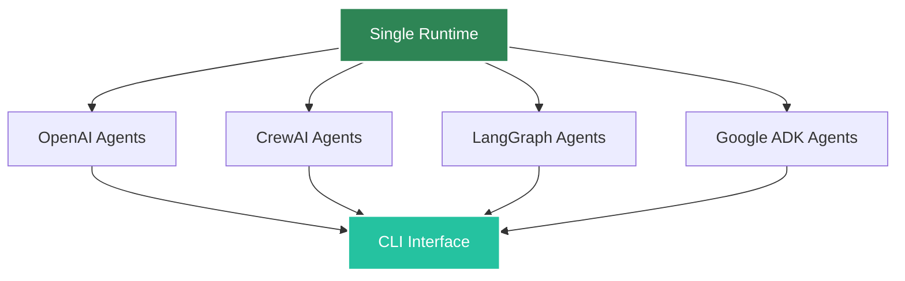

# Multi-Framework Runtime

Agent Kernel supports running agents from multiple frameworks within a single runtime environment. This allows you to leverage the unique strengths of different frameworks in one application while maintaining a unified interface for interaction.

## Overview

The multi-framework capability enables you to:

- **Mix and Match**: Use OpenAI Agents SDK for production workflows alongside CrewAI for role-based tasks
- **Unified CLI**: Interact with all agents through a single command-line interface
- **Session Flexibility**: Switch between agents from different frameworks within the same session
- **Specialized Agents**: Deploy framework-specific agents for their optimal use cases

:::info
While agents from different frameworks can run in the same runtime and be accessed in the same session, they **cannot directly communicate with each other**. Each framework maintains its own agent lifecycle and communication protocols.
:::

## Supported Framework Combinations

You can combine any of the supported frameworks:



## Basic Example

Here's a complete example showing OpenAI Agents SDK and CrewAI agents running together:

```python
from agents import Agent as OpenAIAgent
from crewai import Agent as CrewAIAgent

from agentkernel.cli import CLI
from agentkernel.crewai import CrewAIModule
from agentkernel.openai import OpenAIModule

# OpenAI Agents SDK agents
general_agent = OpenAIAgent(
    name="general",
    handoff_description="Agent for general questions",
    instructions="You provide assistance with general queries. Give short and clear answers",
)

math_agent = OpenAIAgent(
    name="math",
    handoff_description="Specialist agent for math questions", 
    instructions="You provide help with math problems. Explain your reasoning at each step.",
)

# CrewAI agent
history_agent = CrewAIAgent(
    role="history",
    goal="Specialist agent for history questions",
    backstory="You provide assistance with history queries with important details and context.",
    verbose=False,
)

# Register agents with their respective modules
OpenAIModule([general_agent, math_agent])
CrewAIModule([history_agent])

if __name__ == "__main__":
    CLI.main()
```

## Installation

To use multiple frameworks, install Agent Kernel with the required framework extensions:

```bash
pip install agentkernel[cli,crewai,openai]
```

For all supported frameworks:

```bash
pip install agentkernel[cli,crewai,openai,langgraph,google-adk]
```

## Project Structure

A typical multi-framework project structure:

```
my-multi-agent-app/
├── pyproject.toml          # Dependencies for all frameworks
├── demo.py                 # Main application entry point
├── agents/
│   ├── openai_agents.py    # OpenAI Agents SDK definitions
│   ├── crewai_agents.py    # CrewAI agent definitions
│   └── langgraph_agents.py # LangGraph workflow definitions
└── README.md
```

## Usage Patterns

### Specialized Agent Roles

Each framework excels in different scenarios:

```python
# OpenAI Agents SDK - Great for production workflows
customer_service = OpenAIAgent(
    name="customer_service",
    instructions="Handle customer inquiries professionally with access to tools.",
)

# CrewAI - Excellent for role-based collaboration  
research_agent = CrewAIAgent(
    role="researcher",
    goal="Conduct thorough research on topics",
    backstory="Expert researcher with attention to detail",
)

# LangGraph - Perfect for complex multi-step workflows
workflow_agent = create_langgraph_workflow()

OpenAIModule([customer_service])
CrewAIModule([research_agent]) 
LangGraphModule([workflow_agent])
```

## Configuration

### Dependencies

Add all required frameworks to your `pyproject.toml`:

```toml
[project]
dependencies = [
    "agentkernel[cli,crewai,openai,langgraph]>=0.1.0",
]
```

### Environment Variables

Each framework may require specific environment variables:

```bash
# For OpenAI Agents SDK
OPENAI_API_KEY=your_openai_key

# For Google ADK  
GOOGLE_APPLICATION_CREDENTIALS=path/to/credentials.json

# Framework-specific configurations
CREWAI_CONFIG_PATH=./config/crewai.yaml
```

## Best Practices

### Framework Selection

Choose frameworks based on their strengths:

| Use Case | Recommended Framework | Reason |
|----------|----------------------|---------|
| Production APIs | OpenAI Agents SDK | Robust, well-tested, OpenAI optimized |
| Role-based teams | CrewAI | Natural role definitions, collaboration focus |
| Complex workflows | LangGraph | Advanced state management, conditional logic |
| Google ecosystem | Google ADK | Native Google service integration |

### Agent Organization

```python
# Group related agents by framework
class AgentRegistry:
    def __init__(self):
        # OpenAI agents for core business logic
        self.openai_agents = [
            create_customer_service_agent(),
            create_sales_agent(),
        ]
        
        # CrewAI agents for specialized roles
        self.crewai_agents = [
            create_research_agent(),
            create_writer_agent(),
        ]
        
        # LangGraph for complex workflows
        self.langgraph_workflows = [
            create_approval_workflow(),
        ]
    
    def register_all(self):
        OpenAIModule(self.openai_agents)
        CrewAIModule(self.crewai_agents)
        LangGraphModule(self.langgraph_workflows)
```

### Error Handling

```python
try:
    OpenAIModule(openai_agents)
    print("✓ OpenAI agents registered")
except Exception as e:
    print(f"✗ Failed to register OpenAI agents: {e}")

try:
    CrewAIModule(crewai_agents)
    print("✓ CrewAI agents registered")
except Exception as e:
    print(f"✗ Failed to register CrewAI agents: {e}")
```

## Limitations

- **No Inter-Framework Communication**: Agents from different frameworks cannot directly communicate
- **Separate Memory**: Each framework maintains its own memory and session state
- **Framework Dependencies**: All required frameworks must be installed and properly configured
- **Resource Overhead**: Running multiple frameworks increases memory and processing requirements

## Example Projects

Check out the complete working example:

- [Multi-Framework CLI Demo](https://github.com/yaalalabs/agent-kernel/tree/develop/examples/cli/multi)

This example demonstrates OpenAI Agents SDK and CrewAI agents running together with CLI interaction.

## Next Steps

- Explore individual framework guides: [OpenAI](./openai.md), [CrewAI](./crewai.md), [LangGraph](./langgraph.md)
- Learn about [deployment options](../deployment/overview.md) for multi-framework applications
- See [architecture details](../architecture/overview.md) for understanding the module system