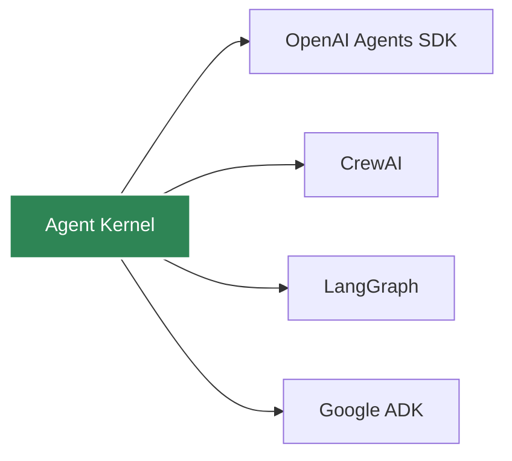

# Framework Integration Overview

Agent Kernel supports multiple AI agent frameworks through a unified adapter pattern.

## Supported Frameworks



## Framework Comparison

| Framework | Best For | Complexity | Multi-Agent |
|-----------|----------|------------|-------------|
| **OpenAI Agents** | Production apps with OpenAI | Low | Yes |
| **CrewAI** | Role-based collaboration | Medium | Yes |
| **LangGraph** | Complex workflows | High | Yes |
| **Google ADK** | Google ecosystem | Low | Yes |

## Choosing a Framework

### OpenAI Agents SDK
- Official OpenAI support
- Simple API
- Built-in function calling
- Good for production

[Learn more →](./openai)

### CrewAI
- Role-based agents
- Built-in collaboration patterns
- Easy task delegation
- Great for teams

[Learn more →](./crewai)

### LangGraph
- Graph-based orchestration
- Maximum flexibility
- Complex state management
- Best for sophisticated workflows

[Learn more →](./langgraph)

### Google ADK
- Gemini models
- Google Cloud integration
- Simple agent creation
- Good for Google ecosystem

[Learn more →](./google-adk)

## Migration Between Frameworks

Agent Kernel makes it easy to migrate:

```python
# Original CrewAI implementation
from crewai import Agent
from agentkernel.crewai import CrewAIModule

agent = Agent(role="assistant", ...)
CrewAIModule([agent])

# Migrate to OpenAI (change 2 lines)
from agents import Agent
from agentkernel.openai import OpenAIModule

agent = Agent(name="assistant", ...)
OpenAIModule([agent])
```

Your execution code (CLI, API, deployment) remains unchanged!

## Framework Portability

Available soon!

Features:
    - Switch the underlying agentic framework without affecting the agent logic
    - Effortless migration of already existing agents to the unified portable implementation
