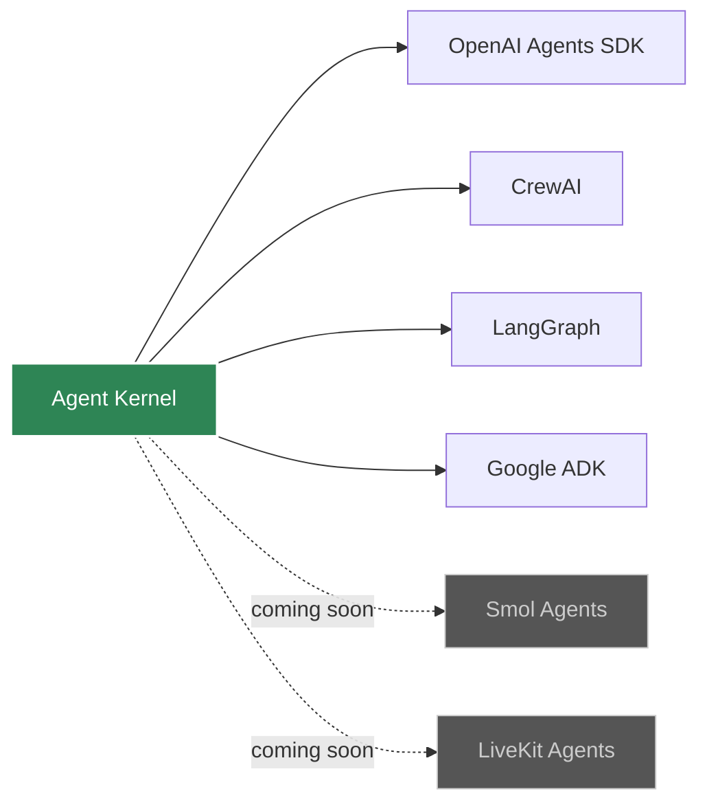

# Framework Integration Overview

Agent Kernel supports multiple AI agent frameworks through a unified adapter pattern.

## Supported Frameworks



## Framework Comparison

| Framework | Best For | Complexity | Multi-Agent |
|-----------|----------|------------|-------------|
| **OpenAI Agents** | Production apps with OpenAI | Low | Yes |
| **CrewAI** | Role-based collaboration | Medium | Yes |
| **LangGraph** | Complex workflows | High | Yes |
| **Google ADK** | Google ecosystem | Low | Yes |
| **Smol Agents** *(coming soon)* | Lightweight, Hugging Face models | Low | Yes |
| **LiveKit Agents** *(coming soon)* | Real-time voice/video agents | Medium | Yes |

## Choosing a Framework

### OpenAI Agents SDK
- Official OpenAI support
- Simple API
- Built-in function calling
- Good for production

[Learn more →](./openai)

### CrewAI
- Role-based agents
- Built-in collaboration patterns
- Easy task delegation
- Great for teams

[Learn more →](./crewai)

### LangGraph
- Graph-based orchestration
- Maximum flexibility
- Complex state management
- Best for sophisticated workflows

[Learn more →](./langgraph)

### Google ADK
- Gemini models
- Google Cloud integration
- Simple agent creation
- Good for Google ecosystem

[Learn more →](./google-adk)

### Smol Agents *(coming soon)*
- Hugging Face's lightweight agentic framework
- Supports any Hugging Face model or API
- Minimal boilerplate, code-first agent design
- Ideal for experimentation and open-source model deployments

### LiveKit Agents *(coming soon)*
- Real-time audio and video agent framework
- Voice-enabled AI applications
- Low-latency media pipelines
- Ideal for conversational voice assistants and live-streaming AI bots

## Migration Between Frameworks

Agent Kernel makes it easy to migrate:

```python
# Original CrewAI implementation
from crewai import Agent
from agentkernel.crewai import CrewAIModule

agent = Agent(role="assistant", ...)
CrewAIModule([agent])

# Migrate to OpenAI (change 2 lines)
from agents import Agent
from agentkernel.openai import OpenAIModule

agent = Agent(name="assistant", ...)
OpenAIModule([agent])
```

Your execution code (CLI, API, deployment) remains unchanged!

## Portable Tool Functions

Agent Kernel lets you write tool functions as plain Python and bind them to any framework using a `ToolBuilder`. The same tool works across all supported frameworks:

```python
def get_weather(city: str) -> str:
    """Returns the weather for a given city."""
    return f"Weather in {city}: sunny"

# Same function, any framework
from agentkernel.openai import OpenAIToolBuilder
from agentkernel.crewai import CrewAIToolBuilder

openai_tools = OpenAIToolBuilder.bind([get_weather])
crewai_tools = CrewAIToolBuilder.bind([get_weather])
```

[Learn more about Tools →](../core-concepts/tools)

## Framework Portability

Available soon!

Features:
    - Switch the underlying agentic framework without affecting the agent logic
    - Effortless migration of already existing agents to the unified portable implementation
