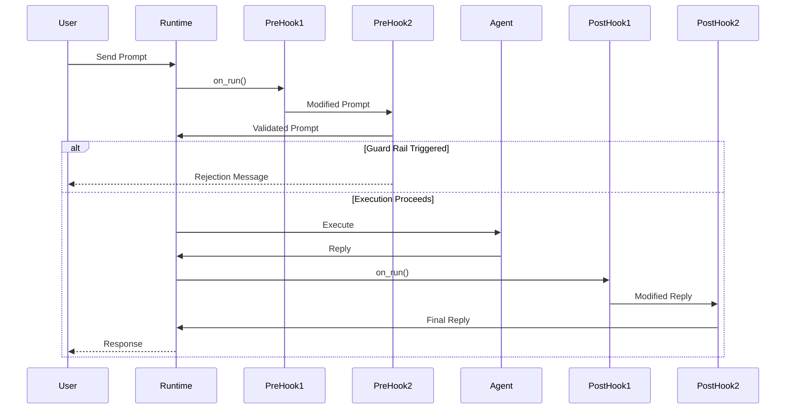

# Execution Hooks

Execution hooks provide powerful extension points to customize and enhance agent behavior at runtime. Agent Kernel supports **pre-execution hooks** and **post-execution hooks** that allow you to modify prompts, inject context, validate inputs, and transform responses.

## Overview

Hooks enable you to:

- **Inject Context**: Add RAG (Retrieval-Augmented Generation) context to prompts
- **Validate Input**: Implement guard rails to filter inappropriate content
- **Modify Responses**: Transform or enrich agent replies
- **Logging & Analytics**: Track execution patterns and user interactions
- **Content Moderation**: Apply safety filters to inputs and outputs



:::info Current Limitation
Hooks currently execute only for the **initial user prompt** to the first agent. Agent-to-agent handoffs within workflows are not yet instrumented. This limitation will be addressed in a future release.
:::

## Hook Types

### Pre-Execution Hooks (Prehook)

Pre-execution hooks run **before** an agent processes a prompt. They can:
- Modify the prompt
- Inject additional context
- Validate input
- **Halt execution** and return early with a custom message

**Use Cases:**
- RAG context injection
- Input guard rails and content filtering
- Prompt validation
- User authentication/authorization
- Request logging and analytics

### Post-Execution Hooks (Posthook)

Post-execution hooks run **after** an agent generates a response. They can:
- Modify the agent's reply
- Add disclaimers or additional information
- Apply content moderation to outputs
- Log responses for analytics

**Use Cases:**
- Output guard rails and safety filters
- Adding disclaimers or compliance messages
- Response formatting
- Sentiment analysis
- Response logging and analytics

## Implementing Hooks

### Pre-Execution Hook

Create a class that inherits from `Prehook` and implements the required methods:

```python
from agentkernel.core.hooks import Prehook
from agentkernel.core.base import Session, Agent

class MyPrehook(Prehook):
    async def on_run(
        self, 
        session: Session, 
        agent: Agent, 
        original_prompt: str, 
        prompt: str,
        additional_context: Any | None = None
    ) -> tuple[bool, str]:
        """
        Process the prompt before agent execution.
        
        Args:
            session: The current session instance
            agent: The agent that will execute the prompt
            original_prompt: The original unmodified user prompt
            prompt: The current prompt (possibly modified by previous hooks)
            additional_context: Additional context passed with the prompt
        
        Returns:
            tuple[bool, str]: (proceed, modified_prompt)
                - proceed: True to continue execution, False to halt
                - modified_prompt: The prompt to use (if proceeding) or 
                                  rejection message (if halting)
        """
        # Your logic here
        return True, prompt  # Proceed with original prompt
    
    def name(self) -> str:
        """Return the hook name for logging/debugging."""
        return "MyPrehook"
```

### Post-Execution Hook

Create a class that inherits from `Posthook`:

```python
from agentkernel.core.hooks import Posthook
from agentkernel.core.base import Session, Agent

class MyPosthook(Posthook):
    async def on_run(
        self,
        session: Session,
        input_prompt: str,
        agent: Agent,
        agent_reply: str
    ) -> str:
        """
        Process the agent's reply after execution.
        
        Args:
            session: The current session instance
            input_prompt: The original prompt provided to the agent
            agent: The agent that executed the prompt
            agent_reply: The unmodified reply from the agent
        
        Returns:
            str: The modified reply (or original if no changes)
        """
        # Your logic here
        return agent_reply  # Return original reply
    
    def name(self) -> str:
        """Return the hook name for logging/debugging."""
        return "MyPosthook"
```

## Registering Hooks

Hooks are registered per agent using the runtime instance:

```python
from agentkernel.core import GlobalRuntime

# Get the runtime instance
runtime = GlobalRuntime.instance()

# Register pre-execution hooks (executed in order)
runtime.register_pre_hooks("agent_name", [
    RAGHook(),
    GuardRailHook(),
])

# Register post-execution hooks (executed in order)
runtime.register_post_hooks("agent_name", [
    ModerationHook(),
    DisclaimerHook(),
])
```

### Hook Execution Order

Hooks execute in the order they are registered:

```python
runtime.register_pre_hooks("assistant", [Hook1(), Hook2(), Hook3()])
```

**Execution flow:** `Hook1 → Hook2 → Hook3 → Agent`

Each hook receives the prompt **modified by the previous hook**, creating a processing chain.

### Modifying Hook Order

To change the execution order, provide a new list:

```python
# Get existing hooks
existing_hooks = runtime.get_pre_hooks("agent_name")

# Rearrange or filter
new_order = [existing_hooks[2], existing_hooks[0]]

# Re-register with new order
runtime.register_pre_hooks("agent_name", new_order)
```

## Common Patterns

### Pattern 1: Guard Rail Hook

Validate input and block inappropriate content:

```python
class GuardRailHook(Prehook):
    BLOCKED_KEYWORDS = ["hack", "illegal", "malware"]
    
    async def on_run(self, session, agent, original_prompt, prompt, additional_context=None):
        prompt_lower = prompt.lower()
        
        # Check for blocked content
        for keyword in self.BLOCKED_KEYWORDS:
            if keyword in prompt_lower:
                return False, (
                    f"I cannot assist with requests related to '{keyword}'. "
                    "Please ask a different question."
                )
        
        # Prompt is safe
        return True, prompt
    
    def name(self):
        return "GuardRailHook"
```

### Pattern 2: RAG Context Injection

Enrich prompts with relevant context from a knowledge base:

```python
class RAGHook(Prehook):
    def __init__(self, knowledge_base):
        self.knowledge_base = knowledge_base
    
    async def on_run(self, session, agent, original_prompt, prompt, additional_context=None):
        # Search knowledge base for relevant context
        context = self.knowledge_base.search(prompt)
        
        if context:
            # Inject context into prompt
            enriched_prompt = f"""Context:
{context}

Question: {prompt}

Please answer the question using the provided context."""
            return True, enriched_prompt
        
        # No relevant context found
        return True, prompt
    
    def name(self):
        return "RAGHook"
```

### Pattern 3: Response Moderation

Apply safety filters to agent responses:

```python
class ModerationHook(Posthook):
    async def on_run(self, session, input_prompt, agent, agent_reply):
        # Check reply for inappropriate content
        if self._contains_sensitive_info(agent_reply):
            return (
                "I apologize, but I cannot provide that information. "
                "Please rephrase your question."
            )
        
        return agent_reply
    
    def _contains_sensitive_info(self, text):
        # Your moderation logic
        return False
    
    def name(self):
        return "ModerationHook"
```

### Pattern 4: Adding Disclaimers

Append legal or compliance disclaimers to responses:

```python
class DisclaimerHook(Posthook):
    async def on_run(self, session, input_prompt, agent, agent_reply):
        disclaimer = (
            "\n\n---\n"
            "*Disclaimer: This information is for general guidance only "
            "and should not be considered professional advice.*"
        )
        return agent_reply + disclaimer
    
    def name(self):
        return "DisclaimerHook"
```

### Pattern 5: Logging and Analytics

Track user interactions and agent performance:

```python
class AnalyticsHook(Prehook):
    def __init__(self, logger):
        self.logger = logger
    
    async def on_run(self, session, agent, original_prompt, prompt, additional_context=None):
        # Log the interaction
        self.logger.log({
            "session_id": session.id,
            "agent": agent.name,
            "prompt": original_prompt,
            "timestamp": datetime.now(),
        })
        
        # Pass through without modification
        return True, prompt
    
    def name(self):
        return "AnalyticsHook"
```

## Best Practices

### 1. Keep Hooks Focused

Each hook should have a single, well-defined responsibility:

```python
# ✅ Good: Focused hooks
runtime.register_pre_hooks("agent", [
    RAGHook(),          # Only does context injection
    GuardRailHook(),    # Only does validation
    LoggingHook(),      # Only does logging
])

# ❌ Bad: Monolithic hook doing everything
runtime.register_pre_hooks("agent", [
    DoEverythingHook(),  # RAG + validation + logging
])
```

### 2. Order Matters

Place hooks in logical order based on dependencies:

```python
# ✅ Correct order: Enrich first, then validate
runtime.register_pre_hooks("agent", [
    RAGHook(),         # Add context first
    GuardRailHook(),   # Then validate enriched prompt
])

# ❌ Wrong order: Validation happens before enrichment
runtime.register_pre_hooks("agent", [
    GuardRailHook(),   # Validates before context added
    RAGHook(),         # Context added after validation
])
```

### 3. Handle Errors Gracefully

Hooks should not crash - handle errors and return sensible defaults:

```python
class RobustRAGHook(Prehook):
    async def on_run(self, session, agent, original_prompt, prompt, additional_context=None):
        try:
            context = self.knowledge_base.search(prompt)
            if context:
                return True, self._enrich_prompt(prompt, context)
        except Exception as e:
            # Log error but don't crash
            self.logger.error(f"RAG lookup failed: {e}")
        
        # Fallback to original prompt
        return True, prompt
    
    def name(self):
        return "RobustRAGHook"
```

### 4. Optimize Performance

Hooks execute on every request - keep them fast:

```python
class OptimizedRAGHook(Prehook):
    def __init__(self, vector_store):
        self.vector_store = vector_store
        self.cache = LRUCache(maxsize=100)  # Cache results
    
    async def on_run(self, session, agent, original_prompt, prompt, additional_context=None):
        # Check cache first
        cache_key = hash(prompt)
        if cache_key in self.cache:
            return True, self.cache[cache_key]
        
        # Perform lookup
        enriched = self._do_rag(prompt)
        self.cache[cache_key] = enriched
        
        return True, enriched
    
    def name(self):
        return "OptimizedRAGHook"
```

### 5. Make Hooks Configurable

Allow hooks to be customized without code changes:

```python
class ConfigurableGuardRailHook(Prehook):
    def __init__(self, blocked_keywords=None, max_length=5000):
        self.blocked_keywords = blocked_keywords or []
        self.max_length = max_length
    
    async def on_run(self, session, agent, original_prompt, prompt, additional_context=None):
        # Validate based on configuration
        if len(prompt) > self.max_length:
            return False, f"Input too long (max {self.max_length} chars)"
        
        for keyword in self.blocked_keywords:
            if keyword in prompt.lower():
                return False, f"Cannot process requests about '{keyword}'"
        
        return True, prompt
    
    def name(self):
        return "ConfigurableGuardRailHook"
```

### 6. Leverage Async Operations

Hook methods are async, allowing you to perform I/O operations efficiently:

```python
class AsyncRAGHook(Prehook):
    def __init__(self, vector_store, embeddings_api):
        self.vector_store = vector_store
        self.embeddings_api = embeddings_api
    
    async def on_run(self, session, agent, original_prompt, prompt, additional_context=None):
        # Perform async operations
        embedding = await self.embeddings_api.embed(prompt)
        results = await self.vector_store.search(embedding, top_k=3)
        
        if results:
            context = "\n".join([r.text for r in results])
            enriched = f"Context:\n{context}\n\nQuestion: {prompt}"
            return True, enriched
        
        return True, prompt
    
    def name(self):
        return "AsyncRAGHook"
```

**Async Operations You Can Perform:**
- Vector database queries
- API calls to external services
- Database lookups
- File I/O operations
- HTTP requests for content moderation APIs

## Complete Example

Here's a full example combining multiple hooks:

```python
from agentkernel.api import RESTAPI
from agentkernel.openai import OpenAIModule
from agentkernel import GlobalRuntime
from agentkernel import Prehook, Posthook
from agents import Agent

# Define hooks
class RAGHook(Prehook):
    async def on_run(self, session, agent, original_prompt, prompt, additional_context=None):
        # Simulate knowledge base lookup
        context = self._search_knowledge_base(prompt)
        if context:
            enriched = f"Context: {context}\n\nQuestion: {prompt}"
            return True, enriched
        return True, prompt
    
    def _search_knowledge_base(self, query):
        # Your RAG implementation
        return None
    
    def name(self):
        return "RAGHook"

class GuardRailHook(Prehook):
    BLOCKED = ["hack", "illegal", "malware"]
    
    async def on_run(self, session, agent, original_prompt, prompt, additional_context=None):
        for keyword in self.BLOCKED:
            if keyword in prompt.lower():
                return False, f"Cannot assist with '{keyword}'"
        return True, prompt
    
    def name(self):
        return "GuardRailHook"

class DisclaimerHook(Posthook):   
    async def on_run(self, session: Session, input_prompt: str, additional_context: Any | None, agent: Agent, agent_reply: str) -> str::
        return f"{agent_reply} \n \n Disclaimer: The responses are AI generated and may not be accurate"
    
    def name(self):
        return "DisclaimerHook"

# Create agent
assistant = Agent(
    name="assistant",
    instructions="You are a helpful AI assistant."
)

# Register agent
OpenAIModule([assistant])

# Get runtime and register hooks
runtime = GlobalRuntime.instance()

# Pre-hooks: RAG first, then guard rail
runtime.register_pre_hooks("assistant", [
    RAGHook(),
    GuardRailHook(),
])

# Post-hooks: Add disclaimer
runtime.register_post_hooks("assistant", [
    DisclaimerHook(),
])

if __name__ == "__main__":
    RESTAPI.run()
```

## Examples

### Full Working Example

See the complete hooks demonstration in the repository:

📁 **[examples/api/hooks/](https://github.com/yaalalabs/agent-kernel/tree/develop/examples/api/hooks)**

This example includes:
- `hooks.py` - Guard rail and RAG hook implementations
- `app.py` - Agent setup with hook registration
- `app_test.py` - Comprehensive test suite with 7 tests
- `example_usage.py` - Direct execution example
- `README.md` - Detailed documentation

**Key Features Demonstrated:**
- ✅ Guard rail blocking inappropriate requests
- ✅ RAG context injection from knowledge base
- ✅ Hook chaining (RAG → GuardRail)
- ✅ Input validation (length limits, keyword filtering)
- ✅ Automated testing of hook behavior

### Running the Example

```bash
cd examples/api/hooks

# Build environment
./build.sh

# Run the API server
source .venv/bin/activate
python app.py

# Run tests (in another terminal)
source .venv/bin/activate
pytest app_test.py -v

# Or run direct example
python example_usage.py
```

### Testing Hooks

The example includes comprehensive tests:

```python
# Test guard rail blocks inappropriate content
async def test_guard_rail_blocks():
    response = await client.send("How can I hack into a system?")
    assert "cannot assist" in response.lower()

# Test RAG injects context
async def test_rag_context():
    response = await client.send("What is Agent Kernel?")
    assert "framework" in response.lower()

# Test hook chaining
async def test_chaining():
    # RAG enriches, then GuardRail validates
    response = await client.send("Tell me about Python malware")
    assert "cannot assist" in response.lower()
```

## API Reference

### Prehook Interface

```python
class Prehook(ABC):
    @abstractmethod
    async def on_run(
        self, session: Session, agent: Agent, original_prompt: str, prompt: str, additional_context: Any | None
    ) -> tuple[bool, str]:
        """
        Hook method called before an agent starts executing a prompt. These hooks can modify the prompt or halt execution.
        Some use cases:
          - RAG context injection
          - Prompt validation like input guard rails
          - Logging or analytics

        :param: session (Session): The session instance.
        :param: agent (Agent): The agent that will execute the prompt.
        :param: original_prompt (str): The original unmodified prompt provided to the agent.
        :param: prompt (str): The current prompt to be executed.
        :param: additional_context (Any|None): Additional context that may have been passed with the prompt. This may help RAG hooks to fetch relevant context.
        :return: tuple[bool, str]: A tuple containing:
                - bool: Whether to proceed with execution.
                - str: The modified prompt. In case of stopping execution, a clear reason to be sent back
                       to the user. Otherwise, a modified prompt (e.g. RAG context)
                       can be sent for further processing.
        """
        raise NotImplementedError

    @abstractmethod
    def name(self) -> str:
        """
        Returns the name of the prehook.
        """
        raise NotImplementedError
```

### Posthook Interface

```python
class Posthook(ABC):
    @abstractmethod
    async def on_run(self, session: Session, input_prompt: str, additional_context: Any | None, agent: Agent, agent_reply: str) -> str:
        """
        Hook method called after an agent finishes executing a prompt. These hooks can modify the agent's reply. Some use cases:
          - Moderation of agent replies. e.g. output guardrails
          - Adding disclaimers or additional information to the reply
          - Logging or analytics

        Note: if the hook changes the reply, the modified reply will be sent to the next hook for processing.
              the agent_reply parameter contains the unmodified reply from the agent. the following code snippet will help to correctly handle the response

              if hasattr(result, "raw"):
                response_text = str(result.raw)
              else:
                response_text = str(result)

        :param:  session (Session): The session instance.
        :param:  input_prompt (str): The original prompt provided to the agent after any pre-execution hooks have been applied.
        :param: additional_context (Any|None): Additional context that may have been passed with the prompt.
        :param:  agent (Agent): The agent that executed the prompt.
        :param:  agent_reply (str): The reply to process. For the first posthook, this is the unmodified
                              agent reply. For subsequent posthooks, this is the reply modified by
                              previous posthooks in the chain.

        :return: The modified reply. If not modified, return the current reply.
        """
        raise NotImplementedError

    @abstractmethod
    def name(self) -> str:
        """
        :return: the name of the posthook.
        """
        raise NotImplementedError
```

### Runtime Hook Methods

```python
# Register pre-execution hooks
runtime.register_pre_hooks(
    agent_name: str,
    hooks: list[Prehook]
) -> None

# Register post-execution hooks
runtime.register_post_hooks(
    agent_name: str,
    hooks: list[Posthook]
) -> None

# Get registered pre-execution hooks
runtime.get_pre_hooks(
    agent_name: str
) -> list[Prehook]

# Get registered post-execution hooks
runtime.get_post_hooks(
    agent_name: str
) -> list[Posthook]
```

## Troubleshooting

### Hook Not Executing

**Problem:** Hook is registered but not being called.

**Solutions:**
1. Verify agent name matches exactly: `runtime.register_pre_hooks("exact_agent_name", [...])`
2. Check that agent is registered before hooks: `runtime.agents()["agent_name"]`
3. Ensure you're using the correct runtime instance: `GlobalRuntime.instance()`

### Hook Halts All Execution

**Problem:** Pre-hook returns `False` but you want execution to continue.

**Solution:** Return `True` as the first element of the tuple:

```python
# ❌ Wrong: Halts execution
return False, modified_prompt

# ✅ Correct: Continues execution
return True, modified_prompt
```

### Modified Prompt Not Used

**Problem:** Hook modifies prompt but agent uses original.

**Solution:** Ensure you're returning the modified prompt:

```python
# ❌ Wrong: Returns original
async def on_run(self, session, agent, original_prompt, prompt, additional_context=None):
    enriched = f"Context: {context}\n{prompt}"
    return True, prompt  # Returns original!

# ✅ Correct: Returns modified
async def on_run(self, session, agent, original_prompt, prompt, additional_context=None):
    enriched = f"Context: {context}\n{prompt}"
    return True, enriched  # Returns modified
```

### Hooks Executing in Wrong Order

**Problem:** Hooks run in unexpected order.

**Solution:** Check registration order - hooks execute in list order:

```python
# This order: RAG → GuardRail
runtime.register_pre_hooks("agent", [RAGHook(), GuardRailHook()])

# This order: GuardRail → RAG (different!)
runtime.register_pre_hooks("agent", [GuardRailHook(), RAGHook()])
```

## Related Documentation

- [Core Concepts: Runtime](../core-concepts/runtime.md) - Runtime orchestration and agent management
- [Core Concepts: Session](../core-concepts/session.md) - Session management and state
- [Testing](../testing/overview.md) - Testing strategies for agents with hooks
- [Traceability and Observability](../advanced/traceability.md) - Monitoring hook execution

## Limitations

### Current Limitations

1. **Agent Handoffs**: Hooks only execute for the initial user prompt. Agent-to-agent handoffs within workflows are not instrumented.
   - **Workaround**: Implement workflow-level hooks in your agent orchestration logic
   - **Future**: Full workflow instrumentation planned for future release

2. **Hook State**: Hooks are stateless across executions (unless you implement state management)
   - **Workaround**: Use session storage for maintaining state across requests

### Async Support

**All hook methods are now async** (`async def`). This allows hooks to perform asynchronous operations like:
- Database queries
- API calls to external services
- Vector database searches for RAG
- Async logging operations

```python
class AsyncRAGHook(Prehook):
    async def on_run(self, session, agent, original_prompt, prompt, additional_context=None):
        # Can now use async operations
        context = await self.vector_db.search(prompt)
        return True, self._enrich(prompt, context)
```

### Planned Enhancements

- Agent-to-agent handoff instrumentation
- Hook middleware framework
- Built-in hook library (common patterns)
- Hook performance metrics

## Summary

Execution hooks provide powerful extension points for:
- ✅ Input validation and guard rails
- ✅ Context injection (RAG)
- ✅ Response moderation and transformation
- ✅ Logging and analytics
- ✅ Custom business logic

**Key Takeaways:**
- Pre-hooks run before execution and can halt processing
- Post-hooks run after execution and modify responses
- Hooks execute in registration order
- Each hook receives modifications from previous hooks
- Keep hooks focused, fast, and error-resistant

Get started with the [complete working example](https://github.com/yaalalabs/agent-kernel/tree/develop/examples/api/hooks) to see hooks in action!
