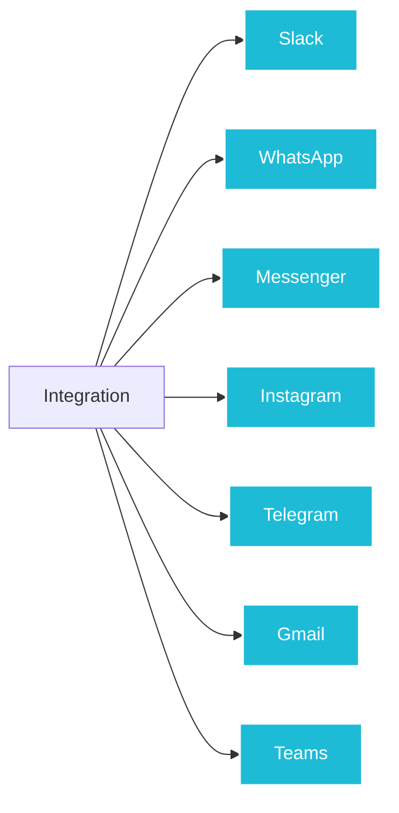
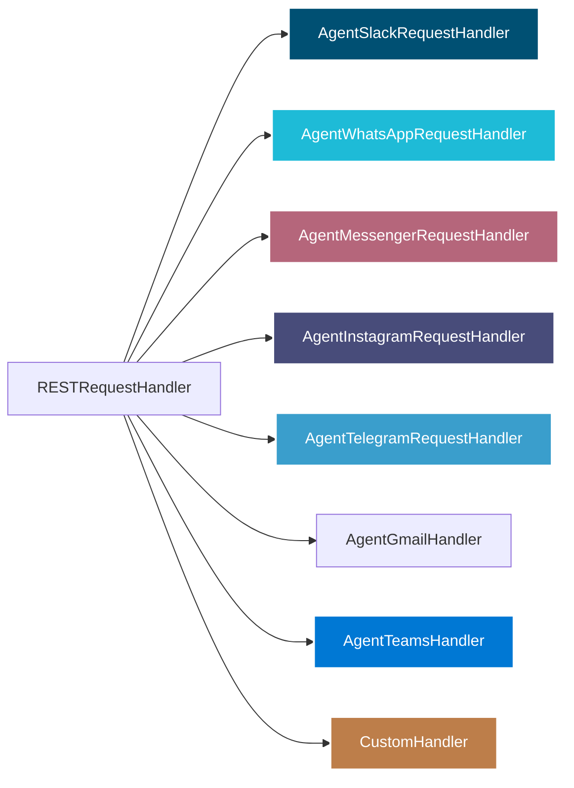

# Overview

Agent Kernel provides various built in integrations to connect your AI agents with external platforms and services. These integrations allow you to deploy your agents in real-world environments and interact with users through different channels.

## Execution Hooks

Agent Kernel provides powerful execution hooks that let you customize agent behavior at runtime.

- **[Execution Hooks](./hooks)** - Pre-execution and post-execution hooks for guard rails, RAG context injection, response moderation, and more. See the [detailed hooks documentation](./hooks) for complete guide with examples.

## Observability & Monitoring

- **Langfuse** - Open-source LLM engineering platform for tracing, evaluating, and monitoring AI applications. See [Traceability and Observability](../advanced/traceability) for detailed setup and usage.
- **OpenLLMetry (Traceloop)** - OpenTelemetry-based observability for LLM applications with support for multiple backends including Traceloop, Datadog, New Relic, and Honeycomb. See [Traceability and Observability](../advanced/traceability) for detailed setup and usage.

## Social media
These are built on REST APIs and you can install custom integrations as well.

### Built-in
The following built-in integrations are available.

- **[Slack](./slack)** - Deploy agents as Slack bots that can respond to mentions and direct messages in Slack workspaces
- **[WhatsApp](./whatsapp)** - Deploy agents as WhatsApp bots
- **[Messenger](./messenger)** - Deploy agents as FB Messenger bots
- **[Instagram](./instagram)** - Deploy agents as Instagram DM bots
- **[Telegram](./telegram)** - Deploy agents as Telegram bots
- **[Gmail](./gmail)** - Deploy agents as Gmail bots that automatically read and reply to emails
- **[Microsoft Teams](./teams)** - Deploy agents as Microsoft Teams bots via Azure Bot Framework, supporting 1:1 chats, group chats, and channels



### Custom
For REST API based 'custom integrations' you can implement **RESTRequestHandler** and pass it to the RESTAPI.run() method. The built-in integrations are also developed similarly.




```python
from fastapi import APIRouter
from agentkernel.api import RESTRequestHandler
from agentkernel.api import RESTAPI
from agentkernel.slack import AgentSlackRequestHandler

class CustomHandler(RESTRequestHandler):
  def get_router(self) -> APIRouter:
      """
        - GET /health: Health check
        - GET /api/v1/agents: List available agents
      """
      router = APIRouter()

      @router.get("/health")
      def health():
          return {"status": "ok"}

      @router.get("/api/v1/agents")
      def list_agents():
          return {"agents": list(Runtime.instance().agents().keys())}

      @router.get("/rag_agent")
      def handle_rag(req: Request):
          return self._handler(req)

  def _handler(req):
      # Do a vector search and return something

if __name__ == "__main__":
    RESTAPI.run([ AgentSlackRequestHandler(), CustomHandler()]) # Can pass multiple handlers
```
