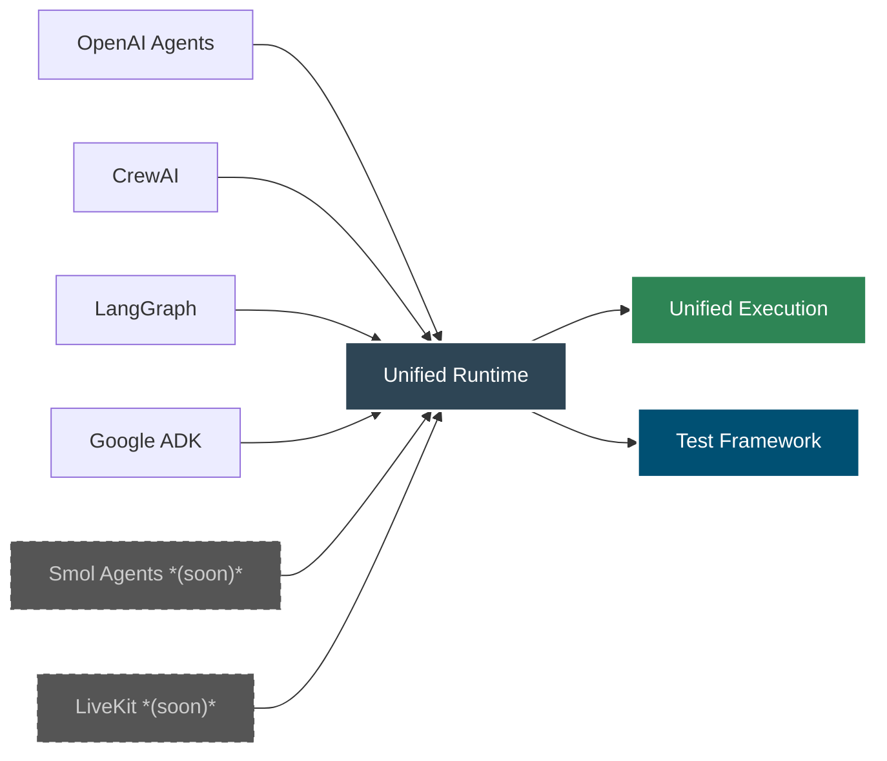
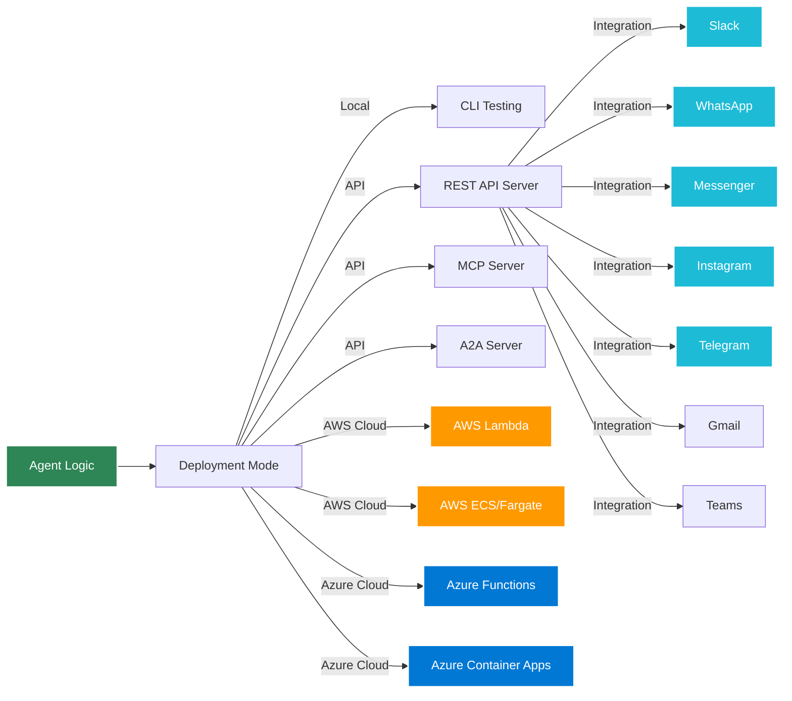

# Introduction to Agent Kernel

**An Operating System for Scalable & Compliant Enterprise AI Agents.**

:::tip What's New
🧠 **Knowledge Base Support** - Agent Kernel now includes a backend-agnostic knowledge base interface with support for ChromaDB (vector), Neo4j (graph) and Starburst Galaxy (SQL/analytics). Give your agents durable, cross-session knowledge with semantic search and graph query capabilities. [Learn more →](/docs/next/architecture/knowledge-bases)
:::

## What is Agent Kernel?

Agent Kernel is an **open-source runtime** that lets you build, test and deploy AI agents to production in days instead of months. It works with any major AI framework — OpenAI, LangGraph, CrewAI, Google ADK — and can run agents from multiple frameworks together in a single runtime. It deploys to AWS, Azure, or your own servers with zero platform code. Built-in integrations for Slack, WhatsApp and more mean your agents can reach users instantly.

**Think of it like Express.js for web servers, or Spring Boot for Java microservices** — but for AI agents. It gives you the scaffolding, execution environment, session management and deployment infrastructure so you can focus on writing the logic that matters.

**Supported Python Versions:** 3.12 - 3.13.x
**Supported Cloud Platforms:** AWS, Azure

It's not:
- A substitute for popular agent frameworks and SDKs like LangGraph, OpenAI Agents, CrewAI, or Google ADK
- Another heavy abstraction that you have to learn

It's a **lightweight, thin adapter** that wraps your existing agents and instantly provides everything else — testing, deployment, integrations, session management, observability.



## Why Agent Kernel?

### Effortless Migration

Build agents using any AI agentic framework and migrate them to Agent Kernel to benefit from its execution framework capabilities. No need to build a platform code from scratch to run your agents. You can focus on domain-specific Agent development and Agent Kernel takes care of testing, deployment and execution.

### Ready-to-Use Execution

Agent Kernel provides pre-built execution capabilities:
- **CLI Testing Environment** for local development
- **REST API Server** for web integration
- **Built-in popular integrations** for pluggable integrations and ability to build custom integrations quickly
  - Slack
  - WhatsApp
  - Messenger
  - Telegram
  - Instagram
  - Gmail
  - Microsoft Teams
- **Multi-Cloud Serverless Deployment** for scalable production
  - AWS Lambda
  - Azure Functions
- **Multi-Cloud Containerized Deployment** for consistent loads
  - AWS ECS/Fargate
  - Azure Container Apps
- **MCP Server** for Model Context Protocol tool publishing
- **A2A Server** for Agent-to-Agent communication

### Multi-Cloud Architecture

Deploy the same agent code to **AWS or Azure** without modification. Agent Kernel provides:
- Cloud-agnostic agent development
- Provider-specific optimizations
- Consistent APIs across clouds
- No vendor lock-in

### Pluggable Architecture

Easily extend Agent Kernel with custom framework adapters, memory back-ends, and deployment profiles.

### Enterprise-Ready Features

- **Knowledge Bases**: Backend-agnostic durable knowledge storage across sessions
  - ChromaDB for semantic/vector search
  - Neo4j for entity and relationship graph queries
  - Starburst Galaxy for SQL analytics over MongoDB, Google Sheets, PostgreSQL, and more
  - `KnowledgeBuilder` composes multiple backends with framework-agnostic tools
  - `semantic_map` keeps agent prompts portable across deployments
  - You can also build your own backend by implementing a `KnowledgeBase` adapter and registering it with `KnowledgeBuilder`
  [Learn more about knowledge bases →](/docs/next/architecture/knowledge-bases)
- **Session Management**: Built-in conversational state tracking across multiple backends
- **Memory Management**: Pluggable memory with smart caching
  - In-memory (development)
  - Redis (AWS & Azure)
  - DynamoDB (AWS serverless)
  - Cosmos DB (Azure serverless)
  - **Volatile Cache**: Request-scoped temporary storage for RAG context, file content, and intermediate data
  - **Non-Volatile Cache**: Session-persistent storage for user preferences, metadata, and configurations
  
  [Learn more about session management →](/docs/core-concepts/session) | [Advanced memory features →](/docs/architecture/memory-management)
- **Execution Hooks**: Powerful pre and post-execution hooks for ultimate control
  - **Pre-execution hooks**: Guard rails, RAG context injection, input validation, authentication
  - **Post-execution hooks**: Response moderation, disclaimers, output filtering, analytics
  - **Hook chaining**: Compose multiple hooks in sequence for complex behaviors
  - **Early termination**: Pre-hooks can halt execution and return custom responses
- **Fault Tolerance**: Production-grade resilience
  - Multi-AZ deployments for high availability
  - Automatic failure recovery and retry mechanisms
  - Health monitoring and auto-scaling (auto-scaling will be made available soon)
  - Persistent state across failures
- **Traceability**: Track and audit all agent operations
  - LangFuse
  - OpenLLMetry
- **Multi-Agent Collaboration**: Leverage multi-agent hierarchies of supported agentic frameworks
- **Agent Testing Capability**: Built in Agent test framework so that you can write automated tests easily
- **Governance**: Guard rails and human in the middle capabilities are coming soon

## Key Features

### Unified API

```python
from agentkernel.core import Agent, Runner, Session, Module, Runtime
```

All framework adapters expose the same core abstractions:
- **Agent**: Framework-specific agent wrapped by Agent Kernel
- **Runner**: Framework-specific execution strategy
- **Session**: Shared conversational state
- **Module**: Container for registering agents
- **Runtime**: Global orchestrator

### Execution Hooks

Powerful **pre-execution** and **post-execution** hooks give you surgical control over agent behavior:

- **Pre-hooks**: Intercept prompts before agents see them
  - 🛡️ Guard rails and content filtering
  - 🧠 RAG context injection from knowledge bases
  - 🔍 Input validation and authentication
  - 📊 Request logging and analytics
- **Post-hooks**: Transform responses after generation
  - ⚖️ Add disclaimers and compliance messages
  - 🔒 Output moderation and filtering
  - 📈 Response analytics and monitoring

**Works with any framework** - same hook code across OpenAI, CrewAI, LangGraph, and ADK.

[Learn more in our blog post →](/blog/hooks-and-smart-memory)

### Smart Memory Management

Two types of cache with identical APIs but different lifecycles:

- **Volatile Cache**: Request-scoped temporary storage
  - Perfect for RAG context, file content, intermediate calculations
  - Auto-clears after request completion
  - Keeps prompts clean and reduces token usage
- **Non-Volatile Cache**: Session-persistent storage
  - Store user preferences, metadata, configurations
  - Persists across multiple requests
  - Share data between hooks and tools

**Multiple backends with multi-cloud support** - swap between in-memory (local), Redis (AWS & Azure), DynamoDB (AWS), or Cosmos DB (Azure) with just environment variables.

[Read the advanced memory guide →](/docs/architecture/memory-management)

### Multi-Framework Support

Agent Kernel currently supports:

- **OpenAI Agents SDK** - Official OpenAI agents framework
- **CrewAI** - Role-based multi-agent framework
- **LangGraph** - Graph-based agent orchestration
- **Google ADK** - Google's Agent Development Kit

Coming soon:
- **Smol Agents** - Hugging Face's lightweight agentic framework
- **LiveKit Agents** - Real-time audio/video agent framework for voice-enabled AI applications

### Flexible Deployment



## Quick Example

Here's a simple agent built with Agent Kernel using CrewAI:

```python
from crewai import Agent as CrewAgent
from agentkernel.cli import CLI
from agentkernel.crewai import CrewAIModule

# Define your agent
agent = CrewAgent(
    role="assistant",
    goal="Help users with their questions",
    backstory="You are a helpful AI assistant",
    verbose=False,
)

# Register with Agent Kernel
CrewAIModule([agent])

# Run with built-in CLI
if __name__ == "__main__":
    CLI.main()
```

You can:
- Test locally with the CLI
- Deploy to **AWS Lambda** or **Azure Functions** with one line-change (multi-cloud!)
- Deploy to **AWS ECS/Fargate** or **Azure Container Apps** for containerized workloads
- Expose as a REST API
- Integrate with MCP or A2A protocols

All without changing your agent code!

## Who Should Use Agent Kernel?

Agent Kernel is built for four types of teams:

### Software Companies (Services)
Development houses and IT services firms with clients asking for AI-powered solutions. Agent Kernel lets them stand up AI agent capabilities quickly without a 6-month R&D cycle — focusing developer time on client-specific agent logic, not infrastructure.

### Software Companies (Products)
SaaS and enterprise software companies wanting to embed AI agents into their products. Agent Kernel's framework-agnostic design eliminates lock-in — add intelligent agents today, switch frameworks tomorrow, and your platform code never changes.

### AI Startups
Early to growth-stage startups building AI-native products. With open-source, no licensing costs, and full deployment infrastructure (Terraform, Docker) out of the box, startups go from prototype to production in days — not quarters.

### Domain Experts
Subject matter experts in finance, healthcare, legal, education, or other fields who want to build AI products without a fulltime engineering team. Agent Kernel dramatically reduces the software engineering surface area — define your agent logic, and Agent Kernel handles the rest.

→ **[Explore all use cases →](/use-cases)**

## Next Steps

Ready to get started? Here's what to do next:

1. [**Install Agent Kernel**](/docs/installation) - Get up and running in minutes
2. [**Quick Start Guide**](/docs/quick-start) - Build your first agent
3. [**Core Concepts**](/docs/core-concepts/overview) - Understand the architecture
4. [**Execution Hooks**](/docs/integrations/hooks) - Add guard rails, RAG, and response control
5. [**Session Management**](/docs/core-concepts/session) - Session configuration and storage
6. [**Memory Management**](/docs/architecture/memory-management) - Advanced caching and persistence
7. [**Framework Integration**](/docs/frameworks/overview) - Choose your framework
8. [**Deployment Guide**](/docs/deployment/overview) - Deploy to production

## Community & Support

- **GitHub**: [yaalalabs/agent-kernel](https://github.com/yaalalabs/agent-kernel)
- **PyPI**: [agentkernel](https://pypi.org/project/agentkernel/)
- **Issues**: [Report bugs or request features](https://github.com/yaalalabs/agent-kernel/issues)
- **Discord**: [Community chat](https://discord.gg/snrPzb46uu)

## License

Agent Kernel is released under the Apache License 2.0. See the [LICENSE](https://github.com/yaalalabs/agent-kernel/blob/develop/LICENSE) file for details.

---

**Built with ❤️ by [Yaala Labs](https://www.yaalalabs.com/)**
