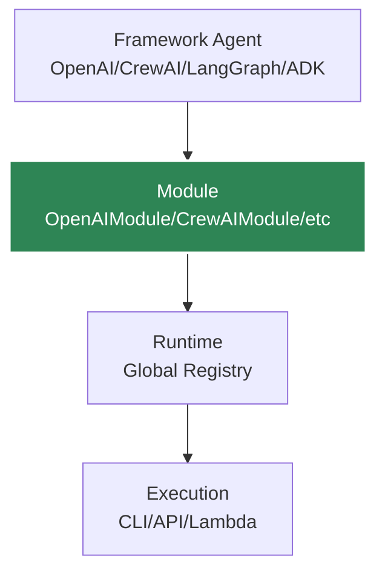

# Quick Start

Build and run your first AI agent with Agent Kernel in under 5 minutes!

## Choose Your Framework

Agent Kernel supports multiple frameworks. Pick the one you're most comfortable with:

import Tabs from '@theme/Tabs';
import TabItem from '@theme/TabItem';

<Tabs>
<TabItem value="openai" label="OpenAI Agents" default>

## OpenAI Agents Quick Start

### 1. Install

```bash
pip install agentkernel[openai]
```

### 2. Create Your Agent

Create a file called `my_agent.py`:

```python
from agents import Agent as OpenAIAgent
from agentkernel.cli import CLI
from agentkernel.openai import OpenAIModule

# Define your agent
general_agent = OpenAIAgent(
    name="general",
    handoff_description="Agent for general questions",
    instructions="You provide assistance with general queries. Give short and direct answers.",
)

math_agent = OpenAIAgent(
    name="math",
    handoff_description="Specialist agent for math questions",
    instructions="You provide help with math problems. Explain your reasoning.",
)

# Register agents with Agent Kernel
module = OpenAIModule([general_agent, math_agent])

if __name__ == "__main__":
    CLI.main()
```

### 3. Set API Key

```bash
export OPENAI_API_KEY=your-api-key-here
```

### 4. Run Your Agent

```bash
python my_agent.py
```

</TabItem>
<TabItem value="crewai" label="CrewAI">

## CrewAI Quick Start

### 1. Install

```bash
pip install agentkernel[crewai]
```

### 2. Create Your Agent

Create a file called `my_agent.py`:

```python
from crewai import Agent as CrewAgent
from agentkernel.cli import CLI
from agentkernel.crewai import CrewAIModule

# Define your agents
general_agent = CrewAgent(
    role="general",
    goal="Agent for general questions",
    backstory="You provide assistance with general queries. Give direct and short answers",
    verbose=False,
)

math_agent = CrewAgent(
    role="math",
    goal="Specialist agent for math questions",
    backstory="You provide help with math problems. Explain your reasoning at each step.",
    verbose=False,
)

# Register agents with Agent Kernel
module = CrewAIModule([general_agent, math_agent])

if __name__ == "__main__":
    CLI.main()
```

### 3. Set API Key

```bash
export OPENAI_API_KEY=your-api-key-here
```

### 4. Run Your Agent

```bash
python my_agent.py
```

</TabItem>
<TabItem value="langgraph" label="LangGraph">

## LangGraph Quick Start

### 1. Install

```bash
pip install agentkernel[langgraph]
```

### 2. Create Your Agent

Create a file called `my_agent.py`:

```python
from typing import TypedDict
from langgraph.graph import StateGraph, END
from agentkernel.cli import CLI
from agentkernel.langgraph import LangGraphModule

# Define state
class State(TypedDict):
    messages: list
    
# Define nodes
def respond(state: State):
    # Your agent logic here
    messages = state["messages"]
    response = f"Processed: {messages[-1]}"
    return {"messages": messages + [response]}

# Build graph
workflow = StateGraph(State)
workflow.add_node("agent", respond)
workflow.set_entry_point("agent")
workflow.add_edge("agent", END)

# Compile graph
graph = workflow.compile()
graph.name = "assistant"

# Register with Agent Kernel
module = LangGraphModule([graph])

if __name__ == "__main__":
    CLI.main()
```

### 3. Set API Key

```bash
export OPENAI_API_KEY=your-api-key-here
```

### 4. Run Your Agent

```bash
python my_agent.py
```

</TabItem>
<TabItem value="adk" label="Google ADK">

## Google ADK Quick Start

### 1. Install

```bash
pip install agentkernel[adk]
```

### 2. Create Your Agent

Create a file called `my_agent.py`:

```python
from adk import Agent as ADKAgent
from agentkernel.cli import CLI
from agentkernel.adk import ADKModule

# Define your agent
agent = ADKAgent(
    name="assistant",
    model="gemini-2.0-flash-exp",
    instructions="You are a helpful AI assistant. Provide clear and concise answers.",
)

# Register with Agent Kernel
module = ADKModule([agent])

if __name__ == "__main__":
    CLI.main()
```

### 3. Set API Key

```bash
export GOOGLE_API_KEY=your-api-key-here
```

### 4. Run Your Agent

```bash
python my_agent.py
```

</TabItem>
</Tabs>

## Testing Your Agent

Once your agent is running, you'll see an interactive CLI:

```
Agent Kernel CLI
Available agents:
  - general
  - math

Type your message (or 'quit' to exit):
> What is 2 + 2?

[math agent responds]
Math: 2 + 2 = 4. This is basic addition where we combine two quantities...

>
```

## Understanding the Structure

Every Agent Kernel application follows this pattern:



1. **Define agents** using your preferred framework
2. **Wrap them** in an Agent Kernel Module
3. **Run them** using Agent Kernel's execution modes (CLI, API, AWS, etc.)

## Next Steps

### Add Custom Tools

Enhance your agent with custom tools:

```python
from crewai import Agent, Tool

def search_database(query: str) -> str:
    # Your custom logic
    return f"Results for: {query}"

search_tool = Tool(
    name="search",
    description="Search the database",
    func=search_database
)

agent = Agent(
    role="researcher",
    goal="Find information",
    backstory="You are a research assistant",
    tools=[search_tool],
    verbose=False
)
```

### Deploy as REST API

Run your agent as a REST API server:

```bash
# Install API dependencies
pip install agentkernel[api]

# Run as API server
python my_agent.py --mode api --port 8000
```

Test it:

```bash
curl -X POST http://localhost:8000/chat \
  -H "Content-Type: application/json" \
  -d '{"agent": "general", "message": "Hello!"}'
```

### Deploy to AWS Lambda

Package and deploy to AWS Lambda:

```bash
# Install AWS dependencies
pip install agentkernel[aws]

# Deploy (requires AWS credentials configured)
ak-deploy --profile serverless --region us-east-1
```

### Configure Memory

Add Redis-backed memory for persistent sessions:

```bash
export AK_SESSION_STORAGE=redis
export AK_REDIS_URL=redis://localhost:6379
```

Or use in-memory storage (default):

```bash
export AK_SESSION_STORAGE=in-memory
```

## Common Patterns

### Multi-Agent Collaboration

```python
# Agents can hand off to each other
supervisor = Agent(
    role="supervisor",
    goal="Coordinate work between specialists",
    # ...
)

specialist1 = Agent(role="specialist1", ...)
specialist2 = Agent(role="specialist2", ...)

module = CrewAIModule([supervisor, specialist1, specialist2])
```

### Session Management

```python
# Sessions automatically track conversation history
# Each user/conversation gets a unique session ID
# Configure via environment variables:
# AK_SESSION_STORAGE=redis
# AK_REDIS_URL=redis://localhost:6379
```

### Error Handling

```python
from agentkernel.core import Runtime

try:
    runtime = Runtime.get()
    agent = runtime.get_agent("my-agent")
    result = await agent.runner.run(agent, session, prompt)
except Exception as e:
    print(f"Agent error: {e}")
```

## Examples Gallery

Explore more examples in our [Examples](./examples/basic-agent) section:

- [Basic Single Agent](./examples/basic-agent)
- [Multi-Agent System](./examples/multi-agent)
- [Custom Tools Integration](./examples/custom-tools)

## Troubleshooting

### Agent Not Found

Make sure you're using the correct agent name when running:

```python
# Agent names come from the framework-specific naming
# OpenAI: agent.name
# CrewAI: agent.role
# LangGraph: graph.name
```

### API Key Errors

Ensure your API key is set correctly:

```bash
# OpenAI (for OpenAI, CrewAI, LangGraph)
export OPENAI_API_KEY=sk-...

# Google (for ADK)
export GOOGLE_API_KEY=...
```

### Import Errors

Install the correct extras package:

```bash
pip install agentkernel[your-framework]
```

## Learn More

- [Core Concepts](./core-concepts/overview) - Deep dive into Agent Kernel architecture
- [Framework Integration](./frameworks/overview) - Framework-specific guides
- [Deployment Guide](./deployment/overview) - Production deployment options
- [API Reference](./api/rest-api) - Complete API documentation

---

**Need help?** Check out our [GitHub Issues](https://github.com/yaalalabs/agent-kernel/issues) or open a discussion!
