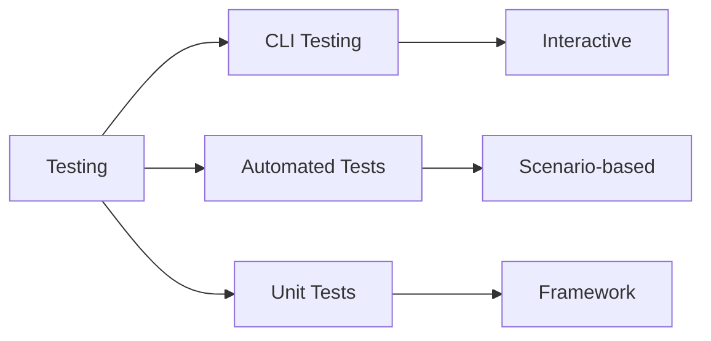

# Testing Overview

Agent Kernel provides tools for testing agents locally and automatically.

## Testing Approaches



## CLI Testing

Interactive testing in terminal:

```bash
python my_agent.py
```

Best for:
- Development
- Quick validation
- Exploratory testing

[Learn more →](./cli-testing)

## Automated Testing

Scenario-based testing:

```python
from agentkernel.test import TestSuite

suite = TestSuite("my_agent.py")
suite.run_scenarios("scenarios.yaml")
```

Best for:
- Regression testing
- CI/CD pipelines
- Validation before deployment

[Learn more →](./automated-testing)

## Test Scenarios

Define test scenarios in YAML:

```yaml
scenarios:
  - name: "Basic greeting"
    agent: "assistant"
    input: "Hello!"
    expected_contains: ["hello", "hi"]
  
  - name: "Math question"
    agent: "math"
    input: "What is 5 + 3?"
    expected_contains: ["8", "eight"]
```

## Best Practices

- Test in CLI during development
- Create automated scenarios for critical flows
- Test with different agents
- Include edge cases
- Test session persistence
- Validate error handling
