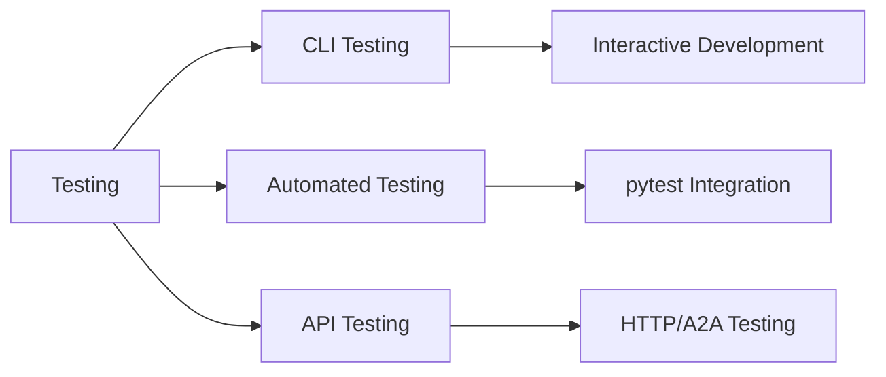

# Testing Overview

Agent Kernel provides a comprehensive testing framework for testing CLI-based agents with both interactive and automated test capabilities.

## Testing Approaches



## CLI Testing

Interactive testing of CLI agents using the `Test` class:

```python
from agentkernel.test import Test

# Create a test instance
test = Test("demo.py")
await test.start()

# Send messages and verify responses
await test.send("Who won the 1996 cricket world cup?")
await test.expect("Sri Lanka won the 1996 cricket world cup.")

await test.stop()
```

Best for:
- Development and debugging
- Interactive exploration
- Quick validation of agent responses

[Learn more →](./cli-testing)

## Automated Testing

pytest-based testing with async support:

```python
import pytest
import pytest_asyncio
from agentkernel.test import Test

@pytest_asyncio.fixture(scope="session")
async def test_client():
    test = Test("demo.py")
    await test.start()
    try:
        yield test
    finally:
        await test.stop()

@pytest.mark.asyncio
async def test_basic_question(test_client):
    await test_client.send("Hello!")
    await test_client.expect("Hello! How can I help you?")
```

Best for:
- Regression testing
- CI/CD pipelines
- Validation before deployment

[Learn more →](./automated-testing)

## Testing Framework Features

### Fuzzy Matching
The Test class uses fuzzy string matching with configurable thresholds:

```python
# Default threshold is 50%
test = Test("demo.py", match_threshold=80)

# Static comparison with custom threshold
Test.compare(actual_response, expected_response, threshold=70)
```

### Session Management
Tests maintain persistent CLI sessions with proper prompt handling and ANSI escape sequence cleanup.

### Multi-Agent Support
Test different agent types within the same CLI application:

```python
await test.send("!select general")  # Switch to general agent
await test.send("Who won the 1996 cricket world cup?")
```

## Best Practices

- Use pytest fixtures for test setup and teardown
- Implement ordered tests for conversation flows
- Configure appropriate fuzzy matching thresholds
- Test agent selection commands when using multi-agent setups
- Include both positive and negative test cases
- Test session persistence and state management
