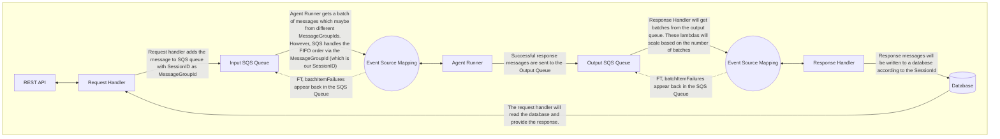
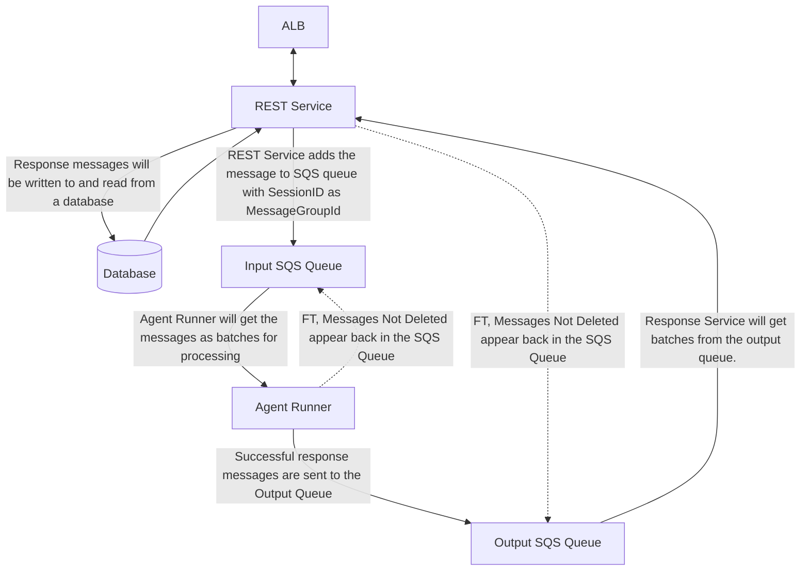
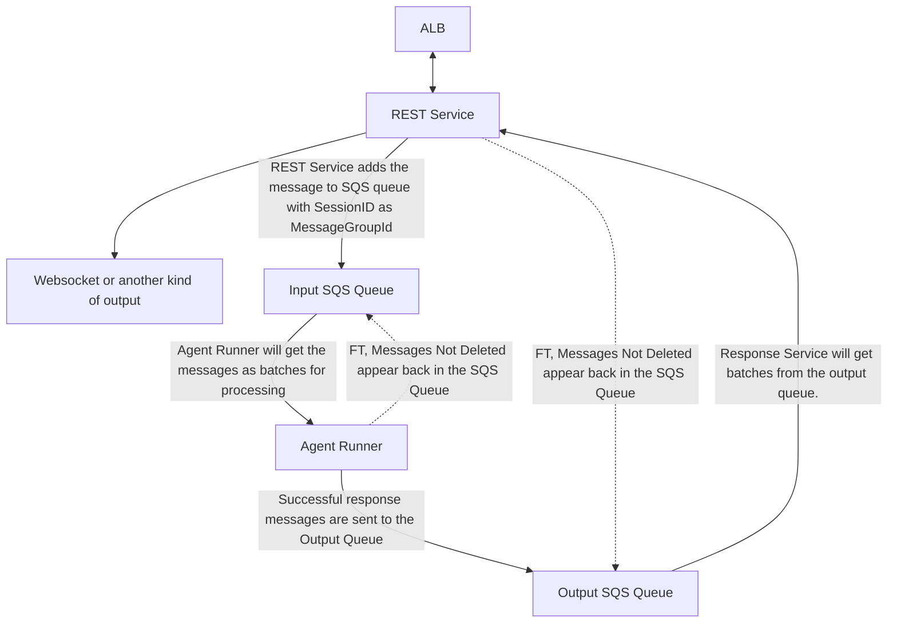
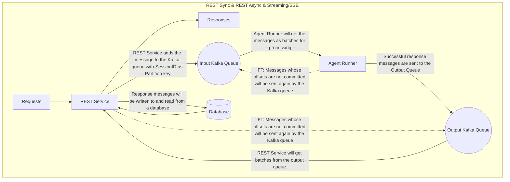
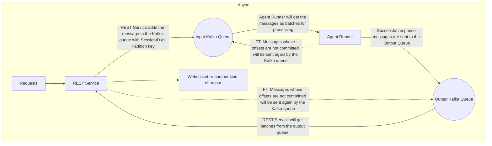

# Agent Kernel Scalability Design — SQS+Lambda, SQS+ECS, and Kafka/on-premise processing methods

Defines how Agent Kernel deployments scale request processing across three processing methods —
**SQS + Lambda**, **SQS + ECS**, and **Kafka + on-premise/local** — and how each method supports
four client communication modes: REST Sync, REST Async (user polling), Streaming/SSE, and Async
(WebSocket in/out). SQS + Lambda and SQS + ECS are already implemented; this design writes down
their shared shape so the new Kafka/on-premise method follows the same contract instead of
diverging, and extends that shape to on-premise deployments.

## Motivation

- Two of the three processing methods already exist in the codebase, built around the same
  input-queue → agent runner → output-queue → response-delivery shape:
  - ECS: `ECSAgentRunner`/`ECSSQSConsumer` poll an input SQS queue and write results to an output
    queue (`ak-py/src/agentkernel/deployment/aws/containerized/akagentrunner.py:13`,
    `ak-py/src/agentkernel/deployment/aws/containerized/core/sqs_consumer.py:39`); `ECSIOHandler`
    runs the REST/WebSocket API and `ECSOutputConsumer` as two `ThreadRunner` threads
    (`ak-py/src/agentkernel/deployment/aws/containerized/ecs_io_handler.py:10`,
    `ak-py/src/agentkernel/pipeline/thread_runner.py:12` — `ThreadRunner` has since moved into
    `pipeline/`; `deployment/common/thread_runner.py` is now a re-export shim).
  - Lambda: `LambdaSQSConsumer` is push-triggered by an SQS Event Source Mapping and returns
    `{"batchItemFailures": ...}` for partial-batch retry
    (`ak-py/src/agentkernel/deployment/aws/serverless/core/sqs_consumer.py:9,64`).
  - Both back their input/output queues with SQS FIFO queues using `MessageGroupId` /
    `MessageDeduplicationId` (`ak-py/src/agentkernel/deployment/aws/core/sqs_handler.py:45-46`
    for the send-attribute fields, `:285-286` and `:327-328` for the input/output send sites).
  - All four communication modes already have working examples: `examples/aws-containerized/
    openai-dynamodb-scalable` (REST sync/async), `examples/aws-containerized/
    openai-websocket-scalable` (Async), `examples/aws-containerized/openai-stream-queue-mode`
    (Streaming — delivered as WebSocket `STREAM_CHUNK` frames on AWS, not SSE), and
    `examples/aws-serverless/scalable-openai` (Lambda REST).
- At the time of writing, no on-premise / self-hosted queue-based processing method existed —
  `deployment/` held only `aws/`, `azure/`, `gcp/`, and `common/` (no `local/`) — so a Kafka-backed
  on-premise method was greenfield work, not a variant of something already running. (Still true of
  `deployment/` today; the on-premise pipeline that shipped since lives under `pipeline/`, not
  `deployment/local/`.)
- Without a shared reference design, each new processing method or communication mode risks
  re-deriving its own queue contract, failure-handling behavior, and component boundaries instead
  of reusing the one that SQS + Lambda and SQS + ECS already validate in production.

## Requirements

### Communication modes (common across all three processing methods)

- **REST Sync**: a normal REST request where the client waits for the response in the same call.
- **REST Async (user polling)**: the request is processed in the background; the user polls a
  separate endpoint later to retrieve the result.
- **Streaming / SSE**: the system streams response chunks back over Server-Sent Events.
- **Async (WebSocket in/out)**: two-way asynchronous communication over WebSockets.
- Every processing method below must support all four modes without changing the shape of its
  input/output queues — only how the response is delivered back to the client differs per mode.

### SQS + Lambda

#### Diagrams

REST Sync, REST Async, and Streaming/SSE all share one shape:

Async (WebSocket) replaces the database read with a direct WebSocket push:

```mermaid
graph LR
    REST_API[REST API] <--> Request_Handler[Request Handler]
    Request_Handler -- "Request handler adds the message to SQS queue with SessionID as MessageGroupId" --> Input_SQS_Queue((Input SQS Queue))
    Input_SQS_Queue -- "Agent Runner gets a batch of messages which maybe from different MessageGroupIds. However, SQS handles the FIFO order via the MessageGroupId (which is our SessionID)" --> ESM1[Event Source Mapping]
    ESM1 <--> Agent_Runner[Agent Runner]
    Agent_Runner -- "Successful response messages are sent to the Output Queue" --> Output_SQS_Queue((Output SQS Queue))
    Output_SQS_Queue -- "Response Handler will get batches from the output queue. These lambdas will scale based on the number of batches" --> ESM2[Event Source Mapping]
    ESM2 <--> Response_Handler[Response Handler]
    Response_Handler --> Websocket[Websocket or another kind of output]

    ESM1 -. "FT, batchItemFailures appear back in the SQS Queue" .-> Input_SQS_Queue
    ESM2 -. "FT, batchItemFailures appear back in the SQS Queue" .-> Output_SQS_Queue
```

#### Flow

- **REST Sync**
  - User sends an HTTP request.
  - Request Handler adds the request message to the Input Queue.
  - Agent Runner gets messages from the Input Queue in batches, processes them, and puts response
    messages on the Output Queue.
  - Response Handler gets messages from the Output Queue and adds them to the Database.
  - Request Handler reads the response message from the Database and returns it via the same
    endpoint.
- **REST Async (user polling)**
  - Same steps 1–4 as REST Sync.
  - The user polls another endpoint (same Request Handler lambda, routed differently) which reads
    the response message from the Database and returns it.
- **Streaming / SSE**
  - Same steps 1–4 as REST Sync, except the Agent Runner puts response **chunks** on the Output
    Queue and the Response Handler writes chunks to the Database.
  - Request Handler reads the response chunks from the Database and streams them to the user via
    the same endpoint.
- **Async (WebSocket)**
  - User sends a WebSocket message as the request.
  - Request Handler adds the request message to the Input Queue.
  - Agent Runner processes it from the Input Queue and puts the response message on the Output
    Queue.
  - Response Handler gets the response message from the Output Queue and sends it as a WebSocket
    message.

#### Components

- **API Gateway** — one endpoint path per mode:
  - REST Sync: `POST` — adds the message to the input queue, processes it, and returns the
    response by reading it from the database.
  - REST Async: `POST` adds messages to the input queue; `GET` reads response messages from the
    database and returns them.
  - Streaming/SSE: `POST` adds the message to the input queue and streams response chunks read
    from the database.
  - Async: request/response are both WebSocket messages.
- **Request Handler**
  - REST Sync: adds the request to the Input Queue, then reads the response from the database and
    returns it via the same endpoint.
  - REST Async: adds the request to the Input Queue; separately reads response messages from the
    database and returns them.
  - Streaming/SSE: adds the request to the Input Queue; reads response chunks from the database
    and streams them via API Gateway.
  - Async: adds the request message to the Input Queue.
- **Input SQS Queue**
  - FIFO queue; uses `MessageGroupId` = SessionID to preserve per-session order.
  - Uses `MessageVisibilityTimeout` so undeleted messages reappear in the queue.
  - Uses `MessageDeduplicationId` to avoid duplicate delivery to consumers.
  - Uses `MessageRetentionPeriod` to drop messages that exceed retention (avoids infinite loops).
- **Agent Runner**
  - Scales from the number of batches; each Lambda invocation gets one batch from the Input Queue.
  - Processes the batch and adds response messages to the Output Queue.
  - Returns failing message IDs as `batchItemFailures` so the Event Source Mapping deletes the
    successful messages but leaves the failed ones for retry.
  - **Designed but not implemented:** on receiving a message, store the session with a hashed
    message ID in the session database (the previous session), so duplicate chat messages aren't
    re-added to history. Neither `ServerlessAgentRunner` nor `ECSAgentRunner` does this — see
    [Open questions](#open-questions).
  - Reuses the input message's `MessageDeduplicationId` when sending to the Output Queue, so a
    duplicate reply is rejected at enqueue time (within SQS's 5-minute dedup window). This is the
    only duplicate protection that actually ships.
- **Output SQS Queue** — same FIFO/`MessageGroupId`/`MessageVisibilityTimeout`/
  `MessageDeduplicationId` properties as the Input Queue.
- **Response Handler**
  - REST Sync / REST Async / Streaming/SSE: reads messages from the Output Queue and writes them
    to the database.
  - Async: reads response messages from the Output Queue and sends them via WebSocket.
- **Database**
  - REST Sync / REST Async / Streaming/SSE: holds response messages temporarily, keyed by session
    ID, with a TTL (default value used if not set); the Request Handler reads from it.
  - Async: stores WebSocket connection details.

#### Failure scenarios

- **Request Handler crashes when triggered by API Gateway** — not handled by the system; the user
  gets an Internal Server Error and must retry.
- **A message is processed but not deleted by the Agent Runner** — the redelivered message is
  processed again: the agent re-runs and the turn is appended to session history a second time.
  Only the *reply* is protected, by `MessageDeduplicationId` reuse on the Output Queue, and only
  within SQS's 5-minute dedup window. The hashed-message-ID session dedup that would have closed
  the history gap was designed but never implemented (see Agent Runner above and
  [Open questions](#open-questions)).
- **Lambda crashes or dies while processing a message** — the message reappears in the queue once
  `MessageVisibilityTimeout` expires.
- **Messages fail while a Lambda processes them** — failing message IDs are returned as
  `batchItemFailures`; the Event Source Mapping deletes the others and leaves the failed ones to
  reappear in the queue for retry.
- **Response Handler fails to write the output message to the database** — if it crashes/dies, the
  message reappears in the Output Queue for retry; if only the database write fails, the Response
  Handler retries the write.
- **A message is processed but not deleted by the Response Handler** — not handled by the system;
  the user may receive the same response repeatedly until the message is eventually deleted (often
  by the second retry) — the user must handle this.

### SQS + ECS

#### Diagrams

REST Sync, REST Async, and Streaming/SSE:

Async (WebSocket):

#### Flow

- **REST Sync**
  - User sends an HTTP request.
  - REST Service (thread 1) adds the message to the Input Queue.
  - Agent Runner gets messages from the Input Queue in batches, processes them, and puts response
    messages on the Output Queue.
  - REST Service (thread 2) gets messages from the Output Queue and adds them to the Database.
  - REST Service (thread 1) reads the response from the Database and returns it via the same
    endpoint.
- **REST Async (user polling)**
  - Same steps 1–4 as REST Sync.
  - The user polls another endpoint on REST Service (thread 1) to get the response from the
    database.
- **Streaming / SSE**
  - Same steps 1–4 as REST Sync, except response **chunks** flow through the Output Queue and
    Database.
  - REST Service (thread 1) reads the response chunks from the Database and returns them via the
    same endpoint.
- **Async (WebSocket)**
  - User sends a WebSocket request.
  - REST Service (thread 1) adds the message to the Input Queue.
  - Agent Runner processes it and puts the response message on the Output Queue.
  - REST Service (thread 2) gets the response message from the Output Queue and sends it as a
    WebSocket message.

#### Components

- **API** — same endpoint shape per mode as SQS + Lambda (REST Sync `POST`; REST Async `POST`
  + `GET`; Streaming/SSE `POST` with chunked streaming; Async WebSocket in/out).
- **REST Service** — always runs two threads:
  - REST Sync: thread 1 runs the REST API (adds to Input Queue, reads response from database);
    thread 2 polls the Output Queue and writes responses to the database.
  - REST Async: thread 1 runs both the add-to-queue endpoint and the read-response endpoint;
    thread 2 polls the Output Queue and writes to the database.
  - Streaming/SSE: thread 1 runs the REST API (adds to Input Queue, streams response chunks read
    from the database); thread 2 polls the Output Queue and writes response chunks to the
    database.
  - Async: thread 1 runs the WebSocket API (adds to Input Queue); thread 2 polls the Output Queue
    and sends responses as WebSocket messages.
- **Input SQS Queue** — same FIFO/`MessageGroupId`/`MessageVisibilityTimeout`/
  `MessageDeduplicationId`/`MessageRetentionPeriod` properties as SQS + Lambda.
- **Agent Runner**
  - Polls the Input Queue; processes each batch and adds successful messages to the Output Queue.
  - Failing messages are **not deleted**, so they reappear in the queue (no `batchItemFailures`
    mechanism — an ECS container does not get the Lambda Event Source Mapping's per-message retry
    signal).
  - **Designed but not implemented:** store the session with a hashed message ID in the session
    database on receipt, to prevent duplicate chat-history entries. `ECSAgentRunner.process_message`
    calls `ChatService.process_chat_request` directly with no message-ID bookkeeping — see
    [Open questions](#open-questions).
  - Reuses the input message's `MessageDeduplicationId` when sending to the Output Queue, so a
    duplicate reply is rejected at enqueue time (within SQS's 5-minute dedup window).
- **Output SQS Queue** — same FIFO/`MessageGroupId`/`MessageVisibilityTimeout`/
  `MessageDeduplicationId` properties as the Input Queue.
- **Database**
  - REST Sync / REST Async / Streaming/SSE: holds response messages temporarily by session ID with
    a TTL (default used if unset); the REST Service reads from it.
  - Async: stores WebSocket connection details.

#### Failure scenarios

- **REST Service crashes when triggered by a user request** — not handled by the system; the user
  gets an Internal Server Error and must retry.
- **A message is processed but not deleted by the Agent Runner** — same gap as SQS + Lambda: the
  redelivered message re-runs the agent and re-appends the turn to session history; only the reply
  is suppressed, by `MessageDeduplicationId` reuse on the Output Queue within the 5-minute window.
- **ECS container crashes while processing a message** — the message reappears in the queue once
  `MessageVisibilityTimeout` expires.
- **Messages fail while an ECS container processes them** — the failing messages are not deleted,
  so they reappear in the queue (after the visibility timeout) for retry.
- **REST Service fails to write the output message to the database** — if it crashes, the message
  reappears in the Output Queue (after the visibility timeout) for retry; if only the database
  write fails, the REST Service retries the write.
- **An output message is processed but not deleted by the REST Service** — not handled by the
  system; the user may receive the same response repeatedly until the message is eventually
  deleted (often by the second retry) — the user must handle this.

#### Scaling

- **Load-based scaling** — ECS's normal scale-on-(CPU load / memory utilization / ALB load).
  - Weak fit for SQS + ECS: queue backlog can be high while CPU stays low (processing is often
    dominated by outbound API calls, not compute) — **needs empirical testing before relying on
    it** (see [Open questions](#open-questions)).
- **Scaling on queue depth (BacklogPerTask)** — based on the
  [AWS blog post pattern](https://aws.amazon.com/blogs/containers/scaling-container-instances-using-custom-metrics-with-amazon-ecs/) [best-effort external reference, not independently verified here]:
  - Run worker tasks in an ECS service consuming from SQS.
  - A Lambda computes `BacklogPerTask = ApproximateNumberOfMessages / runningTaskCount` and
    publishes it as a custom CloudWatch metric.
  - An EventBridge scheduled rule triggers that Lambda periodically (e.g. every 5 minutes).
  - An ECS Target Tracking scaling policy targets an acceptable `BacklogPerTask` value.
  - CloudWatch alarms on the metric trigger the scaling actions.

### Kafka + on-premise / local

> **Superseded by implementation.** At the time this section was written, this was the one
> processing method with no existing implementation (see Motivation), and the component
> descriptions below were the target shape to build against, not a description of existing code.
> That target shape has since been superseded by [#495](../495-onprem-kubernetes/design.md), which
> designs (and `feat: sqs and kafka queue transports with public queue interface cleanup (#495)`
> implements) the actual Kafka transport as part of the unified `agentkernel.pipeline` package
> (pluggable `QueueTransport`, shared `ConsumerLoop`), not the standalone three-container shape
> below. The Kafka diagrams/flow/components/failure-scenarios that follow are kept for historical
> context; for the as-built design and Kubernetes/Helm follow-on work, see
> [#495](../495-onprem-kubernetes/design.md).

#### Diagrams

REST Sync, REST Async

Async and Stream (WebSocket):

#### Flow

- **REST Sync**
  - User sends an HTTP request.
  - REST Service (thread 1) adds the message to the Input Queue.
  - Agent Runner gets messages from the Input Queue in batches, processes them, and puts response
    messages on the Output Queue.
  - REST Service (thread 2) gets messages from the Output Queue and adds them to the Database.
  - REST Service (thread 1) reads the response from the Database and returns it via the same
    endpoint.
- **REST Async (user polling)**
  - Same steps 1–4 as REST Sync.
  - The user polls another endpoint on REST Service (thread 1) to get the response from the
    database.
- **Streaming / SSE**
  - Same steps 1–4 as REST Sync, except response **chunks** flow through the Output Queue and
    Database.
  - REST Service (thread 1) reads the response chunks from the Database and returns them via the
    same endpoint.
- **Async (WebSocket)**
  - User sends a WebSocket request.
  - REST Service (thread 1) adds the message to the Input Queue.
  - Agent Runner processes it and puts the response message on the Output Queue.
  - REST Service (thread 2) gets the response message from the Output Queue and sends it as a
    WebSocket message.

#### Components

- **Note**: this method runs three containers — one for the Input/Output Kafka queues, one for
  Agent Kernel (the Agent Runner), and one for the REST API + response message handler.
- **API** — same endpoint shape per mode as the other two methods (REST Sync `POST`; REST Async
  `POST` + `GET`; Streaming/SSE `POST` with chunked streaming; Async WebSocket in/out).
- **REST Service** — always runs two threads, same thread-1/thread-2 split as SQS + ECS (thread 1:
  API; thread 2: polls the Output Queue and forwards to database/WebSocket depending on mode).
- **Input Kafka Queue**
  - One topic with multiple partitions.
  - Uses the **Partition Key** = SessionID to preserve per-session order (FIFO within a partition).
  - Partition count is fixed (not dynamic) and configurable.
- **Agent Runner**
  - Polls the Input Queue via a consumer group; can run multiple threads (one per consumer
    instance) for parallelism.
  - Processes the batch and adds successful messages to the Output Queue.
  - Offsets of failing messages are **not committed**, so those messages reappear in the queue.
  - **Designed but not implemented:** store the session with a hashed message ID in the session
    database on receipt, to prevent duplicate chat-history entries. The Kafka transport that
    actually shipped under [#495](../495-onprem-kubernetes/design.md) carries no such mechanism
    either — see [Open questions](#open-questions).
- **Output Kafka Queue** — same one-topic/multiple-partitions/Partition-Key=SessionID/
  fixed-configurable-partition-count shape as the Input Kafka Queue.
- **Database**
  - REST Sync / REST Async / Streaming/SSE: holds response messages temporarily by session ID with
    a TTL (default used if unset); the REST Service reads from it.
  - Async: stores WebSocket connection details.

#### Failure scenarios

- **REST Service crashes when a user sends a request** — not handled by the system; the user gets
  an Internal Server Error and must retry.
- **A message is processed but its offset is not committed by the Agent Runner** — the message is
  redelivered and re-processed, re-appending the turn to session history. The hashed-message-ID
  session dedup intended to mitigate this was never implemented (see
  [Open questions](#open-questions)); **the same message must not be re-added to the queue over
  and over** is an implementation obligation, not automatically guaranteed by Kafka itself.
- **A consumer crashes while processing a message** — its offset isn't committed, so the partition
  is reassigned to another consumer, which resumes from the last committed offset.
- **Messages fail while a consumer processes them** — offsets of failed messages aren't committed,
  so Kafka resends them to the same or a different consumer for retry.
- **REST Service fails to write the output message to the database** — if it crashes, the offset
  isn't committed and Kafka resends the message; if only the database write fails, the REST
  Service retries the write.
- **An output message is processed but its offset is not committed by the REST Service** — not
  handled by the system; the user may receive the same response repeatedly until the offset is
  eventually committed — the user must handle this.

### CLI mode

- CLI mode is unaffected by this design — it continues to work exactly as it does today, using the
  Runner directly with no queue indirection.

## Open questions

- **Is load-based ECS scaling viable for the Agent Runner, or is BacklogPerTask mandatory?**
  *Settled in implementation, unmeasured in theory.* BacklogPerTask shipped as the Agent Runner's
  scaling policy (see [Scaling](#scaling)): a scheduled Lambda publishes
  `ApproximateNumberOfMessages / max(runningCount, 1)` to CloudWatch and an ECS target-tracking
  policy holds it at `backlog_target`. The reasoning stands — agent work is dominated by outbound
  model-provider calls, so backlog can climb while CPU and memory stay flat, which would make
  CPU/memory target tracking scale too late or not at all — but it was never benchmarked against a
  representative workload. What remains is a validation task, not a design decision.
- **Should session-level message dedup be implemented, and where?**
  All three methods above describe storing a hashed message ID with the session so a redelivered
  input message isn't re-added to chat history. None of them implement it: `ServerlessAgentRunner`,
  `ECSAgentRunner`, and the shipped `agentkernel.pipeline` runners all call
  `ChatService.process_chat_request` with no message-ID bookkeeping. The residual gap is that a
  message redelivered after a processed-but-not-deleted failure re-runs the agent (double
  provider cost) and appends the turn to session history a second time; only the duplicate *reply*
  is suppressed, via `MessageDeduplicationId` reuse on the Output Queue, and only inside SQS's
  5-minute dedup window. Deciding this needs an owner: whether to close the gap in the shared
  `AgentRunner` (so every transport inherits it), and what the dedup key's retention should be.
