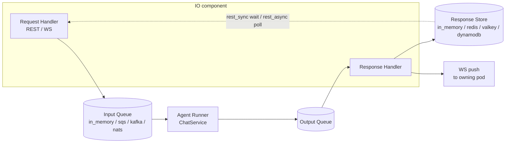

# #495: Unified queue execution pipeline + scalable on-prem Kubernetes deployment

Agent Kernel's chat execution is re-founded on one logical pipeline: Request Handler → Input
Queue → Agent Runner → Output Queue → Response Handler: with pluggable queue transports
(in-memory, SQS, Kafka, NATS JetStream). Local/API run modes execute the same pipeline in one
process over in-memory queues; containerized modes split it into two physical components (IO =
Request Handler + Response Handler, and Agent Runner); the existing Lambda flavor is the same
pipeline split three ways. On top of this, a Helm chart ships the two-component topology to any
Kubernetes cluster in two flavors: baremetal (MetalLB + Gateway API) and AWS EKS. Supporting
research: `research/README.md`.

## Motivation

- The five-component pipeline already exists in the codebase: twice, as divergent copies, plus a
  third divergent non-queue path:

  | Logical component | ECS containerized | Lambda serverless | Direct mode (local/API) |
  |---|---|---|---|
  | Request Handler | `ECSQueueRequestHandler` / `RestHandler` (`deployment/common/rest_handler.py:16`) | `Lambda` + REST router (`aws/serverless/aklambda.py:11`) | `AgentRESTRequestHandler` (inline call) |
  | Input Queue | SQS FIFO | SQS FIFO |: (none) |
  | Agent Runner | `ECSAgentRunner` (`containerized/akagentrunner.py:13`) | `ServerlessAgentRunner` (`serverless/akagentrunner.py:11`) | inline `ChatService` call |
  | Output Queue | SQS FIFO | SQS FIFO |: (none) |
  | Response Handler | `ECSOutputConsumer` (`containerized/akoutputconsumer.py:15`) | `ResponseHandler` (`serverless/akresponsehandler.py:13`) |: (HTTP response inline) |

- Consequences of the divergence:
  - Queue mode is untestable without AWS credentials and infrastructure; local dev exercises a
    different code path (inline) than production (queued), so retry, permanent-failure, and
    output-delivery logic is never executed locally.
  - The retry/receive-count/permanent-failure machinery is implemented per platform
    (`ECSSQSConsumer`, `LambdaSQSConsumer`) instead of once.
  - Behavior differs by path (e.g. REST streaming: SSE inline in direct mode; WS-only in queue
    mode).
- The queue transport is SQS-only and AWS-bound: `boto3` hardwired in `SQSHandler`
  (`deployment/aws/core/sqs_handler.py:14`) and `ECSSQSConsumer`
  (`containerized/core/sqs_consumer.py:14`); `execution.queues` config has no backend
  discriminator: only a bare `url` described as an SQS URL (`core/config.py:322,339,356`).
- The WebSocket push path is fully AWS-bound: API Gateway Management API + DynamoDB connection
  store (`deployment/aws/core/websocket_service.py:13,118`). On Kubernetes, WebSockets terminate
  on the IO pods themselves, so output delivery must reach the specific pod holding the socket.
- Cloud-portable Redis/Valkey response stores exist but are packaged under
  `deployment/aws/core/response_store/` (`handler.py:11`); there is no in-memory response store
  for a single-process topology.
- No Kubernetes/Helm assets exist anywhere in the repo; on-prem today means "a Docker image"
  (`README.md:165`).
- The SQS FIFO semantics any transport must reproduce are documented in
  `research/current-queue-mode.md` (per-session ordering, dedup, bounded retry with a
  permanent-failure hook, attribute-carried routing metadata, batch fetch, error surfacing).

## Architecture

- **Five logical components, fixed roles** (contracts live in the new `agentkernel/pipeline/` package):
  - **Request Handler**: terminates the client protocol (REST/WS), validates, assigns
    `request_id`, enqueues to the Input Queue; in `rest_sync` awaits the response; in
    `rest_async` returns `request_id` for polling.
  - **Input Queue**: transport-backed; per-session FIFO ordering, dedup, at-least-once with
    bounded redelivery.
  - **Agent Runner**: consumes the Input Queue, executes via `ChatService` (the presentation
    wrappers `process_chat_request`/`process_stream_chat_sync`, matching ECS: that layer supplies
    the status-code and error mapping the reply envelope carries; never `Runtime` directly),
    emits reply/chunks to the Output Queue. STREAM mode fans out one message per chunk.
    *(Back-edited 2026-08-13: originally said the execution core; spec §8 and the shipped runner
    use the wrappers, per #621 review.)*
  - **Output Queue**: transport-backed, same guarantees as input.
  - **Response Handler**: consumes the Output Queue; delivers via the Response Store (REST
    modes) or the WS push transport (ASYNC/STREAM modes); surfaces permanent failures as error
    responses so clients never hang.
- **Queue transport is a pluggable backend** (house factory pattern, `core/util/factory.py`):
  `in_memory` (default), `sqs`, `kafka`, `nats`, or a dotted path. Components speak a normalized
  message envelope (`body`, attributes `request_id`/`user_id`/`endpoint_url`, `receive_count`,
  native handle): no SQS record dicts outside the SQS transport.
- **Topology maps logical components to processes; the pipeline is identical in all three:**

  | Topology | Processes | Used by |
  |---|---|---|
  | Single-process | All five components: uvicorn thread + runner threads + response-handler thread (`ThreadRunner`), `in_memory` transport | CLI-adjacent local API, dev, small installs, Azure/GCP containers |
  | Two-process | IO (Request + Response Handler) and Agent Runner; external broker | ECS today; Kubernetes (this change) |
  | Three-way (serverless) | Request-handler Lambda, runner Lambda, response-handler Lambda | Existing Lambda flavor: unchanged, re-based on the shared contracts only where free |

- **Scope boundary**: the pipeline is the execution backbone for *chat-request surfaces*:
  everything that goes through `ChatService` (REST, WS, and later the messaging integrations).
  Stateful `AgentService` clients (CLI REPL, A2A, MCP) stay direct: they own a live conversation
  object and gain nothing from queueing (Q4). Per-invocation serverless direct handlers (Lambda,
  Azure Functions, Cloud Run direct modes) also stay inline: a queue inside a single invocation
  adds hops without decoupling.
- **Guarantees are per-transport, honestly**: the `in_memory` transport reproduces the full
  *semantics* (FIFO per session, receive count, redelivery, permanent-failure hook, dedup window)
  so all pipeline code paths run locally: but not durability (process death loses in-flight
  messages). SQS/Kafka/NATS provide durability per `research/kafka.md` /
  `research/nats-jetstream.md`.
- **No mandatory external services**: every store is pluggable with an in-memory default:
  session, response store, WS connection registry, and the queue transport itself. A single
  process (or single pod) runs with zero backing services; shared backends (Valkey/Redis,
  DynamoDB, brokers) are scale/durability choices, never platform prerequisites. The one hard
  boundary: multi-pod REST queue modes need a *shared* response store, because the pod that
  answers the poll may not be the pod that wrote the response (R6).

## Requirements

### R1. Pipeline package and component contracts

- New `agentkernel/pipeline/` package holding: component contracts
  (Request Handler base, Agent Runner, Response Handler), the queue-transport interface, the
  normalized message envelope, and the transport factory. Coupling: `pipeline` imports `core`
  and `api` (the pipeline request handler extends the base REST handler; `api`'s own pipeline
  imports stay lazy inside `run()` so no cycle exists); `deployment/` imports `pipeline` (core
  stays clean per the architecture rules). *(Back-edited 2026-08-13 to match spec §1 rule 1 and
  the shipped code, per #621 review.)*
- Consumer machinery written once: batch loop, receive-count check, permanent-failure-then-ack
  flow, `ThreadRunner` wiring (extracted from `ECSSQSConsumer._process_single/_consumer_loop/run`)
 : parameterized by a transport with per-thread consumer instances (Kafka needs one consumer
  object per thread; classmethod singletons don't fit).
- Agent Runner and Response Handler business logic extracted from
  `ECSAgentRunner`/`ECSStreamAgentRunner`/`ECSOutputConsumer`; ECS classes become thin SQS-bound
  subclasses with unchanged public names, exports, and behavior.
- `QueueHandler` (send) and `QueueConsumer` (receive) ABCs evolve into / are subsumed by the
  transport interface; existing implementations keep working during migration.

### R2. In-memory transport: queue mode as the local default

- `execution.queues.type: in_memory` is the default: every server-process surface runs the pipeline.
- Full semantics parity, in-process: per-session FIFO (session hashed to a worker lane),
  `receive_count` tracking with redelivery on failure, `max_receive_count` then the
  permanent-failure hook, `request_id` dedup window, batch fetch, `no_of_consumers` respected
  (lower local defaults acceptable: spec decision).
- No durability (documented): process death loses in-flight messages; deployment flavors needing
  durability choose a broker transport.
- `execution.response_store.type: in_memory` added (in-process future/registry) so `rest_sync` /
  `rest_async` work with zero external services; streaming over the in_memory transport bridges
  chunks to the open SSE response in-process: REST streaming keeps working locally (it stays
  WS-only in multi-process topologies).
- Existing app code is unchanged: `RESTAPI.run()` boots the single-process topology automatically
  when the transport is `in_memory` (uvicorn + runner + response-handler threads via `ThreadRunner`).
- Behavioral parity requirement: client-visible REST/WS shapes identical to today's direct mode;
  added latency is in-process queue hops only (sub-millisecond).

### R3. SQS transport (extraction, no behavior change)

- Existing `SQSHandler` + `ECSSQSConsumer` logic repackaged as the `sqs` transport behind the R1
  interface; FIFO group/dedup mapping unchanged.
- Config compatibility: `execution.queues.input.url`/`output.url` keep working: `url` set with
  no `type` implies `sqs` (explicit compat rule); Terraform-injected `AK_EXECUTION__QUEUES__*`
  env vars unchanged.
- ECS deployment behavior, entry points (`ECSIOHandler.run`, `ECSAgentRunner.run`), and the
  Lambda serverless flavor are unchanged from the outside.

### R4. Kafka transport

- Client: `confluent-kafka`; new `kafka` extra. Details and verified gaps: `research/kafka.md`.
- Topics `agent-input`/`agent-output` (+ `.dlq`); producer key = `session_id` (per-session
  ordering); `enable.idempotence=true`; attributes as record headers.
- Retry (no broker redelivery counting): `enable.auto.commit=false`, commit-after-process;
  in-process retry with backoff using partition `pause()`/`resume()`; after `max_receive_count`
  attempts → permanent-failure hook → DLQ topic with error headers → commit.
- Retry/dedup bookkeeping persistence follows the session storage configuration (decided): the
  attempt counter (keyed by `(topic, partition, offset)`, so a crash-looping poison message can't
  retry forever) and the consumer-side `request_id` dedup window (5 min, SQS parity) use the same
  backend/connection as the configured `session:` store, via the shared drivers
  (`core/util/driver/`). With `session.type: in_memory` this bookkeeping is process-local:
  acceptable for dev; production Kafka deployments pair with a persistent session store anyway.
  SQS and NATS transports need none of this (broker-native receive counts and dedup).
- Accepted, documented limitations: head-of-line blocking is per-partition (not per-message-group
  as in SQS FIFO); adding partitions later briefly breaks in-flight session ordering → partition
  count is a sized-up-front capacity parameter.
- Cluster provisioning: Strimzi operator (KRaft); operator install is a documented prerequisite,
  `Kafka`/`KafkaNodePool` CRs shipped as chart-gated templates.

### R5. NATS JetStream transport

- Client: `nats-py`; new `nats` extra. Details: `research/nats-jetstream.md`. Decided: NATS
  JetStream is the recommended on-prem broker: chart default and docs quickstart; Kafka is the
  enterprise-standardization option.
- Two work-queue streams; durable pull consumers; `fetch(batch, timeout)` = long poll.
- Near-1:1 semantics: `ack_wait` = visibility timeout; `msg.metadata.num_delivered` = receive
  count; permanent failure = hook then `term()`; `max_deliver = max_receive_count + 1` as the
  server-side backstop; `Nats-Msg-Id` dedup with a 5-minute `duplicate_window`.
- Per-session ordering: deterministic subject mapping with a partition token, one filtered
  durable consumer per partition, `max_ack_pending=1` per partition consumer; partition count
  configurable (default 32: decided; whether the output path needs partitioning at all stays a
  spec-stage decision).
- asyncio bridge: one background event-loop thread per process; consumer threads submit via
  `asyncio.run_coroutine_threadsafe` (maintainer-documented pattern).
- Provisioning: NACK CRDs in the chart; production fails fast when streams/consumers are missing
  (dev-mode auto-create allowed: spec decision).

### R6. Response store and WS delivery (on-prem completeness)

- Relocate `ResponseDBHandler` + Redis/Valkey/DynamoDB response stores from
  `deployment/aws/core/response_store/` to a neutral home; add the `in_memory` backend (R2); keep
  re-exports at old paths. No behavioral change to existing backends.
- The `in_memory` response store is valid for single-process/single-pod topologies only; multi-pod
  REST queue modes require a shared backend (redis/valkey/dynamodb) because the enqueueing or
  polling pod and the consuming pod can differ: this combination fails fast at startup
  (spec-stage check).
- WS delivery = **direct pod-to-pod push** (decided: Q3, Option D): the 1:1 port of the AWS
  model with the pod taking API Gateway's place and pod-local memory taking DynamoDB's place.
  No shared store in the delivery path:
  - On connect, the IO pod registers the connection in a **pod-local in-memory registry**
    (default `WebSocketConnectionStoreABC` implementation).
  - Chat requests enqueued from a WS carry `endpoint_url` = the originating pod's internal push
    address (downward-API pod IP + port, headless Service); the attribute flows
    input → output unchanged: exactly today's plumbing.
  - The Response Handler POSTs the reply/chunk to that address's internal push endpoint; the
    owning pod resolves `user_id` → local connections and writes the frames. A stale address
    (pod restarted/gone) behaves like AWS `GoneException`: bounded retry, then the
    permanent-failure path.
  - The internal push endpoint is authenticated (chart-injected shared secret) and restricted by
    NetworkPolicy; the single-process topology delivers in-process, no hop.
  - Documented semantic difference vs AWS: replies reach the user's connections on the
    originating pod only. Cross-pod fan-out to all of a user's devices would need a shared
    connection store: the `WebSocketConnectionStoreABC` interface already permits plugging one
    (e.g. Redis/Valkey over the shared drivers), but that is not v1 scope.
- No sticky sessions; clients reconnect on redeploys (research `kubernetes-deployment.md` §1.3).

### R7. Entry points and back-compat

- Platform-neutral entry points in the pipeline package: an IO entry point (Request + Response
  Handler threads) and an Agent Runner entry point: the generalization of `ECSIOHandler.run()` /
  `ECSAgentRunner.run()`, usable in any container runtime.
- All existing public exports (`ECSIOHandler`, `ECSAgentRunner`, `ECSOutputConsumer`,
  `AWSRestAPI`, `AWSWebsocketAPI`, serverless classes) remain and behave identically.
- Thread recording (post-#613) runs on the Request Handler / IO side (decided), mirroring how
  messaging integrations own their platform history at the edge; the Agent Runner stays free of
  thread knowledge. Note for spec stage: `ThreadRecorder.post_run` needs the reply, which in
  async modes arrives at the Response Handler: both live in the IO component, so the exact hook
  point (request-handler await vs response-handler delivery) is pinned in `spec.md`. The final
  treatment can be combined with the later messaging-integrations-as-pipeline phase (see
  Non-goals).

### R8. Config

- `execution.queues.type: in_memory | sqs | kafka | nats | <dotted>` (default `in_memory`) +
  per-backend sub-models (`kafka`, `nats`, `sqs` for URLs); `input`/`output` blocks stay
  backend-neutral (`max_receive_count`, `no_of_consumers`, `batch_size`).
- Compat: `url` present + `type` absent ⇒ `sqs` (R3); existing YAML and `AK_*` env vars keep
  working unchanged.
- `execution.mode` (`rest_sync | rest_async | stream | async`) is unchanged and now orthogonal to
  transport: every mode works over every transport (streams over `in_memory` = local SSE; over
  brokers = WS push).

### R9. Helm chart deliverable (`ak-deployment/`)

- New chart tree `ak-deployment/ak-k8s/` (decided), one umbrella chart published as an OCI artifact:
  - First-party templates: `io-handler` Deployment + Service, `agent-runner` Deployment,
    `Gateway` + `HTTPRoute` (Gateway API Standard channel; plain `Service type=LoadBalancer`
    fallback), ConfigMap/Secret → `AK_*` env injection (app declares modes; infra injects
    connection details: same split as ECS Terraform), optional KEDA `ScaledObject`, optional
    `ServiceMonitor`s.
  - Condition-gated dependencies: `valkey` (official `valkey-io/valkey-helm`), `nats` (official
    `nats-io/k8s` chart + NACK CRs), `kafka` (Strimzi CRs; operator prerequisite). No Bitnami
    anywhere (catalog frozen: research `kubernetes-deployment.md` §3).
  - Air-gap: every image behind a global registry override; machine-readable image manifest per
    release.
- Flavors are values-only; templates never fork:
  - `values-baremetal.yaml`: MetalLB prerequisite (L2 default), Envoy Gateway class,
    cert-manager internal-CA issuers, local storage classes (OpenEBS LocalPV / local-path).
  - `values-eks.yaml`: AWS LB Controller v3 gateway classes (ALB/NLB), ACM annotations, EBS gp3,
    EKS Pod Identity; all broker transports are valid on EKS (decided): `sqs` via Pod Identity
    for customers avoiding a broker, or in-cluster `kafka`/`nats` (flavors × transports are
    orthogonal).
  - `values-dev.yaml`: single replicas, hostpath/ephemeral storage, TLS off: micro-cluster
    sized; also valid: single-process chart mode (one Deployment, `in_memory` transport) for the
    smallest installs.
- Documented prerequisites (not installed): Gateway API CRDs + implementation, MetalLB
  (baremetal), cert-manager, KEDA (if autoscaling), Strimzi (if Kafka).
- WS route: dedicated listener with raised idle/stream timeouts; request buffering never enabled
  on WS routes (Envoy Gateway deadlock: research §1.3).

### R10. Autoscaling

- `agent-runner` scales on queue depth via KEDA (Kafka lag / NATS pending scalers, selected by
  transport); `minReplicaCount: 1` default; scale-to-zero opt-in; replica ceiling documented
  against partition count (`maxReplicaCount * no_of_consumers <= partitions`).
- `io-handler` on plain HPA. Graceful drain: runner stops claiming work on SIGTERM, finishes
  in-flight runs within a generous `terminationGracePeriodSeconds`.

### R11. Observability

- v1 ships documentation + example values, not bundled chart dependencies (decided): OTel collector as the
  single funnel for AK's tracing providers, kube-prometheus-stack, per-broker exporters (NATS
  sidecar / Strimzi Kafka Exporter) via values; self-hosted Langfuse v3 as an optional companion
  install (official chart; ~9 CPU / 22 GiB noted).

### R12. Examples, tests, micro-clusters

- Contract test suite run against every transport (like `SandboxProviderContract`): ordering per
  session, dedup, redelivery count, permanent-failure hook, batch fetch: `in_memory` and `sqs` in
  unit CI; `kafka`/`nats` against ephemeral brokers in integration CI.
- The `in_memory` transport makes the entire pipeline (including failure paths) testable in plain
  pytest with zero infra: this is the refactor's testability dividend.
- New example: `examples/k8s/openai-queue-mode/` (two Dockerfiles, `config.yaml` variants for
  nats/kafka, helm-install README end-to-end on a micro-cluster).
- Micro-cluster guidance (research §5): k3d on macOS (microk8s' MetalLB addon does not work under
  Multipass on macOS); microk8s supported on native Ubuntu (`metallb`, `hostpath-storage`,
  `registry` addons); k3s for closest-to-prod baremetal parity. CI: kind + `helm/kind-action` +
  chart-testing per flavor values file, one smoke test driving a chat request through the queue.

### R13. Docs and skills

- Docs site: new Deployment → "On-Prem / Kubernetes" category (`docs/sidebars.js:61-90`);
  `queue-mode-guide.md` re-framed around the unified pipeline + transport matrix
  (`docs/docs/advanced/queue-mode-guide.md:353` status table gains transports and the K8s
  column); `deployment/overview.md` updated.
- Dev skills: `ak-dev-architecture` (pipeline section replaces the ECS-only queue story);
  follow-up `ak-dev-new-queue-transport` skill once the abstraction exists.
- Chart joins the `ak-deployment` publishing flow (`.github/workflows/sync-terraform.yaml` matrix
  or an equivalent chart-publish workflow).

## Non-goals

- Routing stateful `AgentService` clients (CLI REPL, A2A, MCP) through the pipeline: they stay
  direct (decided). Review note 2026-08-13: making A2A/MCP uniform over the pipeline will be
  taken up as a separate follow-up issue.
- Restructuring or broadly updating the examples tree for the pipeline era (beyond
  `examples/api/openai`'s queue-configurability walkthrough and the new k8s example of R10):
  deferred until after this design's implementation completes (review note 2026-08-13; see
  plan.md "Deferred follow-ups").
- Converting messaging integrations (Slack, WhatsApp, …) into Request/Response Handler pairs:
  a natural later phase (webhook-ack timeouts make it attractive), not v1.
- Changing `Runtime`/`AgentService`/`ChatService`-core semantics: the pipeline sits above the
  ChatService execution core, never bypasses it.
- Serverless (Lambda/Azure/GCP) behavior changes: the Lambda queue flavor is already the
  three-way topology; it adopts shared contracts only where free.
- Sandboxing on Kubernetes (`kubernetes` provider, `k8s_pod` broker: deferred under #494) and
  RAG backend deployment (docs pointer at most).
- Kafka share groups (KIP-932): no ordering + preview-only Python client.
- Installing cluster-scoped infra (MetalLB, cert-manager, KEDA, Strimzi, Gateway API CRDs) from
  our chart.

## Open questions

Review 2026-08-11 resolved: **Q1** NATS JetStream is the recommended on-prem broker; **Q2**
package `agentkernel/pipeline/`, generalized `RequestHandler`/`AgentRunner`/`ResponseHandler`
component names, chart tree `ak-deployment/ak-k8s/`; **Q4** CLI/A2A/MCP stay direct
`AgentService` clients; **Q5** Kafka retry/dedup bookkeeping follows the session storage
configuration; **Q6** thread recording runs on the Request Handler / IO side, combinable with the
later messaging-integrations phase; **Q8** input partition default 32; **Q9** EKS supports
`sqs`, `kafka`, and `nats`; **Q10** single issue (#495) with ordered PRs. Review 2026-08-12
resolved **Q7** (observability ships as documented recipes + example values, no bundled
observability subcharts) and **Q3** (WS delivery uses direct pod-to-pod push: Option D of the
review aid: with `endpoint_url` carrying the originating pod's own address and a pod-local
in-memory connection registry; chosen so Redis/Valkey stays optional platform-wide; Redis
pub/sub, NATS-core subjects, and per-pod broadcast consumers were considered and rejected).

No questions remain open. The design is settled pending final read-through; `spec.md` is the next
stage.
