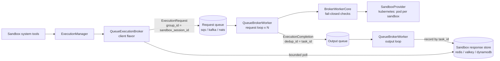

# #503: Sandbox queue broker: transport-agnostic queue-decoupled sandbox execution

> Status: **Draft** (pending design review). Stage 2 ([spec.md](spec.md)) follows after review.

Add the queue-backed sandbox broker flavor planned in #494, generalized over the #495 queue
transport layer: one `queue` broker flavor whose client submits `ExecutionRequest`s over any
`QueueTransport` (`in_memory`, `sqs`, `kafka`, `nats`, or a dotted-path BYO transport), and a
`QueueBrokerWorker` runnable that consumes them, drives `BrokerWorkerCore`, and delivers
completions DB-first. The `kubernetes` sandbox provider lands with it, since both target
deployments execute sandbox workloads as pods.

## Motivation

- The #494 design requires a queue-decoupled broker in deployed modes
  (`docs/specs/494-sandbox-capability/design.md:187-240`), but only the in-process flavors exist:
  - `_BUILTIN_BROKERS` maps `embedded` and `thread` only
    (`ak-py/src/agentkernel/sandbox/factory.py:25-28`).
  - `sandbox.broker.flavor`'s description still reads "The AWS 'sqs' flavor is planned in a later
    iteration" (`ak-py/src/agentkernel/core/config.py:602-606`), and `deployment/aws/` has no
    `sandbox/` package: the #494 spec's `sqs` flavor
    (`docs/specs/494-sandbox-capability/spec.md:408-458`) was never built.
- #494's spec predates the #495 transport layer. Now that `QueueTransport`/`TransportConsumer`
  exist with four conformant built-ins and a reusable contract suite
  (`ak-py/src/agentkernel/pipeline/transport/base.py:9-98`, `pipeline/testing.py`), a single
  transport-agnostic flavor supersedes the per-cloud plan: `sqs` becomes configuration, and the
  Kafka and NATS deployments come for free.
- The transport semantics already match the broker's contract:
  - The #494 concurrency contract serializes operations per `sandbox_session_id`
    (`design.md:94-102`; in-process lock at `sandbox/broker/worker.py:42-51`).
  - The transport contract gives per-group FIFO with at most one in-flight message per group:
    Kafka via partition keying with one record per partition in flight
    (`pipeline/transport/kafka.py:13-20`), NATS via partition subjects with `max_ack_pending=1`
    (`pipeline/transport/nats.py:17-19`), SQS via FIFO groups, in_memory by construction.
  - So `group_id = sandbox_session_id` upholds the per-session contract across a whole worker
    fleet with no distributed locks.
  - At-least-once delivery is already tolerated end-to-end: `QueueMessage.dedup_id`
    (`pipeline/envelope.py:31-32`) gives publish-time dedup where supported, and completion
    records are keyed by `task_id`, so a redelivered completion overwrites idempotently.
- Long-running executions exceed agent-runtime ceilings: the original driver for this issue is a
  Claude code-execution task of roughly 18 minutes against the 15-minute Lambda limit. The fix
  is promotion: the tool's bounded wait expires, the turn ends with a task handle, the worker
  finishes on its own clock, and a later turn recovers the result via `check_sandbox_task`
  (agent re-invocation on completion is deferred; see Non-goals).
- Two concrete deployments are waiting on this feature:
  - **Kafka shape**: Agent Kernel in Lambda mode, sandbox requests on an existing Kafka cluster,
    a broker worker pod inside EKS spinning up sandbox pods that run read-only kubectl commands
    (consumer side: #587).
  - **NATS shape**: Agent Kernel fully inside EKS (the #495 chart topology) with NATS as the
    queueing layer, where sandbox pods must run confined to a given security context and a
    hardened custom image.
- Both shapes execute workloads as Kubernetes pods, but the `kubernetes` provider is
  config-only today: `_SandboxKubernetesConfig` exists (`core/config.py:590-595`) while
  `_BUILTIN_PROVIDER_NAMES` has no `kubernetes` entry (`sandbox/factory.py:20`).

## Requirements

### The `queue` broker flavor (agent-side client)

- New built-in broker flavor `queue` (`sandbox/broker/queue.py`), added to `_BUILTIN_BROKERS`
  (`sandbox/factory.py:25-28`); the existing short-name-to-dotted-path resolution
  (`factory.py:179-202`) needs no structural change.
  - Supersedes the #494 spec's `sqs` flavor (`494-sandbox-capability/spec.md:408-458`): no
    `deployment/aws/sandbox/sqs_broker.py` is ever built; SQS is reached by configuring the
    transport type.
  - Coupling: the flavor imports only `pipeline.envelope` and `pipeline.transport`, which
    themselves import only `core` (verified: `pipeline/transport/base.py:4-6`,
    `pipeline/envelope.py`); imports are lazy (module import happens only when the flavor is
    selected), matching the factory's existing lazy-import discipline.
- `submit(request, wait)`:
  - Serializes the `ExecutionRequest` (`sandbox/broker/base.py:44-54`) as the `QueueMessage`
    body; `group_id = request.sandbox_session.sandbox_session_id`; `dedup_id = task_id`;
    `ATTR_REQUEST_ID = task_id` in the attributes for observability parity with the chat
    pipeline (`pipeline/envelope.py:8`).
  - Sends to the sandbox request queue (the sandbox transport's INPUT queue).
  - `wait > 0`: bounded poll of the sandbox response store until `wait_deadline`; a completion
    found in time yields the `SandboxResult`; `failed`/`timed_out` completions surface as the
    matching typed `SandboxError`, mirroring the in-process flavors' behavior as closely as the
    wire allows (`sandbox/broker/thread.py:103-148` is the reference semantics).
  - `wait == 0`, or deadline expiry: return the `SandboxTask` handle (promotion); execution
    continues on the worker.
  - Client-side fail-fast: reject requests whose effective timeout exceeds
    `sandbox.broker.worker_timeout_ceiling` when set (`core/config.py:617-620`), with
    `SandboxPolicyError`, per the #494 design.
- `result(task_id)`: response-store lookup, serving `ExecutionManager.task_status`'s fall-through
  (`sandbox/manager.py:109-134`); `discard()` stays the durable-flavor no-op
  (`sandbox/broker/base.py:82-87`), TTL owns cleanup.

### The queue broker worker

- New `QueueBrokerWorker` runnable (`sandbox/broker/queue_worker.py`): the process entry point a
  deployment runs as its sandbox execution plane (a pod in both target shapes).
  - Blocking classmethod `run()`, N consumer threads via `ThreadRunner`, one `TransportConsumer`
    per thread (the contract at `pipeline/transport/base.py:42-52`), reusing `ConsumerLoop`'s
    batch/retry/permanent-failure machinery (`pipeline/consumer.py`) and the `IOHandler`
    SIGTERM/SIGINT discipline.
  - Publicly exported (entry points are public, matching `ECSAgentRunner`); the #494 export rule
    that concrete brokers stay internal (`494-sandbox-capability/spec.md:93`) is amended for the
    worker only, not for the client flavor.
- The worker hosts two consumer loops as peer threads (the `ECSAgentRunner` +
  `ECSOutputConsumer` split, collapsed into one process):
  - **Request loop** (input queue): deserialize the `ExecutionRequest`, run
    `BrokerWorkerCore.process()` (terminal guarantee, never raises:
    `sandbox/broker/worker.py:99-109`), send the completion to the block's **output queue**,
    then ack the request. Execution and persistence are decoupled: once the completion is on
    the output queue, a response-store outage can no longer cause a re-execution.
  - **Output loop** (output queue): persist each completion as a response-store record keyed by
    `task_id`, upsert the session-inventory record, then ack.
- Permanent-failure hooks: request-side (retries exhausted before `process()` could produce a
  completion) sends a `failed` completion to the output queue, then dead-letters; no task ends
  without a terminal completion (`494-sandbox-capability/design.md:203-207`). Output-side (the
  store persistently unreachable) logs at ERROR and dead-letters; the completion survives in
  the DLQ for operator recovery.
- Trust boundary: providers are constructed worker-side only; backend credentials (kubeconfig,
  ServiceAccount, SaaS keys) never exist in the agent process; principal and policy are enforced
  fail-closed in the worker against declared capabilities (`sandbox/broker/worker.py:113-159`),
  unchanged.
- Idle-session sweep: the #494 spec's ECS-only sweep
  (`494-sandbox-capability/spec.md:420-436`) generalizes to this worker: broker-side session
  inventory upserted into the response store on create/attach, swept every
  `sandbox.broker.sweep_interval` (`core/config.py:612`), destroying sandboxes idle past their
  profile `idle_timeout`.

### Completion delivery

- Completions travel the sandbox block's **output queue** (design review 2026-08-31): the
  request loop produces them, the output loop persists them, mirroring the chat pipeline's
  Agent Runner / Output Consumer split. `group_id = sandbox_session_id`,
  `dedup_id = task_id`.
- The response store remains the read side: records keyed by `task_id` with TTL
  `sandbox.broker.response_ttl` (`core/config.py:611`) serve the client's bounded wait and
  `check_sandbox_task` recovery ("the user can come back and check", the #494 rule). Queues are
  never read by task id (`494-sandbox-capability/design.md:398-402` rejected receive-and-filter).
- There is **no completion event and no agent re-invocation** in this story: the tool waits;
  on expiry the agent holds a task handle and recovers it with the existing
  `check_sandbox_task` tool on a later turn. Asynchronous resumption (pausing tool execution
  and resuming on completion) is being built as its own human-in-the-loop capability and the
  sandbox broker will adopt it there (see Non-goals). The shipped `SandboxPreHook` ingestion
  path (`sandbox/hooks.py:26,48-73`) stays in place, unfed by this feature, ready for that one.

### Factory seams

- `QueueTransportFactory.create()` and `resolve_type()` are hard-wired to
  `AKConfig.get().execution.queues` (`pipeline/transport/base.py:100-195`). Both gain an optional
  explicit config-block parameter (a `_QueuesConfig`-shaped object); omitted, behavior is
  byte-for-byte today's. The sandbox broker builds its transports from its own blocks through
  this seam.
- Same seam for the response-store factory (`pipeline/response_store/factory.py`), so the
  sandbox broker constructs its store from `sandbox.broker.response_store`
  (`core/config.py:621-624`) instead of `execution.response_store`.
- Startup fail-fasts (the `IOHandler` precedent): the `queue` flavor with a missing or
  `in_memory` response store raises `AKConfigError` (a queue-decoupled broker needs a shared
  store); a missing `sandbox.broker.queue` block likewise.

### Configuration

- `_ExecutionBrokerConfig` (`core/config.py:602-624`) changes:
  - `flavor` gains the `queue` built-in; the "sqs is planned" description text is replaced.
  - New `queue: Optional[_QueuesConfig]`: the sandbox request-queue transport, reusing the
    existing `_QueuesConfig` shape (`core/config.py:475-499`) so every transport's sub-block
    (`kafka`, `nats`, `in_memory`, SQS URLs) and its documentation carry over verbatim. The
    block's INPUT queue carries execution requests to the worker; its OUTPUT queue carries
    completions back to the output loop for response-store persistence.
  - Existing knobs reused as-is: `wait_timeout` (607), `inline_payload_max_bytes` (608-610),
    `response_ttl` (611), `sweep_interval` (612), `worker_timeout_ceiling` (617-620),
    `response_store` (621-624).
  - `request_queue_url` (613) and `object_store_bucket` (614-616) were added for the never-built
    `sqs` flavor and nothing reads them: both fields are removed. Values still present in
    existing YAML or env vars are ignored under the model's default extra-field handling, so
    removal breaks no running config (spec stage verifies this against the settings loader).
- A dedicated queue block (rather than reusing `execution.queues`) is deliberate: sandbox
  executions need their own redelivery sizing. E.g. NATS `ack_wait` must exceed the longest
  execution (`core/config.py`, `_NatsQueueConfig.ack_wait` description), and an 18-minute
  sandbox task must not force chat-queue settings up.
- Env-var overrides follow from the config tree as usual (`AK_SANDBOX__BROKER__QUEUE__...`).

### Payload size limits

- Transports carry hard message caps (Kafka `message.max.bytes` and NATS `max_payload` default
  to roughly 1 MiB; SQS 256 KiB), so inline payload discipline is enforced, not assumed:
  - Request side (client): a serialized request over `inline_payload_max_bytes` (in practice:
    `upload_file` content) is rejected at `submit()` with a typed `SandboxError` naming the
    limit; it never reaches the transport's own send failure.
  - Result side (worker): stdout/stderr over the threshold are truncated with a
    `SandboxResult.notice` stating truncation; `result_ref` stays reserved in the wire contract
    (`sandbox/broker/base.py:61`) for a later object-store offload feature.
- Object-store offload itself (S3 or pluggable) is out of scope (see Non-goals); both target
  workloads (kubectl output, code-execution logs) fit inline.

### `kubernetes` sandbox provider

- Implement the `kubernetes` built-in (`sandbox/providers/kubernetes.py`), following the
  `ak-dev-new-sandbox-provider` checklist: factory branch + `_BUILTIN_PROVIDER_NAMES` entry
  (`sandbox/factory.py:20,102-160`), a `kubernetes` optional-dependency extra (the official
  `kubernetes` client), contract tests, example, docs row.
- Managed mode (both target shapes): `create()` launches a pod in the configured namespace from
  the configured image; `sandbox_id = <namespace>/<pod>`; `attach()` reconnects by pod name and
  raises `SandboxGoneError` when the pod is gone or terminated (the self-heal signal,
  `sandbox/broker/worker.py:161-186`); `destroy()` deletes the pod, idempotent.
- Attached mode (mode 3): `attach_to: <namespace>/<pod>` execs into an existing pod, per the
  existing config field (`core/config.py:593`) and the `environment: attached` validation
  (`sandbox/factory.py:67-99`). Capabilities declare `provisions=True, attaches_external=True`.
- Operations: `execute_command` and `execute_code` (python via stdin to the interpreter) over
  the exec API; `upload_file`/`download_file` over exec streams; `install_packages` only when
  the pod has network egress.
- `_SandboxKubernetesConfig` (`core/config.py:590-595`) gains: `service_account`,
  `security_context` (pod- and container-level overlay), `image_pull_secrets`, `labels`,
  `node_selector`, `env`. The hardened-image requirement of both consumers is then pure config
  (`image`, ideally digest-pinned).
- Capability honesty (`SandboxCapabilities`):
  - `isolation=container`, `shell=True`, `files=True`, `stateful=True`, `attach=True`.
  - `policy_resources=True`: policy cpu/memory map to pod requests/limits.
  - `policy_filesystem=True`: `readOnlyRootFilesystem` plus a writable emptyDir workdir.
  - `policy_network` is **config-asserted**: default `False`; setting
    `kubernetes.network_policy: true` makes the provider create a per-pod NetworkPolicy for
    `network_egress: deny|allowlist` and flips the capability on the instance. The operator is
    asserting the cluster CNI enforces NetworkPolicy, which the provider cannot detect; an
    unconditional `True` would be exactly the false guarantee the capability model forbids.
    - Note: an instance-level capability override is a new pattern (capabilities are class
      attributes today); the spec must define it once, deliberately.
  - `principal_user=False` in the initial iterations: both known consumers bind authority via
    the sandbox pod's ServiceAccount (agent mode). A later iteration of this story flips it to
    `True` via K8s RBAC impersonation: the user-mode principal maps to impersonation headers on
    the provider's API calls, so the API server enforces the invoking user's own RBAC
    (staged in plan.md).
- Lifecycle backstops against orphaned pods: ownership labels on every created pod (so the
  worker sweep can enumerate its own), and `activeDeadlineSeconds` derived from the profile
  `idle_timeout` as the platform-side ceiling.
- Security-boundary guidance (docs requirement, driven by the #587 use case): read-only or
  otherwise-restricted execution is enforced by the **credential**, never by parsing command
  strings: bind the sandbox pod's ServiceAccount to a read-only (Cluster)Role and let the API
  server reject writes. Command-string filtering is explicitly rejected as a security boundary
  (shell metacharacters and compound commands defeat it; #587 documents the injection gap).

### Deployment wiring (Helm chart)

- ak-k8s chart (`ak-deployment/ak-k8s/chart/`): new optional
  `deployment-sandbox-worker.yaml` alongside the existing io/agent-runner/ws-gateway
  Deployments, disabled by default.
  - Values-gated ServiceAccount + Role/RoleBinding for the worker (create/get/delete pods and
    pods/exec in the sandbox namespace only), and the sandbox pod ServiceAccount it assigns.
  - KEDA `ScaledObject` on request-queue depth, mirroring the existing `scaledobject.yaml`.
- Namespace-hardening guardrails for sandbox pods ship as values-gated chart templates
  (default off), covered by the chart's kind CI:
  - Pod Security Admission `restricted` label on the sandbox namespace, so a privileged pod
    spec is rejected by admission even if the worker is compromised.
  - Default-deny NetworkPolicy with values-declared egress exceptions (e.g. the API server
    only, for the kubectl workload).
  - ResourceQuota and LimitRange caps on the namespace.
  - The broker-nats example enables the values flag instead of carrying its own manifests.

### Examples (final iterations)

- Two runnable end-to-end examples land in the last implementation iterations, one per target
  shape (placement following `examples/transport/{kafka,nats}` and `examples/sandbox/`):
  - **Kafka shape** (`examples/sandbox/broker-kafka/`): agent process + `QueueBrokerWorker` as
    separate processes over a Kafka broker; kubernetes provider running kubectl read-only
    commands in a kind cluster under a view-bound ServiceAccount; demonstrates the bounded-poll
    wait and the RBAC rejection of a write command. The Lambda-mode variant (the agent side
    submitting from Lambda, everything else identical) is documented in the example README
    rather than automated.
  - **NATS shape** (`examples/sandbox/broker-nats/`): the chart-deployed topology
    (`examples/k8s/openai-queue-mode` is the base) plus the sandbox worker Deployment, NATS
    sandbox request/output queues, hardened image, securityContext, and the namespace-hardening
    manifests; demonstrates a long execution promoting to a task handle and a later turn
    recovering it via `check_sandbox_task`.
- Sentinel-based deterministic assertions, per the `examples/sandbox/docker` reference.

### Testing

- `tests/test_sandbox_broker.py` additions, all over the `in_memory` transport (no live broker):
  - `queue` flavor end-to-end: submit, worker consume, DB-first completion, bounded-poll hit and
    miss (promotion), `result()` recovery, `failed`/`timed_out` surfacing as typed errors.
  - Ordering: two sessions interleaved, per-session FIFO preserved; same session never
    concurrent across two worker threads.
  - Promotion round trip: bounded wait expires, the completion lands via the output loop, and
    a later `check_sandbox_task` recovers it (registry-miss path included).
  - Output-loop decoupling: a response-store write failure retries via output-queue redelivery
    without re-executing the sandbox operation.
  - Permanent-failure paths: request-side sends the `failed` completion to the output queue
    before dead-lettering; output-side dead-letters without losing the request loop.
  - Fail-fasts: missing/`in_memory` response store, missing queue block, timeout over
    `worker_timeout_ceiling`, oversized request payload.
- `tests/test_sandbox_providers.py`: `SandboxProviderContract` subclass for the kubernetes
  provider over a mocked kubernetes client (create/attach/exec/destroy call shapes, gone-pod
  `SandboxGoneError`, policy and securityContext mapping, network-policy capability assertion).
  The impersonation iteration adds: user-mode principal mapping to impersonation headers, and
  the fail-closed path when the resolver yields no user principal.
- Factory tests: `queue` flavor resolution, kubernetes short-name resolution, missing-extra
  errors (`tests/test_sandbox.py`).
- Live-broker coverage: the sandbox queue path joins the existing env-gated live transport job
  pattern (`tests/test_transport_contract_live.py`) only if it needs semantics the transport
  contract does not already pin; default assumption is it does not.

### Documentation

- `docs/docs/advanced/sandbox.md`: broker-flavor section for `queue` (config, topologies for
  both shapes, the wait-then-check recovery contract), kubernetes provider row with honest
  tiers, and the RBAC-not-string-filtering security guidance.
- `ak-py/README.md`: `kubernetes` extra; `ak-deployment/ak-k8s/README.md`: sandbox worker
  values.
- Dev skills sync (`ak-dev-architecture`, `ak-dev-new-sandbox-provider`,
  `ak-dev-new-queue-transport` cross-reference) via the standard sync flow at merge time.

## Component diagram

## Non-goals

- PTY / interactive terminal execution through the broker. A PTY is a low-latency duplex byte
  stream; the broker is a queue-decoupled request/completion contract. Keystroke round trips
  through a queue are impractical, and a PTY collapses the audit boundary ("every execution is
  an auditable message": `494-sandbox-capability/design.md:196-198`) into an opaque stream that
  no per-command policy or audit can cover. Human interactive access to a sandbox pod is a
  platform surface (`kubectl exec`, a web terminal behind the platform's own authz), not an AK
  feature.
- Streaming execution output (unchanged #494 non-goal, `design.md:376-377`); chunked output
  events could later ride the completion path without changing this design.
- Command-string allowlisting as a security boundary. The boundary is the credential (RBAC via
  ServiceAccount or impersonation). A convenience pre-filter for friendlier early errors may be
  a later addition and must be documented as UX, not security.
- Object-store payload offload and a pluggable object store; `result_ref` stays reserved.
- The AWS terraform provisioning module for the broker (`494-sandbox-capability/spec.md:892`):
  queue and store provisioning is deployment-specific wiring; the Kafka-shape consumer brings
  its own cluster.
- A `k8s_pod` broker flavor as named in #494 (`design.md:389`): the `queue` flavor plus the
  chart's worker Deployment subsumes it.
- GCP/Azure-specific broker flavors (BYO dotted-path remains open to them).

## Open questions

- None outstanding on the design.
  - Resolved 2026-08-24 (design review): the `kubernetes` provider stays inside #503 (both
    examples depend on it); user-mode principal via K8s RBAC impersonation is an iteration of
    this story at a later stage (initial iterations are agent-mode only); truncate-with-notice
    is the v1 answer for oversized results (object-store offload remains a follow-up and
    `result_ref` stays reserved); the unused `request_queue_url`/`object_store_bucket` fields
    are removed; namespace hardening ships as values-gated chart templates covered by the
    chart's kind CI; the completion-event body starts from the #494 shape and is amended at
    spec stage where a cleaner form serves all consumers.
  - Resolved 2026-08-25 (iteration-1 review): the separate `completion_queue` block is dropped;
    completion events ride the deployment's existing `execution.queues` (which is the agent
    input queue by definition, restoring the #494 contract), with a `completion_events` boolean
    (default true) as the poll-only switch and a startup warning on the broker-request-queue +
    in_memory-execution-queues mismatch.
  - Resolved 2026-08-31 (iteration-1 review): superseding the 2026-08-25 entry, completion
    events and agent re-invocation are removed from this story altogether; asynchronous
    resumption will arrive with the separate human-in-the-loop capability. Completions now
    travel the sandbox block's own OUTPUT queue and are persisted to the response store by an
    output loop inside the worker (full `_QueuesConfig` symmetry with the chat pipeline); the
    tool contract is bounded wait plus `check_sandbox_task`. The `completion_events` flag and
    the `used_queues` factory seam are dropped as no longer needed.
