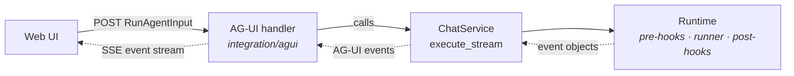

# #523: AG-UI protocol support

Agent Kernel grows an AG-UI integration at `integration/agui/`, mounted by the application the way
the thread and messaging handlers already are, so any compliant AG-UI frontend can drive any AK
agent over an event stream. Because AK's runner streaming contract is text-only today, the change
also widens that contract to typed event objects, so the tool-call, step and reasoning information
the adapters already receive from their frameworks survives to the AG-UI frontend instead of being
discarded at the adapter boundary.

Supporting investigation is in [research/](research/) — `ag-ui.md` (protocol survey and gap
analysis), `a2ui.md` (the related protocol, out of scope here), and `decision-log.md` (decisions
settled in review, with the verified code facts behind them; **partly superseded by this document**
— see the status note at its top).

All `path:line` citations are against `develop` at `97a272e1`, re-verified mechanically. Two
requirements below were reversed because `develop` moved under them — the AG-UI-owned authoriser and
the `ag-ui-protocol` floor — and both say so inline rather than being quietly rewritten.

## Motivation

- AK's entire streaming vocabulary is three fields — `StreamChunk(delta, done, error)`
(`ak-py/src/agentkernel/core/model.py:173-176`).
  - That covers `TextMessageContent`, `RunFinished` and `RunError`, and nothing else, against
  AG-UI's ~25 event types.
  - There is no representation for a tool call, a step, state, or reasoning — the events modern
  chat UIs are built around.
- The adapters already hold the missing information and discard it, because `Runner.stream` is typed
`AsyncGenerator[str, None]` (`core/base.py:376`).
  - OpenAI iterates the SDK's full event stream, then keeps only text deltas
  (`framework/openai/openai.py:224-229`) — tool-call items and handoffs are dropped by the filter.
  - Google ADK `continue`s on every non-partial event (`framework/adk/adk.py:274-286`), which is
  where its function calls and responses arrive.
  - So the expensive part of AG-UI support is not the HTTP surface or the encoder; it is widening
  the runner contract. See `research/ag-ui.md` §3.2.
- **Four of six adapters can stream today** — OpenAI, LangGraph, ADK and Pydantic AI. This issue
covers those four.
  - `CrewAIRunner.stream` (`framework/crewai/crewai.py:410-416`) and `SmolagentsRunner.stream`
  (`framework/smolagents/smolagents.py:186-192`) raise `NotImplementedError`. Both the docstring
  and the exception message claim the *framework* cannot stream — "CrewAI does not support SSE
  streaming", "smolagents does not support SSE streaming".
  - Those claims were true when written and appear to be false at the versions AK pins today, so the
  ceiling is likely AK's own adapter code rather than the SDKs. That is a research finding, not a
  verified one: neither SDK's streaming API was exercised locally, and smolagents' minimum version
  exposing it was never established (`research/ag-ui.md` §3.2.1).
  - Giving those two adapters streaming is therefore **its own issue**, with its own research. See
  Non-goals.
- Adding a new frontend is already a solved problem in this repo. The conversation-thread
integration is a `RESTRequestHandler` the application mounts through `RESTAPI.run(handlers=[...])`,
with its config block parameterizing the handler rather than enabling it; every messaging platform
follows the same shape. AG-UI needs no new mechanism.
- This does not reverse #531's AG-UI non-goal
(`docs/specs/531-introduce-pydanticai-framework/design.md:243`). That rejected wiring a
*framework's own* AG-UI package into its adapter, which would bypass `Runtime` and with it
guardrails, multimodal, session storage and hooks. A first-party AK frontend alongside REST /
WebSocket / MCP / A2A is the opposite direction, and satisfies the principle that decision cited.

## Architecture

A run is served inline: the handler calls the `ChatService` execution core, and encodes each event
as it arrives.

- Every AK cross-cutting concern (guardrails, multimodal pre-hook, session storage, tracing, user
hooks) applies, because execution goes through `Runtime`.
- **Queue mode is out of scope for this issue.** Serving AG-UI through the #495 pipeline — handler
enqueues, agent runner executes, response handler writes chunks to the response store, handler
streams them back — is a coherent future topology, but it is not planned or specified here. It
needs the pipeline's pod-direct WebSocket delivery first: streaming over a broker transport
already fails fast (`pipeline/io_handler.py:100-101`), and shared response stores implement
whole-message storage rather than chunk streaming. It gets its own issue if and when that lands.

## Requirements

### AG-UI surface

- AG-UI is an **integration**, not a protocol surface in `api/`. It lives at `integration/agui/`,
alongside `integration/thread/` and the messaging platforms.
  - Rationale: the consumer is a human-facing frontend, which is what every integration in the repo
  serves. `api/` holds machine-to-machine interop — A2A is agents talking to agents, MCP is tools
  and context talking to models.
  - It stays a dependency leaf: nothing in `core/`, `api/` or `pipeline/` imports it.
- Implemented as a `RESTRequestHandler` (`api/handler.py:16-34`) whose only contract is
`get_router() -> APIRouter`.
- **Mounting the handler is what enables it**, exactly as for conversation threads: the application
passes it to `RESTAPI.run(handlers=[...])`. There is no `enabled` flag.
  - An optional `agui` config block only *parameterizes* the mounted handler — the agent subset, the
  route prefix — and never switches it on. This mirrors how the `thread` block relates to
  `AgentThreadRequestHandler`.
    - One clarification, because it looks like a contradiction otherwise: the block **does** switch
    on the agent-facing tools, via `agui.state.enabled` and `agui.client_context.enabled`
    (see State). Those gate tools bound onto agents, not the AG-UI surface itself, which is still
    enabled only by mounting.
  - The handler fails fast in `__init__` when its configuration is incoherent, rather than at first
  request.
  - Consequence to document: passing `handlers` makes `RESTAPI.run()` skip the queue pipeline
  (`api/http.py:99-106`), so an app mounting AG-UI runs its ordinary REST routes in direct mode
  too. This is the existing trade for every integration, not something AG-UI introduces.
- Route shape mirrors A2A (`api/a2a/handler.py:36-68`): one POST per agent under an `/agui` prefix,
a discovery route, and a bare-path route only when a default agent is configured.
  - Rationale: `RunAgentInput` carries no agent field, so agent selection must come from the path.
- Accepts a `RunAgentInput` body and replies with an SSE stream of AG-UI events, encoded through the
SDK's `EventEncoder` and typed from `encoder.get_content_type()` rather than a hard-coded string.
  - **Correction, verified against the SDK:** `EventEncoder` accepts an `accept` argument but ignores
  it — `__init__` is `pass` and `get_content_type()` returns `"text/event-stream"` unconditionally in
  every release from 0.1.9 to 0.1.20. An earlier revision of this document said the media type is
  "negotiated from the request's `Accept` header"; that describes the SDK's intent, not its
  behaviour. AK still routes through the encoder — it owns the wire framing, and AK inherits real
  negotiation for free if the SDK ever implements it — but the surface replies SSE either way.
- Translation is a **pure function**, `to_agui(event)` in `integration/agui/mapping.py`: a branch per
AK event discriminator, returning `None` where AG-UI has no equivalent. No class, no state — the
event model carries the boundaries that would otherwise have to be inferred.
  - Spelled as a discriminator chain rather than a lookup dict, matching how every adapter already
  translates a typed union into another vocabulary (`framework/openai/openai.py:108-140`). Several
  branches need more than one line, which a dict of type-to-type would fight.
  - Rejected alternatives, each for a specific reason: a `to_agui()` method on the event classes puts
  an `ag_ui` import in `core/`; a decorator registry is the same mapping populated by import
  side-effect, so a missed import fails silently; convention-based auto-mapping turns an upstream
  rename in a pre-1.0 protocol into silent data loss rather than a failing test.
  - **The mapping is covered by an exhaustiveness test** that enumerates every event type in the AK
  event model and asserts each has an explicit decision — mapped, or deliberately `None`. This is
  what makes returning `None` safe: without it, an event type added by PR 4, 5 or 6 maps to nothing
  and disappears from AG-UI with no failure anywhere. The test, not the data structure, is the
  thing that prevents it.
- The run lifecycle lives in the handler, because only AG-UI has that concept: a run always begins
with `RunStarted` and always terminates with exactly one of `RunFinished` or `RunError` —
including when a pre-hook halts the run, when the agent raises, and when the configured guardrails
reject the input.
  - A client disconnect is **not** one of those cases: the generator is closed and there is nobody
  left to write to, so no terminal event can or need be delivered.
- `ag-ui-protocol` is an optional dependency behind a new `agui` extra in `ak-py/pyproject.toml`;
importing `agentkernel` without it must not fail, and constructing the handler without it must
fail with an explanatory error naming the extra.

### Discovery and capability declaration

- A `Runner.supports_streaming` capability declaration is added to core, following the
`SandboxCapabilities` "declare it honestly" pattern.
  - Default `True` on the base class — `stream` is abstract and implementing it is the contract.
  - Explicitly `False` on `CrewAIRunner` and `SmolagentsRunner`. This is a one-line declaration per
  adapter, not streaming work: it is how AG-UI excludes them honestly instead of hardcoding
  framework names, and it is the whole of their involvement in this issue.
  - The follow-up issue that implements their streaming flips these to `True`, and those agents then
  appear over AG-UI with **no AG-UI code change**. The capability flag is the only coupling
  between the two issues.
- Discovery is a **new route under the AG-UI prefix**, listing only agents whose runner declares
`supports_streaming = True`.
  - The existing `AgentRESTRequestHandler.AGENTS_PATH` (`api/handler.py:84`) is left untouched, so
  current REST clients see no change. The two lists legitimately differ — that is the point.
- POSTing a run to a non-capable agent returns an explanatory refusal naming the framework, not a
generic 500 and not a degenerate single-message run.
  - This is a **live path from day one**, not a defensive branch: an app with a CrewAI or smolagents
  agent hits it on the first request. It needs a tested, specific message that says the framework
  cannot stream yet, and points at the follow-up issue rather than reading as a permanent limit.
- The declaration doubles as the source of truth for the per-adapter fidelity matrix in the docs.

### Streaming contract

- `Runner.stream` widens from `AsyncGenerator[str, None]` to yield typed AK event objects.
- **The event model carries boundaries, not just deltas** — message start / text delta / message
end, tool-call start / args / end / result, plus step boundaries and reasoning.
  - This is the decision the rest of the design rests on. With bare deltas, something downstream has
  to infer where a message begins and ends, and that inference is state. Carrying boundaries
  removes the problem rather than relocating it.
  - Model them on **what the six frameworks emit**, not on AG-UI's vocabulary. AG-UI modelled itself
  on the same source, so the mapping comes out near-mechanical anyway — without `core/` owing
  anything to a pre-1.0 protocol's release cycle, where a rename upstream would ripple into every
  AK client.
- **`StreamChunk` gains a field rather than changing one.** `delta` stays `str | None` and remains
the plain-text view; a new `event: StreamEvent | None` carries the rich object.
  - `delta` is the **text projection of `event`**, populated in exactly one place so the two can
  never disagree. Whether that is a Pydantic computed field or an assignment in `Runtime.stream` is
  spec-stage; what is fixed here is that no caller ever derives it.
  - Rejected: replacing `delta`'s type with the event object. It bought nothing the extra field does
  not, and cost every existing consumer.
  - Also rejected: a config switch between text and event streaming. Two wire formats put the
  filter-and-fork back into every consumer, and `to_agui` needs events — so AG-UI would have to
  *require* event mode, reintroducing exactly the process-wide config coupling this design removed
  under Execution. An additive field achieves the same compatibility with none of that.
- **Every surface receives the events.** There is no filter and no fork: `ResponseBuilder` serialises
whatever the chunk carries, so REST SSE, WebSocket streaming and the queue fan-out get the same
enriched stream AG-UI does.
  - It also settles what would otherwise be an open question — whether AK's own clients should see
  the rich events. They do, by construction.
- **Existing frontends keep working, and that falls out of the serializer rather than a shim.**
`ResponseBuilder.stream_chunk` dumps with `model_dump(exclude_none=True)`
(`core/chat_service.py:322`), so a text chunk goes out as `{"delta": "hi", "event": {…}}` — a client
reading `.delta` is unaffected — and a tool-call chunk goes out as `{"event": {…}}` with no `delta`
at all, which existing clients already skip because `if chunk.delta` is what they all do.
  - Internal blast radius is one file: `integration/thread/thread_chat.py:155-162` is the only
  non-test reader of `StreamChunk.delta` in the repo. It appends `chunk.delta` and joins the list,
  which keeps working unchanged.
  - Consequently **no `StreamChunk.text` accessor is needed**, and the latent `TypeError` in the
  thread recorder that an earlier revision of this design had to work around never arises — the
  recorder is not touched at all.
- **The break is in the runner contract, not on the wire.** These are different audiences and the
migration note must not merge them:
  - A user-written `Runner` subclass that yields plain `str` **is** broken. `Runtime.stream`
  (`core/runtime.py:264`) is the sole consumer of `Runner.stream`, and it now builds
  `StreamChunk(event=…)`; a bare string arriving there has no discriminator for `to_agui` to match
  and serialises to the wrong shape. Upgrading users fix their runners — that is expected and
  unavoidable; the requirement here is only that they are **told**, rather than discovering it at
  runtime.
    - It ships **with a version/changelog note**, the same treatment #500's clean break got
    (`docs/specs/500-rename-text-prompt-fields/design.md:92`). No upgrade guide or migration page is
    added: AK has never had one, and inventing the convention here would leave a single orphaned
    page nothing else follows.
    - The affected docs pages are updated to describe the new contract, which is the other half of
    what #500 did. Those updates ride in the PRs that cause them — see `plan.md`.
    - **The reason is boundaries, not an unwillingness to be compatible.** Normalizing a `str` into a
    synthetic text-delta event would cost one `isinstance` in that one place, and it would make the
    text surfaces — REST SSE, WebSocket, the thread recorder — work exactly as they do today. What it
    cannot produce is boundaries that mean anything. PR 1's transitional branch *does* synthesise a
    `MessageStart`/`MessageEnd` pair around the whole run, which is sound for adapters being rewritten
    behind it — but as a permanent arrangement it asserts one message per run and can carry no tool
    call, reasoning or step event at all. That is a degraded mode this non-goal declines, not an
    impossibility.
    - Considered and rejected: normalize anyway, and use the capability declaration to keep such
    runners off AG-UI while they keep serving the text surfaces. It works, but `supports_streaming`
    defaults to `True`, so a custom runner would inherit it and be listed by discovery while unable
    to serve a run — meaning a second declaration (`emits_events`) or a tightened meaning for the
    existing one. That is a permanent extra concept in the capability model, bought for a small
    population: writing a `Runner` subclass means integrating a framework AK ships no adapter for.
    - Reversible if that population turns out to be larger than expected — the normalization is one
    line in one place, and nothing else in the design depends on its absence.
  - A user-written *frontend* reading the SSE stream is **not** broken. It keeps receiving `delta`
  and can adopt `event` whenever it wants to.
  - **Only assistant text is projected into `delta`.** Reasoning is carried on `event` alone, even
  though it passes through the post-hook chain first (so a redaction hook still sees it). Projecting
  it would interleave chain-of-thought into every plain-text surface and persist it into recorded
  threads via `ThreadRecorder` (`integration/thread/thread_chat.py:158-160`) — which would make the
  "not broken" claim above false. Tool-call arguments are not projected either: they are JSON
  fragments, and feeding them to a text hook would corrupt them.
  - The one consequence for a plain-text client: streams now contain chunks carrying `event` with no
  `delta`. Every in-repo consumer already guards on truthiness or drops null keys on serialisation,
  so nothing in AK changes; a third-party client that assumed every non-terminal chunk has a `delta`
  sees more frames.
- The contract change is additive on its own — the types widen, and no *adapter* emits an event
object until the adapter work lands. `Runtime.stream` does, from PR 1: the transitional branch
normalizes each legacy `str` into a `TextDelta` and wraps the run in one synthetic
`MessageStart`/`MessageEnd` pair, so a text chunk carries both `delta` and `event` on the wire the
moment PR 1 merges. That is deliberate, and it is what makes PR 3 deliverable ahead of the adapters
— see the transitional-tolerance point below.
  - Verification bar: the full existing test suite passes **with zero test edits** at that commit.
  This is an in-branch review checkpoint, not a promise about a released version — every PR ships
  in one release (see Delivery).
  - Two test populations, and only one of them survives the adapter PRs — verified, not assumed:
    - Tests that assert on `StreamChunk` or the wire shape **do** survive, because `delta` keeps its
    meaning and `event` is additive. `test_chat_service_streaming.py` constructs
    `StreamChunk(delta="Hello")` directly and asserts the exact JSON; that stays byte-identical. A
    test in this group needing an edit is a signal the projection is wrong, not an accepted cost.
    - Tests that assert on **`Runner.stream` output directly do not**, and cannot: the four adapter
    suites collect `[delta async for delta in runner.stream(...)]` and assert `deltas == ["hi"]`
    (`tests/test_openai_runner.py:210-212`, `tests/test_adk_runner.py:269-270`,
    `tests/test_langgraph_runner.py:133`, `tests/test_pydanticai_runner.py:159`). Once an adapter
    yields events those assertions must change. That edit belongs to that adapter's own PR and is
    part of its per-adapter test work, not a regression.
- **A transitional `str` tolerance exists between PR 1 and PR 6, and PR 6 removes it.** This is the
one piece of scaffolding in the plan, and it is called out because scaffolding that nobody is
assigned to remove becomes permanent.
  - Why it must exist: PR 1 changes the contract, but the four adapters keep yielding `str` until
  PRs 4, 5 and 6. `Runtime.stream` (`core/runtime.py:264`) is the sole consumer, so it must accept
  `str | StreamEvent` for that window — otherwise PR 1 cannot meet its own zero-test-edits gate.
  - **The tolerance normalizes; it must not short-circuit.** The incoming `str` is converted into a
  text event and then follows the identical path — post-hook chain included — that a native event
  follows. A branch that yields the string directly and skips the rest would disable every
  `on_stream_chunk` hook for the whole PR 1 → PR 6 window, which is every streamed run, and no test
  in the suite would fail: nothing in `ak-py/tests` references `on_stream_chunk`. PR 1 therefore
  adds that test alongside the tolerance.
  - Normalizing is also what makes PR 3 deliverable. The AG-UI surface lands before any adapter emits
  events, so if the tolerance produced no event object, PR 3 would ship a surface that sends only
  `RunStarted` and `RunFinished`, with no text.
  - Why it must not survive: leaving it in place means a `str`-yielding runner keeps working, which
  silently reverses the decision above that such runners are broken. The design would say one thing
  and the code do another, with no failing test either way — the tolerance passes whether or not it
  is still needed.
  - **PR 6 owns the removal**, so the step has a named owner rather than being everyone's assumption.
  Its green gate is therefore not only its own per-adapter tests but also: the tolerance is deleted,
  and a new test asserts that a `str`-yielding runner now fails loudly — concretely, `StreamChunk`'s
  `event` field is the `StreamEvent` discriminated union, so a bare `str` is rejected by pydantic with
  a `ValidationError` on the first token rather than degrading into an empty stream. The removal itself requires
  all three adapter PRs merged — see Delivery for how that interacts with their sibling ordering.
  - PR 1 must mark the tolerance as transitional where it is written, naming PR 6, so the removal is
  discoverable from the code and not only from this document.
- `PostHook.on_stream_chunk` keeps its `str` signature and continues to see only text deltas — a
text-redaction hook must not begin receiving tool-call objects.
  - **A hook's edit must be written back into the event, not just into `delta`.** The hook contract
  is `(…, delta: str) -> str | None` (`core/hooks.py:73-85`): it may *modify* the text, not only drop
  it, and redaction is its documented purpose.
    - Without the write-back the two disagree, and dangerously: `delta` carries the redacted text
    while `event` still carries the original, and `event` is what AG-UI serialises and what every
    enriched client reads. The hook would appear to work — `delta` looks right — while shipping the
    unredacted text beside it.
    - So `Runtime.stream` extracts the text, runs the hook chain on it, and if the text changed
    writes it back into the event before yielding. This is the same "populated in exactly one place"
    rule as the `delta` projection, applied in the other direction.
  - A hook returning `None` drops **the whole chunk**, event included — not the text while keeping
  the event.
  - **Known limit, deferred deliberately**: hooks never see tool-call arguments or results, so a
  redaction hook does not cover them.
    - The exposure is new. Those values are discarded at the adapter today, so nothing could reach a
    client; after this change they do.
    - It is **not** mitigated by output guardrails, and the reason is easy to miss: `Runtime.stream`
    never calls `PostHook.on_run` (`core/runtime.py:232-275`) — it only runs the per-token
    `on_stream_chunk`. On a streamed run that token hook is the *entire* output-side defence, so a
    value it cannot see has none.
    - The argument that tool code is application-written does not close it. The **code** is, but the
    **data** often is not: `ToolCallArgs` is written by the model from the conversation, and a tool
    result usually carries a database row or an API response.
    - Closing it needs an **event-aware post-hook** — a contract wider than
    `(str) -> str | None`, since a JSON argument fragment cannot be handed to a hook written for
    prose without corrupting it. That is a core hook-contract change, out of scope here, and gets
    its own issue.
    - Until then it is documented, not silently carried.
- Adapter coverage in this issue is the four that already stream: OpenAI, LangGraph, ADK and
Pydantic AI. CrewAI and smolagents are untouched beyond their `supports_streaming = False`
declaration.

### Adapter boundary support

Verified by reading each adapter and its installed SDK. The four are **not** equally cheap, and the
plan should not pretend otherwise.

| Adapter     | Boundaries                                                                                                                                                                                                                                           | Work                                                                                                                                                                                  |
| ----------- | ---------------------------------------------------------------------------------------------------------------------------------------------------------------------------------------------------------------------------------------------------- | ------------------------------------------------------------------------------------------------------------------------------------------------------------------------------------- |
| OpenAI      | Explicit. `result.stream_events()` emits `RunItemStreamEvent` with `tool_called` / `tool_output` names (`agents/stream_events.py:24-37`)                                                                                                             | Stop discarding. The adapter already iterates the full stream and keeps only `ResponseTextDeltaEvent` (`framework/openai/openai.py:226-229`)                                          |
| LangGraph   | Explicit. `astream_events(version="v2")` emits `on_chat_model_start` / `on_chat_model_end` / `on_tool_start` / `on_tool_end` (`langchain_core/tracers/event_stream.py`)                                                                              | Handle more branches of an `if` it already has (`framework/langgraph/langgraph.py:452-461`)                                                                                           |
| Google ADK  | **Inferable only.** ADK gives `partial=True/False`, not "message started". The end of a text run is inferable; the start must be derived                                                                                                             | Stop skipping non-partial events (`framework/adk/adk.py:281`), plus a small in-adapter derivation                                                                                     |
| Pydantic AI | Explicit, but **not through the API the adapter uses**. `PartStartEvent`, `FunctionToolCallEvent`, `FunctionToolResultEvent` exist (`pydantic_ai/messages.py:3263-3440`), reachable via `run_stream_events()` (`pydantic_ai/agent/abstract.py:1154`) | **Rewrite.** The adapter uses `run_stream(...)` + `result.stream_text(delta=True)` (`framework/pydanticai/pydanticai.py:200-202`), a text-only wrapper — tool events were never in it |

- **Any derivation belongs in the adapter.** ADK needs a little state to turn partial/non-partial
into message boundaries. That is exactly an adapter's job — translating one framework's shape into
AK's vocabulary — and it keeps `Runtime`, `ResponseBuilder` and `to_agui` stateless. The claim is
*no inferred state downstream of the adapter*, not no state anywhere.
  - The handler is the one exception, and only for things AG-UI itself defines rather than infers: the
  run lifecycle, and the pre-run copy of `agui_state` it compares against to decide whether to emit
  `StateSnapshot` (see State). Neither reconstructs anything the event stream failed to say.
- Pydantic AI's rewrite carries a second cost: the `async with run_stream(...)` block also holds the
session-message bookkeeping and the `framework_context` store
(`framework/pydanticai/pydanticai.py:205-211`). Both must be re-plumbed onto the replacement API,
and the `framework_context` store must still run only after the stream drains normally.

### Execution

- The handler always streams. It calls the `ChatService` execution core (`execute_stream`) and
encodes each event as it arrives.
- **AG-UI does not read or require** `execution.mode`**.** Its routes are its own, so it neither
consults the process-wide mode nor forces it to `stream`.
  - `Runtime.stream` and the adapters' `Runner.stream` are independent of that setting — it selects
  behaviour in the shared REST chat route and in the pipeline, neither of which AG-UI uses.
  - This means AG-UI mounts into an app whose ordinary chat surface runs `rest_sync`, without
  disturbing it. Confirm at spec time that no other gate reads the mode on this path.
  - This supersedes the earlier decision to require `execution.mode: stream` process-wide, whose
  premise was serving AG-UI through the pipeline.

### Identity and request handling

- `user_id` is derived from the bearer token, never from the request body.
  - Rationale: AG-UI carries a conversation identifier but no user identity. Trusting the body would
  let any caller resume another user's conversation by guessing an id.
- AG-UI uses the **shared** `Authoriser` in `auth/authoriser.py` and extends
`AuthorisedRESTRequestHandler` (`api/handler.py:37-71`), which already owns the Bearer parsing, the
401 mapping and `_resolve_user`.
  - **This reverses an earlier requirement in this document**, which said AG-UI should define its own
  authoriser in `integration/agui/` mirroring `integration/thread/authoriser.py`, on the reasoning
  that an integration owning its authoriser keeps it a dependency leaf. That file no longer exists:
  PR #632 (`10f9dda0`) deleted it, hoisted the ABC to `auth/authoriser.py`, and moved the thread
  handler onto the shared base. Copying it now would re-fork an abstraction the codebase has just
  unified, so the original recommendation — depend on `auth/` — is the one that stands.
  - `auth/authoriser.py` also ships `AuthValidatorAuthoriser`, an adapter presenting an existing
  `AuthValidator` as an `Authoriser`. That is exactly the fallback described below, so AG-UI consumes
  it instead of implementing one.
  - **Unlike thread routes, AG-UI routes are never open.** Thread read routes stay unprotected when
  no authoriser is configured; AG-UI cannot do that, because an anonymous run has no user to scope
  its session to.
  - When no authoriser is supplied, the handler wraps an `AuthValidator` in
  `AuthValidatorAuthoriser`, resolving identity from `ValidationResult.subject`
  (`auth/handler.py:13-17`). The validator is passed to the handler explicitly:
  `RESTAPI.add_auth_handlers` turns validators into FastAPI dependencies and keeps no retrievable
  registry, so there is nothing for the handler to look up.
  - When neither is available the handler fails at startup rather than per request, consistent with
  the fail-fast rule above. It must never fall back to running anonymously.
  - Resolution happens **inside** the route, because router-level `Depends` do not hand their return
  value to the endpoint.
- `thread_id` maps to `session_id` and to nothing else.
- `RunAgentInput.messages` is ignored; history is rebuilt server-side from the session store, as on
every other AK surface.
- Client-submitted system prompts are stripped, and `RunAgentInput.context` entries are fed to the
model as tool output rather than as instructions — Pydantic AI's documented anti-injection
posture, consistent with the identity rule above.
- **No client-supplied field ever enters `framework_context`.** This is the trust boundary the rest of
this section and the State section both rest on, so it is stated once here.
  - `framework_context` is context the *application* set, injected into the native framework call,
  and read by tools as authoritative. Everything in `RunAgentInput` arrives from the browser.
  - What merging them would cost, concretely: a client sending
  `forwardedProps: {"tenant_id": "victim"}` would overwrite what the application put there, and
  would inject arbitrary keys into the frameworks' own state machinery — LangGraph channels via
  `input_state.update(incoming)` (`framework/langgraph/langgraph.py:396`), ADK session state via
  `state = dict(injected or {})` (`framework/adk/adk.py:182`).
  - The adapters' existing defence does not cover it. Both already guard against a caller key
  displacing an AK internal, by assigning the internal last — `ak_tool_context` in ADK
  (`framework/adk/adk.py:181-183`, whose comment says so outright), `messages` in LangGraph
  (`framework/langgraph/langgraph.py:397`). That protects exactly two key names, and was written
  assuming the caller is application code.
  - This is not a hole in AK alone — `framework_context` is unset unless an application fills it. It
  is a hole AK would hand to applications using the feature as documented, which is worse: the
  author has no reason to suspect a channel named *caller* context is writable from the browser.
  - An application that genuinely wants forwarded data injected can copy it across in a pre-hook —
  one line, written deliberately, by someone who has decided that data is safe to trust. The
  capability is not removed; the decision moves to whoever should be making it.
- `RunAgentInput.forwardedProps` is accepted, stored in the **volatile cache** under a reserved key,
and reaches the agent through a read-only `get_forwarded_props()` system tool.
  - The field is AG-UI's open slot for "any additional context your agent implementation needs at
  runtime" — a current page, a selected record, a locale.
  - **The volatile cache is the right home**, not a new `Session.Keys` member. `forwardedProps` is
  per-request by nature — AG-UI re-sends it on every run, so a previous copy is never wanted — and
  `Runtime` already clears the volatile cache after every run (`core/runtime.py:229-230`). The
  correct lifetime comes for free, with nothing extra to document about expiry. Contrast
  `agui_state`, which earns a top-level key precisely because it must survive the run.
  - **Reached by tool, not by injection, and that is the safer shape** — the same call this design
  already makes for `RunAgentInput.context` above, which is fed to the model as tool output rather
  than as instructions. Client data should arrive where the model treats it as information, not as
  orders.
  - **Read-only: there is no `update_forwarded_props`.** AG-UI has no event to carry the field back,
  so a write tool would mutate something nothing reads. `agui_state` has an update tool only
  because `StateSnapshot` exists to carry the result. Reviewers will ask why the two are
  asymmetric; this is the reason.
  - Gated on `agui.client_context.enabled`, attached through `SystemToolFactory` by the same
  mechanism as the AG-UI state tools — see State for the registration rules and why the flags live
  under `agui`.
  - **Known risk, accepted**: the model may simply never call the tool, and the forwarded context is
  then silently unused. Injection did not have that failure mode. First mitigation is the tool's
  docstring, which AK writes and can therefore get right in one place. If that proves too weak, the
  fallback is multimodal's pattern — the handler injects a short note listing the available keys and
  the tool fetches the values (`core/multimodal/hooks.py`) — deliberately not built until the simple
  version is shown to fail.
  - Why it is handled at all rather than ignored: an omitted decision here reproduces the `tools`
  failure mode below — a client sends the field, gets no error, and the context silently never
  reaches the agent.
- `RunAgentInput.state` is a distinct concept from `forwardedProps` — different lifetime, and it has
a return path — and lands in its own top-level session key. See State.

### State

- `RunAgentInput.state` is accepted, and `StateSnapshot` is emitted. `StateDelta` is deferred to a
follow-up, for the reasons at the end of this section.
- AG-UI state lives in **its own session key**, a new `Session.Keys.AGUI_STATE`, not in
  `framework_context`.
  - The security reason is the general one stated under Identity and request handling: no
    client-supplied field enters `framework_context`, because `state` arrives from the browser and
    `framework_context` is what the application set and its tools trust. `state` is simply one of
    the three fields that rule covers.
  - The fidelity reason, which is specific to `state` because only `state` is sent back: 
    `framework_context` is *injected into the native framework call*, and that
    injection is exactly where per-framework loss comes from — LangGraph keeps declared channels
    only, ADK is accumulate-only. AG-UI state never enters the framework's state machinery, so it
    round-trips identically on all four adapters. The unevenness that looked inherent to state sync
    was an artifact of that mapping, not of the feature.
    - The losses are user-visible, not theoretical. On LangGraph an undeclared channel is dropped, so
      a `StateSnapshot` would report state the client set as gone and the UI would clear it. On ADK,
      accumulate-only means a key the user *deleted* comes back. Same frontend, different bug per
      framework.
    - Nesting it as `framework_context["agui_state"]` does not help: `_store_framework_context`
      merges at the *top* level, so the nested dict is one unit and is dropped or restored wholesale.
  - The ownership reason: they are different concepts sharing a shape. `framework_context` is
    *caller* context; `agui_state` is the *UI's*. An application already keeping tenant data in
    `framework_context` must not collide with AG-UI writing form state into the same dict.
  - This is one more named compartment inside the existing session record, not a second session or a
    second store entry — the same way each framework adapter already keeps its state under its own
    key.
- The session key and the tool functions live in **core**, and are **named for AG-UI anyway**.
  - Placement is forced by coupling: `SystemToolFactory.get_all()` (`core/tool.py:178-200`) lazily
    imports each capability's tools. A tool under `integration/agui/` would make `core/` import an
    integration, breaking the dependency-leaf rule AG-UI otherwise honours. The code has to sit in
    `core/`; that is not a choice.
  - The **name** is a choice, and it is `agui_state` rather than something surface-neutral. Nothing
    but AG-UI populates this key, and a neutral name would advertise a generality that does not
    exist — the same reasoning that put the config under `agui` rather than at the top level.
    Naming it honestly beats naming it aspirationally.
  - Accepted consequence: `core/` now contains an identifier that names an integration. That is a
    weaker version of what `AKConfig` already does with `slack`, `whatsapp` and the rest
    (`core/config.py:696-702`), and it is a rename away from being wrong if a second surface ever
    wants the capability — which is a cheap problem to have later, versus a misleading name now.
- Agent-facing surface is **system tools**, following multimodal's `AnalyzeAttachmentsTool` and
  sandbox's eight:
  - `get_agui_state()` returns the current dict.
  - `update_agui_state(updates)` shallow-merges, matching `_store_framework_context`'s semantics.
  - Attached through `SystemToolFactory`, gated on **`agui.state`** — `enabled: False` by
    default, plus an optional `agents` list.
    - This is a further `if` of the identical shape `get_all()` already uses twice
      (`core/tool.py:186-200`): `_agent_allowed(config, agent_name)` reads exactly `enabled` and
      `agents`. `agui.client_context` gets its own branch of the same shape.
    - **Two flags, not one.** `agui.state` commits to mutation and to emitting `StateSnapshot`;
      `client_context` only ever reads inbound fields — `forwardedProps` and `context` — and never
      writes. An application may reasonably want the second without the first, and one combined flag
      would stop each flag meaning one thing.
    - Nested under `agui` rather than given a top-level block because the capability exists to serve
      AG-UI and nothing else turns it on. `core/` reading an integration's config **section** is not
      a coupling breach — the rule is about imports, and `AKConfig` already defines every
      integration's section (`core/config.py:696-702`). Only the short registration branches name
      `agui`; the keys and the functions do not.
    - **It cannot instead follow "AG-UI is mounted."** Mounting the handler is what enables AG-UI and
      there is deliberately no `enabled` flag (see AG-UI surface), so there is no such signal in
      config. Mounting also happens in application code, potentially after agents are registered —
      and `_attach_system_tools` runs at agent **initialization** (`core/base.py:515-522`), before
      any session or surface exists. Per-run or per-surface gating is therefore impossible; the
      choice is only *which agents*, via the `agents` list.
    - **Nor always-on with no flag.** Tool descriptions are appended to every agent's system prompt
      (`core/tool.py:203-222`), so every agent in every AK deployment — Slack bots, CLI agents —
      would carry `update_agui_state` and some would call it where nothing consumes the result.
      That is a silent behaviour change for every upgrading user.
  - Two consequences to document: mounting AG-UI **without** either block yields no tools, which is
    the intended explicit opt-in; and setting `enabled: True` **without** mounting AG-UI puts the
    tools on every agent for nothing.
- **The owner is always named, but only where it has to be** — `agui.state` in config,
  `Session.Keys.AGUI_STATE` in the session, `get_agui_state` / `update_agui_state` as tools.
  - AG-UI calls the concept *shared state*. AK deliberately does not: a bare `shared_state` says
    nothing about **whose** state it is or what it is shared *with*, and beside `session`,
    `execution` and `multimodal` it reads as a general-purpose store it is not. That AG-UI uses the
    generic term is not a reason for AK to inherit it.
  - The config key is plain `state` because the `agui` block already supplies the owner —
    `agui.agui_state` stutters, and the objection to a bare `state` was that it is generic at *top*
    level, which nesting removes. The session key and the tools are not nested and carry no such
    parent, so they spell it out: `AGUI_STATE`, `get_agui_state`, `update_agui_state`.
  - The rule, so a reviewer does not read the difference as an inconsistency: **name the owner
    exactly once per identifier.** The config path says it in the block; the key and the tools say it
    in themselves.
  - The cost is one term to map when reading the AG-UI spec, stated here so nobody "corrects" it
    back later.
- **Four client-supplied fields, four destinations, none of them `framework_context`:**

  | Field | Stored | Agent reaches it via | Lifetime |
  |---|---|---|---|
  | `state` | `Session.Keys.AGUI_STATE` | `get_agui_state` / `update_agui_state` | survives the run |
  | `forwardedProps` | volatile cache, reserved key | `get_forwarded_props` | cleared after the run |
  | `context` | volatile cache, reserved key | `get_agui_context` | cleared after the run |
  | `tools` · `messages` · system prompts | nowhere | — | documented non-goals |

  - The rule this table encodes: **client-supplied data never enters `framework_context`.** That key
    stays what its name says — context the application set and its tools trust. Stating the boundary
    once here is what keeps a future field from being mapped into it by analogy.
- Inbound, `RunAgentInput.state` overwrites the stored state before the run: the client owns it.
  - An absent or null `state` **must not** clobber what is stored. A client omitting the field is not
    asking to clear it.
- Outbound, the handler emits `StateSnapshot` after the run, and only when the state actually changed
  during it.
- **Surviving the run is a decision, not a side effect.** Two separate things are going on and the
  design should not conflate them:
  - *Holding it during the run* is unavoidable. `update_agui_state` writes somewhere and
    `get_agui_state` reads it back; the session is the only place available.
  - *Keeping it afterwards* is what is being chosen. `Runtime` clears only the volatile cache
    (`core/runtime.py:229-230`) and stores the whole session, so a top-level key persists
    automatically — the same reason `framework_context` does. **Not** persisting would take extra
    code.
  - The decision: `AGUI_STATE` is a top-level key and **does** persist. The alternative — putting
    it in the volatile cache, cleared every run — is the purer reading of the protocol, since the
    client owns state and re-sends it each request, and it would make the "absent `state` must not
    clobber" rule moot because nothing would be stored to clobber.
  - Why persist anyway: the stored copy is read only when the client **omits** `state`, which is
    legal and happens in practice — a page reload that lost the browser's copy, a second tab or
    device on the same thread, or a client that does not implement AG-UI state while its agent
    still uses the tools. Recovery in those cases is worth more than the cost below.
  - **The cost, which must be documented**: stale state. A client that stops sending `state` keeps
    receiving the server's old copy for as long as the session lives, and that lifetime is the
    session TTL — not anything AG-UI controls or the client can observe. Equally, state disappears
    when the session does, which will surprise anyone who reads "persisted" as "durable".
- **No new store is needed.** `Session` is pickled whole by `BinarySerde` and persisted by whichever
  `SessionStore` backend is configured — in-memory, Redis, Valkey, DynamoDB, Cosmos DB or Firestore.
  Nothing resembling `ThreadStore`'s backend family is required, because the protocol has the client
  round-trip state on every request rather than the server looking it up.
- `StateDelta` is deferred, not refused. Snapshots first.
  - It is **an optimisation, not a capability**. `StateSnapshot` is semantically complete: AG-UI has
    clients apply patches to maintain the same state model a snapshot sets outright, so a
    snapshot-only server is fully correct, only chattier. Deltas pay off when state is large and
    changes are small, and there is no evidence yet about how large AK's AG-UI state gets.
  - RFC 6902 diffing is a subsystem in its own right — a new dependency, or a hand-rolled differ
    whose array handling is where such things go subtly wrong.
  - The reference implementations agree: `ag-ui-langgraph`, the most mature integration in the
    ecosystem, emits `StateSnapshot` and `MessagesSnapshot` and no `StateDelta`.
  - Note for whoever picks it up: **AK does have the mutation signal**, because `update_agui_state` is
    the only write path. What it lacks is a channel — a tool runs inside the framework's own
    executor and cannot push an event into the runner's output stream, so deltas would have to be
    diffed at the tool-result boundary in the handler. Feasible, not free.

### Attachments

- Inbound images and documents are in scope, mapped from AG-UI message content onto
`AgentRequestImage` / `AgentRequestFile`.
- AG-UI must not add behaviour to either existing attachment path, and must not require one over the
other. Which path runs is decided by the `multimodal.enabled` config flag:
  - `multimodal.enabled: true` — the `Runtime` system pre-hook describes, stores and injects
  metadata (`core/multimodal/factory.py:18-32`).
  - `multimodal.enabled: false` — a no-op pre-hook lets the request through and the adapter hands
  the image to the model directly (`framework/openai/openai.py:117-128`).
- AK accepts five source forms for an attachment — bare base64, `http://`, `https://`, `s3://` and
`data:` — enumerated in `RequestBuilder._add_images` / `_add_files`
(`core/chat_service.py:86`, `core/chat_service.py:108`) and handled by the adapter
(`framework/openai/openai.py:121-127`).
- **With** `multimodal.enabled: true` **only bare base64 works. The other four are broken today** —
verified, not suspected.
  - `_extract_attachment` returns `req.image_data` verbatim with no check of its form
  (`core/multimodal/hooks.py:246-256`), and `_describe_attachment_briefly` then wraps whatever it
  got as `f"data:{mime_type};base64,{data}"` (`core/multimodal/hooks.py:82`).
  - A URL becomes `data:image/jpeg;base64,https://…`; a `data:` URI becomes double-prefixed
  (`data:image/jpeg;base64,data:image/png;base64,…`). Both are malformed, and the vision model
  describes nothing.
  - `save_attachment` then stores the same string as though it were the bytes
  (`core/multimodal/hooks.py:226-232`), so `analyze_attachments` repeats the mistake later.
  - The `data:` case additionally mislabels the type: `mime_type` is optional when a recognised
  prefix is present, so `_extract_attachment` falls back to a hardcoded `"image/jpeg"`.
  - This is **pre-existing and not AG-UI-specific**: any surface passing a non-bare-base64 source
  hits it with `multimodal.enabled: true`. It is fixed here, in PR 2, rather than filed away — see
  below for where the fix lands and why it is larger than it first appears.
  - Why CI is green regardless: the multipart route produces bare base64
  (`core/chat_service.py:150`, `core/chat_service.py:175`), and every example and test sends bare
  base64. The one working form is well covered; the other four are never exercised.
- **The fix lands in `MultimodalPreHook`, not in the AG-UI handler.** Source-form handling belongs to
the component that mis-handles it; normalizing at the AG-UI boundary would leave every other
surface broken and give AG-UI a private notion of what an attachment source looks like.
  - AG-UI therefore does **no** attachment normalization. It maps AG-UI message content onto
  `AgentRequestImage` / `AgentRequestFile` and stops there, exactly as the REST surface does.
  - Consequently there is no AG-UI-specific refusal rule for URL sources. All five forms behave the
  same on AG-UI as on every other surface, which is the point.
- The fix is **two changes, not one**, and larger than a prefix check:
  - **Classify the source in `_extract_attachment`** (`core/multimodal/hooks.py:246-256`). A `data:`
  URI is split into bare base64 plus its **real** mime type, which also removes the hardcoded
  `"image/jpeg"` fallback. Bare base64 is returned unchanged. This matters because
  `FileReader.readAsDataURL()` — the standard browser API a frontend uses to attach a file —
  produces exactly the `data:` form.
  - **Keep URL-sourced requests in the request list.** `http://`, `https://` and `s3://` cannot be
  described or stored without fetching the bytes, which would put network I/O and SSRF exposure
  inside a system pre-hook. They are skipped for description and storage — but the filter loop at
  `core/multimodal/hooks.py:152-157` currently strips **every** `AgentRequestImage` /
  `AgentRequestFile` unconditionally, so skipping alone would delete the attachment outright and the
  model would never see it. The loop must retain the ones the hook chose not to consume, so the
  adapter receives the URL and passes it to the provider as it already does
  (`framework/openai/openai.py:121-127`).
  - This second change is the non-obvious half and the one a reviewer is most likely to miss.
- Scope consequence: this is a **behaviour change to shared code that every surface sees**, so it
gets its own PR rather than riding inside the integration — see Delivery.
  - Today only bare base64 works with `multimodal.enabled: true`; after this, all five forms do.
  Nothing that works today stops working, since bare base64 is untouched.
  - New tests must cover each of the five source forms through the pre-hook, because the existing
  suite exercises exactly one of them.
- AG-UI audio and video content are refused with an explanatory error. AK has no equivalent request
type, and mapping a video onto the generic file type produces confusing vision-model output.

### Documentation and verification

- The per-adapter fidelity matrix — which event types each adapter can actually fill — is
documented, honestly and per adapter rather than claiming uniform AG-UI support: an adapter that
cannot emit reasoning events says so.
  - It must also state plainly that **CrewAI and smolagents are not reachable over AG-UI yet**, and
  why, rather than omitting them and letting a reader assume full coverage.
- The `thread_id` → `session_id` mapping and the absence of thread recording are documented
explicitly, since the protocol's field name invites the opposite assumption.
- The ignored `RunAgentInput.tools` field is documented as a non-goal; silence would produce a
feature that fails with no error.
- **`forwardedProps` is read-only and pull-based**, and both halves are documented: there is no way
to send it back, and the agent sees it only if it calls `get_forwarded_props()`. A frontend author
who forwards context and watches the agent ignore it needs to know that is the design, not a bug.
- **AG-UI state's lifetime is documented as the session's** — it survives across runs so a reloaded
client can omit `state` and get its own back, but it expires with the session TTL and is not durable
storage. Both halves surprise someone who assumes only one of them (see State).
- Automated verification is pytest plus a scripted SSE client.
- **A minimal example frontend ships under** `examples/api/agui/`, because a protocol whose whole
purpose is driving a user interface is not demonstrated by test assertions alone.
  - **One static HTML file, no build step**: vanilla JS against the SSE endpoint, no `package.json`,
  no `node_modules`, no lockfile to maintain. The original objection was to introducing a
  JavaScript build into a Python repository, not to the demo itself.
  - It must render a tool call live, not just streamed text — that is precisely what AK's existing
  REST SSE surface cannot show, and therefore what the example exists to prove.
  - It must also demonstrate a **state round-trip**: send `state`, have the agent mutate it through
  `update_agui_state`, and render the returned `StateSnapshot`. Same reasoning as the tool call — it
  is the other capability no existing AK surface can show, and the example is the only artifact
  that proves the loop closes end to end rather than in a unit test's assertions.
    - The example therefore ships an `agui` config block enabling both tool groups. The tools are
    attached by `SystemToolFactory`, not bound by the example's own code, so the config is the whole
    of the wiring — and without it the demo silently does nothing, which is the same failure mode the
    documentation above exists to prevent.
  - Note this is a first: `examples/` contains no HTML or JS today, which is a further argument for
  keeping it to a single file.
  - If AG-UI publishes a conformance test kit upstream and it is usable from pytest, the integration
  PR inherits it rather than hand-rolling event assertions, following the reusable-contract pattern
  already used for queue transports (`pipeline/testing.py`) and sandbox providers
  (`sandbox/testing.py`). Whether such a kit exists is unverified and must be checked first.
- The `ag-ui-protocol` version is pinned to a floor in `ak-py/pyproject.toml`.
- Version skew is handled **leniently**: unknown inbound fields and message types are ignored rather
than rejected, so a frontend newer than the server still runs.
  - **Only half of this comes free, verified against the SDK.** Every SDK model sets `extra="allow"`,
  so unknown *fields* already parse and are ignored. Unknown *types* do not: `Message` discriminates
  on `role`, and `InputContent` and `InputContentSource` each discriminate on `type`, so any
  unrecognised value in any of the three raises `ValidationError` and FastAPI turns it into a 422
  before the handler runs. Honouring this requirement therefore takes explicit work in the inbound
  mapping — see `spec.md` §9.
  - **Leniency stops at the live turn, and that boundary is deliberate.** It covers the conversation
  history and fields AK ignores — a newer frontend still runs. It does **not** extend to the message
  the user just sent: an unrecognised content type there is refused with a 400 naming it, rather than
  dropped. Silently discarding the current turn's attachment reads to the user as the agent ignoring
  them, which is the same reason audio and video are refused rather than skipped.
  - The server never emits an event type it cannot fully populate.
  - AG-UI documents no version-negotiation handshake, so this is AK's own policy; confirm that
  against the pinned version before implementing.

## Delivery

The six PRs are **review units, not release units** — they merge together and ship as a single AK
release. The ordering exists so each is reviewable on its own, and two independent roots allow
parallel progress.

| PR | Scope | Green gate | Depends on |
|---|---|---|---|
| 1 | **The streaming contract.** Event types with boundaries, widened `Runner.stream`, the additive `StreamChunk.event` field and the `delta` projection, plus `Runner.supports_streaming` (default `True`, declared `False` on `CrewAIRunner` and `SmolagentsRunner`). `ResponseBuilder` and the thread recorder are untouched, and `Runtime.stream` accepts `str | StreamEvent` transitionally so the adapters keep working. No adapter emits an event object yet; `Runtime.stream` synthesizes them from `str` until PR 6 | existing suite green, **zero test edits**; new tests assert all six runners declare honestly | — |
| 2 | **Attachment source forms.** `_extract_attachment` classifies the source and splits `data:` URIs; the filter loop retains URL-sourced requests it did not consume. Shared multimodal code, no AG-UI in it | new tests across all five source forms; existing suite unchanged | — |
| 3 | **The integration.** `integration/agui/` package, handler and routes (on the shared `AuthorisedRESTRequestHandler` and `Authoriser` — no AG-UI authoriser of its own), discovery, `to_agui` mapping and its exhaustiveness test, attachment mapping (no normalization — see PR 2), `Session.Keys.AGUI_STATE` with its accessors and the four system tools, `SystemToolFactory` branches, `StateSnapshot` emission, `forwardedProps` and `context` → volatile cache, the `agui` config block, the `agui` extra pinned `>=0.1.16`, single-file example frontend, docs | new tests pass | PR 1, PR 2 |
| 4 | **OpenAI and LangGraph.** Both already iterate their framework's full event stream with explicit boundaries; both stop discarding | per-adapter tests | PR 1 |
| 5 | **Google ADK.** Stop skipping non-partial events, plus the in-adapter derivation of message start from `partial` | per-adapter tests, including the derivation | PR 1 |
| 6 | **Pydantic AI, and the end of the transition.** Rewrite `stream` onto `run_stream_events()`, re-plumbing session-message bookkeeping and the `framework_context` store. Also carries the **final step**: deleting the transitional `str` tolerance PR 1 added to `Runtime.stream` | per-adapter tests; `framework_context` round-trip unchanged; **tolerance removed and a test asserts a `str`-yielding runner now fails** | PR 1 (adapter work); PRs 4 and 5 merged (final step only) |

Shape of the graph:

- **Two independent roots** — PRs 1 and 2 touch different code and review in parallel. PR 3 needs
  both; PRs 4, 5 and 6 each need only PR 1.
- **What the two merges were, and why they are improvements rather than compromises.** An earlier
  revision had eight PRs; this is six because two splits stopped earning their keep:
  - *Capability declaration folded into PR 1.* `supports_streaming` is one line per adapter plus a
  base-class default. It was separated to keep the integration PR small, but a six-line change is
  not a review unit — and it belongs with the streaming contract it declares.
  - *The state capability folded into PR 3.* It was separate while the session key and tools were
  surface-neutral. Naming them `agui_state` (see State) settled that they are not: the key, the
  tools and the config all say AG-UI, so reviewing them apart from AG-UI bought nothing. This
  removes the awkwardness of a PR whose config belonged to a feature it was not allowed to mention.
- **The adapter work stays split three ways because the work differs in kind, not just in file.**
  PR 4 is deleting a filter; PR 5 adds inference logic that deserves its own scrutiny; PR 6 is a
  rewrite against an SDK API the adapter has never used. Bundling them would hide the riskiest one
  inside a PR that otherwise looks trivial — which is exactly the failure the split exists to
  prevent, and the reason getting to six went through the other two merges instead.
- PRs 4, 5 and 6 are siblings for their **adapter work** — merge in whichever order review returns;
  a stuck adapter never blocks another.
  - The one ordering constraint is the *final step*, not the adapter work: the `str` tolerance can
  only be deleted once all three have landed. It is assigned to PR 6 so it has an owner rather than
  being everyone's assumption. If review returns PR 6 first, merge its adapter half and move the
  deletion to whichever PR actually lands last — the gate travels with the step, not the number.
- PR 2 is a root because it fixes shared multimodal code with no AG-UI in it. PR 3 depends on it only
  because the example frontend attaches files through `FileReader.readAsDataURL()`, which produces a
  `data:` URI — without PR 2 the demo silently describes nothing.
- PR 3 is the only PR a reader must understand AG-UI to review, and it is deliberately the largest:
  the package, the handler, the state capability, config, the example and the docs. **If review finds
  it unwieldy, the clean cut is to lift the session key, the four tools and their two factory branches
  back out as a seventh PR** — that seam is the one that was just closed, so it reopens without
  disturbing anything else.

Consequences of shipping as one release:

- One version boundary, so the breaking runner-contract change gets one migration note rather than
  users adapting twice.
- No released intermediate state in which AG-UI exists but the four adapters are not yet enriched,
  so the fidelity matrix documents a single end state rather than a moving one.

Filed separately, not part of this set:

- **Streaming for CrewAI and smolagents**, and with it their AG-UI reachability (see Non-goals). It
  needs its own research before it can be scheduled.
- *(The multimodal pre-hook's source-form bug is no longer filed separately — it is PR 2. It is still
  pre-existing and still affects every surface; it is fixed here because AG-UI is the first surface
  whose ordinary clients send `data:` URIs.)*
- **Event-aware post-hooks**, so redaction can cover tool-call arguments and results (see Streaming
  contract). It is a core hook-contract change, not AG-UI work.
- A2UI and queue mode (see Non-goals).

## Non-goals

- **Client-executed tools.** AG-UI lets the *frontend* declare tools that the *frontend* runs — a
browser app can say "I have a `zoom_map` tool; call it and I'll execute it and send you the
result." Those arrive in `RunAgentInput.tools`, and AK ignores the field.
  - Two reasons it cannot be handled by the inbound mapping. AK's tool registry is built once at
  startup (`core/runtime.py:132-140`) with no per-request injection path. And a browser-executed
  tool needs the run to pause, hand control back to the client, and resume with the returned
  result — machinery AK has no equivalent of.
  - Why this is documented rather than silently dropped: a frontend that sends tools gets **no
  error**. The agent simply never calls them, and the developer has no signal that the feature is
  unsupported — they would reasonably assume the bug is in their own code. The documented
  non-goal is the only thing that tells them otherwise.
- **Streaming for CrewAI and smolagents.** Their adapters keep raising `NotImplementedError` and
declare `supports_streaming = False`, so AG-UI excludes them. Their own issue implements it.
  - It is separate because the work is net-new SDK integration resting on **unfinished research**:
  neither streaming API was exercised locally, and smolagents' minimum version was never
  established. Scheduling that inside this issue would put unpinned dependency risk on AG-UI's
  critical path.
  - Two findings that issue must not lose. CrewAI constructs its crew per run
  (`framework/crewai/crewai.py:374`), so AK can enable streaming without user cooperation. And the
  new smolagents `stream` must carry `framework_context` the way its `run` already does —
  `_load_framework_context`, injected as `additional_args`, `_store_framework_context` after the
  loop on success (`framework/smolagents/smolagents.py:157-173`) — or a streamed run silently
  loses caller state the identical non-streamed run keeps. CrewAI needs no equivalent; it does not
  support the key on either path (`framework/crewai/crewai.py:382-384`).
  - Both adapters' stale docstrings and exception messages get corrected there, not here.
- **Thread recording.** AG-UI runs are not recorded as AK conversation threads.
- **Agent-produced images.** A reply degrades to its text form. AG-UI has no event able to carry an
image back, and separately no AK adapter constructs `AgentReplyImage` today (`core/model.py:107`
defines it; every other reference is an import, a type check, or the union).
- **A2UI.** It is a payload, not a transport, and has no technical dependency on AG-UI — it needs a
prompt/catalog capability and a reply type, not a new frontend, and it can ride AK's existing A2A
surface independently. Bundling it here would hold a cheaper, independent capability behind this
work. It gets its own issue, filed once this design is approved.
- **Queue mode.** Serving AG-UI through the #495 pipeline is not in this issue — see Architecture
for why it waits on pod-direct WebSocket delivery, and what it would look like when it lands.
- **Delegating to the per-framework AG-UI packages** (`ag-ui-adk`, `ag-ui-langgraph`,
`ag-ui-crewai`, `pydantic-ai-slim[ag-ui]`). Each drives its framework's agent directly, bypassing
`Runtime` and therefore guardrails, multimodal, session storage, tracing and hooks. Possibly worth
documenting later as an escape hatch for raw framework fidelity with no AK semantics.

## Open questions

No decisions are outstanding. Two spec-stage details and two facts to verify are carried forward
(a third, the inbound attachment shape, has since been resolved — see below):

- **Spec-stage**: naming and module location of the new event types, and the exact discriminator
field they carry. Both settled in `spec.md`.
- **To verify before implementation**, each stated inline in the requirement it affects rather than
restated here: whether AG-UI publishes a usable conformance kit, and whether it defines any
version-negotiation handshake (both under Documentation and verification).
- ~~**The exact shape of AG-UI's inbound attachment content.**~~ **Resolved**, by downloading and
inspecting every `ag-ui-protocol` wheel from 0.1.4 to 0.1.20. `UserMessage.content` is
`Union[str, List[InputContent]]`; `InputContent` is discriminated on `type` over `text`, `image`,
`audio`, `video`, `document` and a deprecated `binary`; and each non-text part carries a `source`
that is either `InputContentDataSource` (base64 + mime type) or `InputContentUrlSource` (URL). Both
forms are therefore real, confirming the Attachments mapping. **This moved the version floor**: none
of these types exist before **0.1.16** — below that, `UserMessage.content` is a plain `str` — so the
pin is `>=0.1.16`, not the `>=0.1.9` an earlier draft carried. Full mapping table in `spec.md` §9.

