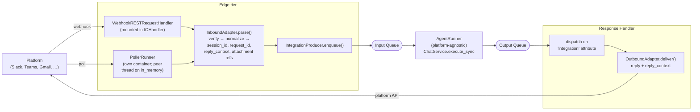

# #524: Pluggable request/response adapter for messaging integrations

Introduce an `integration/adapter/` seam — `InboundAdapter` + `OutboundAdapter` ABCs behind one
factory — so the seven messaging integrations stop running the agent inside their webhook handler
and instead travel the `agentkernel.pipeline` queue. The inbound adapter verifies and parses a
platform event into a normalized envelope (resolving `session_id` and `request_id` at the edge)
and enqueues; the Agent Runner stays platform-agnostic; the outbound adapter delivers the reply
through the platform API. The one design idea: **a platform integration is two pure translation
functions with a queue between them.**

§14 and §15 cover two further consumers of the same pieces — conversation-thread recording and the
AG-UI surface. Neither works on the queue pipeline today, and neither is a messaging platform, so
both travel the pipeline's own producer/queue/runner seam rather than the adapter seam. §15 adds the
one piece §14 did not need: a **return path** for a caller who is still holding the connection when
the reply is produced somewhere else.

## Motivation

- **The agent runs inside the webhook turn on all seven platforms**, so a slow LLM call becomes a
  platform-level delivery timeout and a redelivered event.
  - Inline `ChatService.execute` at `slack_chat.py:163`, `whatsapp_chat.py:293`,
    `messenger_chat.py:223`, `instagram_chat.py:242`, `telegram_chat.py:217`,
    `teams_chat.py:259`, and `gmail_chat.py:437` (poll loop).
  - Two integrations already hand-roll an escape: Telegram defers to `BackgroundTasks`
    (`telegram_chat.py:52`), Teams captures a `ConversationReference` and re-enters via
    `continue_conversation`, commented as avoiding "the Bot Framework delivery timeout"
    (`teams_chat.py:54-56`). Both are per-platform reinventions of a queue hop.
- **The only shared contract is `RESTRequestHandler.get_router()`** (`api/handler.py:16-18`), and
  Gmail does not even implement that — `AgentGmailRequestHandler` is a plain class with
  `start_polling` (`gmail_chat.py:24`, `:123`). There is no seam for parsing, session derivation,
  or delivery, so the logic is duplicated seven ways and drifts.
  - Seven private `_send_message`/`_send_reply` implementations; two separate `_split_reply`
    chunkers (`slack_chat.py:201`, `teams_chat.py:542`); seven inline `session_id` rules.
- **No adapter package exists.** `integration/adapter/` contains only a stale `__pycache__` from
  an abandoned branch; there are no `.py` sources.
- **The Agent Runner would drop reply-to context.** `_FORWARDED_ATTRIBUTES` is
  `(request_id, user_id, endpoint_url)` (`pipeline/agent_runner.py:17`), applied as a filter at
  `:125`, so any integration attribute is discarded on the runner hop.
- **The Response Handler cannot route per message.** `process()` branches only on the global
  `execution.mode` (`pipeline/response_handler.py:51-66`).
- **The enqueue seam is unusable from outside.** `RestHandler._enqueue_request` is private, takes
  no extra attributes, and its callers always mint a fresh `uuid4`
  (`pipeline/request_handler.py:60-72`, `:134`) — so a webhook retry cannot dedupe against the
  platform's own id.
- **Attachments cannot ride the queue inline.** All seven base64-inline downloaded media (e.g.
  `whatsapp_chat.py:211`), bounded only by `api.max_file_size`, which far exceeds SQS's 256 KB
  message cap. `AgentRequestAttachmentRef` (`core/model.py:73`) plus
  `ConversationThreadManager.store_attachments` (`integration/thread/manager.py:144-206`) already
  solve exactly this on the thread path.
- **STREAM mode is global.** `IOHandler` selects `StreamAgentRunner` once from `execution.mode`
  (`pipeline/io_handler.py:112`), so an app with streaming on would fan out per-token messages
  for integration traffic that has no streaming consumer.
- **No host for a poller.** `IOHandler.run` builds a fixed three-task list (`io_handler.py:94-119`)
  with no seam for a fourth peer thread.
- **Mounting an integration today disables the pipeline.** `RESTAPI.run` delegates to `IOHandler`
  only when `handlers is None` (`api/http.py:99-106`), and every integration example passes
  explicit handlers (`examples/api/slack/server.py:16`). Integration apps therefore boot a bare
  FastAPI with no queue at all.

> Two items the issue lists under "what is left" are **already delivered** and are not in scope:
> `_TeamsConfig` exists (`core/config.py:203-216`, wired at `:843`), and `IOHandler.run` already
> mounts app-supplied handlers alongside its own (`io_handler.py:73`). Both were re-verified on
> this branch; the issue's line numbers for them are stale.

## Design shape



## Requirements

### 1. Adapter package and abstractions

- New package `ak-py/src/agentkernel/integration/adapter/` with `base.py` (ABCs + the normalized
  envelope) and `factory.py`.
- `InboundAdapter` ABC — the platform → AK direction. Abstract surface:
  - `name` (class attribute): the adapter short name; also the value stamped as the routing
    attribute and the key the outbound adapter is resolved by.
  - `verify(raw) -> None`: **concrete on the base, defaulting to a no-op**; raises to reject.
    Overridden by the four platforms whose verification is separable — WhatsApp
    (`whatsapp_chat.py:131`), Messenger (`:125`), Instagram (`:133`) and Telegram (`:57-61`).
    Slack and Teams inherit the default because their SDKs verify inside their own dispatch
    (Bolt's `handle`, `BotFrameworkAdapter.process_activity`), and Gmail has nothing to verify.
    Where it is overridden it must run **before** parsing and before enqueue. (Decision Q4.)
  - `parse(raw) -> InboundParseResult`: normalize one platform delivery. The result carries a
    **list** of `InboundRequest` (one platform delivery can carry several messages — WhatsApp,
    Messenger and Instagram all iterate `entry` x `messaging`/`messages`) plus the optional
    platform-expected HTTP response the platform SDK produced during parsing (Slack's Bolt
    `handle()` and Teams' `process_activity` both own their response, including Slack's
    `url_verification` challenge). An empty list means the delivery is legitimately ignored
    (bot's own message, non-message activity, echo), so "ignore" is not an exception.
    *(Revised while writing `spec.md`: the original single-`Optional` return dropped batched
    Meta deliveries and had nowhere to carry an SDK-owned response — re-review.)*
  - `source` (class attribute): `WEBHOOK` or `POLLER` — decides how the adapter is hosted.
- `OutboundAdapter` ABC — the AK → platform direction. Abstract surface:
  - `deliver(reply: AgentReply, reply_context: Dict[str, str]) -> None`: send the agent reply.
  - `deliver_error(message: str, reply_context: Dict[str, str]) -> None`: user-facing failure
    text; called on permanent failure so a user is never left silent.
  - `acknowledge(reply_context) -> Dict[str, str]` (optional, default no-op): the edge-side ack
    (Slack's "thinking" message, typing indicators, read receipts). Its **return value is merged
    into `reply_context`**, which is what carries Slack's ack-message `ts` to the outbound side.
  - `split_reply(text) -> list` (concrete on the base, overridable): one shared chunker replacing
    the two current copies.
- `InboundRequest` — the normalized envelope returned by `parse`. Fields, all required unless
  noted:
  - `session_id: str` — resolved at the edge; doubles as the queue `group_id` (FIFO ordering key).
  - `request_id: str` — the platform's own idempotency id where one exists; doubles as `dedup_id`.
  - `requests: List[AgentRequest]` — the prebuilt request list passed to `ChatService` as
    `requests=`, exactly as the integrations build today.
  - `prompt: str`, `agent: Optional[str]`, `user_id: Optional[str]`, `group_id: Optional[str]`.
  - `reply_context: Dict[str, str]` — flat, string-valued delivery coordinates.
- `IntegrationAdapterFactory` follows the house factory pattern (`core/util/factory.py`):
  built-in short names resolved by `if/elif` + real imports guarded by `require_extra`, any other
  value treated as a dotted path via `resolve_dotted(..., base=InboundAdapter)`, unknown →
  `AKConfigError`. Same shape as `QueueTransportFactory` (`pipeline/transport/base.py:90-196`).
  - Built-in names: `slack`, `whatsapp`, `messenger`, `instagram`, `telegram`, `teams`, `gmail`.
  - **Only the outbound half resolves by name.** Inbound adapters are constructed by the
    application (Decision Q1), so nothing needs to look one up; the Response Handler holds only
    the `integration` attribute string and must map it to a class. (Decision Q1.)

### 2. Inbound edge behaviour

- Where `verify` is overridden (§1), it runs synchronously in the HTTP request context and
  rejects with the platform's expected status before any work: 401/403 per platform, matching
  today's behaviour (`telegram_chat.py:57-61`, the Meta HMAC checks). Where it is not, the
  platform SDK rejects inside `parse`'s dispatch with the same status
  (`teams_chat.py:118-121`).
- After a successful enqueue the webhook route returns its platform-expected success response
  **immediately** — it must not await the agent run. Target: webhook handler p99 under 1 s
  excluding attachment download.
- `parse` returning an empty request list results in a success response and no enqueue.
- The adapter never calls `ChatService`, `AgentService`, or `Runtime`.
- `session_id` **keeps each platform's current bare key** (`thread_ts`, `from_number`,
  `sender_id`, `chat_id`, `conversation.id`, `thread_id`) — as derived today at
  `slack_chat.py:81`, `whatsapp_chat.py:278`, `messenger_chat.py:193`, `instagram_chat.py:211`,
  `telegram_chat.py:183`, `teams_chat.py:254`, `gmail_chat.py:267`. Cross-platform namespacing is
  out of scope (Non-goals).
- `request_id` prefers the platform id so a platform retry dedupes instead of double-running:
  WhatsApp `message.id`, Messenger/Instagram `message.mid`, Telegram `update_id`, Teams
  `activity.id`, Gmail `message_id`.
  - **Slack has no usable id at the handler** — Bolt hands over the inner event, not the envelope
    (`slack_chat.py:48-50`). Slack's adapter must synthesise `f"slack:{channel}:{ts}"`, which is
    unique per message.
  - **Telegram's `update_id` is currently discarded**: `_handle_message` receives `body["message"]`
    (`telegram_chat.py:79`). The adapter must parse the whole update object.

### 3. Queue contract

- One new attribute constant in `pipeline/envelope.py`: `ATTR_INTEGRATION = "integration"`,
  carrying the adapter `name`. Its presence is what marks a message as integration traffic.
- `reply_context` travels as flat attributes, each key stamped with the reserved prefix
  **`reply_`** — SQS-attribute-name-safe and consistent with the existing bare names
  (`request_id`, `user_id`, `endpoint_url`, `status_code`). (Decision Q3.) Rationale:
  - `QueueMessage.attributes: Dict[str, str]` is already mapped to native metadata by every
    transport — SQS `MessageAttributes` (`transport/sqs.py:240-259`), Kafka headers (`kafka.py:329`),
    NATS headers (`nats.py:257`) — so no transport work is needed.
  - Attributes, not the body: `BaseRunRequest` is `extra="allow"` and `RequestBuilder` turns any
    unknown body field into an `AgentRequestAny` context entry (`core/chat_service.py:126-146`).
    Reply-to coordinates in the body would be fed to the agent as context.
- Teams' `ConversationReference` is carried as **one JSON-encoded attribute value** — it is an
  object rather than a string (`TurnContext.get_conversation_reference`, `teams_chat.py:173`).
  Every other platform's reply context is natively flat strings.
- **Budget: 8 KB** total serialized reply context, enforced in the producer and raised as a
  `ValueError` naming the offending adapter — not left to fail inside the transport client.
  Measured contexts: Slack ~100 B, WhatsApp ~80 B, Gmail a few hundred (subject dominates), Teams
  ~0.5–2 KB (the serialized `ConversationReference`). So the budget is 4–80x headroom, and sits
  far below SQS's 256 KB body+attributes ceiling. (Decision Q3.)
- `group_id = session_id` (per-conversation FIFO ordering) and `dedup_id = request_id`.

### 4. Reusable enqueue seam

- Promote enqueue to a public, reusable seam that accepts a caller-supplied `request_id` and
  extra attributes, replacing `RestHandler._enqueue_request`'s private, uuid-minting form
  (`pipeline/request_handler.py:60-72`).
- The existing REST call sites keep their current behaviour bit-for-bit: body via
  `model_dump(exclude_none=True)`, `attributes={ATTR_REQUEST_ID: ...}`, `group_id=session_id`,
  `dedup_id=request_id`.
- Whether this is a new `pipeline` producer class or a widened method on `RestHandler` is an
  implementation choice for `spec.md`; the requirement is that it is public, takes
  `(body, request_id, attributes)`, and is used by both REST and integration producers.

### 5. Agent Runner changes

- Integration attributes must survive the runner hop. `_FORWARDED_ATTRIBUTES`
  (`pipeline/agent_runner.py:17`) is extended to forward `ATTR_INTEGRATION` plus every
  `reply_`-prefixed attribute; the existing three continue to be forwarded unchanged.
- The Agent Runner gains **no** platform knowledge — it neither reads nor interprets
  `reply_context`; it copies it.
- **STREAM never applies to integration traffic**: a message carrying `ATTR_INTEGRATION` is
  executed by the non-streaming path even when `execution.mode == stream`, so
  `StreamAgentRunner` does not fan out per-token messages to a platform with no streaming
  consumer.

### 6. Response Handler dispatch

- `ResponseHandler.process` dispatches on `ATTR_INTEGRATION` **before** the existing
  `execution.mode` branch (`pipeline/response_handler.py:51-66`); a message without the attribute
  takes today's path unchanged.
- Integration dispatch resolves the outbound adapter by name through the factory and calls
  `deliver(reply, reply_context)`.
- `on_permanent_failure` calls `deliver_error(...)` for integration messages so a user gets a
  failure message instead of silence, matching the existing "clients never hang" guarantee
  (`response_handler.py:68-108`).
- Delivery failures propagate so `ConsumerLoop` retries up to `max_receive_count` and then hands
  over to `on_permanent_failure` — the same contract `_broadcast` documents (`:159-166`).

### 7. Hosting and topology

- **Webhook adapters** are hosted by `WebhookRESTRequestHandler`, a generic `RESTRequestHandler`
  that mounts the adapter's route(s), verifies, parses, and enqueues (Decision Q7 — it joins the
  `AgentRESTRequestHandler` / `ThreadRESTRequestHandler` / `ScheduleRESTRequestHandler` family).
  Per-platform handler classes are no longer needed for routing.
  - No `IOHandler` change is required for webhooks: `run(handlers=[...])` already mounts app
    handlers alongside the pipeline's own `RequestHandler()` (`io_handler.py:73`).
- **The application constructs the adapter explicitly** (Decision Q1):
  `IOHandler.run(handlers=[WebhookRESTRequestHandler(SlackInboundAdapter())])`.
- **The seven `Agent<Platform>RequestHandler` classes are deleted outright** (Decision Q8) — no
  shim, no deprecation window. Their platform logic moves into the adapters, so each
  `integration/<platform>/<platform>_chat.py` is **removed** and replaced by
  `integration/<platform>/adapter.py`; the public aliases (`agentkernel.slack`, …) export the
  adapter pair instead. An un-migrated app fails at import.
- **Mounting an adapter host outside a pipeline topology is a fail-fast** (Decision Q2). Without
  it the failure is silent and worse than a crash: `QueueTransportFactory.resolve_type()` returns
  `in_memory` when no block is declared (`transport/base.py:101`), so `RESTAPI.run` would enqueue
  successfully into a queue no runner drains — the platform gets its HTTP 200 and the user never
  gets a reply.
  - Mechanism (Decision Q9): `RESTRequestHandler` gains a class attribute
    `requires_pipeline: bool = False`; `WebhookRESTRequestHandler` sets it `True`; `RESTAPI.run`
    raises `AKConfigError` when any handler declares it, **after** the existing delegation branch
    (`api/http.py:99-106`) so the no-handlers path is untouched. No global state, no context var,
    and `IOHandler` needs no change — a handler declares its own requirement rather than `api/`
    learning what an integration is.
  - This also correctly rejects an adapter host mounted on the legacy `AWSRestAPI`/`ECSIOHandler`
    surfaces, which §13 puts out of scope.
- **Poller adapters** (Gmail) get **their own container entry point**, `PollerRunner`, mirroring
  `AgentRunner` exactly (Decisions Q5, Q7): `run()` rejects the `in_memory` transport and names the co-hosted
  topology, and `IOHandler` runs the poller as a `ThreadRunner.Task` peer thread **only** on
  `in_memory` — the same branch that already co-hosts the agent runner (`io_handler.py:111-117`).
  - Rationale: as an unconditional `IOHandler` peer thread, scaling the webhook tier for Slack
    load would silently multiply Gmail pollers. Poller lifetime must not be coupled to webhook
    replica count.
  - Run at **one replica**. Duplicate polling is not a correctness failure — `dedup_id` is
    the platform message id, and every transport deduplicates on it (SQS natively, NATS via
    `Nats-Msg-Id`, Kafka via `BookkeepingStore.claim_dedup`, in-memory via a window) — so a second
    poller wastes API quota rather than double-running the agent.
  - The poller loop must observe `ThreadRunner.shutdown_event` once per iteration so it can be
    marked `graceful=True` without hanging the drain.
  - A poller produces into the input queue only; it never delivers replies (that stays with the
    Response Handler's outbound dispatch).
- **Mounting changes for applications.** Integration apps must move from
  `RESTAPI.run([AgentSlackRequestHandler()])` to `IOHandler.run(handlers=[...])`, because explicit
  handlers disable `RESTAPI.run`'s pipeline delegation (`api/http.py:99-106`). All seven examples
  under `examples/api/` and the seven pages under `docs/docs/integrations/` must be updated.
- Both broker and `in_memory` transports must work. On `in_memory` the whole path runs in the
  single-process topology, which is what local development and the existing integration tests use.

### 8. Attachments

- Attachments are **offloaded to the `AttachmentStore` at the inbound edge** and travel as
  `AgentRequestAttachmentRef` (`core/model.py:73`), never as inline base64.
- Reuse the thread path's mechanism rather than reimplementing it —
  `ConversationThreadManager.store_attachments` (`integration/thread/manager.py:144-206`) already
  does exactly this rewrite; the shared piece is extracted or called directly.
- Two guards carried over verbatim from that path:
  - Attachment-bearing messages require `multimodal.enabled: true`; otherwise reject with an
    actionable error (`manager.py:165-173`).
  - `multimodal.storage_type: session_cache` is rejected — it writes into a session copy the
    runner process never sees (`manager.py:174-181`).
- Attachment download stays at the edge (it needs the platform token) and stays bounded by
  `api.max_file_size`.

### 9. Configuration

- Adapters are selected per platform under the platform's existing config block (`slack`,
  `whatsapp`, …), so no new top-level section is introduced and existing YAML/env vars keep
  working.
- Each block gains an optional **outbound** adapter override (dotted path). Absent → the
  built-in outbound adapter for that platform. There is deliberately no inbound override: the
  application constructs the inbound adapter itself (Decision Q1), so bring-your-own inbound is
  just passing a different instance.
- Existing per-platform fields (`agent`, `agent_acknowledgement`, tokens, secrets) are unchanged
  in name, type, and default.

### 10. Per-platform adapters

- All seven ship in this change: Slack, WhatsApp, Messenger, Instagram, Telegram, Teams, Gmail
  (Gmail as the poller).
- Each adapter preserves its platform's current user-visible behaviour: acknowledgement messages,
  typing indicators, read receipts, reply-threading, audio/video rejection, oversized-file
  rejection, and download-failure messages. Each is preserved per platform rather than collapsed
  to a common subset.
- Teams' existing `continue_conversation` proactive delivery becomes the outbound adapter
  (`teams_chat.py:173-196`); Telegram's `BackgroundTasks` deferral is removed as redundant.
- The existing `Agent<Platform>RequestHandler` classes are **deleted** (Decision Q8), along with
  the `<platform>_chat.py` modules that hold them. The public aliases (`agentkernel.slack`, …)
  keep working but export the per-platform adapter pair instead. This is a breaking change for
  every existing integration app, accepted deliberately: the mounting call has to change anyway
  (§7), so a shim would only soften the first error, not remove the migration.

### 11. Errors and observability

- Verification failure → platform-expected rejection status, no enqueue, warning log.
- Enqueue failure → 5xx to the platform so it retries; nothing is acknowledged to the user.
- Unknown adapter name / unimportable dotted path → `AKConfigError` at construction, not at first
  request.
- Missing optional dependency for a built-in adapter → `ImportError` naming the extra, via
  `require_extra` (`core/util/factory.py:49-64`).
- A reply arriving with no matching outbound adapter → error log naming the `integration`
  attribute value; the message must not silently disappear.
- Mounting an adapter host outside a pipeline topology → `AKConfigError` raised by
  `RESTAPI.run` on the `requires_pipeline` marker, before the app is built (Decisions Q2, Q9).
  *(Revised while writing `spec.md`: this bullet said "at `get_router()`", which contradicts
  Q9's chosen mechanism — re-review.)*
- `reply_context` exceeding 8 KB serialized → `ValueError` at enqueue naming the adapter
  (Decision Q3).
- Logs on both hops carry `integration`, `session_id`, and `request_id`.
- **Credentials reach two processes** (Decision Q6, accepted): the edge holds the platform's
  verification secret *and* its send token — the token is required there for attachment download
  (§8) and for the edge acknowledgement — and the Response Handler holds the send token for
  `deliver`. Dropping edge acknowledgements would not narrow this, since attachment offload
  already forces the token onto the edge. Deployment note, not a code change.

### 12. Testing

- A reusable `IntegrationAdapterContract` suite (the `QueueTransportContract` /
  `SandboxProviderContract` pattern, `pipeline/testing.py`) that every built-in and BYO adapter
  is run against: verify-rejects, parse-ignores-returns-None, session/request id resolution,
  reply-context round-trip through the queue.
- Round-trip tests over the `in_memory` transport: platform event in → agent runs → outbound
  adapter called with the right reply context.
- Per-platform parse/deliver tests for all seven. **Messenger, Instagram, and Telegram have no
  test file in `ak-py/tests/` today** and need new ones, not edits.
- Pipeline-side tests updated for the new attribute forwarding and the dispatch branch:
  `test_pipeline_agent_runner.py`, `test_pipeline_response_handler.py`,
  `test_pipeline_request_handler.py`, `test_pipeline_io_handler.py`.
- Existing `test_slack_integration.py`, `test_whatsapp_integration.py`,
  `test_teams_integration.py`, `test_gmail_integration.py` are **rewritten, not edited**: their
  subject class is deleted (Decision Q8), and they drive it directly — e.g. all ten Slack tests
  call `handler.handle(...)` and patch `handler._chat_service`
  (`test_slack_integration.py:57`, `:71-196`). Both anchors disappear.
- A test that `RESTAPI.run` rejects a `requires_pipeline` handler, and that the no-handlers
  delegation path (`api/http.py:99-106`) still reaches `IOHandler` unchanged (Decision Q9).
- For §15, a new `test_agui_pipeline.py`: the marker stamped only by the queue-mode handler, the
  session stored before the enqueue, the enqueue happening before any event is yielded, a store
  error chunk becoming exactly one `RunError`, `{"agui_state": …}` becoming a `StateSnapshotEvent`
  and its absence yielding none, `AgentRunner` streaming an `ATTR_AGUI` message under
  `mode: rest_sync`, the `ATTR_USER_ID` guard not applying to it, and construction failing on a
  non-chunk-streaming response store.
- For §15.4, the chunk-streaming half of the response-store contract run against `in_memory`,
  `redis` and `valkey` (fakes), plus a `dynamodb` case asserting it still declines: in-order
  delivery, stop at `done`, `close_stream` releasing a parked reader, and a timeout raising
  `TimeoutError`.
- For §14, a new `test_thread_pipeline_recording.py`: the marker stamped only by
  `ThreadRequestHandler`, the user message and attachment offload committed before enqueue, the
  rejections (missing `user_id`, unavailable agent) leaving no phantom thread, deferred requests
  unmarked, `AgentRunner`/`StreamAgentRunner` appending only for a marked message and only after
  the output send, a thread-store failure never retrying the run,
  `IOHandler.run(request_handler=...)` replacing rather than joining the chat route, and an
  end-to-end read-back through the thread routes.

### 13. Compatibility

- **This is a breaking change for messaging-integration applications** (Decision Q8), and the
  only one in this CR: the seven handler classes and their `<platform>_chat.py` modules are
  removed, and the mounting call changes (§7). Both edits land in the same file in a user's app.
  Everything else below is unchanged.
- The pipeline's existing REST/WebSocket paths are unchanged for messages without
  `ATTR_INTEGRATION`.
- Non-integration surfaces are untouched: `RESTAPI.run`'s delegation rule keeps its three
  conditions, and the new `requires_pipeline` check sits after it, so no existing handler is
  affected (its default is `False`).
- No transport change; no new queue; no change to `QueueMessage`'s shape beyond three new attribute
  constants (`integration`, `thread` for §14, and `agui` for §15).
- §14 is **additive**: `AgentThreadRequestHandler` and its direct path are unchanged, and a
  pipeline app that mounts nothing new behaves exactly as before.
- §15 is **additive**: `AGUIRequestHandler` and its direct SSE path are unchanged and stay the
  documented default; `agui` config keeps every field, name, type and default. The new
  `add_chunk`/`stream`/`close_stream` methods on the redis and valkey stores are additions to an
  optional capability the base class already declares (`response_store/base.py:54-72`), so a
  bring-your-own store is unaffected and existing `execution.response_store` YAML keeps working.
  The one visible change outside AG-UI is that `POST /api/v1/chat` in STREAM mode now serves SSE on
  redis/valkey instead of answering HTTP 400 (§15.4) — strictly more working than before.
- Legacy ECS/serverless runners (`ECSAgentRunner`, `ECSOutputConsumer`, `ServerlessAgentRunner`)
  are untouched — they inherit the seam through #495's recorded "ECS runtime classes become
  pipeline instantiations" follow-up (`docs/specs/495-onprem-kubernetes/plan.md:318`).

### 14. Conversation-thread recording on the pipeline

Threads are **not** a messaging platform and do not use the adapter seam (§1). They are recorded
here because they are the second consumer of the pieces this CR builds — a marker attribute (§3), a
prebuilt `requests` list on the body (§4), edge-side attachment offload (§8), and the
`requires_pipeline` marker (§7) — and because moving integrations onto the queue makes the queue the
normal way to run chat, which is the topology where threads currently do not work at all.

**The gap.** `grep -r 'ThreadRecorder\|ConversationThreadManager' ak-py/src/agentkernel/pipeline/`
returns nothing. `IOHandler.run` always mounts `RequestHandler` (`io_handler.py:91`), which enqueues
and returns, so thread support works only on the direct path,
`RESTAPI.run([AgentThreadRequestHandler()])`. An application that adopts queue mode silently loses
thread history — no error, no warning. The previously documented position ("thread recording does
not apply to queue-mode/deployment adapters") described that gap; it was never a design constraint.

**Why not the adapter seam.** Considered and rejected — the seam is for surfaces whose reply leaves
out-of-band over a platform API, and threads are a caller-waits surface:

| Seam contract | Threads |
|---|---|
| `InboundAdapter`'s side effects are limited to platform calls and attachment storage (§1) | Recording writes thread rows — outside the contract |
| `OutboundAdapter.deliver(reply, reply_context)` pushes out-of-band; `reply_context` is flat strings under 8 KB (§3) | The caller waits on the open connection; the reply returns through the response store |
| `parse(raw) -> InboundParseResult` | Redundant — `RequestHandler.run_chat` already normalizes a chat body |
| — | `ThreadRESTRequestHandler`'s GET routes have no delivery at all |

The seam that fits is the one already in the pipeline: **producer → queue → runner**.

**Shape.** The existing `ThreadRecorder` bracket splits across the queue, because the run already
does:

```
POST /api/v1/chat
   │
   ▼  ThreadRequestHandler  (IOHandler process)
   ├─ ensure_agent_available          ─┐
   ├─ RequestBuilder                   │  everything that must commit before the
   ├─ pre_run: offload attachments,    │  caller can be told the request was accepted
   │           open thread, append     │
   │           the user message       ─┘
   ├─ body.requests = rebuilt list; body.files/images = None
   └─ enqueue with attribute  thread=1
   │
   ▼  input queue
   │
   ▼  AgentRunner  (may be a different process)
   ├─ ChatService.process_chat_request(req=body, requests=body.requests)
   ├─ _send_to_output(...)             ← the reply is safe first
   └─ post_run: append the assistant message
```

- **14.1 A `thread` message attribute is the join.** `ATTR_THREAD` in `pipeline/envelope.py`,
  stamped only by `ThreadRequestHandler`. Without it the runner records nothing, so a request
  enqueued by any other producer — the plain `RequestHandler`, a schedule provider, a messaging
  integration — never grows a thread nobody opened. Same shape as `ATTR_INTEGRATION` (§3), and it
  is what keeps the "integrations never record threads" non-goal true by construction rather than
  by convention.
- **14.2 Recording runs after `_send_to_output`, not before** (Decision Q10). Recording first
  duplicates the assistant message whenever the send then fails and the message is redelivered.
  This order instead risks losing a recording if the process dies in between — the safer direction,
  since the caller still got its answer.
- **14.3 Recording failures are logged, never raised.** The reply is already delivered, so a failing
  thread store must not retry the message and run the agent a second time to fix bookkeeping.
- **14.4 Attachments are offloaded at the edge** and the originals cleared from the body — the same
  rule and the same shared helper as §8. `pre_run` stores the bytes and substitutes
  `AgentRequestAttachmentRef`; `BaseRunRequest.requests` (§4) carries that list over the queue.
  Leaving `files`/`images` on the body would send every attachment through the broker a second
  time, into its message-size limit, for a field the runner ignores once `requests` is set.
- **14.5 `ThreadRequestHandler` replaces the pipeline's chat route; it does not join it**
  (Decision Q11). New `IOHandler.run(request_handler=...)` parameter. Both handlers own
  `POST /api/v1/chat`, so mounting the thread handler through `handlers=[...]` — the way §7 mounts
  a webhook host — would leave FastAPI serving whichever registered first, silently unrecorded.
- **14.6 `RequestHandler` declares `requires_pipeline`** (inherited by `ThreadRequestHandler`),
  reusing the §7/Q9 marker. It is a queue producer: on a bare `RESTAPI.run([...])` app it would
  enqueue into a queue no runner drains while the caller waits out its response-store budget —
  exactly the silent failure Q2 rejects. `RestHandler` does not declare it, so
  `ECSQueueRequestHandler` and the legacy ECS surfaces (§13) are unaffected.
- **14.7 Deferred requests are unmarked.** A `schedule` block registers a task instead of running
  it, so there is no exchange to record, and the 202 acknowledgement must never appear in a thread
  as something the agent said. Matches `AgentThreadRequestHandler`, which checks `req.schedule`
  before `pre_run`. Occurrences reach the queue from the schedule provider, which stamps no marker.
- **14.8 Streaming accumulates in `StreamAgentRunner`.** Chunks fan out as separate output
  messages, so the runner's own loop is the only place the reply exists as one thing. A halted
  stream (error chunk) or an empty one records nothing — the rule `_stream_with_recording` already
  applies on the direct path.
- **14.9 The thread package is imported lazily inside the runner method**, the same rule §6's
  outbound dispatch follows: threads are an `integration` capability, and a module-scope import
  would make every runner process pay for the thread stores.

**Behaviour differences from the direct handler**, accepted:

- **Both processes need the `thread` block.** The API process opens the thread; the runner appends
  the reply. A runner without it warns naming the missing block and drops the reply, rather than
  failing the run.
- **A loss window.** A crash between the output send and the append loses one assistant message.
  The direct handler has no such window because it does both inline.
- **Error shapes follow the pipeline surface** (`HTTPException(400, {"error", "session_id"})`),
  not `ResponseBuilder`, since this is a `RequestHandler` subclass.

**Not in scope here:** migrating `AgentThreadRequestHandler` (it stays the direct-execution
handler); thread recording for integrations or scheduled occurrences (both remain non-goals below);
and store-level deduplication of a redelivered append — 14.2's ordering makes that window
vanishingly small and a dedup would touch all six thread backends.

### 15. AG-UI on the pipeline

AG-UI is the **third** consumer of the pieces this CR builds, and the second caller-waits one. It
does not use the adapter seam (§1), for the reasons §14 gives for threads (Decision Q12) — it reuses
a marker attribute (§3), the public enqueue seam (§4), and the pipeline's own
producer → queue → runner. What it needs that threads did not is a **return path**: the caller is
still holding an SSE connection when the reply is produced in another process.

**The gap.** `AGUIRequestHandler._run` hands back `StreamingResponse(self._events(...))`, and
`_events` runs `handler.run_stream_async(...)` — the agent, its tools and the model — inside the
still-open HTTP request (`integration/agui/handler.py:213-285`). A slow model holds a connection,
and the run cannot be retried or scaled apart from the web tier: the identical problem the seven
platforms and §14 are moved off. AG-UI touches no pipeline component today —
`grep -rn 'response_store\|pipeline' integration/agui/` returns nothing.

**Why not the adapter seam.** Same table as §14, one row different — and that row is why §15 needs
work §14 did not:

| Seam contract | AG-UI |
|---|---|
| `OutboundAdapter.deliver(reply, reply_context)` pushes out-of-band once, with a finished `AgentReply` | The reply is *n* events (`RunStarted`, token deltas, tool calls, `StateSnapshot`, `RunFinished`) down a socket the caller still holds |
| `reply_context` is flat `Dict[str, str]` under 8 KB (§3), enforced in `IntegrationProducer._reply_attributes` (`integration/adapter/producer.py:61-67`) | The delivery address is a file descriptor owned by a live task in one process — not serialisable at any size |
| `ATTR_INTEGRATION` routes a message *away* from streaming (§5) | AG-UI rejects any agent whose runner cannot stream (`handler.py:_resolve_agent`, 400) |

**Shape.** The direction inverts: a messaging adapter *pushes* from the runner; AG-UI *pulls* into
the process that never let go of the socket. `request_id` is a string, so it fits a queue
attribute where a socket does not.

```
POST /agui/{agent}
   │
   ▼  AGUIPipelineRequestHandler   (IOHandler process — keeps the socket)
   ├─ authorise · resolve agent · parse · to_requests   (shared with the direct handler)
   ├─ set_agui_session_keys, then sessions().store(session)   ← the runner reads it there
   ├─ enqueue(body{requests}, request_id, attributes={agui: "1"}, group_id=thread_id)
   └─ return StreamingResponse(_events(request_id))
   │
   ▼  input queue
   │
   ▼  AgentRunner  (different process; streams on the marker, whatever execution.mode says)
   ├─ per chunk → _send_to_output(chunk)
   └─ state changed during the run → one extra chunk {"agui_state": {...}}
   │
   ▼  output queue
   │
   ▼  ResponseHandler → store.add_chunk(request_id, chunk)
   │
   ▼  back on the socket: _events drains store.stream(request_id) → AGUIMapper → encoder
```

- **15.1 An `agui` message attribute is the join.** `ATTR_AGUI` in `pipeline/envelope.py`, stamped
  only by the queue-mode AG-UI handler. Same shape as `ATTR_INTEGRATION` (§3) and `ATTR_THREAD`
  (§14.1), and it carries three separable facts no existing marker carries: run the streaming path,
  deliver chunks to the response store, and compute the AG-UI state snapshot. (Decision Q14.)
- **15.2 The runner streams on the marker, regardless of `execution.mode`.** `IOHandler` selects
  `StreamAgentRunner` only when `mode == stream` (`pipeline/io_handler.py:130`), so an app whose
  mode is the default `rest_sync` would otherwise run an AG-UI message through
  `process_chat_request` and produce one non-streamed reply. `AgentRunner.process` therefore routes
  an `ATTR_AGUI` message to the shared streaming implementation. (Decision Q15.)
  - The `ATTR_USER_ID` guard in the streaming path (`agent_runner.py:218-219`) is the
    WebSocket-entered marker and must not apply: AG-UI chunks go to the store, never to a socket
    the gateway owns. AG-UI stamps no `ATTR_USER_ID`, for the same reason `IntegrationProducer`
    does not (`producer.py:29-33`); `user_id` travels in the body.
- **15.3 The Response Handler dispatches on `ATTR_AGUI` before the `execution.mode` branch**
  (`pipeline/response_handler.py:52-72`), writing each chunk with `store.add_chunk`. A message
  without the attribute takes today's path unchanged.
  - `on_permanent_failure` writes one error chunk (`done=True`) so the edge can close the run with
    exactly one `RunError` — the protocol's terminal event, so no client hangs.
- **15.4 Chunk streaming becomes a shared-store capability.** `supports_chunk_streaming()` is
  `True` in exactly one implementation today (`response_store/in_memory.py:29`) and defaults `False`
  on the base (`base.py:54`); `ResponseStoreFactory` *requires* a shared store on a broker
  transport (`factory.py:38-42`). So the two properties AG-UI needs — chunk streaming and
  cross-process visibility — exist in different stores and in no single one.
  - `redis` and `valkey` implement `add_chunk` / `stream` / `close_stream` and return `True`. A
    list per `request_id` with a blocking pop, not a Redis Stream: this is single-consumer,
    at-most-once and drop-on-close, so consumer groups buy nothing. (Decision Q17.)
  - One new method on the shared driver, `blpop`
    (`core/util/driver/redis_like.py`) — both backends inherit it, since the `valkey` client is a
    `redis-py` fork with an identical API (`redis_like.py:16-19`).
  - `dynamodb` stays a mailbox and keeps returning `False`: it has no blocking read, and polling it
    per chunk is the thing §15 exists to avoid. An AG-UI queue app configured with it fails fast
    (§15.7).
  - This also lifts `RequestHandler`'s existing `POST /api/v1/chat` SSE route
    (`request_handler.py:275-289`) onto broker transports, where it answers HTTP 400 today.
- **15.5 The runner owns the state comparison; the edge does not reload the session**
  (Decision Q18). Forced, not chosen: `SessionStore.load` returns the **process-local cached copy**
  when one exists (`core/session/redis.py:39-43`, and the same in every cached backend), so an
  edge-side `state_after` would compare the session the edge itself cached against its own snapshot
  and always conclude nothing changed. The runner holds one session lifecycle in one process, takes
  its own before/after, and emits one extra chunk `{"agui_state": {...}}` only when they differ.
  - The AG-UI state helper is imported **lazily inside the runner method**, the same rule §14.9
    follows for the thread package: AG-UI is an `integration` capability and a module-scope import
    would make every runner process pay for it.
  - The edge no longer needs `state_before` on the queue path at all; it maps the chunk to
    `StateSnapshotEvent`.
- **15.6 The edge must persist the session before enqueueing.** `set_agui_session_keys` writes
  `state`, `forwardedProps` and `context` onto the session object
  (`integration/agui/run_input.py:61-76`); today the same object is used by the run, so nothing is
  stored. Over the queue the runner loads the session in another process, so the edge calls
  `sessions().store(session)` — otherwise the client's inbound state silently never reaches the
  tools.
- **15.7 A chunk-streaming response store and a shared session store are both mandatory, and both
  are checked at construction.** `AGUIPipelineRequestHandler.__init__` raises `AKConfigError` —
  before the first request, the same fail-fast posture as Q2 — when either:
  - the resolved response store returns `False` from `supports_chunk_streaming()`, naming the
    configured store and the supported ones; or
  - the transport is a broker and `session.type` is the literal `in_memory`. That is the
    *accidental default* (`core/config.py:94-96`), and it silently costs the client's inbound
    `state`/`forwardedProps`: the runner loads a session the edge never shared. The same failure §8
    rejects `multimodal.storage_type: session_cache` for.
  - A dotted-path bring-your-own session store cannot be classified, so it is left to the
    deployer — the check names only what it can prove wrong.
- **15.8 A queue-mode sibling class, not a mode-aware handler** (Decision Q16).
  `AGUIPipelineRequestHandler` subclasses `AGUIRequestHandler`, reusing its routes, its authoriser
  contract, its 404/400 gates and its parse — mirroring `AgentThreadRequestHandler` /
  `ThreadRequestHandler` (Q11). It declares `requires_pipeline = True` (§7/Q9), so a bare
  `RESTAPI.run([...])` app crashes at boot instead of enqueueing into a queue no runner drains.
  - It mounts through `IOHandler.run(handlers=[...])`, **not** `request_handler=`: AG-UI owns
    `agui.prefix`, so unlike `ThreadRequestHandler` it collides with no pipeline route (§14.5). No
    `IOHandler` change is needed.
  - The edge half of `_run` is extracted so both handlers share it verbatim and cannot drift on the
    404/400 contract.
- **15.9 Behaviour differences from the direct handler**, accepted:
  - **The events arrive as a burst, not progressively.** `AgentHandler.run_stream_sync` collects
    every chunk before returning (`core/chat_service.py:255-271`), so `StreamAgentRunner` fans out a
    finished run. The client receives the same events in the same order and the bracket holds, but
    token-by-token liveness is lost. Making the runner incremental would also fix the existing
    broker STREAM/WebSocket path, so it is a separate CR, not a §15 requirement.
  - **A loss window.** If the API replica dies mid-run its socket dies with it and the remaining
    chunks sit in the store until TTL. AG-UI has no resume token, so the client must start a new
    run. The direct handler loses the run on the same failure, so this is not a regression — but it
    is now a two-process surface.
  - **`_warn_if_unreadable` runs at the edge** and so still works; the tools it warns about run in
    the runner.
- **15.10 Not in scope here:** migrating `AGUIRequestHandler` (it stays the direct-execution
  handler and the documented default); a `dynamodb` chunk-streaming implementation; incremental
  fan-out (above); and AG-UI thread recording, which stays out by construction because
  `ATTR_AGUI` is not `ATTR_THREAD` (§14.1).

## Non-goals

- Namespacing `session_id` across platforms to avoid collisions (e.g. a Telegram `chat_id`
  colliding with a WhatsApp `from_number`). Each platform keeps its bare key; namespacing is a
  separate CR.
- Touching `deployment/aws/*` runners — this change targets `agentkernel.pipeline` only.
- Streaming replies to messaging platforms.
- Adding new messaging platforms.
- Conversation-thread recording for **integrations** — the platforms own their history, and this is
  unchanged; the `thread` marker (§14.1) is what keeps integration traffic out of the recording
  path. §14 adds recording for *chat* traffic on the pipeline, which is a different surface.
- Outbound-initiated (agent-first) messaging; every flow here starts from an inbound event.
- Replacing the direct-execution `AgentThreadRequestHandler` or `AGUIRequestHandler`, neither of
  which is a messaging platform. §14 and §15 add queue-mode *siblings* to each; the existing
  direct handlers are untouched and remain the documented default.
  - The earlier form of this non-goal said AG-UI "has no queue hop to fix". That was wrong on its
    own terms: `AGUIRequestHandler._events` runs the agent inside the open SSE request
    (`integration/agui/handler.py:213-285`), which is the same shape §14 and the seven platforms
    are moved off. §15 corrects it.
- Truly incremental streaming through the queue. `AgentHandler.run_stream_sync` collects every
  chunk before returning (`core/chat_service.py:255-271`), so `StreamAgentRunner` fans out a
  completed run, not a live one — §15.9 accepts that and records the follow-up.
- Helm chart support for the poller tier. `PollerRunner.run(adapter)` ships as the container entry
  point and the topology is documented, but the `ak-k8s` poller Deployment and its `values.yaml`
  block are a follow-up CR.

## Decisions

Resolved with the requester, 2026-08-27. Each is reflected in the requirements above.

1. **Mounting API — adapters are explicit; the seven handler classes are removed** (window
   settled in Q8).
   `IOHandler.run(handlers=[WebhookRESTRequestHandler(SlackInboundAdapter())])`. Rejected: keeping
   the seven names over new bodies (advertises a per-platform specialisation that no longer
   exists, since the body is ~90% shared), and a single `IntegrationHandler("slack")` (breaks all
   seven public aliases for no gain over explicit adapters). Cost accepted: two new names in
   front of every user. See §1, §7, §10.
2. **Mounting outside the pipeline fails fast** with `AKConfigError`, rather than warning or
   silently enqueueing into an undrained queue. See §7, §11.
3. **`reply_context` uses the `reply_` prefix with an 8 KB serialized budget**, raised as a
   `ValueError` at enqueue naming the adapter. See §3.
4. **`verify` and `parse` stay separate, but `verify` is concrete on the base and defaults to a
   no-op.** Four platforms override it; Slack and Teams verify inside their SDK's dispatch and
   Gmail has nothing to verify, so none of the three writes an empty method. See §1.
5. **The poller is its own container at `replicas: 1`**, mirroring `AgentRunner`; `IOHandler`
   co-hosts it only on the `in_memory` transport. Rejected: an unconditional `IOHandler` peer
   thread (couples poller count to webhook scaling) and leader election (real machinery for a
   problem transport-level dedup already covers). See §7.
6. **Acknowledgements stay at the edge, and both processes hold platform send credentials.**
   Accepted as forced rather than chosen: attachment offload (§8) already requires the send token
   at the edge, so moving acknowledgements would cost the responsive UI and narrow nothing.
   See §11.

7. **Names follow each existing family.** `WebhookRESTRequestHandler` joins the
   `*RESTRequestHandler` siblings; `PollerRunner` joins `AgentRunner` as a pipeline `run()`
   entry point. Rejected: a symmetric `WebhookAdapterHandler`/`PollerAdapterHost` pair, which
   matches neither convention and introduces "Host" as a new noun. See §7.
8. **The seven handler classes are deleted in this CR — no shim, no deprecation window.** The
   `<platform>_chat.py` modules go with them. Context: the package is pre-1.0 (0.8.1), the
   codebase has no `DeprecationWarning` machinery at all, and Q2's fail-fast means an
   un-migrated app breaks either way — a shim would only improve the first error message.
   Accepted cost: an `ImportError` rather than a guided failure. See §7, §10.
9. **The fail-fast is a `requires_pipeline` marker on `RESTRequestHandler`, checked in
   `RESTAPI.run`.** Rejected: a module-level flag set by `IOHandler` (process-global state that
   leaks between tests, the `ThreadRunner.shutdown_event` hazard) and a context var (brittle
   coupling to `get_router()` running inside one specific call). See §7.

Taken during implementation, 2026-09-02, covering §14. Q12 was raised with the requester, who
directed the pipeline route; Q10 and Q11 are implementation calls recorded here for review.

10. **Thread recording happens after the reply reaches the output queue, not before.** The two
    orderings trade a duplicate against a loss: recording first duplicates the assistant message on
    any redelivered send, recording last loses one if the process dies in the gap. Losing a
    recording is the better failure, because the caller already has its answer and the thread is
    history rather than delivery. Rejected: a store-level dedup on `request_id`, which would touch
    all six thread backends to close a window this ordering already makes negligible. See §14.2.
11. **`ThreadRequestHandler` replaces the pipeline's chat route through a new
    `IOHandler.run(request_handler=...)` parameter**, rather than joining it via `handlers=[...]`.
    Both own `POST /api/v1/chat`; joining would leave FastAPI serving whichever registered first
    with no error, which is the same class of silent failure Q2 rejects. Rejected: making
    `RequestHandler` itself thread-aware behind a config check (puts an `integration` capability
    inside `pipeline`, against the coupling rule) and giving the thread handler a different chat
    path (breaks client parity with the direct handler). See §14.5.
12. **Threads do not use the adapter seam.** They are a caller-waits surface with no out-of-band
    delivery, so `OutboundAdapter` has no target and `InboundAdapter`'s side-effect contract
    excludes recording. The pipeline's own producer/runner seam is the fit. See §14.

Taken during implementation, 2026-09-03, covering §15. All are implementation calls recorded here
for review.

13. **AG-UI does not use the adapter seam either.** Q12's argument applies unchanged — a
    caller-waits surface has no out-of-band target — plus one AG-UI-specific reason: the reply is
    *n* typed events, and `OutboundAdapter.deliver` is one call with a finished `AgentReply`. The
    fit is the pipeline's producer/queue/runner *plus the response store* as the return path.
    See §15.
14. **A distinct `ATTR_AGUI`, not a reused or generalised marker.** `ATTR_INTEGRATION` means
    "deliver out-of-band through an outbound adapter" and routes a message *away* from streaming
    (§5); `ATTR_THREAD` means "record a thread". AG-UI means "stream, store the chunks, snapshot the
    state" — three facts neither carries. Rejected: reusing `ATTR_THREAD` (would make AG-UI grow
    threads, breaking the §14 non-goal by construction), and collapsing all three into one
    `delivery` attribute with values (rewrites §3 and §14.1 for no gain today; the right move if a
    fourth caller-waits surface arrives). See §15.1.
15. **The marker, not `execution.mode`, decides that a message streams.** `AgentRunner.process`
    routes an `ATTR_AGUI` message to the shared streaming implementation. Rejected: requiring
    `execution.mode: stream` for AG-UI (couples an app-global switch to one surface and breaks a
    mixed app serving plain REST alongside AG-UI), and having `IOHandler` start both runners on the
    input queue (two consumers competing for messages, each rejecting the other's). See §15.2.
16. **A queue-mode sibling class, `AGUIPipelineRequestHandler`, not a mode-aware
    `AGUIRequestHandler`.** Mirrors the Q11 thread pair exactly: the direct handler stays the
    default, the sibling declares `requires_pipeline`. Rejected: branching inside
    `AGUIRequestHandler` on the resolved transport (puts a pipeline concern inside `integration/`
    and makes `requires_pipeline` — a class attribute read before construction — undecidable).
    See §15.8.
17. **`redis`/`valkey` chunk streaming is a list plus a blocking pop, not a Redis Stream.**
    The contract is single-consumer, at-most-once and drop-on-close, so `XADD`/consumer groups add
    machinery with nothing to show for it. One `blpop` on the shared `_RedisLikeDriver` serves both
    backends. `dynamodb` is left as a mailbox — it has no blocking read. See §15.4.
18. **The runner computes the AG-UI state snapshot, not the edge.** Forced by
    `SessionStore.load` returning the process-local cached copy (`core/session/redis.py:39-43`): an
    edge-side `state_after` would compare the edge's own cached session against its own snapshot and
    always report no change, silently dropping every `StateSnapshot`. The runner has one session
    lifecycle in one process and emits `{"agui_state": …}` as a chunk only when the state differs.
    Rejected: a cache-bypassing `load(refresh=True)` (a new argument threaded through all six
    session stores to serve one caller). See §15.5.
19. **The burst-not-stream behaviour is accepted, and its fix is a separate CR.**
    `AgentHandler.run_stream_sync` collects every chunk before returning
    (`core/chat_service.py:255-271`), so a queue-mode AG-UI client receives the whole event stream
    at the end of the run. Correct and ordered, but not live. Fixing it means making the sync
    streaming bridge incremental, which changes the existing broker STREAM/WebSocket path too — so
    it is its own change, with its own tests, rather than a §15 side effect. See §15.9.

## Open questions

None outstanding. Nine resolved with the requester on 2026-08-27; Q10-Q12 taken during the §14
implementation on 2026-09-02, and Q13-Q19 during the §15 implementation on 2026-09-03 — all open to
review.

Q19 is the one worth a reviewer's explicit yes or no: it ships a queue-mode AG-UI surface whose
events arrive in a burst. The alternative is to hold §15 until the incremental-streaming CR lands.
