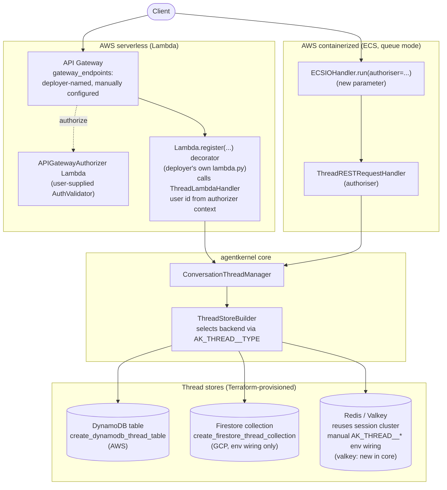

# #527: Thread store deployment support and Authoriser support for serverless and ECS

Conversation Thread Support (`thread:` config block, #348) shipped with pluggable stores and an
`Authoriser`, but no deployment story: no cloud provisioning (AWS, GCP, or Azure) for the thread
store, and no way to protect thread routes on serverless or containerized deployments. This change
adds thread-store provisioning + env-var wiring + IAM to the AWS and GCP Terraform (mirroring each
cloud's existing session-store pattern; Azure is out of scope, see Non-goals), native thread routes
to the Lambda REST router
protected by the existing `APIGatewayAuthorizer`, and an `Authoriser`-mounting seam to ECS's
queue-mode entrypoint.

## Motivation

- **No cloud provisioning for the thread store.** Each cloud already provisions the *session* store
  behind a flag — `create_dynamodb_memory_table` (AWS,
  `ak-deployment/ak-aws/serverless/state.tf:297-313`), `create_firestore_database` (GCP,
  `ak-deployment/ak-gcp/serverless/variables.tf:169`), `create_cosmosdb_cluster` (Azure,
  `ak-deployment/ak-azure/serverless/variables.tf:101`) — but nothing provisions or wires the thread
  store's DynamoDB table / Firestore collection / Cosmos DB table, so `thread:` cannot be enabled on
  a deployed stack without hand-built infrastructure.
- **No Authoriser on serverless.** The Lambda REST router only exact-matches literal, static paths
  (`ak-py/src/agentkernel/deployment/aws/serverless/core/router/rest_lambda.py:354-388`), so no
  thread-listing or thread-detail endpoint exists today.
- **No Authoriser on containerized queue mode.** `ECSIOHandler.run()` hardcodes
  `RESTAPI.run(handlers=[ECSQueueRequestHandler()])`
  (`ak-py/src/agentkernel/deployment/aws/containerized/ecs_io_handler.py:29-51`), so `RESTAPI.run`
  auto-mounts an *open* `ThreadRESTRequestHandler` (`ak-py/src/agentkernel/api/http.py:96-104`) with
  no way to pass a configured `Authoriser` — exactly the interim state the #348 design said to close
  (`docs/specs/348-conversation-thread-support/design.md:81`).

## Scope

- This change covers thread-store provisioning + env wiring across **AWS and GCP** — plus the
  Authoriser work on AWS serverless and ECS. Issue #527 originally scoped GCP provisioning as a
  follow-up ticket; that scope was **intentionally expanded during design review** to land it
  alongside AWS (they share one env-var contract and mirror the existing session-store wiring).
  Azure is **dropped from this change entirely** (see Non-goals) — it can be scoped as a separate
  follow-up. Issue #527 is being updated to match this scope.
- Authoriser/route-authorization plumbing remains AWS-only (see Non-goals); the GCP work here is
  store provisioning + env wiring only.

## Architecture overview

## Requirements

### Core — Valkey thread store

- Add `valkey` to the built-in backend set: the `_ThreadStoreConfig.type` field description
  (a description-only field post-#541, no regex pattern —
  `ak-py/src/agentkernel/core/config.py:254-257`) and `_BUILTIN_THREAD_STORES`
  (`core/thread/store/base.py:13`), plus a `_ThreadValkeyConfig` sub-config (URL + ttl + prefix,
  mirroring `_ThreadRedisConfig`, `config.py:220-223`).
- Add a `ValkeyThreadStore` and its `require_extra`-guarded `ThreadStoreBuilder` branch with the
  `agentkernel[valkey]` extra hint, mirroring how `SessionStoreBuilder` builds `ValkeySessionStore`
  (`ak-py/src/agentkernel/core/builder.py:108-112`). Valkey is Redis-protocol-compatible; the store
  should reuse the Redis thread store's logic with a valkey client, as the session stores do.
- Backend selection for thread is **always** via `thread.type` / `AK_THREAD__TYPE` — Redis/Valkey
  thread storage is chosen by setting `AK_THREAD__TYPE=redis|valkey` (plus the URL), not by any new
  Terraform enum.

### Env-var contract (all clouds)

- `AKConfig.thread` is `Optional[...] = None` with no `default_factory`
  (`ak-py/src/agentkernel/core/config.py:580`), so the presence of any `AK_THREAD__*` env var
  turns the feature on — but `thread.type` then defaults to `"memory"` (`config.py:254-257`) and
  `ThreadStoreBuilder.build()` reads it directly (`ak-py/src/agentkernel/core/thread/store/base.py:149-153`).
- Therefore every Terraform wiring below must inject `AK_THREAD__TYPE=<backend>` **together with** the
  backend's connection vars. Unlike session — where the committed `config.yaml` declares the type
  (e.g. `session: {type: dynamodb}` in `examples/memory/dynamodb/config.yaml`) and Terraform injects
  only the connection detail — thread is deployment-toggled with no `thread:` block in the committed
  config, so there is no declared type to fall back on: setting only the table name would silently
  run threads on the non-durable in-memory backend.

### AWS serverless (Lambda) Terraform — DynamoDB thread table

- New `create_dynamodb_thread_table` boolean (default `false`) in
  `ak-deployment/ak-aws/serverless/variables.tf`, alongside `create_dynamodb_memory_table`.
- New `dynamodb_thread` module invocation in `serverless/state.tf` mirroring `dynamodb_memory`
  (`state.tf:297-313`):
  - `attributes = [{session_id, S}, {sk, S}]`, `hash_key = "session_id"`, `range_key = "sk"`
  - `ttl_enabled = true`, `ttl_attribute_name = "expiry_time"`
  - `table_name = "ak-agent-threads"` (Python-side default, `config.py:220-223`)
  - **No GSI** — `list_threads` is a full-table `Scan`
    (`ak-py/src/agentkernel/core/thread/store/dynamodb.py:207-241`); do not copy the
    response-store GSI pattern.
- Thread the table ARN/name through to both `request_handler` and `agent_runner` module blocks
  (pattern: `state.tf:22-25`, `:482-489`, `:535-540`) with matching variables in each module's
  `variables.tf`.
- Env vars, injected only when the flag is true, in both modules' environment-merge blocks
  (`request-handler/main.tf:252-284` pattern): `AK_THREAD__TYPE=dynamodb` +
  `AK_THREAD__DYNAMODB__TABLE_NAME=<name>`.
- IAM: scoped policy on both Lambda roles granting
  `DescribeTable/GetItem/PutItem/UpdateItem/DeleteItem/Query/Scan` on the table ARN only (no
  `/index/*`), mirroring `lambda_dynamodb_describe_policy` (`request-handler/main.tf:32-59`).

### AWS serverless (Lambda) — generic path-parameter routing

A standalone platform capability, independent of thread — the router limitation is fixed generically
rather than worked around by any one feature.

- **The gap**: `RESTLambdaRouter.register()`/`dispatch()` (`rest_lambda.py:327-388`) and
  `_normalize_path()` (`common.py:20-35`) do pure literal-string dict lookups keyed off
  `event["path"]` (the *concrete* URL, e.g. `/api/v1/threads/abc-123`) — never
  `event["resource"]` (the *template* API Gateway matched, e.g. `/api/v1/threads/{session_id}`,
  curly braces intact). A route registered via `Lambda.register("/threads/{session_id}",
  method="GET")` already sits in `self._routes` under that exact literal string; it just never gets
  looked up correctly, so it 500s via `dispatch()`'s no-route `ValueError`.
- **The fix — an additive fallback in `dispatch()` only**: when the existing `event["path"]`-based
  lookup misses, also try the identical literal-string lookup against `event["resource"]` (after the
  same base-path stripping already applied to `path`). Still a plain dict lookup — no wildcard/regex
  matching anywhere. API Gateway itself already resolves which resource template matched and
  populates `event["pathParameters"]` accordingly; the router's only job is finding the handler
  registered under that same template string.
- **`register()` needs zero changes** — this call is already legal today, it just never matches:
  `@Lambda.register("/threads/{session_id}", method="GET")`.
- **Zero regression risk for existing routes**: the fallback only ever triggers on requests that
  would otherwise hit the no-route `ValueError`. Every existing static route (all four current
  examples using `Lambda.register`) matches on the first (`path`-based) attempt, completely
  unaffected — verified by dedicated regression tests (see `spec.md` Testing).
- **Trade-off, explicitly accepted**: this touches `dispatch()`, shared production routing code used
  by every existing Lambda deployment. It needs its own dedicated tests (not just thread-specific
  ones) and must be checked against the existing default-chat-path special-casing in the same
  function.

### AWS serverless (Lambda) — thread REST routes + APIGatewayAuthorizer

- Thread routes are **not** auto-registered anywhere. AK exposes reusable thread-handling logic (a
  `ThreadLambdaHandler` with list/detail methods, reusing `ConversationThreadManager` — the same data
  path as `ThreadRESTRequestHandler`, `ak-py/src/agentkernel/api/thread.py`) that the deployer wires up
  themselves, in their own `lambda.py`, via the **existing, already-public** `Lambda.register(route,
  method)` decorator (`ak-py/src/agentkernel/deployment/aws/serverless/aklambda.py:38-47`, delegating
  to `RESTLambdaRouter.register`, `.../core/router/rest_lambda.py:327-352`) — the same mechanism
  already used for custom routes in `examples/aws-serverless/openai-auth/lambda.py:30-38` and three
  other examples. No cold-start auto-registration.
- **List is a flat endpoint; detail uses a path parameter**, symmetric with ECS/FastAPI's
  `/api/v1/threads/{session_id}`, now that the generic path-parameter routing above makes this work:
  - List (deployer names the path, e.g. `threads`): query params `user_id`, `group_id`, `limit`,
    `cursor`.
  - Detail (deployer names the path, e.g. `threads/{session_id}`): `session_id` from
    `event["pathParameters"]["session_id"]` (populated by API Gateway, per the above); query params
    `limit`, `cursor`.
- Authorization uses the existing `APIGatewayAuthorizer` gateway-level Lambda REQUEST authorizer, as
  in `examples/aws-serverless/openai-auth/lambda_auth.py` — a user-supplied `AuthValidator` returns
  `ValidationResult(subject=..., claims=...)`, which the authorizer forwards as `principalId` +
  string context on the policy (`ak-py/src/agentkernel/deployment/aws/serverless/akauthorizer.py:43-48`,
  `:75-92`). No in-Lambda `Authoriser` instance and no new cold-start configuration hook.
- **Risk — this mechanism needs careful attention in implementation and testing.** Authorization is
  entirely external to the thread Lambda: nothing in its code fails closed if the authorizer is
  misconfigured. `_resolve_user` reading a missing `principalId` looks identical whether no authorizer
  is attached at all (intentionally open) or one is attached but a bug leaves `principalId` unset
  (unintentionally open). Both must be exercised as distinct, deliberate test cases — not left to
  fall out of the same code path unexamined.
- The thread handler methods resolve the caller's user id from
  `event["requestContext"]["authorizer"]` (principal/claims injected by the gateway authorizer) and
  apply the same scoping as `ThreadRESTRequestHandler._resolve_user` — list scoped to that user,
  403 on ownership mismatch for the detail route.
- Exposure is via the existing `gateway_endpoints` variable, configured **manually by the deployer**
  — they add entries for whatever path names they chose in their `lambda.py` decorators, same as any
  other custom endpoint (`gateway_endpoints` paths are relative to `/{api_base_path}/{api_version}`;
  not `api/v1/<name>`, which would deploy `/api/v1/api/v1/<name>`). The detail route's
  `{session_id}` path segment brings it to 2 segments, within the module's 3-segment limit
  (`ak-deployment/ak-aws/serverless/modules/api-gateway/main.tf:1-16`); API Gateway treats the literal
  `{session_id}` `path_part` as a path parameter, same as it always has for containerized.
- Routes registered via `gateway_endpoints` are protected by the deployment's configured `authorizer`
  variable (`serverless/variables.tf`), the same as any other endpoint.

### AWS containerized (ECS) Terraform — DynamoDB thread table

- Same shape as serverless: `create_dynamodb_thread_table` variable on
  `ak-deployment/ak-aws/containerized/variables.tf`, a `dynamodb_thread` module in `state.tf`
  (mirrors `dynamodb_memory`, `containerized/state.tf:112-118`), and pass-through into both
  `rest-service` and `agent-runner` modules.
- Env vars on both modules' environment-merge blocks (`rest-service/main.tf:2-20`,
  `agent-runner/main.tf:4-17`): `AK_THREAD__TYPE=dynamodb` + `AK_THREAD__DYNAMODB__TABLE_NAME`,
  injected only when the flag is true.
- IAM: task-role policy on both task roles scoped to the thread table ARN only, mirroring
  `dynamodb_policy`/`tasks_iam_role_policies` (`rest-service/main.tf:33-61`, `:185-189`) and
  `agent_runner_dynamodb_memory_policy` (`agent-runner/main.tf:123-154`).

### AWS containerized (ECS) — Authoriser mounting

- `ECSIOHandler.run()` gains an optional `authoriser: Optional[Authoriser] = None` parameter
  (`ecs_io_handler.py:29-51`), and when `AKConfig.get().thread is not None` passes
  `ThreadRESTRequestHandler(authoriser=authoriser)` explicitly in the handlers list so
  `RESTAPI.run`'s `isinstance` check skips auto-mounting a second, open one (`api/http.py:96-104`).
- Non-queue-mode ECS (direct `RESTAPI.run(handlers=[...])`, e.g.
  `examples/aws-containerized/openai-dynamodb/app.py`) needs no change — the caller already controls
  the handlers list, same as `examples/api/thread-openai/app.py`.

### AWS containerized (ECS) — route exposure

- Thread routes are exposed the same way as serverless: through the containerized HTTP API's
  `gateway_endpoints` variable (`ak-deployment/ak-aws/containerized/variables.tf:51-70`). By default
  only the chat endpoints exist (`containerized/state.tf`), so the deployer adds the thread entries.
- Unlike serverless, this needs no code-side workaround: FastAPI natively supports path parameters —
  `ThreadRESTRequestHandler.get_router()` (`api/thread.py:63,86`) already serves
  `/api/v1/threads/{session_id}` — and the containerized entry shape is `{path, method,
  overwrite_path}` (`overwrite_path` is **required**, unlike the serverless `{path, method}` shape).
  Paths are relative to `/{api_base_path}/{api_version}`; the HTTP API imposes no segment-depth limit,
  so `{session_id}` works as an HTTP API path variable. The detail route's `overwrite_path` must
  reference that variable so the id is forwarded to the ALB backend, which already gives the deployer
  free choice of the *external* path name while the *internal* FastAPI route stays fixed:
  - `{ path = "threads",              method = "GET", overwrite_path = "/api/v1/threads" }`
  - `{ path = "threads/{session_id}", method = "GET", overwrite_path = "/api/v1/threads/${request.path.session_id}" }`
- These entries are protected by the deployment's configured `authorizer`, and the mounted
  `ThreadRESTRequestHandler` applies the same principal scoping as serverless.

### GCP Terraform — Firestore thread wiring

- Thread reuses the Firestore database provisioned by `create_firestore_database`; Firestore
  collections are implicit, so no new database resource is needed — the thread store writes to its
  own collection (`ak-agent-threads` default, `config.py:227-231`; one document per session with a
  `messages` subcollection, `ak-py/src/agentkernel/core/thread/store/firestore.py:5-10`).
- New opt-in boolean (e.g. `create_firestore_thread_collection`, env-wiring only) on both
  `ak-gcp/serverless` and `ak-gcp/containerized`, requiring `create_firestore_database = true`.
- When enabled, extend the existing firestore env block (`serverless/cloud_function.tf:159-164`,
  `containerized/cloud_run.tf:160-164`) with `AK_THREAD__TYPE=firestore`,
  `AK_THREAD__FIRESTORE__COLLECTION_NAME`, `AK_THREAD__FIRESTORE__PROJECT_ID`,
  `AK_THREAD__FIRESTORE__DATABASE_ID` — same values/shape as the `AK_SESSION__FIRESTORE__*` block
  (GCP already sets `AK_SESSION__TYPE=firestore` explicitly, so thread matches the established GCP
  pattern).
- IAM: covered by the existing Firestore datastore access already granted to the service account for
  session storage (same database); verify and extend only if the existing binding is
  collection-scoped.

### Docs and example

- New deployable example `examples/aws-serverless/thread-openai`, registered under `weekly.tests` in
  `.github/integration-test-config.yaml` (format per lines 34-71): deploys with
  `create_dynamodb_thread_table = true`, manually-configured `gateway_endpoints` entries for the
  deployer-named list/detail paths, a `lambda.py` wiring `ThreadLambdaHandler` via `Lambda.register`,
  and an `APIGatewayAuthorizer` auth Lambda (per `examples/aws-serverless/openai-auth`); exercises
  deploy → chat → thread list/read → destroy.
- Document the `AK_THREAD__TYPE` + backend-vars pairing requirement prominently — thread is the one
  `AK_*` store where Terraform must set the type explicitly, and it is easy to misconfigure (feature
  "on", silently wrong backend).

## Non-goals

- Thread REST routes for serverless deployments in websocket execution modes (`async`, `stream`) —
  no REST API Gateway exists in those modes (`local.rest_api_enabled`, `serverless/state.tf:33-34`).
- A rename/write REST route — renaming stays via the chat request's `thread_name` field.
- Redis/Valkey cluster *provisioning* for thread, and any new Terraform variable for backend
  selection — thread on Redis/Valkey reuses whatever cluster `create_redis_cluster`/
  `create_valkey_cluster` already provisions; selection is purely `AK_THREAD__TYPE=redis|valkey` +
  the cluster URL, wired manually via the generic `environment_variables` passthrough. No new cluster
  resources, no new Terraform booleans.
- Changing session/multimodal/response-store deployment wiring — thread mirrors their patterns but
  does not touch them.
- GCP thread REST-route authorization plumbing beyond what its gateway already provides — this
  issue's Authoriser work targets AWS serverless (APIGatewayAuthorizer) and ECS (`ECSIOHandler`);
  GCP scope here is store provisioning + env wiring only.
- Azure thread-store provisioning — dropped from this change entirely; can be scoped as a separate
  follow-up ticket if needed.

## Open questions

- None currently open. This document is pending its first real review pass and has already gone
  through two rounds of informal revision; the settled position, so a future reader doesn't need to
  reconstruct the discussion:
  - **No new Terraform variables**, and **no auto-attach of `gateway_endpoints` for any backend**.
    An intermediate draft added Terraform auto-attach (`local.thread_routes_enabled`) plus
    `create_thread_redis`/`create_thread_valkey` flags to gate it uniformly across backends — that
    was rejected: introducing new variables just to avoid an inconsistency (DynamoDB auto-attached,
    Redis/Valkey not) was the wrong fix. The routes are manually configured via `gateway_endpoints`
    on **both** serverless and containerized, for **every** backend — which, for containerized, is
    simply what the design already had before that intermediate draft touched it.
  - **Serverless thread routes are wired via the existing `Lambda.register` decorator**, not
    auto-registered by AK at cold start — reusing a mechanism that already existed in the codebase
    and was already used by other examples, rather than the bespoke `ThreadEndpointsHandler`/
    resource-template approach an earlier draft proposed.
  - **The thread detail route uses a `{session_id}` path parameter, symmetric with containerized.**
    An earlier pass in this same revision moved `session_id` to a query parameter after verifying the
    Lambda router's `register()`/`dispatch()` did pure literal-string matching with no template
    support at all. Rather than leave that workaround in place, the router gap itself is now fixed —
    see "AWS serverless (Lambda) — generic path-parameter routing" above — as a small, additive,
    thread-independent capability, restoring the more idiomatic path-parameter shape. Containerized
    was never affected either way — FastAPI supports path parameters natively, and the containerized
    `gateway_endpoints` entry's `overwrite_path` already lets the deployer name the external path
    however they like while forwarding to the fixed internal FastAPI route.
  - Azure is dropped from this change entirely; GCP remains, verified via `terraform validate` only
    (no live GCP credentials available to this project for `plan`/`apply`).
  - The Lambda authorization mechanism (gateway-level `APIGatewayAuthorizer`) is unchanged throughout
    all of this — only the route-registration transport changed, not how authorization works — but is
    flagged as needing careful implementation and test attention (see the Risk callout above).
