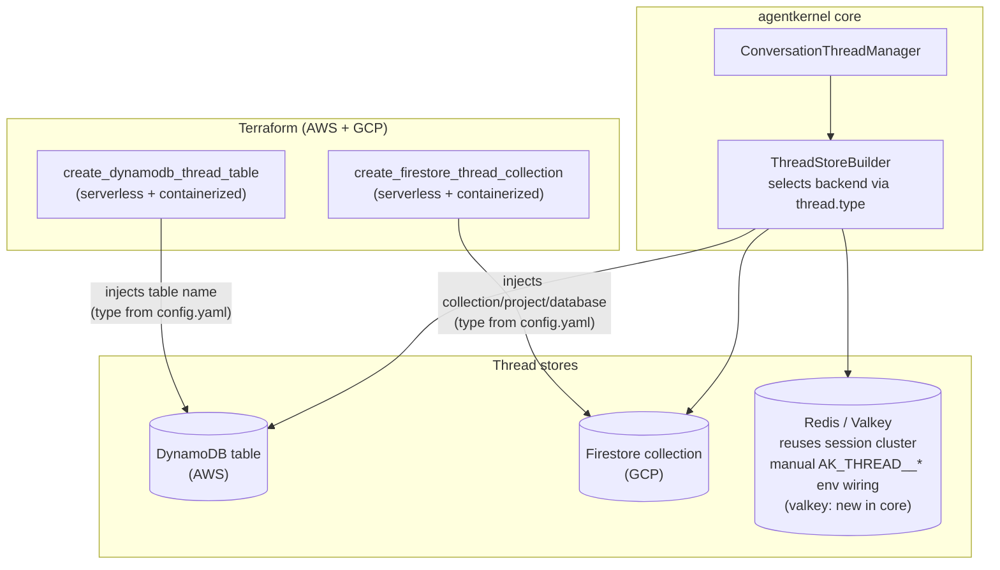

# #527: Thread store deployment support

Conversation Thread Support (`thread:` config block, #348) shipped with pluggable stores, but no
deployment story: no cloud provisioning (AWS, GCP, or Azure) for the thread store. This change adds
thread-store provisioning + env-var wiring + IAM to the AWS and GCP Terraform (mirroring each cloud's
existing session-store pattern; Azure is out of scope, see Non-goals), and a `ValkeyThreadStore`
backend in core. Authoriser / route-authorization work and the Lambda path-parameter routing fix are
entirely out of scope — see Non-goals.

## Motivation

- **No cloud provisioning for the thread store.** Each cloud already provisions the *session* store
  behind a flag — `create_dynamodb_memory_table` (AWS,
  `ak-deployment/ak-aws/serverless/state.tf:302-318`), `create_firestore_database` (GCP,
  `ak-deployment/ak-gcp/serverless/variables.tf:169`), `create_cosmosdb_cluster` (Azure,
  `ak-deployment/ak-azure/serverless/variables.tf:101`) — but nothing provisions or wires the thread
  store's DynamoDB table / Firestore collection / Cosmos DB table, so `thread:` cannot be enabled on
  a deployed stack without hand-built infrastructure.

## Scope

- This change covers thread-store provisioning + env wiring across **AWS and GCP**, and the core
  `ValkeyThreadStore` backend. Issue #527 originally scoped GCP provisioning as a follow-up ticket;
  that scope was **intentionally expanded during design review** to land it alongside AWS (they share
  one env-var contract and mirror the existing session-store wiring). Azure is **dropped from this
  change entirely** (see Non-goals) — it can be scoped as a separate follow-up. Issue #527 is being
  updated to match this scope.
- **Authoriser / route-authorization plumbing of any kind, on any cloud, is entirely out of scope** —
  see Non-goals and Open questions for the history of what this design used to include here and why
  it was removed.

## Architecture overview

## Requirements

### Core — Valkey thread store

- Add `valkey` to the built-in backend set: the `_ThreadStoreConfig.type` field description
  (a description-only field post-#541, no regex pattern —
  `ak-py/src/agentkernel/core/config.py:254-257`) and `_BUILTIN_THREAD_STORES`
  (`core/thread/store/base.py:13`), plus a `_ThreadValkeyConfig` sub-config (URL + ttl + prefix,
  mirroring `_ThreadRedisConfig`, `config.py:220-223`).
- Add a `ValkeyThreadStore` and its `require_extra`-guarded `ThreadStoreBuilder` branch with the
  `agentkernel[valkey]` extra hint, mirroring how `SessionStoreBuilder` builds `ValkeySessionStore`
  (`ak-py/src/agentkernel/core/builder.py:108-112`). Valkey is Redis-protocol-compatible; the store
  should reuse the Redis thread store's logic with a valkey client, as the session stores do.
- Backend selection for thread is **always** via `thread.type` (env equivalent
  `AK_THREAD__TYPE`) — Redis/Valkey thread storage is chosen by declaring `thread: {type: redis|valkey}`
  plus the URL, not by any new Terraform enum.

### Env-var contract (all clouds)

- `AKConfig.thread` is `Optional[...] = None` with no `default_factory`
  (`ak-py/src/agentkernel/core/config.py:609`), so the presence of any `AK_THREAD__*` env var
  turns the feature on — but `thread.type` then defaults to `"memory"` (`config.py:254-257`) and
  `ThreadStoreBuilder.build()` reads it directly (`ak-py/src/agentkernel/core/thread/store/base.py:149-153`).
- **The application declares the backend; Terraform supplies only its address.** Every Terraform
  wiring below injects the connection vars (`AK_THREAD__DYNAMODB__TABLE_NAME`, the
  `AK_THREAD__FIRESTORE__*` set) and **never** `AK_THREAD__TYPE`. `thread.type` is declared in the
  committed `config.yaml`, exactly as session does (`session: {type: dynamodb}` in
  `examples/memory/dynamodb/config.yaml`) — the type is an application design decision, the table or
  collection name is a deployment fact only Terraform knows.
- Residual failure mode, accepted and documented rather than defended against in Terraform: enabling a
  flag *without* declaring `thread.type` materialises the block via the injected connection var while
  `type` falls back to `"memory"`, so threads run in-memory with the provisioned backend unused and no
  error. The same hazard applies to Redis/Valkey, which have no flag and are wired by hand. A
  `_ThreadStoreConfig` validator rejecting `type: memory` alongside a populated backend sub-block would
  close it; that is scoped to a separate follow-up.

### AWS serverless (Lambda) Terraform — DynamoDB thread table

- New `create_dynamodb_thread_table` boolean (default `false`) in
  `ak-deployment/ak-aws/serverless/variables.tf`, alongside `create_dynamodb_memory_table`.
- New `dynamodb_thread` module invocation in `serverless/state.tf` mirroring `dynamodb_memory`
  (`state.tf:302-318`):
  - `attributes = [{session_id, S}, {sk, S}]`, `hash_key = "session_id"`, `range_key = "sk"`
  - `ttl_enabled = true`, `ttl_attribute_name = "expiry_time"`
  - `table_name = "thread_store"` — a **name suffix**, not the full table name: the shared module
    composes `<product_alias>-<env_alias>-<module_name>-<suffix>`
    (`ak-deployment/ak-aws/common/modules/dynamodb/main.tf:6`) and injects the composed name into the
    env var, so the Python-side default (`config.py:226-229`) never applies on a deployed stack. Mirrors
    session's `"session_store"` (`ak-aws/serverless/state.tf:316`).
  - **No GSI** — `list_threads` is a full-table `Scan`
    (`ak-py/src/agentkernel/core/thread/store/dynamodb.py:207-241`); do not copy the
    response-store GSI pattern.
- Thread the table ARN/name through to both `request_handler` and `agent_runner` module blocks
  (pattern: `state.tf:22-25`, `:482-489`, `:535-540`) with matching variables in each module's
  `variables.tf`.
- Env vars, injected only when the flag is true, in both modules' environment-merge blocks
  (`request-handler/main.tf:283-318` pattern): `AK_THREAD__DYNAMODB__TABLE_NAME=<name>` only — the type
  comes from the application's `config.yaml`.
- IAM: scoped policy on both Lambda roles granting
  `DescribeTable/GetItem/PutItem/UpdateItem/DeleteItem/Query/Scan` on the table ARN only (no
  `/index/*`), mirroring `lambda_dynamodb_describe_policy` (`request-handler/main.tf:32-53`).

### AWS containerized (ECS) Terraform — DynamoDB thread table

- Same shape as serverless: `create_dynamodb_thread_table` variable on
  `ak-deployment/ak-aws/containerized/variables.tf`, a `dynamodb_thread` module in `state.tf`
  (mirrors `dynamodb_memory`, `containerized/state.tf:112-118`), and pass-through into both
  `rest-service` and `agent-runner` modules.
- Env vars on both modules' environment-merge blocks (`rest-service/main.tf:2-20`,
  `agent-runner/main.tf:4-17`): `AK_THREAD__DYNAMODB__TABLE_NAME` only, injected when the flag is true.
- IAM: task-role policy on both task roles scoped to the thread table ARN only, mirroring
  `dynamodb_policy`/`tasks_iam_role_policies` (`rest-service/main.tf:36-64`, `:220-228`) and
  `agent_runner_dynamodb_memory_policy` (`agent-runner/main.tf:123-154`).

### GCP Terraform — Firestore thread wiring

- Thread reuses the Firestore database provisioned by `create_firestore_database`; Firestore
  collections are implicit, so no new database resource is needed — the thread store writes to its
  own collection (`ak-agent-threads` default, `config.py:234-237`; one document per session with a
  `messages` subcollection, `ak-py/src/agentkernel/core/thread/store/firestore.py:5-10`).
- New opt-in boolean (e.g. `create_firestore_thread_collection`, env-wiring only) on both
  `ak-gcp/serverless` and `ak-gcp/containerized`, requiring `create_firestore_database = true`.
- When enabled, extend the existing firestore env block (`serverless/cloud_function.tf:159-164`,
  `containerized/cloud_run.tf:160-164`) with `AK_THREAD__FIRESTORE__COLLECTION_NAME`,
  `AK_THREAD__FIRESTORE__PROJECT_ID`, `AK_THREAD__FIRESTORE__DATABASE_ID` — same values/shape as the
  `AK_SESSION__FIRESTORE__*` block, and connection detail only. GCP's Terraform does also inject
  `AK_SESSION__TYPE`, but redundantly (its example declares `session: {type: firestore}` anyway), so
  that is not followed for thread.
- IAM: covered by the existing Firestore datastore access already granted to the service account for
  session storage (same database); verify and extend only if the existing binding is
  collection-scoped.

### Docs and example

- A deployable **AWS** example (existing or new — exact choice at spec time) exercises
  `create_dynamodb_thread_table = true` end to end: deploy → chat (which auto-creates/appends thread
  data via the existing `ConversationThreadManager`, no REST read route needed to prove provisioning
  works) → destroy.
- **No GCP example** — see Non-goals. The GCP Terraform wiring is in scope and implemented; only a
  worked example of it is deferred.
- Document the two-step contract prominently — the application declares `thread.type`, the Terraform
  flag provisions the backend and injects its address. Setting the flag without declaring the type is
  easy to do and fails silently (feature "on", running in-memory).

## Non-goals

- **Authoriser / route-authorization plumbing of any kind, on any cloud.** No thread REST routes, no
  `ThreadLambdaHandler`, no gateway-level or in-process authorizer mechanism, for AWS or GCP. This
  axis was considered across earlier revisions of this design (serverless thread routes +
  `APIGatewayAuthorizer`, then an ECS gateway-Lambda-authorizer redesign, then GCP mounting added and
  reverted) and is now dropped from this change entirely — see Open questions for that history. Thread
  route protection can be scoped as a fully separate follow-up change if/when needed.
- **The Lambda REST router's path-parameter dispatch gap.** `RESTLambdaRouter.register()`/`dispatch()`
  (`ak-py/src/agentkernel/deployment/aws/serverless/core/router/rest_lambda.py:327-388`) only matches
  the concrete `event["path"]`, never the route template `event["resource"]`, so no
  `Lambda.register("/foo/{id}", ...)`-registered route can ever dispatch — this was found and a fix
  drafted while an earlier revision of this design was building thread REST routes on Lambda (see Open
  questions), but is dropped from this change along with the rest of that work. It can be proposed as
  its own standalone platform fix, independent of thread, if/when it's next needed.
- Redis/Valkey cluster *provisioning* for thread, and any new Terraform variable for backend
  selection — thread on Redis/Valkey reuses whatever cluster `create_redis_cluster`/
  `create_valkey_cluster` already provisions; the deployer declares `thread: {type: redis|valkey}` with
  the cluster URL in `config.yaml` (or passes `AK_THREAD__REDIS__URL` through the generic
  `environment_variables` passthrough). No new cluster resources, no new Terraform booleans.
- Changing session/multimodal/response-store deployment wiring — thread mirrors their patterns but
  does not touch them.
- **A worked GCP example of the thread store.** The GCP Terraform wiring *is* in scope and implemented;
  only an example demonstrating it is deferred. `examples/gcp-serverless/openai-firestore` would be the
  host, but it sits in no test matrix and GCP has no live integration test, so adding a `thread:` block
  there would be verified only by `terraform validate` — the depth the GCP Terraform already gets —
  while imposing thread's `user_id`-required behaviour on an example nothing exercises. Worth adding
  when GCP gains a live integration test.
- Azure thread-store provisioning — dropped from this change entirely; can be scoped as a separate
  follow-up ticket if needed.

## Open questions

- None currently open. This document has gone through several rounds of revision; the settled
  position, so a future reader doesn't need to reconstruct the discussion:
  - Azure is dropped from this change entirely; GCP remains, verified via `terraform validate` only
    (no live GCP credentials available to this project for `plan`/`apply`).
  - **Authoriser / route-authorization work went through several revisions before being removed from
    this change's scope entirely.** In order: serverless thread REST routes (a `ThreadLambdaHandler`
    wired via `Lambda.register`) protected by the existing `APIGatewayAuthorizer`, plus an
    `Authoriser`-mounting seam on ECS's `ECSIOHandler.run()` → the ECS approach was redesigned into a
    gateway-level Lambda authorizer after the in-process parameter was flagged as a security risk (AK's
    shared, maintained entrypoint executing arbitrary deployer-authored authorization code) → GCP
    Authoriser mounting was added for symmetry, then reverted → finally, this revision removes
    Authoriser/route-authorization work entirely, along with the Lambda path-parameter routing fix that
    existed only to support the (now removed) thread detail route on Lambda — keeping only provisioning
    and the core Valkey thread store in scope (see Scope, Non-goals). A future reader shouldn't be
    surprised that a design titled around thread deployment support doesn't mention `Authoriser` or
    Lambda routing at all — both can be scoped as fully separate follow-up changes if needed.
