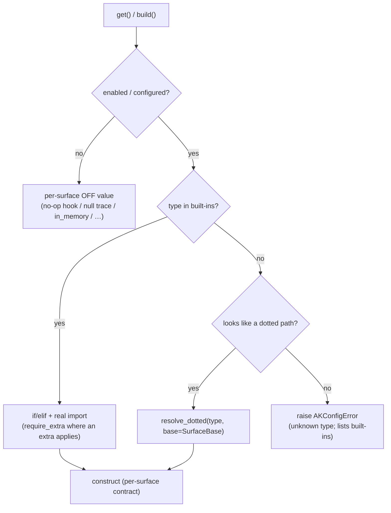

# #541: Standardize pluggable-backend factory pattern + BYO extension

Unify AK's backend-selection factories (guardrail, trace, session store, thread store, multimodal
storage, AWS response store) onto one shape: built-ins resolved by `if/elif` + real imports, a
shared dotted-path `else` branch that lets users bring their own backend by config, uniform
friendly "install the extra" errors, and one typed `AKConfigError`. Roll out incrementally,
trace + guardrail first.

## Motivation

- The six backend-selection factories have drifted apart and are individually inconsistent:
  - **Unknown `type` is handled two different ways.**
    - Raise (bare `Exception`): guardrail (`guardrail/guardrail.py:43`, `:66`), trace (`trace/trace.py:43`).
    - Silent fallback to an in-memory default: session store (`core/builder.py:113` — `from_str` → `IN_MEMORY`), thread store (`core/thread/store/base.py:157` → `MEMORY`), AWS response store (`deployment/aws/core/response_store/handler.py:43`). A typo silently degrades a production app to in-memory state — a footgun.
  - **The "install the extra" hint is ad hoc.** Only the `valkey` branch of `SessionStoreBuilder` builds a friendly message; redis/dynamodb/cosmosdb/firestore need extras too and let the raw `ImportError` through.
  - **No shared, typed config error.** Bare `raise Exception(...)` at `guardrail/guardrail.py:43,66` and `trace/trace.py:43`; `core/util/error_util.py` is a message-mapper (`ErrorCategory`/`ErrorUtil`), not an exception type.
  - **No bring-your-own (BYO) path.** All six are closed sets: adding a backend means editing AK. A user whose observability platform is Datadog (unsupported) cannot plug in a tracer without forking.
- The building blocks for the target already exist and are proven:
  - Lazy per-branch imports keep optional deps optional (guardrail `guardrail/guardrail.py:30-41`, trace `trace/trace.py:36-42`, session store `core/builder.py:136-160`).
  - Clean ABCs to subclass for BYO on every surface: `BaseTrace` (`trace/base.py`), `InputGuardrail`/`OutputGuardrail` (`guardrail/guardrail.py:9,17`), `SessionStore` (`core/session/base.py:8`), `ThreadStore` (`core/thread/store/base.py`), `AttachmentStore` (`core/multimodal/storage/base.py`).
  - The sandbox factory (`sandbox/factory.py`) already does dotted-path BYO + subclass check + extra-message, but via a stringly-typed registry map — it should converge to the same shape (see #494).

## Requirements

### Shared helpers (`core/util/factory.py`, new)

- `AKConfigError(Exception)` — one typed error for all config-resolution failures (unknown type, un-importable/`invalid` dotted path, not-a-subclass). Replaces the bare `Exception` raises.
- `resolve_dotted(path: str, *, base: type) -> type` — the BYO resolver.
  - Import `pkg.mod.Class`; return the class.
  - Raise `AKConfigError` when: `path` has no `.` (not a dotted path), the module/attr can't be imported, or the class is not a `type` / not `issubclass(cls, base)`.
  - Wraps `ImportError`/`AttributeError` into `AKConfigError` naming `path` — a user-supplied path that fails is a config error, not a crash.
- `require_extra(extra: str, feature: str)` — context manager wrapping a **built-in** import; on `ImportError` re-raises `ImportError` with `pip install "agentkernel[<extra>]"`. Stays `ImportError` (missing dependency, matches today's valkey behavior), not `AKConfigError`.
- `resolve_dotted` and `require_extra` are independent: `resolve_dotted` provides extensibility, `require_extra` provides a friendly missing-dependency message. A surface uses `require_extra` only for built-ins behind an optional extra.

### Per-surface factory shape

Every backend-selection factory follows the same control flow:

- Built-ins stay `if/elif` with **real** `from .x import Y` (grep/mypy/refactor-safe), not a string registry.
- The `else` branch is `resolve_dotted(type, base=<SurfaceBase>)` — the uniform BYO hatch on every surface.
- An unknown, non-dotted `type` raises `AKConfigError` naming the value and listing the built-ins.
- **OFF/disabled behavior stays per-surface** and is unchanged (see Non-goals).

### BYO construction contracts (per surface, documented on each base ABC)

Construction is intentionally *not* uniform — each surface passes what it needs; a plugin author targets the base's documented `__init__`:

- **Trace** — `cls()` then `.init()`; subclass `BaseTrace`. OFF → `Trace(None)`.
- **Guardrail (input/output)** — `cls()`; subclass `InputGuardrail` / `OutputGuardrail`. OFF → the base pass-through instance.
- **Session store** — `cls(cache=SessionCacheBuilder.build())`; subclass `SessionStore`. OFF → in_memory (default `type`).
- **Thread store** — construct as today (config-driven); subclass `ThreadStore`. OFF → memory.
- **Multimodal attachment store** — construct as today (config/session-scoped); subclass `AttachmentStore`.

Single-instance surfaces (trace/guardrail) construct no-arg; a BYO plugin reads its own settings from env or `AKConfig` (e.g. a Datadog tracer reads `DD_*`). No AK-delivered `params` channel is added (see Non-goals).

### Public interfaces

- These ABCs become **public, stability-bearing** BYO contracts — a signature change is breaking for plugin authors and must be treated as such: `BaseTrace`, `InputGuardrail`/`OutputGuardrail`, `SessionStore`, `ThreadStore`, `AttachmentStore`, and the sandbox ABCs (`Sandbox`, `SandboxProvider`, `PrincipalResolver`, `SandboxBroker`).

### Config changes

- Relax the enum `pattern=` on the `type`/`storage_type` fields that feed these factories, so a dotted path passes config-load validation. Keep the field descriptions and defaults.
  - Phase 1: `_TraceConfig.type` (`core/config.py:258`), guardrail `_GuardrailParamConfig.type` (`core/config.py:263`).
  - Phase 2: `_SessionStoreConfig.type` (`core/config.py:80`), `_MultimodalConfig.storage_type` (`core/config.py:195-197`), `_ThreadStoreConfig.type` (`core/config.py:248`).
  - Separate follow-up (outside this issue): `_ResponseStoreConfig.type` (`core/config.py:292`).
- Descriptions should state "a built-in short name or a dotted path to a `<Base>` subclass" so generated docs advertise BYO.
- Out of scope: `a2a.task_store_type` (`core/config.py:111`) and non-backend value enums (`identity.mode`, `policy.network_egress`, log level, sandbox `scope`) keep their patterns.

### Behavioural changes

All intentional:

1. **Fail loud on unknown `type`.** `SessionStoreBuilder`, `ThreadStoreBuilder`, and the AWS response-store handler stop silently falling back to in-memory and raise `AKConfigError`. (Behaviour change; the only one with migration impact.)
2. Guardrail and trace raise `AKConfigError` instead of bare `Exception` on unknown `type` (typed, catchable).
3. **New:** every surface accepts a dotted-path `type` → BYO backend (additive).
4. Friendly `pip install "agentkernel[<extra>]"` message is now uniform across all built-ins behind an extra (previously valkey-only).

**Non-changes:** each surface's OFF/disabled value and semantics; the per-surface construction signatures of the built-ins; existing config field names and defaults; the shape of `AKConfig`.

### Rollout (incremental)

1. **Phase 1** — add `core/util/factory.py` (`AKConfigError`, `resolve_dotted`, `require_extra`); apply to **trace + guardrail**; relax their `type` patterns; tests (BYO dotted path resolves; unknown → `AKConfigError`; extra-missing message; disabled unchanged).
2. **Phase 2** — session store, thread store, multimodal storage; drop the `Types` StrEnum + `from_str`; fail-loud replaces the silent fallbacks.
3. **Phase 3** — converge `sandbox/factory.py` (built-ins → real imports, keep dotted BYO/cache/extra-message and the architecture-forced dotted `sqs`).

The AWS response-store handler (`deployment/aws/core/response_store/handler.py`) is a **separate follow-up**, tracked outside this issue.

## Non-goals

- Unifying OFF/disabled semantics — they are intrinsic per surface (guardrail no-op hook vs trace null wrapper vs session in_memory vs sandbox `None`).
- A uniform AK-delivered `params`/config channel for single-instance BYO plugins — they read their own env/`AKConfig`.
- Changing instance-caching/lifecycle of any surface (sandbox keeps its per-`(profile,type)` cache because it is multi-instance; the others keep build-once-at-startup).
- Framework adapters and messaging integrations — selected/constructed differently (not single-`type`-string backend factories); not in scope unless later decided.

## Open questions

- None outstanding.
  - Resolved 2026-07-21: the listed ABCs are public, stability-bearing interfaces (see Public interfaces); shared helpers live in `core/util/factory.py` with `AKConfigError`; the AWS response-store handler is a separate follow-up, not part of this issue.
