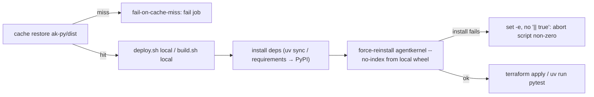

# #542: Fail loudly when integration tests can't use the branch-built agentkernel wheel

The nightly/weekly/reusable integration workflows are meant to test the `agentkernel` wheel
built from the checked-out commit, but on a cache miss the deploy silently falls back to the
PyPI release and reports results against the wrong build. This change makes that impossible by
adding two independent guard layers: fail the cache restore on a miss, and fail every script
that installs the local wheel (`deploy.sh` **and** the example `build.sh`) when that install
fails. Evidence for every claim below is in
[`research/issue_findings.md`](./research/issue_findings.md).

## Motivation

- A cache miss on `ak-py-<sha>` currently produces a false green (or unexplained failures)
  with no visible error. Root causes, all verified:
  - **No `fail-on-cache-miss`.** All six `actions/cache/restore@v5` steps that restore
    `ak-py/dist` continue silently on a miss.
    - `integration-test.yaml:87, :195`
    - `integration-test-weekly.yaml:93, :205`
    - `test-reusable.yaml:142, :179` (not named in the original issue — same defect)
  - **`|| true` swallows the local-wheel install — in two script families.** The failure
    hides on the `--force-reinstall` local-wheel line of both the Lambda/container packaging
    scripts (`deploy/deploy.sh`) and the example environment scripts (`build.sh`):
    - **`deploy/deploy.sh`** (deployed artifact): 22 of 27 scripts end the
      `--force-reinstall --no-index` line with `|| true`
      (e.g. `examples/aws-serverless/openai/deploy/deploy.sh:13`).
    - **`build.sh`** (the **test** virtualenv — this is the surface the original scope
      missed): all 64 example `build.sh` scripts have a local-wheel force-reinstall line, and
      62 of them (across 61 files) end it with `|| true`
      (e.g. `examples/memory/valkey/build.sh:15`). This matters because `run_single_test.py`'s
      `run_simple_test` (used by `memory` / `api` / `cli` / `containerized` tests) runs
      `./build.sh local` then `uv run pytest` — the pytest environment *is* the venv `build.sh`
      populates.
  - **`uv sync` resolves `agentkernel` from PyPI, not the local wheel.** In each example
    `build.sh local`, `uv sync --find-links ../../../ak-py/dist --all-extras` installs
    `agentkernel` per `uv.lock`, which pins `version = "0.6.1"`, `source = { registry =
    "https://pypi.org/simple" }` (e.g. `examples/memory/valkey/uv.lock:20`). So `uv sync`
    installs the **PyPI** wheel; the *only* line that swaps in the branch wheel is the
    subsequent `--force-reinstall --no-index --find-links … agentkernel[…]` — the exact line
    `|| true` neutralises. A swallowed failure therefore leaves PyPI's `agentkernel` in the
    test venv (verified: the branch adds `session.type: valkey` at
    `ak-py/src/agentkernel/core/config.py:80`, absent from PyPI `0.6.1`, so the swap is
    invisible until a `valkey` example's `pytest` fails to validate its config).
  - **uv's package cache serves a stale same-version wheel (the primary `build.sh` defect).**
    Even with `ak-py/dist` present and holding the correct branch wheel, a force-reinstall
    *without* `--no-cache-dir` reuses the cached `agentkernel 0.6.1` uv downloaded from PyPI
    during `uv sync` — because it shares the version string — and reports success while
    shipping the wrong wheel (verified with `uv 0.11.21`: the `valkey`-supporting config
    appears only when `--no-cache-dir` is present). So `build.sh` needs **both** `|| true`
    removed and `--no-cache-dir` added; removing `|| true` alone does not close the observed
    `valkey` failure.
  - **`uv run` does not undo a correct force-reinstall.** `uv run pytest` re-syncs the project
    env, but because the force-reinstalled local wheel is still `version 0.6.1` it satisfies
    the lock and is left in place (verified end-to-end with `uv 0.11.21`) — so no
    `--no-sync`/lock change is required.
  - **Missing `set -e`.** Only 12 of 27 `deploy.sh` scripts set `-e`; a mid-script install
    failure does not abort the run (e.g. `examples/memory/redis/deploy/deploy.sh`,
    `examples/aws-containerized/adk/deploy/deploy.sh`). All 64 example `build.sh` already set
    `set -euo pipefail`, so `build.sh` needs no `set -e` additions — only `|| true` removal and
    `--no-cache-dir`.
  - **Version equivalence hides the swap.** `ak-py/pyproject.toml` is `0.6.1`; examples pin
    `agentkernel[...]>=0.6.1`, so a PyPI `0.6.1` satisfies the pin identically.
- The failure is checkable end-to-end for **both** script families: `run_single_test.py` runs
  every subprocess with `check=True` (`run_command`, `.github/scripts/run_single_test.py:24`),
  so a nonzero exit fails the step — the scripts just never return nonzero today:
  - `./deploy.sh local` at `:228`, `:377`, `:529` (deploy action).
  - `./build.sh local` at `:97` (`run_simple_test`, the `memory` / `api` / `cli` /
    `containerized` test action), immediately followed by `uv run pytest` at `:105` in the same
    venv.
- `uv` behaviour (tested, `uv 0.11.21`): `--find-links` at a **missing** directory exits `2`;
  at an **empty** directory the non-`--no-index` pass resolves `agentkernel` from PyPI (exit
  `0`) and only the `--no-index` pass fails (exit `1`). So the silent-swap severity differs by
  script shape:
  - `aws-serverless/streaming-openai` and `aws-serverless/websocket-openai` have **no
    `--find-links` on the first pass**, so on a full miss they cleanly install PyPI `0.6.1`
    and the `--no-index` failure is swallowed — a clean false green, despite having `set -e`.
  - The other cache-dependent scripts fail the first pass on a full miss, degrading to a noisy
    crash (no `set -e`) or a loud abort (`set -e`) rather than a clean green — but still hit
    the silent swap when the cache is present-but-empty.
- Six scripts already self-build ak-py via `build.sh` inside `deploy.sh` and are cache-miss
  immune (e.g. `azure-serverless/openai/deploy/deploy.sh`,
  `gcp-serverless/openai-firestore/deploy/deploy.sh`).

## Design idea

Two independent guards, either of which alone prevents a wrong-build test run:

## Requirements

### Guard 1 — cache restore fails on a miss

- Add `fail-on-cache-miss: true` to every `actions/cache/restore@v5` step that restores
  `ak-py/dist`, in all three workflows (six steps, listed under Motivation).
- Behaviour after change: a missing `ak-py-<sha>` entry fails the restore step immediately, so
  the deploy job never proceeds against an absent wheel.
- The corresponding `actions/cache/save@v5` steps in `build-ak-py` are unchanged.

### Guard 2 — the local-wheel install fails loudly (both `deploy.sh` and `build.sh`)

Every script that force-reinstalls the local wheel — the deployment packagers (`deploy/deploy.sh`)
**and** the example environment builders (`build.sh`) — must:
  - Have `set -e` active near the top (before the first command that can fail).
  - **Not** end the `--force-reinstall ... --no-index ...` local-wheel line with `|| true`.

Behaviour after change: a failed local-wheel install returns nonzero and aborts the script — for
`deploy.sh` before `terraform apply`, for `build.sh` before `run_single_test.py` proceeds to
`uv run pytest` — and `run_single_test.py`'s `check=True` fails the step.

#### `deploy/deploy.sh` (deployed artifact)

- The install block should follow the reference `examples/azure-serverless/openai/deploy/deploy.sh`
  shape: a deps pass, then a `--force-reinstall --no-deps --no-index --find-links ../../../ak-py/dist`
  pass with `--no-cache-dir` and no `|| true`.
- Scope of scripts to normalize (subject to the open question on breadth):
  - The 22 scripts with `|| true` on the `--no-index` line → remove it.
  - The scripts lacking `set -e` → add it.
  - `streaming-openai` and `websocket-openai` specifically: their `--no-index` passes must not
    be swallowed (each has four such passes across its Lambda targets).

#### Example `build.sh` (test virtualenv)

- All 64 example `build.sh` already set `set -euo pipefail`, so no `set -e` additions are needed.
- Each force-reinstall local-wheel line must (a) **not** end with `|| true`, and (b) carry
  `--no-cache-dir` — the latter is required so uv installs the wheel from `--find-links` rather
  than a cached same-version `0.6.1` (see Motivation). Both are needed; `|| true` removal alone
  does not fix the observed failure.
- Scope: 62 lines across 61 files end with `|| true` (`examples/containerized/openai/build.sh` has
  two force-reinstall lines) → remove it; `--no-cache-dir` is appended to every force-reinstall
  line that lacks it (all 64 scripts).
- The unrelated `rm -rf dist || true` (`examples/containerized/openai/build.sh`) is left as-is —
  it is intentional cleanup, not a wheel install.
- Five `build.sh` force-reinstall lines use `--find-links` **without** `--no-index`
  (`cli/openai_structured`, `api/openai_structured`, `api/thread-openai`,
  `api/multimodal/thread-openai`, `aws-containerized/openai-dynamodb-scalable`). Removing
  `|| true` still makes their failures loud; converting them to `--no-index` is out of scope
  (it would change resolution behaviour — see open questions).

### Consistency

- All normalized `deploy.sh` scripts share one install-block shape so the same failure mode
  cannot silently reappear in one script while fixed in others.
- No `local`-mode script in either family (`deploy.sh` or `build.sh`) swallows the local-wheel
  install with `|| true`.
- Acceptance: no `deploy.sh local` can ship a PyPI-sourced `agentkernel`, and no `build.sh local`
  can leave a PyPI-sourced `agentkernel` in the test venv.

### Verification (acceptance criteria)

- A cache miss on `ak-py-<sha>` fails the deploy/test job immediately instead of proceeding.
- A failed local-wheel install fails `deploy.sh` before `terraform apply` runs, and fails
  `build.sh` before `run_single_test.py` reaches `uv run pytest`.
- All example scripts behave consistently: no `|| true` on any local-wheel install line, `set -e`
  active in every one.
- A workflow run can never report results against a PyPI-sourced `agentkernel` — neither via a
  deployed artifact (`deploy.sh local`) nor via the test venv (`build.sh local`).

## Non-goals

- Redesigning the build/cache architecture (build once in `build-ak-py`, restore per job). The
  fix keeps this design and only makes its failure modes loud.
- Converting cache-dependent scripts to self-build ak-py inside `deploy.sh`.
- Changing the published version, the `>=0.6.1` pins, or the `agentkernel` extras any example
  installs.
- Touching the six already-immune self-building scripts' build logic.
- Changing how `build.sh` resolves dependencies (the `uv sync` + `uv.lock` PyPI pin, or adding
  `[tool.uv.sources]`/`--no-sync`). `uv run` leaves the version-matched force-reinstalled wheel
  in place, so the un-swallowed force-reinstall is sufficient; a lockfile/resolution redesign is
  out of scope.

## Open questions

- **Normalization breadth.** Minimal edits (only remove `|| true`, only add `set -e` where
  missing) vs. rewriting all 27 install blocks to one canonical shape (matching the reference,
  incl. `--no-cache-dir`)? Recommendation: full normalization — the acceptance criterion
  "behave consistently" is otherwise not met, and divergent shapes are how this bug arose.
- **Optional provenance assertion.** Should `deploy.sh` assert the installed wheel's origin
  (e.g. verify `agentkernel` in `dist/data` came from `ak-py/dist`, or check a build-metadata
  marker) before `terraform apply`, as a third guard? Recommendation: defer unless Guards 1–2
  are judged insufficient — it adds per-script complexity for a case the two guards already
  close.
- **Self-building scripts.** Leave the six `build.sh`-in-`deploy.sh` scripts as-is (immune but
  inconsistent, and redundant with the CI `build-ak-py` job), or fold them into the cache-based
  shape for uniformity? Recommendation: leave as-is for this fix; track separately.
- **First-pass `--find-links` on Group B.** Add `--find-links ../../../ak-py/dist` to the
  first-pass install in `streaming-openai`/`websocket-openai` for shape-consistency, or rely
  solely on the un-swallowed `--no-index` pass? Either closes the bug once `|| true` is gone.
- **`build.sh` find-links-only lines.** Five `build.sh` force-reinstall lines use `--find-links`
  without `--no-index` (listed under Guard 2). Leave them (removing `|| true` already makes
  failures loud) or tighten to `--no-index` for a stronger local-only guarantee?
  Recommendation: leave for this fix — adding `--no-index` changes resolution behaviour and
  belongs with a broader `build.sh` normalization.
