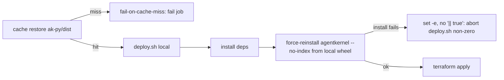

# #542: Fail loudly when integration tests can't use the branch-built agentkernel wheel

The nightly/weekly/reusable integration workflows are meant to test the `agentkernel` wheel
built from the checked-out commit, but on a cache miss the deploy silently falls back to the
PyPI release and reports results against the wrong build. This change makes that impossible by
adding two independent guard layers: fail the cache restore on a miss, and fail `deploy.sh`
when the local-wheel install fails. Evidence for every claim below is in
[`research/issue_findings.md`](./research/issue_findings.md).

## Motivation

- A cache miss on `ak-py-<sha>` currently produces a false green (or unexplained failures)
  with no visible error. Root causes, all verified:
  - **No `fail-on-cache-miss`.** All six `actions/cache/restore@v5` steps that restore
    `ak-py/dist` continue silently on a miss.
    - `integration-test.yaml:87, :195`
    - `integration-test-weekly.yaml:93, :205`
    - `test-reusable.yaml:142, :179` (not named in the original issue — same defect)
  - **`|| true` swallows the local-wheel install.** 22 of 27 `deploy.sh` scripts end the
    `--force-reinstall --no-index` line with `|| true`, so its failure never propagates
    (e.g. `examples/aws-serverless/openai/deploy/deploy.sh:13`).
  - **Missing `set -e`.** Only 12 of 27 scripts set `-e`; a mid-script install failure does
    not abort the run (e.g. `examples/memory/redis/deploy/deploy.sh`,
    `examples/aws-containerized/adk/deploy/deploy.sh`).
  - **Version equivalence hides the swap.** `ak-py/pyproject.toml` is `0.6.1`; examples pin
    `agentkernel[...]>=0.6.1`, so a PyPI `0.6.1` satisfies the pin identically.
- The failure is checkable end-to-end: `run_single_test.py` runs `./deploy.sh local` with
  `check=True` (`.github/scripts/run_single_test.py:228, :377, :529`), so a nonzero
  `deploy.sh` exit *does* fail the deploy step — the scripts just never return nonzero today.
- `uv` behaviour (tested, `uv 0.11.21`): `--find-links` at a **missing** directory exits `2`;
  at an **empty** directory the non-`--no-index` pass resolves `agentkernel` from PyPI (exit
  `0`) and only the `--no-index` pass fails (exit `1`). So the silent-swap severity differs by
  script shape:
  - `aws-serverless/streaming-openai` and `aws-serverless/websocket-openai` have **no
    `--find-links` on the first pass**, so on a full miss they cleanly install PyPI `0.6.1`
    and the `--no-index` failure is swallowed — a clean false green, despite having `set -e`.
  - The other cache-dependent scripts fail the first pass on a full miss, degrading to a noisy
    crash (no `set -e`) or a loud abort (`set -e`) rather than a clean green — but still hit
    the silent swap when the cache is present-but-empty.
- Six scripts already self-build ak-py via `build.sh` inside `deploy.sh` and are cache-miss
  immune (e.g. `azure-serverless/openai/deploy/deploy.sh`,
  `gcp-serverless/openai-firestore/deploy/deploy.sh`).

## Design idea

Two independent guards, either of which alone prevents a wrong-build test run:

## Requirements

### Guard 1 — cache restore fails on a miss

- Add `fail-on-cache-miss: true` to every `actions/cache/restore@v5` step that restores
  `ak-py/dist`, in all three workflows (six steps, listed under Motivation).
- Behaviour after change: a missing `ak-py-<sha>` entry fails the restore step immediately, so
  the deploy job never proceeds against an absent wheel.
- The corresponding `actions/cache/save@v5` steps in `build-ak-py` are unchanged.

### Guard 2 — `deploy.sh` fails when the local wheel can't be installed

- Every `deploy.sh` that force-reinstalls the local wheel must:
  - Have `set -e` near the top (before the first command that can fail).
  - **Not** end the `--force-reinstall ... --no-index ...` line with `|| true`.
- Behaviour after change: a failed `--no-index` local-wheel install returns nonzero, aborts
  the script before `terraform apply`, and fails the deploy step via `run_single_test.py`'s
  `check=True`.
- The install block should follow the reference `examples/azure-serverless/openai/deploy/deploy.sh`
  shape: a deps pass, then a `--force-reinstall --no-deps --no-index --find-links ../../../ak-py/dist`
  pass with `--no-cache-dir` and no `|| true`.
- Scope of scripts to normalize (subject to the open question on breadth):
  - The 22 scripts with `|| true` on the `--no-index` line → remove it.
  - The scripts lacking `set -e` → add it.
  - `streaming-openai` and `websocket-openai` specifically: their `--no-index` passes must not
    be swallowed (each has four such passes across its Lambda targets).

### Consistency

- All normalized `deploy.sh` scripts share one install-block shape so the same failure mode
  cannot silently reappear in one script while fixed in others.
- Acceptance: no `deploy.sh` invoked with `local` can ship a PyPI-sourced `agentkernel`.

### Verification (acceptance criteria)

- A cache miss on `ak-py-<sha>` fails the deploy job immediately instead of proceeding.
- A failed local-wheel install fails `deploy.sh` before `terraform apply` runs.
- All example deploy scripts behave consistently (`set -e`, no `|| true` on the local-wheel
  install).
- A workflow run can never report results against a PyPI-sourced `agentkernel` when invoked
  with `deploy.sh local`.

## Non-goals

- Redesigning the build/cache architecture (build once in `build-ak-py`, restore per job). The
  fix keeps this design and only makes its failure modes loud.
- Converting cache-dependent scripts to self-build ak-py inside `deploy.sh`.
- Changing the published version, the `>=0.6.1` pins, or the `agentkernel` extras any example
  installs.
- Touching the six already-immune self-building scripts' build logic.

## Open questions

- **Normalization breadth.** Minimal edits (only remove `|| true`, only add `set -e` where
  missing) vs. rewriting all 27 install blocks to one canonical shape (matching the reference,
  incl. `--no-cache-dir`)? Recommendation: full normalization — the acceptance criterion
  "behave consistently" is otherwise not met, and divergent shapes are how this bug arose.
- **Optional provenance assertion.** Should `deploy.sh` assert the installed wheel's origin
  (e.g. verify `agentkernel` in `dist/data` came from `ak-py/dist`, or check a build-metadata
  marker) before `terraform apply`, as a third guard? Recommendation: defer unless Guards 1–2
  are judged insufficient — it adds per-script complexity for a case the two guards already
  close.
- **Self-building scripts.** Leave the six `build.sh`-in-`deploy.sh` scripts as-is (immune but
  inconsistent, and redundant with the CI `build-ak-py` job), or fold them into the cache-based
  shape for uniformity? Recommendation: leave as-is for this fix; track separately.
- **First-pass `--find-links` on Group B.** Add `--find-links ../../../ak-py/dist` to the
  first-pass install in `streaming-openai`/`websocket-openai` for shape-consistency, or rely
  solely on the un-swallowed `--no-index` pass? Either closes the bug once `|| true` is gone.
