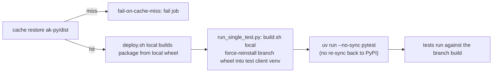

# #542: Fail loudly when integration tests can't use the branch-built agentkernel wheel

The nightly/weekly/reusable integration workflows are meant to test the `agentkernel` wheel
built from the checked-out commit, but on a cache miss the deploy silently falls back to the
PyPI release and reports results against the wrong build. This change makes that impossible and,
in the process, unblocks the integration suite end-to-end. Evidence for the original diagnosis is
in [`research/issue_findings.md`](./research/issue_findings.md).

> **Approach note (as implemented).** The original design proposed normalizing the local-wheel
> install line across all 27 example `deploy/deploy.sh` and all 64 example `build.sh` scripts.
> During implementation that broad, per-script rewrite was **abandoned and reverted** (the example
> `build.sh`/`deploy.sh` were restored to `develop`) in favour of a smaller, centralized fix that
> the same integration harness applies to every test: the wheel is force-reinstalled into the test
> client's venv from one place — `run_single_test.py` — and `uv run` is prevented from reverting it.
> This document describes the change **as built and tested**. Where it differs from the earlier
> plan, the earlier plan is superseded.

## Motivation

- A cache miss on `ak-py-<sha>` currently produces a false green (or unexplained failures) with no
  visible error. Two independent gaps allow it:
  - **No `fail-on-cache-miss`.** All six `actions/cache/restore@v5` steps that restore
    `ak-py/dist` continue silently on a miss:
    - `integration-test.yaml:88, :196`
    - `integration-test-weekly.yaml:93, :205`
    - `test-reusable.yaml:142, :179` (not named in the original issue — same defect)
  - **The test client re-resolves `agentkernel` from PyPI.** For the AWS deployment tests, the
    *deployment package* is built from the local wheel, but the **test client** that runs `pytest`
    against the deployed endpoint has its own venv. `uv run pytest` re-syncs that venv from
    `uv.lock`, which pins `agentkernel` to `source = { registry = "https://pypi.org/simple" }`. So
    the client imports the **published** wheel, not the branch wheel — and a `config.yaml` that
    uses a feature only present locally (e.g. `session.type: valkey`, added after the `0.6.1`
    release) fails validation at import, or worse, silently passes against the wrong code.
  - **`|| true` / stale uv cache on the deployment packager.** The canonical `deploy.sh` template
    force-reinstalls the local wheel with a trailing `|| true`, which forces a zero exit even when
    the install fails, and without `--no-cache-dir` uv can serve a cached same-version `0.6.1`
    wheel from a prior PyPI download instead of the wheel in `--find-links`.
- Version equivalence hides the swap: `ak-py/pyproject.toml` is `0.6.1` and examples pin
  `agentkernel[...]>=0.6.1`, so PyPI's `0.6.1` satisfies the pin identically and no error surfaces.
- Once the branch wheel is actually used, the `memory/valkey` integration test surfaced two
  **real, previously-masked** failures that had to be fixed for the suite to pass (see
  [Additional fixes](#additional-fixes-uncovered-once-the-branch-wheel-is-used)).
- Separately, the AWS serverless integration deploys were blocked by API Gateway **access
  logging**, which requires an account-level CloudWatch Logs role (`aws_api_gateway_account`) — a
  per-account+region singleton not provisioned in the CI account. This is fixed by making access
  logging opt-in (see [Guard 3](#guard-3--api-gateway-access-logging-is-opt-in)).

## Design idea

Three independent guards, plus the dependency corrections needed to make the suite green:

## Requirements

### Guard 1 — cache restore fails on a miss

- Add `fail-on-cache-miss: true` to every `actions/cache/restore@v5` step that restores
  `ak-py/dist`, in all three workflows (six steps, listed under Motivation).
- Behaviour after change: a missing `ak-py-<sha>` (or `ak-py-<checkout_ref>`) entry fails the
  restore step immediately, so the job never proceeds against an absent wheel.
- The corresponding `actions/cache/save@v5` steps in the build jobs are unchanged
  (`fail-on-cache-miss` is a restore-only input; saving must still succeed on a first build).

### Guard 2 — the test client runs against the branch wheel, not PyPI

Rather than editing every example script, the fix is centralized in the integration harness
(`.github/scripts/run_single_test.py`) so it applies uniformly to every AWS deployment test:

- **Before running `pytest`**, the harness runs `./build.sh local` in the example directory. This
  force-reinstalls `agentkernel` from `../../../ak-py/dist` into the test client's venv, mirroring
  how the deployment package itself is built by `deploy.sh local`.
- **`pytest` runs under `uv run --no-sync`.** `--no-sync` stops `uv run` from re-syncing the venv
  from `uv.lock`, which would otherwise revert the just-installed branch wheel back to the PyPI
  version (the two share the `0.6.1` version string, so a normal re-sync silently swaps it back).
- The canonical `deploy.sh` template (documented in
  [`docs/docs/deployment/aws-serverless.md`](../../docs/deployment/aws-serverless.md)) has its
  force-reinstall lines changed from `... || true` to `... --no-cache-dir`, so a failed install is
  no longer swallowed and a stale uv cache cannot mask a bad wheel in the deployment package.
- Behaviour after change: the client that asserts against the deployed endpoint imports the branch
  `agentkernel`; a wheel that cannot be installed fails the step (the harness runs every subprocess
  with `check=True`).

> **Deviation from the original plan (intentional).** The proposed broad normalization — removing
> `|| true` and adding `set -e`/`--no-cache-dir` across all 27 `deploy.sh` and all 64 `build.sh`
> scripts — was **not** shipped; those files were reverted to `develop`. The centralized
> `run_single_test.py` fix covers the surface the tests actually exercise, at a fraction of the
> churn, and does not risk changing what each Lambda artifact ships. A repo-wide script
> normalization can be tracked separately if still wanted.

### Additional fixes (uncovered once the branch wheel is used)

With the correct wheel installed, the `memory/valkey` example exposed two genuine problems in its
own dependency set that had been masked by the PyPI substitution. Both are fixed in
`examples/memory/valkey/pyproject.toml` (and reflected in `uv.lock`):

- **`valkey` is required directly.** Published `agentkernel 0.6.1` does not declare a `valkey`
  extra (added after release), so `agentkernel[valkey]` resolves to nothing from PyPI. Add
  `valkey>=6.0.0` as a direct dependency so it is always installed into the Lambda package.
- **`langchain-community` is pinned to `0.4.1`.** `ragas` (pulled in by the `test` extra) imports
  `langchain_community.chat_models.vertexai.ChatVertexAI`, which was removed in
  `langchain-community 0.4.2`. Pinning `==0.4.1` keeps that import resolvable. (This is the
  ragas/langchain-community incompatibility the original spec had flagged as out-of-scope; it is
  now actually fixed, because the branch wheel makes the `valkey` test collectible at all.)
- **Lockfile follow-through.** `uv.lock` re-resolves accordingly (notably `aiohttp` `3.14.1` →
  `3.14.2` and the associated Python-version constraint updates). No example `pyproject.toml`
  version bump or `agentkernel` pin change.

### Guard 3 — API Gateway access logging is opt-in

The AWS serverless integration deploys failed because API Gateway access logging depends on the
account-level CloudWatch Logs role (`aws_api_gateway_account`), which is a **singleton per AWS
account + region** and is not provisioned in the CI account. Make logging opt-in so CI (and any
account without that role) can deploy cleanly:

- Add a boolean variable `enable_api_gateway_logs` (default `false`) at the root serverless module
  (`ak-deployment/ak-aws/serverless/variables.tf`) and thread it through `state.tf` to both the
  `api-gateway` and `websocket-api-gateway` modules.
- When `false`:
  - the REST `api-gateway` module creates **no** CloudWatch log group (`count = 0`) and adds **no**
    `access_log_settings` on the stage (via a `dynamic` block);
  - the `websocket-api-gateway` module passes `stage_access_log_settings` **and**
    `stage_default_route_settings` as `null` (not `{}`) to the upstream
    `terraform-aws-modules/apigateway-v2` module — `{}` would be treated as "enabled" and default
    `create_log_group` to `true`;
  - the `shared-api-gateway-resources` module (which provisions `aws_api_gateway_account`) is gated
    with `count = var.enable_api_gateway_logs ? 1 : 0` in `state.tf`, so the singleton account role
    is only created when logging is requested.
- The two log-group ARN/name outputs on each module return `null` when logging is disabled.
- Module READMEs document the toggle, including the singleton caveat: enabling it in more than one
  deployment in the same account/region contends over `aws_api_gateway_account`, and disabling it
  after it was enabled **destroys** that account role, which can affect other REST APIs.

## Non-goals

- Redesigning the build/cache architecture (build once, restore per job). The fix keeps this design
  and only makes its failure modes loud.
- The broad, per-script normalization of all example `deploy.sh`/`build.sh` (removing `|| true`,
  adding `set -e`/`--no-cache-dir` everywhere). This was explored, reverted, and replaced by the
  centralized `run_single_test.py` fix; it can be tracked as separate hygiene work.
- Changing the published `agentkernel` version, the `>=0.6.1` pins, or the extras any example
  installs (the added `valkey`/`langchain-community` entries are example-local dependency fixes,
  not `agentkernel` changes).
- Enabling API Gateway access logging by default, or provisioning `aws_api_gateway_account`
  outside the opt-in path.

## Verification (acceptance criteria)

- A cache miss on `ak-py-<sha>` fails the deploy/test job immediately at the restore step instead
  of proceeding (Guard 1).
- The AWS deployment tests' client imports the **branch** `agentkernel`: after
  `run_single_test.py` runs `./build.sh local` and `uv run --no-sync pytest`, the venv's
  `agentkernel/core/config.py` accepts `session.type: valkey` (the branch build), and a wheel that
  cannot be installed fails the step rather than falling back to PyPI (Guard 2).
- `examples/memory/valkey` collects and runs its tests: `valkey` is installed and the
  `ragas`/`langchain-community` import resolves (Additional fixes).
- `terraform` plans/applies for the AWS serverless deployment with `enable_api_gateway_logs` unset
  (default `false`) without requiring the account-level CloudWatch role, and with it set to `true`
  the log group and access logging are created (Guard 3).
