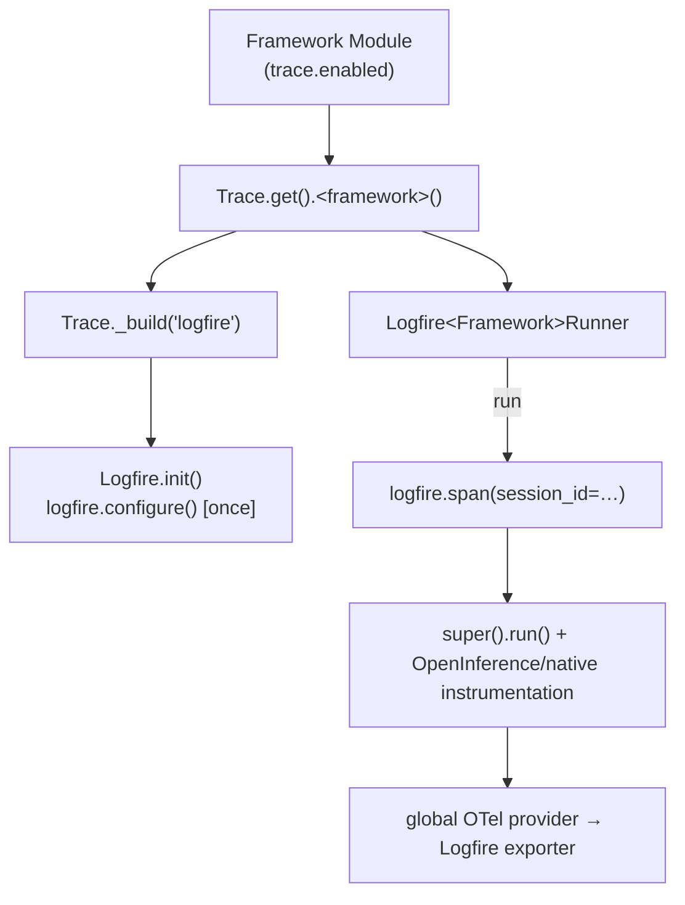

# #545: Add Pydantic Logfire as a tracing provider

Add a third built-in observability backend, **Logfire** (Pydantic's OpenTelemetry-based platform),
alongside Langfuse and OpenLLMetry, enabled with `trace.type: logfire`. Logfire configures the
global OpenTelemetry tracer provider once at startup; per-framework traced runners wrap each agent
run in a Logfire span and activate the framework's deep instrumentation, mirroring the existing
provider structure.

## Motivation

- The trace subsystem already supports two backends and a bring-your-own dotted path, and adding a
  third is a closed, well-scoped extension:
  - `BaseTrace` declares `init()` + one method per framework (`openai`, `langgraph`, `crewai`, `adk`,
    `smolagents`), all `@abstractmethod` (`trace/base.py:7-47`).
  - The factory `Trace._build()` resolves built-ins by `if/elif` + `require_extra`-wrapped lazy import,
    and anything with a `.` as a dotted `BaseTrace` subclass (`trace/trace.py:37-53`); `_BUILTIN_TRACERS`
    lists the built-ins (`trace/trace.py:8`).
  - Each framework Module selects the traced runner transparently: `Trace.get().<framework>()` when
    `trace.enabled` (e.g. `framework/openai/openai.py:302-307`, `framework/adk/adk.py:337`,
    `framework/langgraph/langgraph.py:459`, `framework/crewai/crewai.py:555`,
    `framework/smolagents/smolagents.py:303`).
- Logfire is a natural fit for this shape and complements the existing two:
  - It is "an opinionated wrapper around OpenTelemetry" — `logfire.configure()` installs the global
    OTel tracer provider and exporter, so any OTel/OpenInference instrumentor active in the process
    emits into Logfire. This is the same mechanism Langfuse 4.x relies on (see
    `research/logfire-provider.md`).
  - It ships a native `logfire.instrument_openai_agents()` for the OpenAI Agents SDK, and
    `logfire.span(...)` is a direct analog of Langfuse's `start_as_current_observation(...)`.
- The two existing providers already bracket the two integration styles Logfire needs:
  - Langfuse — a client/observation object plus OpenInference instrumentors per framework
    (`trace/langfuse/openai.py:23`, `trace/langfuse/crewai.py:24-25`, `trace/langfuse/adk.py:23`).
  - OpenLLMetry — a global, once-guarded init (`TraceloopContext.initialize_global`,
    `trace/openllmetry/openllmetry.py:43-55`) and no-arg runners that only wrap `super().run()`
    (`trace/openllmetry/openai.py:19-30`). Logfire follows OpenLLMetry's no-arg runner shape with
    Langfuse-style span wrapping.

## Requirements

### Provider package (`trace/logfire/`, new)

- New package mirroring `trace/langfuse/` and `trace/openllmetry/`: empty `__init__.py`, a `logfire.py`
  main class, and one runner module per framework (`openai.py`, `langgraph.py`, `crewai.py`, `adk.py`,
  `smolagents.py`).
- `Logfire(BaseTrace)` in `trace/logfire/logfire.py`:
  - `init()` calls `logfire.configure(service_name="AgentKernel", send_to_logfire="if-token-present")`
    exactly once, guarded by a class-level `threading.Lock` + `bool` flag.
    - Once-guard is required: every framework Module constructor calls `Trace.get()`, which calls
      `init()` — so `init()` runs once per Module. Matches `TraceloopContext.initialize_global`
      (`trace/openllmetry/openllmetry.py:43-55`).
    - `send_to_logfire="if-token-present"` → ships to Logfire only when `LOGFIRE_TOKEN` is set,
      otherwise runs locally with no error (see Open questions → resolved).
  - `openai/langgraph/crewai/adk/smolagents()` each lazily import and return the matching no-arg
    traced runner (same pattern as `trace/openllmetry/openllmetry.py:103-141`).
- `import logfire` inside `trace/logfire/logfire.py` (and runner modules) resolves to the third-party
  top-level package, not the sibling `agentkernel.trace.logfire` package — identical to Langfuse's
  `from langfuse import Langfuse` in `trace/langfuse/langfuse.py:5`.

### Traced runners (`trace/logfire/<framework>.py`)

- Each runner subclasses the framework's base `Runner` and wraps `super().run(...)` in a
  `logfire.span("Agent Kernel <Framework>", session_id=session.id)` context, then sets `input`
  (`result.prompt`) and `output` (`str(result)`) span attributes — matching Langfuse's
  `span.update(input=..., output=...)` (`trace/langfuse/openai.py:36-39`).
- Exceptions from `super().run(...)` propagate out of the `with` block; Logfire records the exception
  and sets error status automatically on span exit (standard OTel behavior). No explicit try/except —
  matches the Langfuse/OpenLLMetry runners, which do not catch (`trace/langfuse/smolagents.py:30-33`).
- Deep (LLM/tool-level) instrumentation is activated in each runner's `__init__`, reusing the
  OpenInference instrumentors already shipped by the framework extras (so the `logfire` extra stays
  minimal — see Open questions → resolved):

  | Framework | Deep instrumentation activated in `__init__` | Source extra |
  |---|---|---|
  | OpenAI | `logfire.instrument_openai_agents()` (Logfire native) | `logfire` |
  | CrewAI | `CrewAIInstrumentor().instrument(skip_dep_check=True)` + `LiteLLMInstrumentor().instrument()` | `crewai` |
  | Google ADK | `GoogleADKInstrumentor().instrument()` | `adk` |
  | LangGraph | none — session span only | — |
  | Smolagents | none — session span only | — |

  - LangGraph and Smolagents are span-level under Logfire. Smolagents matches Langfuse today
    (`trace/langfuse/smolagents.py` activates no instrumentor). LangGraph is intentionally shallower
    than Langfuse (whose depth comes from a Langfuse-specific `CallbackHandler`,
    `trace/langfuse/langgraph.py:24`, which has no Logfire analog and no OpenInference instrumentor in
    the `langgraph` extra) — deep LangGraph tracing is a Non-goal / follow-up.

### Factory registration (`trace/trace.py`)

- Add `"logfire"` to `_BUILTIN_TRACERS` (`trace/trace.py:8`).
- Add an `if trace_type == "logfire":` branch in `_build()` importing `Logfire` inside
  `require_extra("logfire", "trace.type: logfire")`, so a missing SDK raises the friendly
  `pip install "agentkernel[logfire]"` `ImportError` (matches `trace/trace.py:41-50`).
- No change to `BaseTrace` (all six methods already declared) or to the disabled/BYO paths.

### Configuration (`core/config.py`)

- `_TraceConfig.type` stays a free-form `str` with default `langfuse` (`core/config.py:267-270`);
  only its `description` gains `logfire` in the built-in list. No `pattern=` (would break BYO).

### Optional dependency (`pyproject.toml`)

- New extra `logfire = ["logfire>=3.0"]` (floor covers `instrument_openai_agents`; latest is 4.x,
  requires Python ≥3.10 ⊇ AK's 3.12+). No OpenInference packages added here — they already live in the
  framework extras that a Logfire user installs to run that framework.

### Example (`examples/cli/logfire/`)

- A CLI OpenAI example (modeled on `examples/cli/openai/`) that enables Logfire via a `config.yaml`
  (`trace.enabled: true`, `trace.type: logfire`), depends on `agentkernel[cli,openai,logfire]`, and a
  README documenting `LOGFIRE_TOKEN` setup and local (token-less) mode.

### Tests

- Extend `tests/test_trace.py`: a `logfire` missing-extra test asserting the friendly
  `agentkernel[logfire]` `ImportError` (mirrors the langfuse/openllmetry tests, `test_trace.py:81-97`).
- New `tests/test_trace_logfire.py` (mocks the `logfire` module): factory builds `Logfire` for
  `type: logfire`; `init()` configures exactly once; a runner wraps `super().run()` in a span and sets
  `input`/`output`; an exception propagates to the span on exit; the OpenAI runner calls
  `logfire.instrument_openai_agents()`; every runner subclasses its framework base.

### Documentation

- Add a Logfire section to `docs/docs/advanced/traceability.md` (install, config, `LOGFIRE_TOKEN`,
  what gets traced, coverage table, troubleshooting) alongside the Langfuse and OpenLLMetry sections.

## Component relationships

## Non-goals

- Wrapping streaming runs (`execution.mode: stream`) in the session span. The traced runners override
  `run()` only, so under stream mode `Runtime.stream()` calls the inherited `stream()` and there is no
  "Agent Kernel <Framework>" span or `session_id` attribute (deep instrumentation still emits LLM/tool
  spans where active). This matches the Langfuse and OpenLLMetry runners — no code change is expected.
- Deep LangGraph and Smolagents instrumentation under Logfire (span-level only for now).
- Changing the disabled path, the BYO dotted-path path, or the `BaseTrace` interface.
- Changing the default `trace.type` (stays `langfuse`).
- OTel baggage propagation of `session_id` into child instrumentor spans (the wrapping span is their
  parent, which is sufficient for correlation).
- Adding OpenInference packages to the `logfire` extra (reused from framework extras).

## Open questions

- None outstanding.
  - **Resolved — behavior when `LOGFIRE_TOKEN` is unset.** Configure with
    `send_to_logfire="if-token-present"`: run locally without error rather than raising like Langfuse's
    `auth_check()` (`trace/langfuse/langfuse.py:25-28`). Logfire supports token-less/local and
    export-to-any-OTLP-backend modes; failing hard would be wrong for those.
  - **Resolved — where the OpenInference instrumentors come from.** Reuse the ones in the framework
    extras (OpenAI-agents, CrewAI, LiteLLM, Google-ADK); keep the `logfire` extra minimal. A Logfire
    user already installs the framework extra to run that framework, guaranteeing the instrumentor is
    present (same assumption the Langfuse runners make, `trace/langfuse/crewai.py:5-6`).
  - **Resolved — repeated `init()`.** Once-guard `logfire.configure()` with a class-level lock + flag,
    since each Module constructor triggers `init()`.
  - **Resolved — OpenAI instrumentation source.** Use Logfire's native
    `logfire.instrument_openai_agents()` rather than the OpenInference instrumentor — it is the
    idiomatic Logfire path and needs nothing beyond the `logfire` extra.
