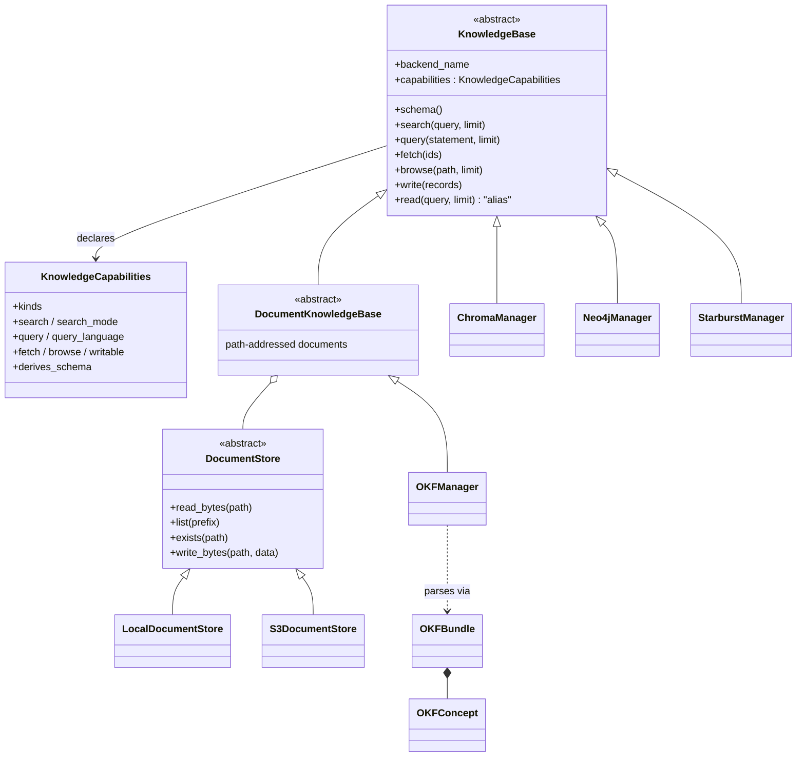

# #553: Open Knowledge Format support and the knowledge-base architecture refactor

Splits the knowledge-base layer along three independent axes — **representation** (what the knowledge
*is*), **capability** (what a backend can *do* with it), and **storage** (where the bytes *live*) —
then adds Open Knowledge Format as the first representation that exercises all three: an OKF bundle
is parsed by format code that knows nothing about storage, served over a `DocumentStore` that knows
nothing about OKF, and exposed to agents through the same `KnowledgeBuilder` tools every other
backend uses. The one-sentence design idea: **a backend's shape becomes declared data
(`KnowledgeCapabilities`), not a class hierarchy**, so the KB tier can grow new kinds of knowledge
without growing new abstract base classes.

Supporting research: [`research/okf-format-survey.md`](research/okf-format-survey.md) — what OKF is,
what it binds a consumer to, and which of its properties drive the decisions below.

## Motivation

### The current contract has one retrieval hole, and OKF needs three

- `KnowledgeBase` exposes exactly one retrieval operation, `read(query, limit)` (`base.py:84`), so
  every backend must express its whole retrieval surface as one string.
  - Chroma treats it as a semantic query (`chroma.py:111`), Neo4j as Cypher (`neo4j.py:138-143`),
    Starburst as SQL (`starburst.py:184`). Three unrelated languages behind one signature, with
    nothing on the object saying which.
  - OKF's identity *is* the file path (`research/okf-format-survey.md` §2), so an agent must be able
    to **fetch by id** and **browse a namespace**. Neither is expressible as `read(query)`.
- There is no machine-readable statement of what a backend supports. The constraints exist, but only
  as prose in a hand-written schema dict (`examples/cli/knowledgebase/openai/starburst/demo.py:49-52`
  declares `"write_supported": false` as free text the runtime never reads) and as inconsistent
  runtime failures:
  - `StarburstManager.write` raises `NotImplementedError` (`starburst.py:141`).
  - `StarburstManager.read` returns `[]` for a rejected statement (`starburst.py:178`) and `[]` again
    for a genuine query failure (`starburst.py:227`) — indistinguishable from "no results".
  - `ChromaManager` and `Neo4jManager` accept writes with no declared constraint at all.

### The router leaks one backend's dialect into the shared tool

- `KnowledgeBuilder.write_kb` writes Neo4j-specific metadata keys for **every** backend: it sets
  `cypher_query` and `cypher_params` alongside the generic `query`/`params` on all writes
  (`knowledgebuilder.py:156-166`), because `Neo4jManager.write` reads only the `cypher_*` spelling
  (`neo4j.py:120-121`). A Chroma write carries dead Cypher keys in its stored metadata.
- `get_schemas` calls `backend.schema()` for every backend inside one `json.dumps`
  (`knowledgebuilder.py:105`) with no per-backend guard — while its sibling
  `get_all_kb_descriptions` does guard each backend (`knowledgebuilder.py:185-187`). Since
  `schema()` raises `ValueError` when `add_schema()` was never called (`base.py:57-58`), one
  unconfigured backend makes the agent's first tool call raise into the framework.

### Schemas must be hand-written, but OKF bundles carry their own

- `schema()` returns only what the application passed to `add_schema()`, merged under
  `{"backend": name}` (`base.py:60-62`), and hard-fails when nothing was passed (`base.py:57-58`).
- An OKF bundle already declares its own concept types, index, and version
  (`research/okf-format-survey.md` §3, §6). Requiring a deployment to hand-transcribe that into a
  dict would guarantee drift between the bundle and what the agent is told about it.

### Record and result shapes cannot carry OKF's provenance

- `Record` is `Mapping[str, Any]` (`base.py:4`) and the default `format_results` renders only
  `text` plus `metadata["source"]` (`base.py:103`).
- OKF's load-bearing fields — path identity, `type`, trust tier, `stale_after`, `sources[]` — have
  nowhere to go that survives to the agent (`research/okf-format-survey.md` §3).

### The package is not importable the way it is documented

- `knowledgebase/__init__.py` is a single comment line and exports nothing, while
  `docs/docs/core-concepts/overview.md:353` documents `from agentkernel.knowledgebase import
  KnowledgeBase`. That import fails today.
- There are no tests for the knowledge-base tier anywhere under `ak-py/tests/` (the suite has files
  for every other pluggable tier), so nothing pins the contract this change refactors.

### The house patterns this change should have been using already exist

- Honest per-backend capability declaration plus optional operations that raise a typed error:
  `SandboxCapabilities` (`sandbox/model.py:33-48`) and `Sandbox.execute_command` /
  `upload_file` defaulting to `SandboxCapabilityError` (`sandbox/base.py:39-69`).
- Backend-selection factories: `resolve_dotted` / `require_extra` / `AKConfigError`
  (`core/util/factory.py:18,26,50`).
- Reusable conformance suites for pluggable tiers: `SandboxProviderContract`
  (`sandbox/testing.py:130`) and `QueueTransportContract` (`pipeline/testing.py`).
- Lazy public exports that keep optional dependencies optional: the PEP 562 `__getattr__` map in
  `deployment/aws/__init__.py` behind `agentkernel/aws.py`.
- Refusing to fetch remote references from inside a framework component, for SSRF reasons:
  `core/multimodal/hooks.py:41,344`.

## Design shape

Three axes, each replaceable without touching the other two:

| Axis | Question | Owns | Knows nothing about |
|---|---|---|---|
| **Representation** | What is this knowledge? | `OKFBundle` / `OKFConcept` parsing, frontmatter families, links, trust tiers | where bytes come from |
| **Capability** | What can I do with it? | `KnowledgeCapabilities`, the operation set, `KnowledgeCapabilityError` | any specific backend |
| **Storage** | Where are the bytes? | `DocumentStore`: `LocalDocumentStore`, `S3DocumentStore` | markdown, YAML, OKF |

## Requirements

### Capability declaration

- Add `KnowledgeCapabilities` (pydantic `BaseModel`, `knowledgebase/model.py`), declared as a
  `ClassVar`-style attribute on every backend, mirroring `SandboxCapabilities`
  (`sandbox/model.py:33-48`).
  - `kinds: list[str]` — advisory taxonomy surfaced to the agent, an **open list** whose conventional
    values are `vector`, `structured`, `graph`, `document`; an out-of-tree backend may declare its own
    kind without a framework release, and unknown values reach the agent unchanged. A backend may
    declare more than one (Neo4j declares `["graph", "structured"]`).
  - `search: bool` and `search_mode: "semantic" | "lexical" | None` — relevance retrieval, and
    honestly which kind. Chroma is `semantic`; OKF is `lexical`.
  - `query: bool` and `query_language: str | None` — e.g. `"cypher"`, `"sql"`. `query=True` requires
    a non-empty `query_language`.
  - `fetch: bool` — retrieval by identity.
  - `browse: bool` — enumeration of the backend's namespace.
  - `writable: bool`.
  - `derives_schema: bool` — whether `schema()` can self-describe without `add_schema()`.
- Declared values must be true of the instance: a backend declaring `fetch=True` must override
  `fetch()`. Verified by the contract suite (below), not by trust.
- **Invariant, enforced at construction**: at least one of `search`, `query`, `fetch` is `True`,
  otherwise the backend is unreachable through `read_kb`. Violation raises `ValueError` naming the
  backend.
- Declaring `kinds` as data — rather than as `VectorKB` / `StructuredKB` / `FileSystemKB` base
  classes — is the load-bearing choice; see [Deviations from the proposed class
  diagram](#deviations-from-the-proposed-class-diagram).

### Operation set on `KnowledgeBase`

- Retain the existing abstract members unchanged: `backend_name`, `connect()`, `get_description()`,
  and the provided `add_schema()` / `format_results()` / `close()`.
- Four retrieval/write operations, each **optional** with a base implementation that raises
  `KnowledgeCapabilityError(backend_name, operation)` — the `sandbox/base.py:39-69` shape:

  | Operation | Signature | Declared by |
  |---|---|---|
  | `search` | `(query: str, limit: int = 3) -> list[Record]` | `capabilities.search` |
  | `query` | `(statement: str, limit: int = 3) -> list[Record]` | `capabilities.query` |
  | `fetch` | `(ids: list[str]) -> list[Record]` | `capabilities.fetch` |
  | `browse` | `(path: str = "", limit: int = 50) -> list[Record]` | `capabilities.browse` |
  | `write` | `(records: Iterable[Record], **kwargs) -> None` | `capabilities.writable` |

- `read(query, limit)` becomes a **concrete** method on the base that delegates to `query()` when
  `capabilities.query_language` is set, else to `search()`.
  - Keeps `read_kb` and every external caller working with no signature change.
  - A subclass that still overrides `read()` — including any application's own backend — keeps
    winning, so bring-your-own backends written against today's ABC need no edit.
- Add `knowledgebase/errors.py` with `KnowledgeError` and `KnowledgeCapabilityError`, matching
  `sandbox/errors.py`. `KnowledgeCapabilityError` replaces `StarburstManager`'s ad-hoc
  `NotImplementedError` (`starburst.py:141`).

### Records and result formatting

- `Record` stays `Mapping[str, Any]` (`base.py:4`) — no runtime shape change, so no existing backend
  or user subclass is invalidated.
- Add a `KnowledgeRecord` `TypedDict` (`total=False`) documenting the **reserved metadata keys** a
  backend may set, so richer representations have a defined place:
  - `id` — the backend-native identity (an OKF bundle path). Required in any record a `fetch`-capable
    backend returns, because it is what the agent passes back to `fetch`.
  - `source`, `title`, `kind`, `trust`, `stale`, `links`.
  - Unknown keys are carried through untouched — asserted by the contract suite.
- `format_results` (`base.py:94-103`) keeps its current output for records that carry only
  `text`/`metadata.source`, and gains an `id` prefix when `metadata["id"]` is present. Backends may
  override; `OKFManager` does.

### Schema derivation

- `schema()` gains a `_derived_schema() -> Mapping[str, Any]` hook, defaulting to `{}`.
  - Final schema = `{"backend": name}` + `_derived_schema()` + `_dynamic_schema`, in that order —
    an explicit `add_schema()` value always wins over a derived one.
  - Also add `"capabilities": capabilities.model_dump()` so the agent is told what the backend can do
    from the same call it already makes.
- The hard failure at `base.py:57-58` is relaxed: it raises only when the schema is empty **and**
  `capabilities.derives_schema` is `False`. A backend that self-describes needs no `add_schema()`.
- `OKFManager._derived_schema()` returns the bundle's own `okf_version`, the distinct `type` values
  present, the top-level directory names, concept count, and the reserved-file inventory — read from
  the loaded bundle, never hand-transcribed.

### Storage layer — `DocumentStore`

- New `knowledgebase/store/` package. `DocumentStore` is an ABC over a path namespace, with **no
  knowledge of markdown, YAML, or OKF**:
  - `read_bytes(path) -> bytes`, `exists(path) -> bool`, `list(prefix: str = "") -> list[str]`,
    `write_bytes(path, data) -> None`, `close() -> None`.
  - `writable: bool` property — `S3DocumentStore` over a read-only prefix declares `False`, and the
    KB above it folds that into `capabilities.writable`.
  - Paths are POSIX-style and **bundle-relative**; the store owns the mapping to a filesystem path or
    an object key.
- `LocalDocumentStore(root: str)` — local filesystem. No extra required (stdlib only).
- `S3DocumentStore(bucket: str, prefix: str = "", region: str | None = None, client=None)` — requires
  the existing `aws` extra (`boto3>=1.41.4`, already in `pyproject.toml`); no new extra.
  - `list()` paginates; `read_bytes` maps `NoSuchKey` to `FileNotFoundError` so the layer above sees
    one exception type regardless of store.
- `DocumentStore.from_uri(uri)` resolves `file://…` / a bare path → `LocalDocumentStore`, `s3://bucket/prefix`
  → `S3DocumentStore`, and any other value as a dotted path via `resolve_dotted`
  (`core/util/factory.py:26`), raising `AKConfigError` otherwise.
  - This is what makes local-in-dev / S3-in-prod a one-environment-variable change without the KB
    tier gaining an `AKConfig` section (see [Decisions](#decisions) 1).
- Stores take **explicit constructor parameters and never read `AKConfig`**, matching the shared-driver
  and transport rules.

### Representation layer — OKF parsing

- New `knowledgebase/okf/` package holding the format only. It takes `bytes`/`str` in and returns
  objects; it never touches a `DocumentStore` or a network.
- `OKFConcept`: the parsed document — `path` (its identity), `type` (the only required frontmatter
  field), and the identity / provenance / trust / lifecycle / computation families, plus the markdown
  body and its outbound links.
- `OKFBundle`: the parsed tree — concepts keyed by path, reserved files (`index.md`, `log.md`), the
  declared `okf_version` from the bundle-root `index.md` frontmatter, and a **diagnostics list**.
- YAML frontmatter is parsed with `pyyaml`, already a **core** dependency
  (`ak-py/pyproject.toml`), so a local-filesystem OKF backend needs **no optional extra at all**.
- **Tolerant by specification** — the research is explicit that a strict OKF reader is a
  non-conformant one (`research/okf-format-survey.md` §5). Concretely:
  - A file that fails to parse, or lacks a non-empty `type`, is **skipped with a diagnostic**; the
    bundle still loads.
  - Unknown frontmatter keys, unknown `type` values, missing optional fields, a missing `index.md`,
    and broken links are all carried through, never rejected.
  - A bare `verified` mapping is normalised to a one-element list.
  - **v0.2 only** (see [Decisions](#decisions) 5). No v0.1 translation: a v0.1 `timestamp` key or a
    body `# Citations` list is carried through as an unknown key / ordinary body text, never mapped
    onto `generated` / `sources`. A bundle declaring any other `okf_version` still loads; the
    mismatch is recorded as a diagnostic, never a rejection.
  - Diagnostics are **surfaced**, not swallowed: exposed on the bundle, logged at `warning` on load,
    and reported through `get_description()`.
- Trust tier is derived only from `verified` — absent → `unverified`; present with no `human:` actor →
  `machine-confirmed`; present with a `human:` actor → `human-reviewed`. Staleness is derived only
  from `stale_after`. Both are **advisory signals attached to every returned record**; nothing is
  ever filtered out on their basis, and that must be asserted by a test.
- Links are extracted in both specified forms — bundle-absolute (`/tables/x.md`) and relative
  (`./x.md`) — resolved to bundle-relative paths and attached as `metadata["links"]`, so an agent can
  traverse the graph with `fetch`.

### `DocumentKnowledgeBase` and `OKFManager`

- `DocumentKnowledgeBase` (abstract, `knowledgebase/document.py`) is the **only** new intermediate
  base class, and it exists because it carries real shared behavior for any path-addressed
  collection: holding the `DocumentStore`, normalising and validating paths, mapping
  `FileNotFoundError` to an empty result, and folding `store.writable` into its capabilities.
- `OKFManager(store: DocumentStore, name: str = "", description: str | None = None)` composes the
  store with the OKF parser. It declares
  `kinds=["document"], search=True, search_mode="lexical", fetch=True, browse=True,
  writable=store.writable, derives_schema=True`.
  - `fetch(ids)` — bundle paths in, concept records out. The natural companion to `metadata["links"]`.
  - `browse(path)` — directory listing; a bundle-root call returns `index.md`'s listing when present
    and a derived listing when it is not.
  - `search(query, limit)` — **lexical**, over frontmatter (`title`, `description`, `tags`, `type`)
    and body text, ranked by field-weighted term overlap. Declared as `lexical` precisely so no
    caller mistakes it for embedding search.
  - `write(records)` — emits **conformant** concept documents: a non-empty `type`, and
    `generated: {by, at}` stamped with the writing actor in the `<producer>/<version>` convention.
    Kept because producing OKF is the format's intended agent workflow, not only consuming it
    (`research/okf-format-survey.md` §8).
  - `format_results` renders `id`, `title`, `type`, trust tier, and a staleness marker, so routing
    information reaches the agent rather than being flattened away.
- **Bundle manifest and cost.** `connect()` walks the store once and holds a parsed manifest in
  process.
  - Without it, one `browse` or `search` over an S3 bundle is one `list` plus one `get` per object,
    on every agent tool call.
  - `refresh_seconds` **defaults to 300**: the manifest re-walks lazily on the first access after the
    interval has elapsed, so a bundle rewritten by a separate producer pipeline is picked up without a
    restart. `reload()` forces an immediate re-walk; `refresh_seconds=None` disables automatic
    refresh for a bundle known to be immutable.
  - Stated consequence: an edit made underneath a running process is seen at most `refresh_seconds`
    later, and the re-walk cost lands on whichever agent tool call crosses the boundary. This is the
    deliberate trade and must be documented on the backend.
  - Bodies of large bundles are read lazily per concept; frontmatter is parsed eagerly, because
    schema derivation and search ranking both need it.

### Agent surface — `KnowledgeBuilder`

- The four existing tools keep their names and signatures: `get_schemas`, `read_kb`, `write_kb`,
  `get_all_kb_descriptions`.
- Two new capability-gated tools:
  - `fetch_kb(backend: str, ids: str) -> str` — comma-separated ids.
  - `browse_kb(backend: str, path: str = "", limit: int = 50) -> str`.
  - Each is included in `build()`'s output **only when at least one registered backend declares that
    capability**, so a vector-only application's tool list is unchanged.
  - Routing a call at a backend that does not declare the capability returns an actionable string
    naming the backends that do — matching `read_kb`'s existing error-to-string behavior
    (`knowledgebuilder.py:118-119,128-130`), never an exception into the framework.
- `write_kb` stops emitting Neo4j's `cypher_query` / `cypher_params` keys
  (`knowledgebuilder.py:157-166`); it emits the generic `query` / `params` only.
  - `Neo4jManager.write` reads `query`/`params` first and falls back to `cypher_query`/`cypher_params`
    (`neo4j.py:120-121`), so a caller writing records by hand in the old shape still works.
- `get_schemas` gains the same per-backend `try/except` its sibling `get_all_kb_descriptions` already
  has (`knowledgebuilder.py:185-187`), reporting the failing backend inline instead of failing the
  whole call.
- Semantic-map placeholder resolution (`knowledgebuilder.py:76-89`) applies to `fetch_kb` ids and
  `browse_kb` paths as well as queries, so an OKF bundle root can be an environment-swappable token.

### Extensibility

- Adding a KB type requires: subclass `KnowledgeBase` (or `DocumentKnowledgeBase`), declare
  `KnowledgeCapabilities`, override the operations declared. No change to `KnowledgeBuilder`, the
  tools, or any framework adapter.
- Adding a **storage** backend for an existing representation requires only a `DocumentStore`
  subclass — an HTTP-served or git-backed OKF bundle is a store, not a new KB.
- `knowledgebase/testing.py` ships `KnowledgeBaseContract` and `DocumentStoreContract`, reusable
  suites in the `SandboxProviderContract` (`sandbox/testing.py:130`) / `QueueTransportContract` shape.
  `KnowledgeBaseContract` asserts, for any backend: declared capabilities match implemented
  operations; undeclared operations raise `KnowledgeCapabilityError`; records carry `id` when
  `fetch` is declared; unknown metadata keys round-trip; `read()` routes to the declared primitive.
- `knowledgebase/__init__.py` gains **lazy** exports via PEP 562 `__getattr__` (the
  `deployment/aws/__init__.py` pattern) for `KnowledgeBase`, `KnowledgeBuilder`,
  `KnowledgeCapabilities`, `Record`, and the errors — fixing the import documented at
  `docs/docs/core-concepts/overview.md:353` without making `chromadb`/`neo4j`/`trino`/`boto3` eager.

### Security

- **Path containment**: every agent-supplied id or path reaching `fetch`/`browse`/`write` is
  normalised and rejected if it escapes the bundle root — `..` segments, absolute paths, and symlinks
  that resolve outside `LocalDocumentStore.root`. Rejection is an error result, not a traversal.
- **No network fetch of OKF reference fields**: `resource`, `sources[].resource`, and `computation`
  values that are absolute URLs are returned to the agent as data and never dereferenced by the KB
  layer, matching the multimodal hook's stance on remote references
  (`core/multimodal/hooks.py:41,344`).
- Concept body text is untrusted content authored by whoever produced the bundle. It is returned as
  data; nothing in the KB layer acts on instructions found inside a concept.

### Error handling

- Missing/unreadable document → empty result plus a logged warning; never a traversal or a raise into
  the framework.
- Malformed concept → skipped with a diagnostic; the bundle still loads (specification requirement).
- Missing store configuration (no bucket, unreadable root) → `ValueError` at construction, matching
  `StarburstManager.connect`'s missing-config behavior (`starburst.py:102`).
- Missing `boto3` for `s3://` → `ImportError` naming the `aws` extra, via `require_extra`
  (`core/util/factory.py:50`).
- Unresolvable `from_uri` value → `AKConfigError`.
- Undeclared operation → `KnowledgeCapabilityError`, caught at the tool boundary and returned as an
  actionable string.

## Migration and behavioural changes

Each is intentional; each needs a test.

1. `KnowledgeBase.read` becomes concrete, delegating to `query()`/`search()`. Existing overrides in
   `ChromaManager`, `Neo4jManager`, `StarburstManager` are **renamed** to `search`/`query`/`query`
   respectively; the base alias preserves `read()` for every caller. A third-party subclass that
   overrides `read()` is unaffected.
2. `StarburstManager.write` raises `KnowledgeCapabilityError` instead of `NotImplementedError`
   (`starburst.py:141`). `KnowledgeCapabilityError` does **not** subclass `NotImplementedError`, so
   any caller catching the old type must be updated — in-tree there are none.
3. `schema()` no longer raises when `add_schema()` was skipped **and** the backend derives its own
   (`base.py:57-58`). For the three existing backends, all of which declare
   `derives_schema=False`, behavior is unchanged.
4. `schema()` output gains `"capabilities"`. This changes the JSON `get_schemas` returns to the
   agent — additive, but it is a prompt-visible change.
5. `write_kb` no longer writes `cypher_query`/`cypher_params` into record metadata
   (`knowledgebuilder.py:157-166`). Neo4j reads the generic keys with the old keys as fallback, so
   agent-issued writes are unaffected; **records already stored by Chroma carry the dead keys and are
   not migrated**.
6. `get_schemas` degrades per backend instead of failing the call.
7. `build()` may return six callables rather than four, when a registered backend declares `fetch`
   or `browse`.
8. `agentkernel.knowledgebase` exports names for the first time — additive; the documented import
   starts working.

**Non-changes**, to be asserted: `Record` stays `Mapping[str, Any]`; `read`/`write` signatures;
the four existing tool names and signatures; `KnowledgeBuilder.__init__`'s `backends` +
`semantic_map` signature; `add_schema`/`format_results`/`close`; no framework adapter changes; no
`AKConfig` section added; every existing example (`examples/cli/knowledgebase/openai/*`) runs
unmodified.

## Deviations from the proposed class diagram

The input diagram's storage half — `OKFManager o-- OKFStorage`, `LocalOKFStorage` / `S3OKFStorage` —
is adopted as-is in substance. Two changes:

- **`VectorKB` / `StructuredKB` / `FileSystemKB` become `capabilities.kinds`, not base classes.**
  - The diagram has `Neo4jManager` inheriting from both `VectorKB` and `StructuredKB`. That is a
    diamond whose only purpose is to say "this backend is two things" — which a declared list says
    directly, and which today's `Neo4jManager` does not even need, since it is Cypher-only
    (`neo4j.py:125-146`) with no vector index.
  - `AGENTS.md` forbids exactly this: *"Don't invent a new intermediate abstraction 'for consistency'
    across adapters… forcing uniformity across adapters is itself an opinion the architecture
    avoids."* (`AGENTS.md:67-69`) Marker classes carrying no behavior are that abstraction.
  - The repo has already answered "what can this backend do?" with declared data rather than type
    identity, in `SandboxCapabilities` (`sandbox/model.py:33-48`).
  - The taxonomy is not lost — it becomes stronger, because `kinds` reaches the agent through
    `get_schemas()` where an inheritance edge never could.
  - `DocumentKnowledgeBase` **is** kept as a base class, because unlike the other three it carries
    real shared implementation (store composition, path containment, error mapping) that a second
    document-shaped KB would otherwise duplicate.
- **`OKFStorage` → `DocumentStore`.** The store reads bytes at paths; it has no OKF knowledge, and
  naming it for one format would make it look wrong to reuse for the next path-addressed
  representation. `OKFManager` keeps the `*Manager` suffix of its siblings for discoverability.

## Non-goals

- **Executing Attested Computations.** `type: Attested Computation` concepts are read like any other
  concept; the executor/attester workflow runs arbitrary code and belongs to the sandbox capability
  (`research/okf-format-survey.md` §7).
- **Embedding an OKF bundle into a vector store.** Semantic search over a bundle is achieved by
  composing an OKF backend with a vector backend in one `KnowledgeBuilder` — not by giving
  `OKFManager` an embedder.
- **An OKF authoring/enrichment agent.** `write` emits conformant documents; the producer-side
  pipeline is a separate change.
- **A `knowledgebase` block in `AKConfig`.** Backends stay application-constructed, as today.
- Bundle-level concurrency control, versioning, or locking on write.
- Changing any framework adapter, `Runtime`, `Session`, or the system-tool factory. Knowledge-base
  tools remain application-bound through `KnowledgeBuilder.build()`.
- Migrating metadata already written by the current `write_kb` (item 5 above).
- Rewriting `semantic_map`, the KB router pattern, or the existing examples.

## Decisions

Resolved with the maintainer on 2026-08-31. The requirements above already reflect them.

1. **Config — no `AKConfig` section.** Applications construct the backend and its `DocumentStore`
   explicitly, as they do today. `DocumentStore.from_uri` keeps local-in-dev / S3-in-prod a one-string
   change; reading that string from the environment stays the application's job.
2. **`kinds` — open `list[str]`.** `vector`, `structured`, `graph`, `document` are documented
   conventional values, not a closed enum. Extensibility wins over agent-side routability, and the
   values are advisory anyway — routing is driven by the boolean capability flags and
   `get_description()`, not by `kinds`.
3. **Record typing — `KnowledgeRecord` as a `TypedDict`.** Reserved keys get a documented home,
   `Record` stays `Mapping[str, Any]`, and no existing backend or user subclass is invalidated. The
   "a `fetch`-capable backend must set `id`" rule is enforced by `KnowledgeBaseContract`, not by
   runtime validation.
4. **Manifest refresh — lazy automatic refresh, `refresh_seconds` default 300.** The manifest re-walks
   on the first access after the interval elapses; `reload()` forces one immediately;
   `refresh_seconds=None` opts out for an immutable bundle. Chosen so an S3 bundle rewritten by a
   separate producer pipeline is picked up without a restart.
5. **OKF version — v0.2 only.** No v0.1 read translation and no v0.1 writes. A v0.1 bundle still
   *loads*, because the conformance rules forbid rejecting a concept for unknown frontmatter keys —
   but `timestamp` and a body `# Citations` list are carried through as unrecognised content rather
   than mapped onto `generated` / `sources`, and a declared `okf_version` other than `0.2` is recorded
   as a bundle diagnostic.
6. **Verification gate — stands.** Every `[SPEC]`-marked claim in `research/okf-format-survey.md` must
   be re-checked verbatim against the OKF **v0.2** specification text before `spec.md` fixes
   conformance behavior.
