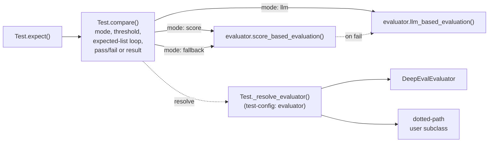

# #555: Replace RAGAS with a pluggable `AKEvaluator` (DeepEval), rename test modes, add `return_metrics`

Removes the RAGAS-specific comparison logic from `Test` — code as well as dependency — and moves all
scoring behind a pluggable `AKEvaluator` interface selected by a new `evaluator` field in
`test-config.yaml`, which takes either a built-in short name (`deepeval`, the only one) or a dotted
path to a user's own `AKEvaluator` subclass — the same bring-your-own spelling every other pluggable
backend in the repo uses. That value is resolved by `Test._resolve_evaluator`, a private helper on the
harness that `Test.compare` calls, so backend selection sits next to the policy it serves rather than in
a separate factory module. Renames the comparison modes
(`fuzzy` → `score`, `judge` → `llm`) so each mode maps one-to-one onto an `AKEvaluator` method. Adds
`return_metrics`, a per-call argument that makes `Test.compare` / `Test.expect` return an
`AKEvaluationResult` instead of raising `AssertionError`. The design idea: evaluators are pure scorers, and every policy decision —
threshold, mode, alternative-expected iteration, pass/fail — stays in the harness.

Requirements background: [`research/evaluator-framework-survey.md`](research/evaluator-framework-survey.md).

## Motivation

- The comparison logic is RAGAS-specific and cannot be swapped
  - `Test._judge_compare` imports `ragas` / `litellm` inline and builds RAGAS clients directly (`ak-py/src/agentkernel/test/test.py:152-181`)
  - The two RAGAS metrics are selected by an `if expected:` branch inside that method (`test.py:188`, `test.py:201`)
- The harness owns the evaluation clients
  - The judge's LLM and embedding clients are parked on `Test` class attributes (`test.py:25-26`) and
    constructed **inside the comparison method itself** (`test.py:171-178`), so `Test` holds live
    evaluation machinery instead of something behind an interface
  - Both are typed `Optional[Any]` (`test.py:25-26`), so the class declares no contract for what it is
    holding — only whichever objects the current comparison method happened to build
  - Swapping the evaluation backend therefore means editing the method that does the comparing, rather
    than changing a configuration value
- The evaluator seam exists but is unspecified
  - `AKEvaluator` (untracked, `ak-py/src/agentkernel/test/core/akevaluators/evaluator.py`) declares `score_based_evaluation` and `llm_based_evaluation` with no parameters, no return type, and no payload model; `deepeval.py` is empty
- Mode names describe implementations, not intent
  - `Mode.FUZZY` / `Mode.JUDGE` (`test.py:16-19`) name a specific string-matching library and a specific
    RAGAS technique, so a backend that scores deterministically by another means has no accurate mode to sit under
- Scoring and asserting are fused, so scores are unobservable
  - `_fuzzy_compare` and `_judge_compare` return `None` and communicate only by raising `AssertionError` (`test.py:149`, `test.py:197-199`, `test.py:214-217`)
  - Numeric scores are computed and discarded (`test.py:194`, `test.py:212`); no caller can report or threshold them
- A broken judge is indistinguishable from a failing agent
  - `FALLBACK` catches `AssertionError` from the judge and re-raises a message naming only expected/received (`test.py:254-262`), so a missing API key surfaces as a content mismatch
- The RAGAS dependency forces a transitive pin
  - The `test` extra carries `ragas`, `datasets`, `pandas`, and `langchain_community==0.4.1` pinned solely to work around a RAGAS import (`ak-py/pyproject.toml:153-157`, comment at `:154`)
- Judge unit tests hit a live LLM
  - `test_compare_judge_mode` and `test_compare_fallback_mode` make real RAGAS calls with no skip guard or fake (`ak-py/tests/test_cli_tester.py:35-81`)

## Design

## Requirements

### Mode rename

- `Mode` becomes `SCORE = "score"`, `LLM = "llm"`, `FALLBACK = "fallback"`; `FUZZY` and `JUDGE` are gone
- Each mode maps to exactly one evaluator entry point
  - `score` → `AKEvaluator.score_based_evaluation`
  - `llm` → `AKEvaluator.llm_based_evaluation`
  - `fallback` → `score_based_evaluation`, then `llm_based_evaluation` only if the first did not pass
- The two names describe **how** a backend scores (deterministically, or by asking a model), never
  **what** it measures. That is what makes them backend-neutral: only four evaluation concerns exist in
  all four surveyed catalogues, so any mode vocabulary naming a measurement — `similarity`,
  `faithfulness` — would be unimplementable by at least one plausible backend (survey §10, Finding 14).
  Every catalogue, by contrast, has deterministic scorers and LLM judges
- `AKTestConfig.mode` validation pattern becomes `^(fallback|llm|score)$` (`ak-py/src/agentkernel/test/config.py:32`)
- Clean break: `fuzzy` and `judge` are not accepted as aliases, and no changelog note is produced
  (the repo has no `CHANGELOG` file)
  - `mode: fuzzy` / `mode: judge` fail loudly against the pattern, which is the intended upgrade signal
  - The 6 in-repo example configs pinned to `mode: fuzzy` are updated in the same change
    (enumerated under "Migration surface")
- `Mode` stays exported from `agentkernel.test` (`ak-py/src/agentkernel/test/__init__.py:9`)

### Evaluator interface (`test/core/akevaluators/`)

- `AKEvaluator` is an ABC whose implementations are **pure scorers**: they compute a score and never
  assert, never threshold, and never decide pass/fail
- Two abstract methods, matching the two non-fallback modes
  - `score_based_evaluation(case) -> AKEvaluationResult` — deterministic scoring, no LLM involved
  - `llm_based_evaluation(case) -> AKEvaluationResult` — LLM-as-judge scoring
- Both methods are **synchronous** (see "Synchronous evaluation") and take one argument: the
  `AKEvaluationCase` payload. Everything a backend needs arrives in that model, so adding an input
  later changes the model, never the method signatures or the harness's call sites
- Constructed with the resolved test configuration; an evaluator instance owns its own backend
  clients, so the only evaluator state `Test` holds is the resolved instance itself — never a
  backend client, a model object, or a metric
  - The constructor is **part of the interface**, because `Test._resolve_evaluator` calls it
    identically for a built-in and for a user subclass: `__init__(self, config: AKTestConfig)`
  - `AKEvaluator` supplies a concrete `__init__` storing `self._config`, so a subclass that needs
    nothing more inherits it and implements only the two scoring methods
  - The whole config is passed, not just the `llm` block: a backend may read `mode` or a field
    added later, and widening the argument afterwards would break every user subclass
- **One metric per mode in v1.** The interface allows a backend to offer more, but AK ships exactly one
  score metric and one llm metric, so no metric-selection vocabulary or config key exists yet
  - Deferring the vocabulary is not just scope control: a shared metric vocabulary would have to be
    drawn from the four concerns common to every surveyed catalogue — custom rubric, answer relevancy,
    context precision, context recall (survey §10, Finding 14) — and AK needs none of those four for
    the ground-truth comparison `expect()` actually performs. A vocabulary defined now would name
    metrics AK does not use and exclude the one it does
  - A backend that cannot provide one of the two raises `AKMetricNotSupported`
- The package (`agentkernel.test.core.akevaluators`) exports the interface, the two payload models, and
  the three evaluator errors — `AKEvaluationError`, `AKMissingInput`, `AKMetricNotSupported` — so a
  bring-your-own subclass imports everything it needs from one place. It exports **no selector**:
  resolution lives on `Test`. `AKConfigError` stays the shared one from `core/util/factory.py`

### LLM model construction

- **The configuration is the common surface, not the model object.** `llm.model` and `llm.provider`
  (`config.py:11-12`) stay AK's single source of truth for every evaluator; each backend adapts them
  into whatever model class its own library expects
  - This is the repo's adapter convention — wrap the native object, do not abstract over it — and it
    preserves the provider support the RAGAS path had, which passed `provider=` into
    `LiteLLMStructuredLLM` (`test.py:177`)
- For DeepEval that adapter is its built-in `LiteLLMModel`, constructed as
  `LiteLLMModel(f"{llm.provider}/{llm.model}")`
  - AK writes **no** `DeepEvalBaseLLM` subclass and no structured-output handling: every DeepEval LLM
    metric requires schema-constrained JSON from the judge, and `LiteLLMModel` already provides it.
    Hand-rolling a shim would mean owning that schema plumbing for no gain, since `LiteLLMModel` is
    litellm underneath either way
  - `api_key` / `base_url` are left to litellm's own environment resolution
- **Only `llm` mode needs a model.** `score_based_evaluation` performs no LLM call, so score mode runs
  without a model, an API key, or a network connection

### Evaluation payload (`AKEvaluationCase`)

- Pydantic model, the single argument to both evaluator methods
  - `user_input: str` — required
  - `actual: str` — required
  - `expected: str | None` — a **single** ground truth; no library accepts alternatives (survey §2)
  - `context: list[str] | None` — retrieved/ground-truth context; **present in the model but not
    populated in v1**, since neither shipped metric consumes it
  - `criteria: str | None` — rubric for the llm metric; **present in the model but not populated in
    v1** — where a per-test rubric comes from is deferred, and the llm metric uses AK's own default
    rubric until then
- Only the fields the two shipped metrics need are populated, all of them from `Test.compare`'s
  existing arguments
  - `quasi_contains` needs `actual` and `expected`
  - `GEval` is keyed on `actual` and `expected` only — its `evaluation_params` name `ACTUAL_OUTPUT`
    and `EXPECTED_OUTPUT`, so the rubric never reads the question
  - `user_input` is still carried and passed through, because `LLMTestCase.input` is mandatory in
    DeepEval even when no metric reads it; an empty string is acceptable there
  - So `Test.compare` fills `actual` and `expected`, passes `user_input` through, and leaves
    `context` / `criteria` unset
- **No new `compare` / `expect` parameters** other than `return_metrics`: nothing about metric or
  payload configuration is passed per call
- `expected` is required by both shipped metrics; a call that reaches either without one raises
  `AKMissingInput` naming the metric and the field

### Evaluation result (`AKEvaluationResult`)

- Pydantic model returned by both evaluator methods and by `compare`/`expect` under `return_metrics`
  - `metric: str` — the metric that produced the score
  - `evaluator: str` — the configured evaluator name
  - `score: float | None` — normalised to `[0.0, 1.0]`; `None` means "not scored", never `0.0`
  - `threshold: float | None` / `passed: bool | None` — stamped by `Test.compare`, unset by evaluators
  - `mode: str | None` — the `Mode` that produced the decisive result; unset by evaluators
  - `expected: str | None` — which alternative produced the decisive score
  - `reason: str | None` — the judge's rationale where the backend supplies one
  - `cost: float | None` — evaluation cost where the backend reports it; expected to be `None` in
    practice, since DeepEval documents `evaluation_cost` as tracked when integrated with Confident AI
  - `attempts: list[AKEvaluationResult]` — non-decisive attempts (the failed score-mode result in
    `fallback`, and per-alternative scores); empty by default
  - `metadata: dict[str, Any]` — backend-specific extras (verbose logs, raw metric name); empty by default

### Configuration (`AKTestConfig`)

- One new field
  - `evaluator: str = "deepeval"` — a built-in short name (`deepeval` is the only one) **or** a
    dotted path to an `AKEvaluator` subclass, the same spelling `sandbox.profiles.*.type` uses for
    a bring-your-own backend (`examples/sandbox/identity/config.yaml:18`)
  - Plain `str` with **no** `pattern`, unlike `mode`: the built-in set is checked in
    `Test._resolve_evaluator` and a dotted path is validated by importing it, so no regex can express
    the valid set. An unresolvable value raises `AKConfigError` at first use — it is never silently
    defaulted
  - Selecting an evaluator selects **both** metrics; there is no per-mode evaluator key, since a
    mixed pair would make `fallback` compare scores from two unrelated backends
- `return_metrics` is **not** a config field: it is decided per call, so a suite can assert on most
  comparisons and collect the result for specific ones
- The `judge` block is renamed to `llm`, matching the mode name, and keeps its three existing fields
  unchanged (`model`, `provider`, `embedding_model` — `config.py:11-13`)
  - `embedding_model` is retained though nothing consumes it any more (RAGAS `answer_similarity` was
    its only consumer; neither shipped metric uses embeddings)
- No `score` block, no metric-selection keys, and no rubric key: one metric per mode means nothing to
  select, and the llm metric's rubric is AK-owned until a per-test source is decided
- Legacy keys are rejected rather than ignored, so the clean break fails loudly
  - `AKTestConfig` sets `extra="ignore"` (`config.py:40`), so a leftover `judge:` block would otherwise
    be **silently dropped**, reverting the model/provider to defaults with no error
  - A present `judge` key (in YAML or as `AK_TEST__JUDGE__*`) raises `AKConfigError` naming the new
    `llm` spelling; this is a validation error, not a compatibility shim
- Env-var spellings for new fields follow the existing convention: `AK_TEST__EVALUATOR`,
  `AK_TEST__LLM__MODEL`

### Evaluator selection (`Test._resolve_evaluator`)

- Resolution lives on the harness, not in a separate factory module: `Test._resolve_evaluator()` is a
  private `@classmethod` that turns `AKTestConfig.get().evaluator` into an `AKEvaluator` instance, and
  `Test.compare` calls it once, before dispatching to a mode
  - Keeping it on `Test` puts every policy decision — mode, threshold, alternatives, and which backend
    scores them — inside the one class that owns the comparison, so `compare` reads top to bottom
    without a hop into another module
  - Private and argument-free: `evaluator` is config-only (see Non-goals), so there is nothing per call
    to pass and nothing outside `Test` to select
- The three resolution branches are the #541 house pattern
  (`ak-py/src/agentkernel/core/util/factory.py`), the same shape as `InputGuardrailFactory`
  (`guardrail/guardrail.py:33-55`) and `SandboxProviderFactory` (`sandbox/factory.py:146-159`) — only
  the location differs, so the two shared helpers are reused verbatim
  1. **Built-in short name** — `if evaluator == "deepeval":` with the real import inside
     `require_extra("test", "evaluator: deepeval")` (`factory.py:50`), so a missing dependency names
     the extra to install instead of surfacing a bare `ModuleNotFoundError`
  2. **Unknown short name** — a value containing no `.` that matches no built-in raises
     `AKConfigError` (`factory.py:18`) naming the value and listing the built-ins. It is **not**
     retried as a dotted path, so a typo (`deepval`) fails as a typo rather than as an import error
  3. **Dotted path** — any value containing a `.` goes to `resolve_dotted(evaluator,
     base=AKEvaluator)`, which raises `AKConfigError` when the module will not import, the attribute
     is missing, or the object is not an `AKEvaluator` subclass
- Every branch ends the same way — `cls(AKTestConfig.get())` — which is why the constructor is part of
  the interface: the built-in gets no construction path a user subclass does not get
- Evaluator instance lifetime — **the resolved evaluator is cached on `Test`**
  - **Two** private class attributes, and no others: `_evaluator: tuple[str, AKEvaluator] | None` —
    the config string and the instance it produced, held as **one** slot — and
    `_evaluator_lock: RLock`. `compare` is a `@staticmethod`, so there is no instance to hang them off
  - `_resolve_evaluator` is the house double-checked lookup, the same shape as `AKConfig.get()`
    (`core/config.py:719-741`) and `AKTestConfig.get()` (`config.py:44-50`): return the cached
    instance when its key equals the configured value, otherwise take the lock, re-check, resolve,
    and store
  - `RLock` rather than `Lock` for reentrancy, the reason `AKConfig` already gives at
    `core/config.py:716-717`: the dotted-path branch runs `importlib.import_module` while the lock is
    held, so a user module that reaches evaluation during its own import re-enters the method instead
    of deadlocking
  - Key and instance share one slot so that a single store publishes both. This is **not** fixing a
    reachable race: `evaluator` does not change during a run — one process resolves one evaluator, and
    nothing but `_reset_evaluator()` in a test produces a second store, at which point the stale key
    is `None` and matches no config value. One slot is simply the cheaper shape, with one store to
    make, one read to do, and one thing to clear
  - Holding the lock across construction is deliberate: it serialises a slow bring-your-own constructor
    (loading a model, opening a client) against other threads' first comparison, which is the right
    trade against constructing that same expensive object several times over
  - **Single-slot, not a dict.** At most one evaluator is ever live, so a swapped-away backend's
    clients are dropped rather than retained under a stale key. Re-swapping rebuilds, which costs a
    constructor — the case a suite alternating evaluators mid-run would hit, and one no in-repo suite
    does
  - The cache is required, not an optimisation: a bring-your-own evaluator may do real work in its
    constructor (load a model, open a client), and the interface promises one instance is reused for
    the session, so rebuilding per comparison would break that promise
  - This is **not** the state the Motivation removes. What goes away is a pair of untyped evaluation
    clients built inline by the comparison method (`test.py:25-26`, `test.py:171-178`). What replaces
    it is one slot holding an `AKEvaluator` behind its interface, filled by a method that does nothing
    but resolve — swapping the backend is a config value, not an edit to `compare`
  - The key is still compared against the live config on every call, so the suite under "Test suite"
    that swaps `evaluator` between tests rebuilds on the next `compare` without an explicit reset.
    Application runs never take this path — they resolve once and hit the cache thereafter
  - `Test._reset_evaluator()` pairs with `AKTestConfig._reset()` (`config.py:53`) for the tests that
    want the rebuild to be explicit
  - Instances must be safe to share across threads, since one instance is reused across tests. The
    lock guards construction only — it is not held across `score_based_evaluation` /
    `llm_based_evaluation`, which would serialise every comparison in the suite
  - Concurrency exposure is small by construction: `compare` is synchronous and pytest runs one thread
    per worker, and `pytest-xdist` (newly active via `deepeval`, see Dependencies) parallelises by
    **process**, so each worker gets its own class object and its own slot — at the cost of one
    evaluator construction per worker
- The evaluator is resolved for every mode, including `score`, because score mode runs the evaluator's
  own `score_based_evaluation`
  - `DeepEvalEvaluator` therefore needs the `deepeval` package in every mode; the import happens inside
    `require_extra` (`factory.py:50`), the repo-wide pattern for turning `ModuleNotFoundError` into an
    actionable message
  - `test.py` imports only `AKEvaluator` and the two payload models at module level, all pure Python,
    so module-level imports in `agentkernel.test` stay free of `deepeval` and importing the harness
    does not require it
- No `AKEvaluatorFactory` class is added anywhere; the evaluator package has no selector to import

### Bring-your-own evaluator

- **The dotted path is the extension point, and it is the only one**: there is no registry, no entry
  point, and no privileged built-in path. `DeepEvalEvaluator` satisfies the same contract a user
  subclass does, so anything the built-in can do a user class can do
- Resolution is ordinary `importlib`, so any module on `sys.path` works — including one sitting
  beside the test file, which is the form the sandbox example uses
  (`type: sandbox_provider.DemoIdentitySandboxProvider`, `examples/sandbox/identity/config.yaml:18`)
  - `evaluator: my_evaluator.MyEvaluator` in an app's `test-config.yaml` therefore resolves against
    `my_evaluator.py` next to `app_test.py`, because pytest's default import mode puts the test
    file's own directory on `sys.path`
  - An installed package (`mypkg.evaluators.MyEvaluator`) works by the same mechanism
- The subclass contract, which `_resolve_evaluator` does not enforce beyond the `issubclass` check
  - Implement `score_based_evaluation(case)` and `llm_based_evaluation(case)`; both synchronous,
    both returning `AKEvaluationResult`
  - Raise `AKMetricNotSupported` from a method the backend cannot provide, rather than returning a
    `0.0` — an unsupported mode is a configuration error, not a test failure
  - Populate `metric`, `score` (normalised to `[0.0, 1.0]`, or `None` for "not scored"), and
    optionally `reason` / `cost` / `metadata`. Leave `passed`, `threshold`, `mode`, and `attempts`
    unset: the harness stamps them, so an evaluator that sets them is overwritten, not obeyed
  - Never assert, never threshold, never iterate the alternatives list, and never read
    `AKTestConfig` independently — every policy decision stays in `Test.compare`, and the single
    `expected` on the case is the only ground truth a method sees
  - Raise `AKEvaluationError` on a backend failure (missing credentials, transport error) so the
    harness can distinguish a broken evaluator from a failing agent, which is the failure mode
    called out in Motivation
  - Be safe to share across threads, since one instance is reused for the whole session
  - Do no evaluation work at **module import time**. The dotted-path import runs while `Test` holds
    `_evaluator_lock`, so a module that reaches `Test.compare` (or `_resolve_evaluator`) as an import
    side effect inverts the lock order against CPython's per-module import lock. Construction work
    belongs in `__init__`, which runs after the import completes
- A user subclass needs **no** AK extra and no `deepeval` install: the `deepeval` import lives
  inside the built-in's `require_extra` branch, so the dotted-path branch never reaches it.
  `pip install agentkernel[test]` still pulls `deepeval` in, since it is one dependency line on the
  extra, but nothing in the resolution path requires it
- `AKEvaluationResult.evaluator` carries the configured string verbatim — `"deepeval"` or the
  dotted path — rather than the class name, so a report names what the config selected
- The offline test suite rides on this branch: the fake evaluator under "Test suite" is registered
  by dotted path, so every llm-mode test exercises BYO resolution as a side effect

### `DeepEvalEvaluator`

- Ships as part of the `test` extra, exactly as `ragas` did — one dependency line, no new extra
- **Score metric: `quasi_contains`** via `deepeval.scorer.Scorer`, wrapped in a custom `BaseMetric` as
  DeepEval documents for statistical scoring
  - SQuAD-style normalised containment (case, punctuation, and article normalisation, then a
    containment test), so a verbose correct answer still matches a short expected phrase
  - Chosen because it is the only option that is simultaneously DeepEval-specific (Opik, RAGAS, and
    autoevals all ship ROUGE/BLEU/BERTScore/exact-match; none ship normalised containment), needs no
    extra dependency, downloads no model, and runs offline — so `agentkernel[test]` stays light and
    score mode never touches the network (survey §9)
  - It returns a binary 0/1, with two accepted consequences: `threshold` is inert on the score path
    (any value in `(0, 1]` behaves identically), and in `fallback` a near-miss reaches the llm stage
    rather than passing locally (survey §9, Finding 12). That cost is proportional — only failing comparisons pay
    it — and close to today's behaviour, since the length-sensitive `fuzz.ratio` already falls through
    for long responses against short expectations
  - The model-backed scorers (`faithfulness` via SummaC, `hallucination` via Vectara HHEM,
    `answer_relevancy` via a sentence-transformers cross-encoder) are **not** shipped: each pulls
    PyTorch and a first-run model download into every environment installing the `test` extra
- **Llm metric: `GEval`**
  - One AK-owned rubric, judging whether the response conveys the same information as `expected`, with
    `evaluation_params=[ACTUAL_OUTPUT, EXPECTED_OUTPUT]`
  - Required because DeepEval ships no semantic-similarity metric — the one gap that is DeepEval's
    alone, since RAGAS, Opik, and autoevals all ship a ground-truth comparison (survey §3 Finding 5,
    §10 Finding 13) — so the RAGAS
    `answer_similarity` path has no drop-in replacement other than a rubric-based judge
  - **Behavioural change**: today, `judge` mode with no expected answers falls back to RAGAS
    `answer_relevancy` against the question (`test.py:201-217`). That path is dropped — `llm` mode now
    requires `expected` and raises `AKMissingInput` without it. Every in-repo caller already passes
    expectations, and `expect()` requires them by signature (`test.py:264`)
  - AK owns the default rubric; overriding it per test is deferred (see the payload section)
  - Constructed with `threshold=None` (DeepEval's score-only mode), `include_reason=True`, and the
    `LiteLLMModel` from "LLM model construction"
- Maps `AKEvaluationCase` → `LLMTestCase(input, actual_output, expected_output)`
- Translates a soft backend failure (`metric.error`, a `None` score) into a raised `AKEvaluationError`
  rather than a low score
- **Behavioural change**: score mode no longer computes a rapidfuzz ratio, so a response that scored
  just above the old threshold may now score differently on a different scale

### No outbound data

- **Nothing about a user's tests may reach DeepEval or Confident AI.** Evaluation is local except for
  the judge call that the user's own `llm.model` / `llm.provider` configuration makes
- Telemetry is disabled by the harness, not left to the user
  - `DEEPEVAL_TELEMETRY_OPT_OUT` is set via `os.environ.setdefault(..., "1")` **before the first
    `deepeval` import**, since DeepEval initialises telemetry at import time — setting it afterwards is
    too late
  - `setdefault` rather than an unconditional write, so a user who deliberately opts in by exporting
    the variable themselves is respected
- The Confident AI cloud path is never engaged: AK does not call `deepeval.login`, does not set
  `CONFIDENT_API_KEY`, and does not use the hosted dataset/report features. Results stay in-process
- Local state files DeepEval writes into the working directory — `.deepeval/`,
  `.deepeval_telemetry.txt` — are treated as build artefacts: added to `.gitignore`, and relocated out
  of the repository root if DeepEval offers a path override
- Covered by a test asserting the environment variable is set before `deepeval` is imported, so a
  future refactor that moves the import cannot silently re-enable telemetry

### `return_metrics` mode

- A keyword argument on `Test.compare` and `Test.expect`, `return_metrics: bool = False`
  - Per-assertion, so one suite can assert on most comparisons and collect the `AKEvaluationResult`
    for the ones it wants to inspect or report
  - Defaulted, and keyword-only in practice since it is appended after the existing parameters, so
    every current call site keeps working unchanged
- When `False` (default), `compare` and `expect` behave as today: return `None` on success, raise
  `AssertionError` on failure
- When `True`
  - `compare` and `expect` return the decisive `AKEvaluationResult` with `passed`, `threshold`, and
    `mode` stamped, and non-decisive attempts in `attempts`
  - No `AssertionError` is raised for a failing comparison
  - Every other error still raises, unsuppressed: `AKEvaluationError` (judge unavailable),
    `AKMissingInput`, `AKMetricNotSupported`, `AKConfigError`, the `ValueError` for an invalid mode
    (`test.py:239-240`), the `ValueError` for an empty expected list (`test.py:143-144`), and the
    `AssertionError` from `expect` when no response has been recorded (`test.py:271`)
- In `fallback`, the decisive result is the llm result whenever score mode did not pass; the score-mode
  result is recorded in `attempts`

### Harness changes (`Test`)

- **All RAGAS code leaves `test.py`, not just the dependency**: `_fuzzy_compare` and `_judge_compare`
  are deleted, along with the `_ragas_llm` / `_ragas_embeddings` class attributes (`test.py:25-26`) and
  the module-level imports `from datasets import Dataset`, `from ragas import evaluate`,
  `from ragas.metrics import answer_relevancy, answer_similarity`, and `from rapidfuzz import fuzz`
  (`test.py:8-11`). After the change no RAGAS, `datasets`, or `rapidfuzz` symbol appears anywhere in
  `agentkernel.test`; all scoring goes through `AKEvaluator`
- The private surface `Test` gains in their place is exactly four members: `_resolve_evaluator()`,
  `_reset_evaluator()`, and the two cache attributes `_evaluator` (one `(key, instance)` tuple) and
  `_evaluator_lock`. `_evaluator` holds an `AKEvaluator` behind its interface — no comparison logic,
  no backend client, and no metric object returns to the class
- `Test.compare` keeps its existing parameters and stays a synchronous `@staticmethod`; the only
  addition is `return_metrics: bool = False`, appended last, so every current call site is unaffected
  (`examples/transport/nats/app_test.py:105`, `ak-py/src/agentkernel/skills/ak-test/SKILL.md:159`)
- `Test.expect` gains the same argument and forwards it to `compare`
- `compare` retains ownership of: mode validation and selection, resolving the evaluator through
  `Test._resolve_evaluator()`, iteration over the `expected` list with "pass if ANY alternative
  passes", the fallback chain, and building the `AKEvaluationCase`
  - The evaluator is resolved once per `compare` call, before the expected-list loop, so every
    alternative and both stages of `fallback` score through the same instance
- Assertion messages remain recognisable to existing tests that match on them
  (`ak-py/tests/test_cli_tester.py:31`, `:48`, `:73`), with the mode names updated
- `Test.expect` stays `async` and returns whatever `compare` returns

### Threshold scale

- Thresholds become plain floats in `[0.0, 1.0]` on every path, matching what every evaluation library
  returns; the 0–100 scale and the `threshold / 100` conversion into judge scoring (`test.py:251`,
  `test.py:260`) are removed
- `Test.match_threshold` and `Test.compare(threshold=...)` default to `0.5` instead of `50`
  (`test.py:28`, `test.py:221`)
- Thresholding stays in the harness: DeepEval metrics are constructed with `threshold=None`, and
  `passed` is decided by comparing the returned score against the AK threshold
- Out-of-range values (a leftover `50`) raise `ValueError` rather than silently passing everything,
  since any score is below 50 on the new scale
- Call sites carrying explicit thresholds are updated: `examples/transport/nats/app_test.py:111,123`
  and `examples/transport/kafka/app_test.py` (`threshold=10`), plus the docs pages listed under
  Migration surface

### Synchronous evaluation

- Evaluator methods and `Test.compare` are synchronous, because `compare` is called from inside
  running event loops in shipped code — `examples/transport/nats/app_test.py:100-112` and
  `examples/aws-serverless/openai/lambda_test.py:52-56` call it inside `@pytest.mark.asyncio` bodies
  - `asyncio.run()` raises inside a running loop, and the existing `AgentHandler._run_async_sync`
    bridge (`ak-py/src/agentkernel/core/chat_service.py:207-225`) ends in `loop.run_until_complete`,
    which also raises on an already-running loop
- An adapter whose backend is async-only must run the coroutine on a dedicated worker thread with its
  own event loop; a shared helper in the evaluator package provides this so each adapter does not
  reinvent it

### Dependencies

- `deepeval` replaces `ragas` in the `test` extra as a single dependency line, the same way `ragas` was
  declared (`ak-py/pyproject.toml:153`)
- Removed from the `test` extra (`pyproject.toml:152-157`): `ragas`, `datasets`, `pandas`, the
  `langchain_community==0.4.1` pin, and `rapidfuzz` (`:152`), which loses its consumer once
  `_fuzzy_compare` is deleted
- Nothing else is added: `quasi_contains` needs no library, and `litellm` is already there
- DeepEval emits anonymous usage telemetry by default and writes local state files into the working
  directory; both are suppressed — see "No outbound data"
- Installing `deepeval` also installs four pytest plugins — `pytest-xdist`, `pytest-repeat`,
  `pytest-rerunfailures`, `pytest-asyncio` are its runtime dependencies, and pytest auto-loads plugins
  via entry points, so they become active in every AK test session alongside the existing `addopts`
  (`pyproject.toml:212`). RAGAS brought none; the interaction must be verified before merge
- The identical `langchain_community==0.4.1` pin in the `langgraph` extra (`pyproject.toml:45`) is a
  separate pin and is untouched. AK's CI installs every extra (`ak-py/build.sh` runs
  `uv sync --all-extras`, driven by `.github/workflows/test-reusable.yaml:152`), so that pin still
  constrains CI resolution after the `test` one is dropped
- Resolution of `test` + `langgraph` together must be verified after the removal

### Migration surface

The rename touches these current (non-versioned, non-build) surfaces; all must be updated in the same change:

- Code: `ak-py/src/agentkernel/test/test.py`, `ak-py/src/agentkernel/test/config.py:32`
- Tests: `ak-py/tests/test_test_config.py`, `ak-py/tests/test_cli_tester.py`, `ak-py/tests/test_config.py`
- Skills: `ak-py/src/agentkernel/skills/ak-test/SKILL.md:6,42,47-56`, and the `test-config.yaml`
  template embedded in `ak-py/src/agentkernel/skills/ak-init/SKILL.md:338` (there is no separate
  template file)
- Docs: `docs/docs/testing/cli-testing.md`, `docs/docs/testing/automated-testing.md`,
  `docs/docs/testing/overview.md`, `docs/docs/core-concepts/configuration.md` — each gains the
  `evaluator` key alongside `mode`, and the testing pages gain a bring-your-own-evaluator section
  mirroring the sandbox one (`docs/docs/advanced/sandbox.md:378`)
- Examples: 40 `examples/**/test-config.yaml` files — 34 with `mode: fallback`, 6 with `mode: fuzzy`,
  and every one of them carrying a `judge:` block and a comment naming the old modes
  - No `evaluator` key is added to them: the default already selects `deepeval`, and adding a key
    every example would carry identically is noise. The skill templates document the key instead
- Versioned docs under `docs/versioned_docs/` are frozen published snapshots and are **not** edited

### Test suite

- Llm-mode unit tests must run offline: a fake `AKEvaluator` subclass registered by dotted path
  replaces the live-LLM calls currently in `ak-py/tests/test_cli_tester.py:35-81`
- Coverage required for: each mode routing to its evaluator method, `return_metrics` true/false per
  mode, `attempts` population in `fallback`, the judge-unavailable path raising rather than
  reporting a mismatch, and `mode: fuzzy` / `mode: judge` and a leftover `judge:` block each failing
  with a clear error
- `Test._resolve_evaluator` is covered branch by branch: `deepeval` → `DeepEvalEvaluator`; a dotted
  path to a test-local subclass → that class; an unknown short name → `AKConfigError` listing the
  built-ins; a dotted path to a non-`AKEvaluator` class → `AKConfigError`; a dotted path to a missing
  module → `AKConfigError`; the built-in with the extra absent → `ImportError` naming
  `agentkernel[test]`
- Caching is covered directly: two `compare` calls under one config resolve to the same instance
  (identity assertion) with the constructor running once, and a `compare` reached through the harness
  scores through the evaluator the config names
- The key check is covered without an explicit reset: changing `evaluator` between two `compare` calls
  (via `AKTestConfig._reset()` alone) yields a different instance, proving the slot's key is compared
  against the live config rather than only on first use
- No concurrency test is written: one evaluator is resolved per run, `compare` is synchronous, and a
  test that sleeps to widen a lock window asserts on timing rather than on behaviour
- A BYO evaluator scores end-to-end with `deepeval` never imported (asserted against `sys.modules`),
  proving the dotted-path branch carries no dependency on the built-in
- The cached instance rebuilds after `AKTestConfig._reset()` + `Test._reset_evaluator()`, so swapping
  `evaluator` mid-suite takes effect instead of scoring through the previously cached instance
- `ak-py/tests/test_test_config.py` gains assertions for the new fields, the renamed `llm` block, the
  rejected `mode` values, and the `AKConfigError` raised by a legacy `judge:` key
- Score-mode tests run against the real `quasi_contains` scorer — no model download, no network — and
  assert the new score semantics rather than the old fuzzy ratio

## Non-goals

- Any evaluator backend other than DeepEval. Opik, Braintrust, and RAGAS are not implemented here;
  `_resolve_evaluator`'s dotted-path branch is the extension point until a second built-in is added
  - Worth recording for whoever revisits this: the catalogues differ in **coverage**, not just in
    preference (survey §10, Finding 15). DeepEval is deepest on agentic and safety metrics and alone
    in shipping non-LLM local-model scorers; RAGAS is deepest on reference comparison and retrieval;
    Opik on deterministic text statistics and conversation-level judging. A user whose need is
    reference comparison has a real reason to reach for the dotted path, and that is the case the
    bring-your-own branch is expected to serve first
- More than one metric per mode, and any config surface for selecting metrics
- A per-call or per-`Test` evaluator override. `evaluator` is config-only in v1 — unlike `mode`,
  which `Test.__init__` and `compare` both accept — because `AK_TEST__EVALUATOR` already covers
  per-environment selection and a suite mixing evaluators across assertions has no demonstrated use
- A registry or entry-point mechanism for third-party evaluators: the dotted path covers it, matching
  every other pluggable backend in the repo
- A public `AKEvaluatorFactory`, or any way to obtain an evaluator instance outside `Test`. Resolution
  is a private detail of the harness; if a second consumer ever needs one, `_resolve_evaluator` is
  what gets promoted out
- Per-call metric or payload configuration: the only argument added to `compare` / `expect` is
  `return_metrics`, and the payload's optional fields stay unpopulated in v1
- `DAGMetric`: it needs a caller-supplied graph object, which no config key can express and no call
  argument may carry under the rule above
- Trace- or trajectory-derived metrics (`TaskCompletion`, `StepEfficiency`, `PlanAdherence`): they read
  instrumentation, not arguments, and need the CLI under test to emit spans (survey §2, Finding 4)
- Tool-call metrics (`ToolCorrectness`, `ArgumentCorrectness`): they need typed `ToolCall` payloads the
  harness cannot currently capture from a CLI subprocess
- Conversational/multi-turn metrics and the turn history they need
- Multimodal metrics and image payloads
- Dataset-level batch evaluation (`deepeval.evaluate(test_cases, metrics)`)
- Editing `docs/versioned_docs/` snapshots

### Verification required in `spec.md`

- The argument direction of `quasi_contains_score(targets, prediction)`: documented as testing whether
  the normalised prediction appears in the normalised target list, which is the reverse of what this
  harness needs (the short expected phrase should be found inside the longer response). AK controls
  which value goes into which argument — confirm against the source and map accordingly
- Whether passing a `LiteLLMModel` instance to a metric is sufficient, or whether DeepEval also
  requires the `USE_LITELLM=1` environment variable its docs mention for litellm-backed judges
- That the configured judge model can actually return schema-constrained JSON: `GEval` parses
  structured verdicts, so a weak or non-JSON-capable model behind `llm.model` fails at evaluation time
  rather than at configuration time
- That opting out of telemetry does not break evaluation in the pinned DeepEval version — the project
  has a history of opt-out regressions (confident-ai/deepeval#1613), so the pin must be tested with
  `DEEPEVAL_TELEMETRY_OPT_OUT=1` set
- Whether DeepEval still creates `.deepeval/` when telemetry is opted out, and whether a path override
  exists to move it out of the user's repository

## Open questions

- None outstanding. Items needing confirmation against the DeepEval source or a pinned version are
  listed under "Verification required in `spec.md`" rather than left as design decisions.
