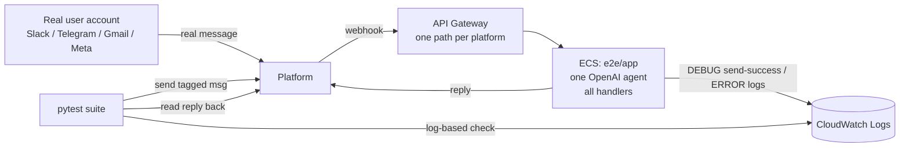

# #590: True end-to-end tests for the messaging integrations against real platform accounts

> Status: documents the harness introduced in PR #596. Stage 2: [spec.md](spec.md); Stage 3: [plan.md](plan.md).

Add a self-contained `e2e/` harness that proves each messaging integration works over the real
transport: a real user account sends a message on the real platform → the platform delivers it by
webhook to a long-lived **AWS ECS deployment** running one OpenAI agent with every integration
enabled → the test reads the agent's real reply back from the platform (or, where no read-back API
exists, from the deployment's logs). The harness is a downstream *consumer* of the published
`agentkernel` package — it adds no code to `ak-py/` core.

## Motivation

- The existing integration tests never drive a message through a platform.
  - The nightly/weekly suite deploys example apps and calls the agent's **own REST endpoint**
    via `AK_TEST_ENDPOINT` (`docs/specs/40-integration-tests/design.md:243`), asserting on the
    HTTP response. No platform, no webhook.
  - So the transport layer is entirely untested: API Gateway path routing, Slack signature
    verification, Telegram secret-token check, and the platform-specific inbound webhook payload
    shape each integration parses. A regression there is invisible to every test today.
- Only a deployed instance receiving *real* webhooks exercises that layer. A local/in-process test
  can call the handler function directly, but it cannot reproduce the platform → API Gateway →
  container delivery path or the platform's own payload/signature contract.
- Each handler already has an error-fallback path that returns transport-OK-but-agent-failed, so a
  round-trip test can distinguish "transport works and the agent answered" from "transport works but
  the run failed":
  - Slack posts `"Error handling your request."` (`ak-py/.../integration/slack/slack_chat.py:183`).
  - Telegram sends one of three fallbacks
    (`integration/telegram/telegram_chat.py:193,212,230`).
  - Every handler logs `"Error handling message: ..."` at ERROR before falling back
    (`slack_chat.py:182`, `telegram_chat.py:229`, `messenger/messenger_chat.py:246`,
    `instagram/instagram_chat.py:265`, `whatsapp/whatsapp_chat.py:302`).

## Requirements

### Scope: every messaging platform AK can construct today

- Covered: **Slack, Telegram, Gmail, WhatsApp, Messenger, Instagram**.
- **Teams is out of scope**: `core/config.py` has no `_TeamsConfig` / `teams:` field, so
  `AgentTeamsRequestHandler` cannot be constructed without a core change first (grep for `teams` in
  `ak-py/src/agentkernel/core/config.py` returns nothing).
- The harness is a standalone top-level `e2e/` tree — deployable app, Terraform, pytest suite, and
  one-time helper scripts — never imported by `ak-py/`.

### Deployment: one long-lived instance, all integrations on

- One deployable app (`e2e/app/app.py`): a single OpenAI agent `general` on `gpt-4.1-mini`,
  registered via `OpenAIModule`, served by `RESTAPI.run([...handlers])`.
- Handler activation is credential-gated so the same app degrades cleanly:
  - Slack + Telegram are **always on** (their credentials are always provided).
  - WhatsApp / Messenger / Instagram activate only when their `AK_*__ACCESS_TOKEN` is present, and
    a partial/broken optional config must **degrade** (log + skip) rather than crash the app and
    take Slack/Telegram down with it.
  - Gmail is polling-based (no inbound webhook): started in a background thread before
    `RESTAPI.run()`, and likewise must degrade to "Gmail disabled" on any auth failure instead of
    crash-looping the container.
- Deployment is **one-time / long-lived**: deploy once (API Gateway URL + Slack Event Subscriptions
  registration stay stable), then run tests on demand. No per-run deploy/destroy.
- Deploys the **published PyPI wheel** of `agentkernel` (pinned in `e2e/app/uv.lock`), not the
  branch tree — the weekly runs validate the *released* package's integrations against live
  platforms. A local build path (`deploy.sh local`) force-installs the branch wheel for pre-release
  validation.

### Transport: API Gateway → ECS, one webhook path per platform

- Terraform uses the `yaalalabs/ak-containerized/aws` module (ECS + HTTPS API Gateway via VPC link),
  with one `gateway_endpoints` entry per platform webhook path.
  - Meta platforms (WhatsApp / Messenger / Instagram) need **both** a `GET` route (Meta's
    `hub.*` verification challenge) and a `POST` route (message delivery).
  - Slack and Telegram need `POST` only.
- Webhook URLs and the direct `agent_invoke_url` are Terraform **outputs**, consumed by the
  register-webhook steps and health probe.
- Remote S3 state (`backend.tf`) so the CI deploy job and local `deploy.sh` share one state — same
  bucket/convention as `agent/deploy/backend.tf`.

### Per-platform sender identity (why the tests are shaped as they are)

- **Slack** — sender must be a *user* token (`xoxp-`): the handler reads `body["user"]`, absent on
  bot-authored messages, so a second bot cannot drive the test.
- **Telegram** — bots cannot message other bots, so a real *user* account sends via MTProto
  (Telethon) with a pre-generated session string.
- **Gmail** — needs **two** accounts (bot polls its inbox and replies; tester sends and reads):
  send-to-self would make the bot answer its own replies in a loop.
- **WhatsApp** — needs **two separate Meta apps** (the handler replies to every message its app's
  webhook delivers; a shared app would loop). Two Cloud API *test* numbers cannot message each other
  (verification OTP is undeliverable to a test number → error `131030`), so full automation needs a
  **production** sender number.
- **Messenger / Instagram** — there is **no API** to send a message *to a Page / IG account as a
  user*. The inbound leg can never be driven programmatically; only a human DM triggers it.

### Verification depth (first cut)

- **Assertion**: the bot replied with *something*, and the reply is **not** one of the handlers'
  known error-fallback strings (which would mean transport OK but the agent run failed). Reply
  *content* is deliberately not asserted.
- **Read-back platforms (Slack / Telegram / Gmail)** — full round-trip: read the agent's reply back
  from the platform (Slack: threaded reply; Telegram: same chat; Gmail: poll the tester's copy of
  the thread), fully automated in CI.
- **Log-based platforms (WhatsApp / Messenger / Instagram)** — no read-back API, so poll the
  deployment's CloudWatch logs for the handler's send-success line and fail if it logged an
  agent-run error:
  - Success line `"Message sent successfully: ..."` is logged at **DEBUG** (`whatsapp_chat.py:338`,
    `messenger_chat.py:346`, `instagram_chat.py:358`), so the deployment config **must** set
    `logging.ak.level: DEBUG` (`e2e/app/config.yaml`) or the log check can't see it.
  - Messenger/Instagram scope the match by the handler's logger name (`"ak.api.messenger"` /
    `"ak.api.instagram"`) because WhatsApp logs an identical success line.
- **Automation ceilings** are encoded as skips-by-default behind explicit opt-in flags:
  - WhatsApp: `E2E_WHATSAPP_AUTOMATED=1` (needs a production sender), else skip.
  - Messenger / Instagram: `E2E_MESSENGER_AUTOMATED=1` / `E2E_INSTAGRAM_AUTOMATED=1` verify a
    *recent human-triggered* round trip via logs; unattended CI always skips.

### Tests skip, never fail, on missing credentials

- Each test resolves its inputs through `require_env(...)`, which `pytest.skip`s when any variable is
  absent — so a platform can be run one at a time and CI need not hold every platform's secrets.
- Each read-back test sends a uniquely-tagged message (`uuid` nonce) and polls up to a bounded
  deadline (`REPLY_TIMEOUT_SECONDS = 180`, Gmail `300`) at `POLL_INTERVAL_SECONDS = 5`.

### One-time setup scripts (interactive, run once)

- `telegram_login.py` — interactive MTProto login, prints a Telethon `StringSession`.
- `set_telegram_webhook.py` — registers the deployed webhook URL (+ optional secret token) via the
  Telegram Bot API.
- `gmail_login.py` — interactive OAuth, prints a base64 `token.pickle` per account (bot + tester).

### CI: weekly + manual dispatch, deploy decoupled from test

- Two jobs added to `.github/workflows/integration-test-weekly.yaml`:
  - `e2e-messaging-deploy` — **opt-in** via the `provision_e2e_messaging` dispatch input; builds the
    package, applies Terraform in place (no destroy), waits for ECS to stabilize.
  - `e2e-messaging-test` — probes the deployed webhook, re-registers the Telegram webhook, runs the
    suite. Runs on the weekly schedule and on manual dispatch; scheduled runs test the existing
    deployment as-is (deploy is separate and optional).
- Must run on a **Linux** runner: the image vendors dependencies at build time and macOS wheels
  crash the linux/amd64 container.
- The published-wheel pin stays current without a human: `publish.yaml` bumps
  `e2e/app/pyproject.toml` on release (like it does for `examples/`), and `test.yaml`'s
  `update-lock-files` job regenerates `e2e/app/uv.lock` afterwards (decoupled, because the new
  version may not be resolvable on PyPI at publish time).

## Component diagram

## Non-goals

- Asserting the agent's reply *content* (first cut checks only "replied, and not the error
  fallback").
- Teams (blocked on a `core/config.py` `_TeamsConfig` addition — a core change, out of scope here).
- Automating the Messenger / Instagram inbound leg, or WhatsApp test-number-to-test-number sends
  (hard vendor ceilings, documented not worked around).
- Wiring into per-PR or nightly runs — weekly schedule + manual dispatch only, to bound real-account
  traffic and deployment cost.
- Validating the branch's working tree by default (the deployment exercises the published wheel;
  branch validation is the explicit `deploy.sh local` path).

## Open questions

- Assertion depth is a deliberate first cut (reply exists, not an error fallback). Deepening to
  content assertions is a follow-up, not a gap in this change.
- Teams coverage is deferred until core grows a `_TeamsConfig`; tracked separately.
- Meta test-number and Gmail "Testing"-status tokens are short-lived; long-lived operation relies on
  system-user tokens / "In production" consent status (documented in `e2e/README.md`), not on a code
  change here.
