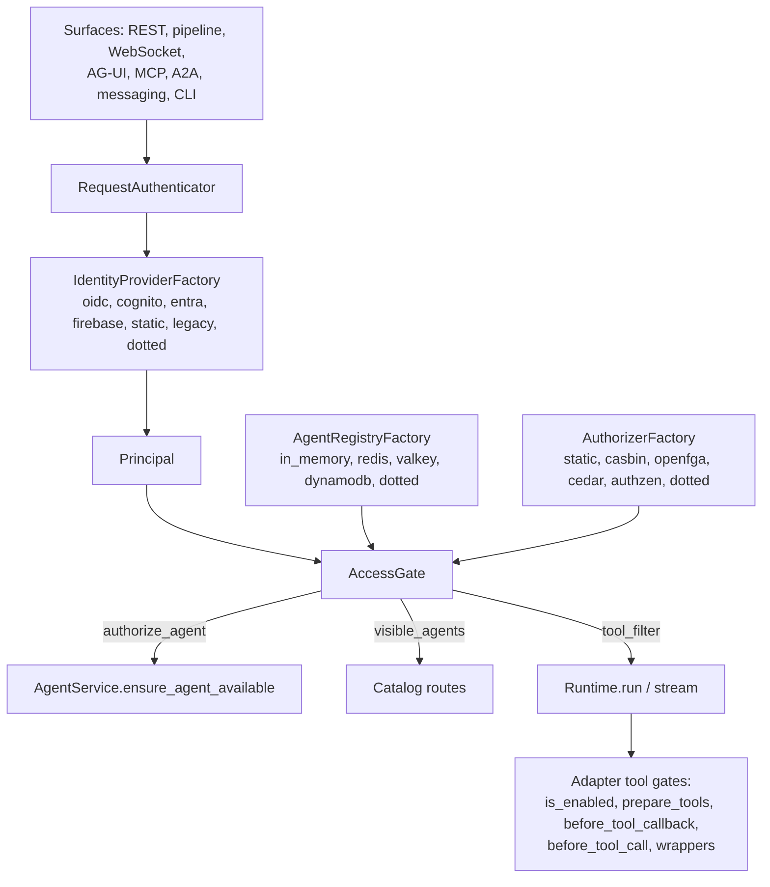

# #603: Identity layer, RBAC and agent registry

Agent Kernel gains three pluggable layers under one new package, `agentkernel/identity/`: identity
providers that turn an inbound credential into a `Principal`, an authorizer that decides which
agents a principal may use (at a capability level) and which tools an agent may offer and invoke
for that principal, and an agent registry that gives every agent a first-class descriptor and a
catalog. The design idea is that the acting principal is established once from the validated
credential at every surface and published for the whole run, and that every access decision is
made by one `AccessGate` over the registry and the authorizer, before any state is committed.

Evidence is cited against `develop` at `5c257514` (2026-10-01); the research behind this design,
including the ten settled review decisions, is in `research/` (start with `research/README.md`
and `research/design-options.md` section 4).

## Motivation

- There is an authentication seam but no identity layer: `agentkernel.auth` exports two ABCs and
  one adapter (`auth/__init__.py:14-15`); no built-in JWT/OIDC, Cognito, API-key or static provider
  exists in the package, and the only crypto helper validates against a static RS256 public key
  (`auth/handler.py:50-71`). Every example validator decodes with `verify_signature: False`
  (`examples/aws-containerized/crewai-auth/app.py:46-62`).
- The REST surface validates a token and discards who it belongs to: the dependency installed by
  `RESTAPI.add_auth_handlers` returns a `ValidationResult` that no route reads (`api/http.py:184-193`);
  the acting user on `/api/v1/chat` is the client-supplied body `user_id` (`api/handler.py:105, 121`).
- WebSocket surfaces authenticate one identity and act as another: the validated `userId` claim keys
  the connection and routes the reply (`pipeline/ws/handler.py:185, 230`), while the queued body's
  `user_id` comes from the client frame, which `BaseRequest.from_payload` declares "authoritative"
  (`core/model.py:325-328`).
- MCP is mounted outside the REST auth dependencies (`api/http.py:161`) and runs agents with no user
  (`api/mcp/akmcp.py:43`); A2A also runs with no user (`api/a2a/a2a.py:60-63`) and its cards carry no
  security schemes (`core/builder.py:38-48`), using 0.3-era field names the pinned a2a-sdk 1.1.2 no
  longer defines (`ak-py/uv.lock:18-19`).
- No surface authorizes agent selection per caller: `AgentService.ensure_agent_available` and
  `select` check only that a name is registered (`core/service.py:49-70, 72-101`); MCP, A2A and AG-UI
  filter by static allow-lists that ignore the caller (`api/mcp/akmcp.py:66`, `api/a2a/a2a.py:73`,
  `integration/agui/handler.py:59-67`).
- The agent registry is a name-keyed dict on `Runtime` (`core/runtime.py:140, 193-220`) and an
  `Agent` carries `name`, `runner`, hooks and run options only (`core/base.py:456-467`): no id,
  version, owner, tags or catalog description. `get_description()` returns the system prompt on
  OpenAI (`framework/openai/openai.py:404-408`), which is why AG-UI lists names only
  (`integration/agui/handler.py:143-144`) and why MCP publishes the prompt as a tool description
  (`api/mcp/akmcp.py:71-75`).
- In the two-process queue topology the io-handler process loads no agents
  (`examples/k8s/openai-queue-mode/app_io_handler.py:12-16`), so its `GET /api/v1/agents`
  (`api/handler.py:102-103`) and the thread handler's availability precheck
  (`integration/thread/thread_chat.py:209-217`) see an empty registry.
- Tool sets are fixed per agent at load time (`core/base.py:626-636`, `core/tool.py:166-176`) with
  no per-run or per-user filtering and no call-time gate AK wires; the only call-time checks live
  inside individual tools (`knowledgebase/okf/tools.py:150-152`, `schedule/tools.py:73-81`).
- Two identity precedents already exist: the run-scoped `ACTING_USER_CACHE_KEY`
  (`core/runtime.py:34-36, 275-276`) with exactly one reader (`schedule/tools.py:73-81`), and the
  sandbox `SandboxPrincipal` / `PrincipalResolver` (`sandbox/model.py:114-120`,
  `sandbox/principal.py:17-39`) to which AK never hands a user (`sandbox/manager.py:306-320`).
- The only role model, OKF's `consumer` / `producer` / `curator`, is per agent and deliberately
  local to `knowledgebase/okf/` (`knowledgebase/okf/roles.py:1-10, 22-27`;
  `docs/specs/553-okf-knowledge-bases/design.md:645-648`).
- Three per-agent scoping vocabularies coexist in config: `None`-means-all lists
  (`core/config.py:269, 403, 836, 931, 941, 948`), `["*"]` sentinels (`core/config.py:141, 149`), and
  OKF's per-database roles (`core/config.py:432-440`). All are agent-to-capability grants; none is a
  user-to-agent grant, and no end-user auth setting exists anywhere in `AKConfig`.

## Requirements

### 1. Core models (`core/model.py`, `core/runtime.py`, `core/tool.py`)

- `Principal` (Pydantic, picklable) beside `BaseChatRequest` in `core/model.py`, so core never
  imports the capability (the `ScheduleSpec` precedent):
  - `subject: str`; `kind: Literal["user", "agent", "service"] = "user"`; `provider: str` (the
    provider short name that produced it, `legacy`, or `anonymous`); `groups: list[str] = []`;
    `roles: list[str] = []`; `claims: dict[str, Any] = {}`; `actor: Optional[Principal] = None`
    (the RFC 8693 `act` chain: who is acting for this subject).
  - `Principal.anonymous()` returns `subject="anonymous"`, `provider="anonymous"`;
    `is_anonymous` property.
  - Groups and provider roles are carried verbatim; `roles` additionally holds AK roles produced
    by the role mapping (section 3).
- `AccessLevel` (`StrEnum`, ordered, comparable): `read < write < admin`. It is the **capability
  tier a principal may drive through an agent**; any level implies the principal may chat with the
  agent. Record management is not a level (settled, Q4).
- `AgentDescriptor` (Pydantic): `id` (defaults to `name`), `name`, `version` (semver string,
  default `"0.0.0"`), `description` (catalog text; never `get_description()`), `owner:
  Optional[str]`, `tags: list[str]`, `visibility: Literal["private", "internal", "public"] =
  "private"`, `surfaces: Optional[list[Literal["rest", "a2a", "mcp", "agui"]]]` (`None` = every
  mounted surface), `skills: list[AgentSkillDescriptor]` (`id`, `name`, `description`, `tags`),
  `tools: list[str]`, `runner: str`, `supports_streaming: bool`, `identity: AgentIdentitySpec`
  (`subject: Optional[str]`, defaults to `id`; the only agent-identity field in round 1, settled Q7).
- `SystemTool` gains `tier: AccessLevel = AccessLevel.READ` (`core/model.py:197-200`). Declared
  tiers: sandbox execution tools and all five schedule tools `write`; `analyze_attachments`, the
  OKF read tools, `get_agui_state`, `get_forwarded_props`, `get_agui_context` `read`; `write_kb`
  and `update_agui_state` `write`.
- `Agent` (`core/base.py`) gains:
  - `descriptor` property: built once by the adapter from the native agent (name, tools, skills,
    runner name, `supports_streaming`) and overlaid by `Module.describe` and config (section 4).
  - `get_tool_names() -> list[str]`: implemented per adapter from the same source the A2A skills
    are built from today (`framework/openai/openai.py:428-437` and siblings); ADK implements it
    too, although its `get_a2a_card` is still a `TODO` (`framework/adk/adk.py:546-551`).
- `Runtime` (`core/runtime.py`):
  - `run(...)` and `stream(...)` gain `principal: Optional[Principal] = None` beside
    `acting_user_id`. `principal` wins; `acting_user_id` alone synthesizes
    `Principal(subject=acting_user_id, provider="legacy")`; both present and disagreeing raise
    `ValueError`; neither present means `Principal.anonymous()`.
  - Publishes `PRINCIPAL_CACHE_KEY = "ak.principal"` in the volatile cache next to
    `ACTING_USER_CACHE_KEY` (which keeps its current value and absence rules: set only for a
    non-anonymous principal), cleared in the same `finally`.
  - Sets `principal.actor = Principal(kind="agent", subject=agent.descriptor.identity.subject,
    provider="agentkernel")` on a copy of the run principal before publishing it.
- `ToolContext.principal` property (`core/tool.py`): the published `Principal`, or `None` outside
  a run; `Session` gains no new accessor.

### 2. Establishing the acting principal on every surface

- One rule everywhere: the acting principal comes from the validated credential, never from the
  request body. An authenticated request whose body `user_id` differs from the principal's subject
  is rejected (settled, Q3); a request with no credential, where the surface allows it, acts as the
  anonymous principal.
- Default posture is unchanged (settled, Q2): with no `identity` block, every surface behaves as
  today, including the body `user_id` being accepted verbatim and the legacy `AuthValidator` /
  `Authoriser` seams working as they do now.
- `RequestAuthenticator` (class, `identity/provider/request.py`): the shared bearer-header and
  WebSocket-token extraction over the configured `IdentityProvider`, replacing the three copies of
  header parsing (`api/http.py:184-187`, `api/handler.py:63-68`, `pipeline/ws/handler.py:177-187`).
  - A present but invalid credential is a 401 (HTTP) or a policy-violation close (WebSocket), with
    a generic detail; the provider's reason is logged, never returned.
  - No credential: the chat and catalog routes get `Principal.anonymous()`; the
    `AuthorisedRESTRequestHandler` family (threads, schedules, AG-UI) keeps requiring one (401), as
    it does today with an `Authoriser` (`api/handler.py:71-72`).
  - With no `identity` block it defers to the legacy seams: `AuthValidator` results are adapted by
    `AuthValidatorIdentityProvider` (section 3) and `Authoriser` by the existing
    `AuthValidatorAuthoriser` path, so `ValidationResult.subject` finally reaches the run.
- REST (`RESTAPI.add_auth_handlers`, `AgentRESTRequestHandler`, pipeline `RequestHandler`): the
  dependency stores the `Principal` on `request.state`; `run`, `run_multipart` and `run_chat`
  read it, reject a differing body `user_id` with 400 (`detail="user_id does not match the
  authenticated principal"`), otherwise set the body `user_id` to the subject before
  `ChatService`. `ChatService.execute*` pass `principal` through `AgentHandler` to
  `AgentService.run_multi` / `stream_multi`, which forward it to `Runtime`.
- WebSocket (`PipelineWebSocketHandler`, `ECSWebSocketSystemRequestHandler`, `LambdaWSHandler`):
  the connection's principal is the acting principal for every frame; a frame whose envelope
  `user_id` differs is answered with the existing `FAILED` system frame
  (`pipeline/ws/handler.py:267`) and not enqueued; otherwise the envelope `user_id` is set to the
  subject before `BaseRequest.from_payload`, so its "envelope is authoritative" rule
  (`core/model.py:325-328`) stays as written and the runners need no change. The connection
  store keys stay the subject (today's `claims["userId"]` becomes `principal.subject`).
- Messaging: `InboundRequest.user_id` (the platform sender id, `integration/adapter/base.py:59`)
  becomes `Principal(subject=<sender>, provider=<platform name>)` at `AgentRunner`; no mapping to
  a canonical subject in this change (#243 is the hook).
- AG-UI: unchanged contract (token-derived user, no anonymous mode); `_resolve_user` becomes the
  `RequestAuthenticator` and the run receives the `Principal`.
- MCP and A2A: section 8.
- CLI: `ak` CLI and `agentkernel.cli` accept `--token` (or `AK_CLI_TOKEN`) authenticated through the
  configured provider; without one the CLI runs as the anonymous principal.

### 3. Identity providers (`identity/provider/`)

- `IdentityProvider` ABC: `name: ClassVar[str]`; `async authenticate(credential: str, context:
  Optional[ValidationContext] = None) -> Principal`, raising `AuthenticationError(reason)`
  (`identity/errors.py`). `ValidationContext` (`auth/handler.py:7-10`) is reused as the context
  type; no new context model.
- `IdentityProviderFactory` (`identity/provider/factory.py`, the `core/util/factory.py` shape):
  `create(identity_config) -> IdentityProvider`; `get()` returns the process-wide provider built
  from `AKConfig.identity`, or `None` when the block is absent (the enabled-check);
  `reset()` for tests. Branches: `oidc`, `cognito`, `entra`, `firebase` (each under
  `require_extra("auth", "identity.provider.type: <name>")`, reusing the existing `auth` extra,
  `ak-py/pyproject.toml:24-26`), `static`, else a dotted path to an `IdentityProvider` subclass,
  else `AKConfigError`.
- `OIDCIdentityProvider` (`oidc`):
  - Issuer discovery at `<issuer>/.well-known/openid-configuration` unless `jwks_uri` is given;
    JWKS cached, refreshed once on an unknown `kid`, refresh cooldown 30 s; network fetches never
    block the event loop.
  - Validates signature (algorithms allow-list, default `["RS256", "ES256"]`; symmetric algorithms
    refused), `iss` equals the configured issuer, `aud` contains the configured audience
    (required), `exp` and `nbf` with `leeway` (default 30 s), and every `required_claims` entry.
  - Claim paths (dotted, configurable): `subject` default `sub`, `groups` default `groups`, `roles`
    default `roles`; missing group or role claims yield empty lists, a missing subject claim is an
    `AuthenticationError`.
- Provider subclasses that change only defaults and one check each:
  - `CognitoIdentityProvider` (`cognito`): issuer
    `https://cognito-idp.<region>.amazonaws.com/<user_pool_id>`; groups from `cognito:groups`;
    `token_use` must equal the configured value (default `access`); for access tokens the audience
    check reads `client_id` instead of `aud`.
  - `EntraIdentityProvider` (`entra`): issuer `https://login.microsoftonline.com/<tenant_id>/v2.0`;
    subject from `oid`; roles from `roles`, groups from `groups`; `tid` must equal `tenant_id`; a
    groups-overage marker (`_claim_names` present) yields empty groups and one warning per process.
  - `FirebaseIdentityProvider` (`firebase`): issuer `https://securetoken.google.com/<project_id>`,
    audience `project_id`, keys from Google's `securetoken@system.gserviceaccount.com` JWK set;
    roles from a configurable custom-claim path (default `roles`).
- `StaticIdentityProvider` (`static`): a map of credential key to principal fields; credential
  values are resolved by key through the existing secret capability (`SecretManager.get`,
  `secret/manager.py:60`), never written in YAML; comparison via `hmac.compare_digest`. Documented
  as the dev, test and CLI provider, not for production.
- `AuthValidatorIdentityProvider(validator)` (`legacy`, constructed in code, not by config): wraps
  an `AuthValidator` into a `Principal(subject=result.subject, claims=result.claims,
  provider="legacy")`. The default subject `"user"` (`auth/handler.py:15`) is treated as "no
  subject" and raises `AuthenticationError` when identity is configured; the pinned behaviour in
  `tests/test_authoriser_shared.py:54-57` is kept on the legacy `Authoriser` path.
- `RoleMapper` (class, `identity/provider/roles.py`): applies `identity.role_mapping` (provider
  group or role value to a list of AK roles) inside the factory wrapper, so every provider's
  output is mapped the same way and the authorizer only ever sees `Principal.roles`.
- `IdentityProviderContract` (`identity/provider/testing.py`): valid credential yields the
  expected principal; expired, wrong audience, wrong issuer, unknown `kid`, tampered signature and
  missing subject each raise `AuthenticationError`; group and role claim paths map; every built-in
  subclasses it.

### 4. Agent entity and registry (`identity/registry/`)

- `AgentRegistry` ABC: `register(descriptor, agent)` (raises `AgentRegistrationError` on a
  duplicate `id`, replacing the bare `Exception` at `core/runtime.py:209`), `deregister(id)`,
  `get(id) -> Agent | None` (process-local object), `descriptor(id) -> AgentDescriptor | None`,
  `agents() -> dict[str, Agent]` (the current `Runtime.agents()` contract), `list(cursor, limit,
  tags=None) -> AgentDescriptorPage` using `core/util/pagination.py`.
- `AgentRegistryFactory` with its own `registry.type` selector (settled, Q9; the `ThreadStoreBuilder`
  shape): `in_memory` (today's dict; the default when no `registry` block exists), `redis`,
  `valkey`, `dynamodb` (under `require_extra("redis" | "valkey" | "aws", ...)`), else a dotted path
  to an `AgentRegistry` subclass, else `AKConfigError`.
- Store-backed registries persist descriptors only; `Agent` objects stay process-local.
  Redis-like layout `{prefix}agent:{id}` document plus `{prefix}index:all` set over
  `_RedisLikeDriver`; DynamoDB one item per agent, partition key `agent_id`, over `DynamoDBDriver`
  (the schedule store shapes, `schedule/store/redis_like.py:3-6`, `schedule/store/dynamodb.py:3-18`).
  `register` upserts the record with `updated_at`; `deregister` deletes it; records do not expire
  (`ttl` default 0), and a crashed process leaving a record behind is a documented boundary.
- `Runtime.register` / `deregister` / `agents()` delegate to the configured registry; `Runtime`
  gains a `registry` property. The registry is per `Runtime` instance as today
  (`tests/test_module.py:164-179`).
- Descriptor sources, later wins per field: adapter defaults from the native agent, then
  `Module.describe(agent, **fields) -> Self` (fluent, beside `pre_hook` and `run_options`, same
  `_wrapped` resolution, `ValueError` for an unloaded agent and for unknown fields), then the
  `registry.agents.<id>` config overlay. `description` is never defaulted from `get_description()`.
- Availability now means "a descriptor exists in the registry": `AgentService.ensure_agent_available`
  (`core/service.py:49-70`) consults `registry.descriptor(name)`, so on a store-backed registry the
  io-handler process can list and precheck agents it does not host; `select` still needs the local
  `Agent` and raises `ValueError` when the process does not host it.
- Catalog: `GET /api/v1/agents` returns `{"agents": [<descriptor>...]}` filtered by the caller
  (section 6), paginated with the shared cursor helpers; the `tools` field of each entry lists only
  the tools at or below the caller's level. The same filtered list feeds AG-UI's `/agents`, the MCP
  tool list and `/a2a/catalog`, each narrowed by the descriptor's `surfaces`.
- `A2ACardBuilder.build` takes the descriptor and emits the a2a-sdk 1.x card: `name`,
  `description`, `version` (the descriptor's, not `library_version`), `supported_interfaces`,
  `skills` (one per skill descriptor), `security_schemes` and `security_requirements` derived from
  the configured identity provider (`bearer` for `static` and `legacy`, `openIdConnect` with the
  issuer's discovery URL otherwise; none when identity is not configured), mirrored per skill.

### 5. Authorization (`identity/authz/`)

- `Authorizer` ABC: `async agent_level(principal, agent_id) -> Optional[AccessLevel]`; `async
  check_tool(principal, agent_id, tool) -> Decision` (`allowed: bool`, `reason: str`); `async
  filter_tools(principal, agent_id, tools) -> list[str]` (default: per-tool `check_tool`); `async
  visible_agents(principal, candidates) -> list[str]` (default: candidates with a level, the
  registry being the candidate set); `capabilities: ClassVar[AuthorizerCapabilities]`
  (`lists_resources: bool`) so a ReBAC backend can replace the candidate walk natively.
- `AuthorizerFactory`: `create(authorization_config)`; `get()` returns the configured authorizer or
  `None` when the `authorization` block is absent (the enabled-check); `reset()` for tests. Branches:
  `static` (ships first), `casbin` (`casbin` extra), `openfga` (`openfga` extra), `cedar` (`cedar`
  extra), `authzen` (HTTP, no extra), else a dotted path to an `Authorizer` subclass, else
  `AKConfigError`. Only `static` is implemented in the first iteration; the others are named
  branches whose adapters subclass the contract suite when they land.
- `StaticAuthorizer` (`static`) evaluates the `authorization.grants` and `authorization.tools`
  blocks (its policy source; engine backends ignore these blocks and own their policy):
  - Subject grammar: `*` (everyone, anonymous included), `authenticated` (any non-anonymous
    principal), `user:<subject>`, `group:<name>`, `role:<name>`; agent is an id or `*`.
  - `agent_level` is the highest level over matching grants for that agent id or `*`; `None` when
    none matches.
  - Tool tier: the `tiers` entry for `(agent, tool)` if present, else the system tool's declared
    `tier`, else `read`.
  - `check_tool` allows when the tool is not in `deny`, is in `allow` when `allow` is set, and its
    tier is at or below `agent_level`; `agent_level` of `None` denies everything.
  - With the block present and no grants at all, every agent is denied for every principal except
    through `visibility`; one warning at startup names the empty block.
- `AccessGate` (class, `identity/authz/gate.py`): the one consumer of registry plus authorizer.
  `get()` returns `None` when authorization is not configured. Methods: `authorize_agent(principal,
  agent_id) -> AccessLevel` (raises `PermissionError` when `None`; raises `KeyError` when the
  registry has no descriptor), `visible(principal, descriptor) -> bool` (`agent_level is not None`,
  or `visibility` admits: `public` everyone, `internal` non-anonymous, `private` nobody; settled Q5:
  visibility never confers a level), `visible_agents(principal) -> list[AgentDescriptor]`,
  `tool_filter(principal, agent) -> ToolFilter` (the per-run allow set over
  `agent.get_tool_names()`, with `reason` per denied tool).
- Startup validation (`AccessGate.validate_configuration()`, called from `Module.load` for the
  agents it loads and from the handlers' `get_router()`): an `allow`, `deny` or `tiers` entry naming
  a tool the loaded agent does not have raises `AKConfigError`; a grant naming an unknown agent id
  only warns, since the agent may be hosted by another process.
- `AuthorizerContract` (`identity/authz/testing.py`): level resolution across all five subject
  forms, highest-level-wins, `*` agent grants, tier gating, `allow` / `deny` precedence, anonymous
  handling, and `visible_agents` equivalence with the candidate walk; every backend subclasses it.

### 6. Enforcement points

| Decision | Fires | Mechanism | Rule |
|---|---|---|---|
| May the principal use agent A | Before selection, on every surface | `AgentService.ensure_agent_available(name, principal)` calls `AccessGate.authorize_agent` after the registration check, through a lazy import inside the enabled-check (the `ChatService._maybe_schedule` pattern) | `PermissionError` maps to 403; a descriptor the principal cannot see maps to 404, so an unauthorized caller cannot distinguish "hidden" from "absent" (the A2A 1.0 rule). Fires before the session loads, before a thread is written (`integration/thread/thread_chat.py:209-217`) and before the pipeline `RequestHandler.run_chat` enqueues (`pipeline/request_handler.py:256-297`, which gains the precheck) |
| Same decision, at the choke point | `Runtime.run` / `stream`, before pre-hooks | `AccessGate.authorize_agent` again when the gate exists, so programmatic and CLI callers are covered | `run` raises `PermissionError`; `stream` yields one `StreamChunk(error=..., done=True)` and stores nothing. Two authorizer calls per request are accepted; the second also yields the level the tool filter needs |
| Which agents the principal may see | Catalog routes | `AccessGate.visible_agents`, narrowed by `surfaces` | Feeds REST, AG-UI, MCP `tools/list`, `/a2a/catalog` |
| Which tools agent A offers this run | Per run, at tool-list time | `Runtime` resolves `AccessGate.tool_filter(principal, agent)` once, after `resolve_run_options` and before the framework-context load, and publishes it under `TOOL_FILTER_CACHE_KEY`; adapters apply it natively (section 7) | Visibility only; hidden tools are not a boundary |
| May agent A invoke tool T now, for this principal | Call time | The same filter re-checked at the call through each adapter's native gate or wrapper (section 7) | A denied call returns a tool result string naming the reason (`"Tool 'apply_manifest' requires level write; the current principal has read"`), never an exception into the framework (the OKF `write_kb` behaviour, `knowledgebase/okf/tools.py:150-152`); a failure inside the gate itself denies |
| Threads, schedules, sandbox principal | Existing checks | Unchanged ownership rules; `AgentPrincipalResolver` reads `ToolContext.principal` so `sandbox.identity.mode: user` works with the run principal and no custom resolver | Absorbing ownership checks into the authorizer is round 2 |

- HTTP mapping: `PermissionError` to 403 is added beside the `ValueError` to 400 branches in the
  `ChatService` presentation wrappers (`core/chat_service.py:593-596, 611-614`) and in every
  `AuthorisedRESTRequestHandler` route; the schedule handler's `_as_http_error`
  (`schedule/handler.py:160-172`) already has it.
- Scheduled occurrences carry `user_id` in the frozen trigger body (`docs/specs/629-scheduled-tasks`),
  so the runner re-checks the level at fire time; a task whose owner has since lost access is
  skipped with one warning and recorded as a trigger with an error, never run.

### 7. Framework adapter tool gates

- Shape is consistent across adapters, behaviour is not (no feature-forcing): each adapter applies
  the run's `ToolFilter` at list time where its framework has a hook and at call time through a
  hook or wrapper; what it cannot cover is declared and warned once per runner.

| Adapter | List time | Call time | Not covered |
|---|---|---|---|
| OpenAI Agents SDK (0.20.0) | `FunctionTool.is_enabled` composed with any user-set callable (AND) | `tool_input_guardrails` entry returning `reject_content(reason)` | Hosted tools (web search, file search, computer use) |
| Pydantic AI (2.13.0) | agent-wide `prepare_tools` composed with the user's | wrapper on AK-bound `Tool`s; natively declared tools covered by `prepare_tools` returning `None` for denied tools | none beyond MCP toolsets the app attaches itself |
| Google ADK | none (the tool list is static on `LlmAgent`) | `before_tool_callback` composed AK-first with the user's; returns `{"error": reason}` | ADK built-in tools |
| CrewAI (1.15.18 in the lock) | none | one process-wide `before_tool_call` hook (available since 1.9.1) returning `False`; CrewAI's own "blocked by hook" message reaches the agent | tools not routed through the executor |
| LangGraph | none (compiled graph) | wrapper around the `StructuredTool` callables produced by `LangGraphToolBuilder.bind` | tools bound natively by the application, warned once |
| smolagents | none | wrapper on `Tool.forward` of AK-bound tools | natively constructed tools, warned once |

- Every adapter resolves nothing itself: it reads `TOOL_FILTER_CACHE_KEY` from the session's
  volatile cache (set by `Runtime`), so with no `authorization` block the filter is absent and the
  native calls are keyword-for-keyword what they are today (the #754 invariant).
- System-prompt text about system tools is composed per agent at load time
  (`core/tool.py:256-276`) and is not filtered per run; a principal below a tool's tier may read
  about it and receives the reason string on invocation. Documented limitation.

### 8. Protocol surfaces

- REST and pipeline: section 2; `GET /api/v1/agents` per section 4.
- MCP (`api/mcp/`): when identity is configured, the FastMCP app is built with a `TokenVerifier`
  adapter over the `IdentityProvider` (`fastmcp.server.auth.TokenVerifier.verify_token`, FastMCP
  3.4.7) and publishes RFC 9728 protected-resource metadata through `RemoteAuthProvider` for the
  OIDC-family providers; `Executor.execute` reads the verified token's principal and passes it to
  `run_multi`; `tools/list` returns only agents visible to the caller and exposed on `mcp`; a call
  to another agent is an MCP tool error. With no identity block MCP stays open as today.
- A2A (`api/a2a/`): the global REST dependency already covers the A2A routers (`api/http.py:151-155`);
  the executor receives the principal through the a2a-sdk `ServerCallContext.user` (a2a-sdk 1.1.2)
  built from `request.state`; `/a2a/catalog` and the well-known card route return cards for agents
  visible to the caller and exposed on `a2a`; cards per section 4.
- AG-UI: the `/agents` listing becomes `visible_agents` narrowed by `surfaces` and
  `supports_streaming`; `_resolve_agent` keeps its 404 rule and adds 403 for a visible agent the
  principal holds no level on.
- Messaging and CLI: section 2.

### 9. Configuration (`core/config.py`)

- Three new optional top-level blocks. Presence is the enablement: `identity` (identity
  resolution), `authorization` (enforcement), `registry` (backend selection; absent = `in_memory`).
  No `enabled` flag anywhere. The env-var materialization caveat threads and schedules have
  applies: any `AK_IDENTITY__*` variable materializes the block, and a materialized `identity`
  block with an `oidc` provider and no `issuer` fails at startup with `AKConfigError`, which is the
  intended fail-fast.

```yaml
identity:
  provider:
    type: oidc                      # oidc | cognito | entra | firebase | static | dotted path
    issuer: https://login.example.com/realms/ak
    audience: agent-kernel
    jwks_uri: null                  # optional override of discovery
    algorithms: [RS256, ES256]
    leeway: 30
    required_claims: []
    claims: {subject: sub, groups: groups, roles: roles}
    cognito: {region: eu-west-1, user_pool_id: eu-west-1_abc, token_use: access}
    entra: {tenant_id: ...}
    firebase: {project_id: ...}
    static:
      principals:                   # credential key -> principal; values resolved via `secret`
        CLI_TOKEN: {subject: alice, groups: [support], roles: [admin]}
  role_mapping:                     # provider group or role -> AK roles
    ak-admins: [admin]
authorization:
  type: static                      # static | casbin | openfga | cedar | authzen | dotted path
  grants:
    - {subject: role:admin, agent: "*", level: admin}
    - {subject: group:support, agent: support-triage, level: write}
    - {subject: authenticated, agent: faq, level: read}
  tools:
    - agent: support-triage
      tiers: {create_ticket: write, lookup_ticket: read}
      allow: null                   # optional allow-list over the agent's bound tools
      deny: [delete_ticket]
registry:
  type: in_memory                   # in_memory | redis | valkey | dynamodb | dotted path
  redis: {url: redis://localhost:6379, prefix: "ak:registry:", ttl: 0}
  dynamodb: {table_name: ak-agent-registry}
  agents:
    support-triage:
      version: 1.2.0
      description: Triage support tickets
      owner: cx-platform
      tags: [support]
      visibility: internal
      surfaces: [rest, agui]
```

- Reuse: `ValidationContext` is the auth context; `_RegistryRedisConfig(_RedisConfig)`,
  `_RegistryValkeyConfig(_ValkeyConfig)`, `_RegistryDynamoDBConfig(_DynamoDBConfig)` change
  defaults only (`prefix: "ak:registry:"`, `table_name: "ak-agent-registry"`, `ttl: 0`); the
  `auth` extra is reused for PyJWT; the `secret` block resolves static credentials; the shared
  pagination helpers back the catalog.
- New fields and their readers, each with a one-line reason it cannot be derived:

| Field | Reader | Why it cannot be derived |
|---|---|---|
| `identity.provider.type` and the per-provider blocks | `IdentityProviderFactory` | nothing in `AKConfig` names an IdP |
| `identity.provider.claims`, `algorithms`, `leeway`, `required_claims`, `jwks_uri` | `OIDCIdentityProvider` | provider claim conventions differ (`research/identity-and-delegation.md` A.2) |
| `identity.role_mapping` | `RoleMapper` | IdP groups are identity facts, AK roles are policy |
| `authorization.type` | `AuthorizerFactory` | backend selection |
| `authorization.grants`, `authorization.tools` | `StaticAuthorizer` | the policy itself |
| `registry.type` and backend blocks | `AgentRegistryFactory` | settled Q9 |
| `registry.agents.<id>.*` | `Runtime.register` overlay | deployment-owned metadata not known to code |
| `AgentDescriptor.surfaces` | catalog routes and the four protocol surfaces | replaces three lists (section 10) |

- Every new field carries a `description`; defaults keep existing YAML and `AK_*` variables valid.

### 10. Compatibility and deprecations

- `mcp.agents`, `a2a.agents`, `agui.agents` (`core/config.py:141, 149, 948`) are deprecated over one
  release (settled, Q6): while present they are read as a fallback source of each listed agent's
  `surfaces`, a deprecation warning names the replacement, and the old list is ANDed with the
  descriptor's `surfaces`, so no upgrade widens exposure. `mcp.expose_agents` keeps its meaning.
  `agui.default_agent` validation moves to "exposed on `agui`".
- `AuthValidator`, `Authoriser`, `AuthValidatorAuthoriser`, `RESTAPI.add_auth_handlers`,
  `authoriser=` and `auth_validator=` constructor arguments all keep working; the only observable
  change on an unconfigured deployment is none.
- `Runtime.register` raises `AgentRegistrationError` (an `Exception` subclass) instead of a bare
  `Exception`; `Runtime.agents()` keeps returning the live dict.
- `api.enabled_routes.agents` (`core/config.py:110-117`) stays declared and unread; not in scope.
- Data written before the change is unaffected: no existing store layout changes; the registry
  store is new.

### 11. Testing

- New: `tests/test_identity_provider_*.py` per built-in subclassing `IdentityProviderContract`
  (RSA and EC test keys, a local JWKS server fixture); `tests/test_authorizer_static.py` subclassing
  `AuthorizerContract`; `tests/test_agent_registry_*.py` per backend over fakes of the shared
  drivers; `tests/test_access_gate.py` (visibility rules, 403 versus 404, tool filter);
  `tests/test_tool_gates_<adapter>.py` for the six adapters (denied tool hidden where supported,
  denied call returns the reason string, no-authorization path keyword-for-keyword unchanged).
- Changed: `tests/test_api_http.py:185-289` (the dependency stores the principal; body mismatch
  400), `tests/test_pipeline_ws.py:350` (frame mismatch frame), `tests/test_module.py:146`
  (`AgentRegistrationError`), `tests/test_authoriser_shared.py` (legacy path unchanged, adapter
  rejects the `"user"` default when identity is configured), `tests/test_agui_handler.py` (403
  branch), `tests/test_api_mcp.py` (token-verified tool listing), A2A card tests (1.x fields).
- Riskiest consumer: `pipeline/request_handler.py` (precheck before enqueue) gets dedicated cases
  for the io-handler process with a store-backed registry and no local agents.
- Run: `cd ak-py && uv run pytest`.

### 12. Documentation and skills

- New page `docs/docs/advanced/identity-and-access.md`; updates to `api/rest-api.md` (subject
  propagation and the 400 rule), `api/mcp-server.md`, `api/a2a-server.md`, `api/agui-server.md`,
  `advanced/threads.md`, `advanced/scheduling.md`, `advanced/sandbox.md` (default resolver reads the
  run principal), `advanced/queue-mode-guide.md` (store-backed registry in multi-process), and the
  deployment pages that describe validators.
- `ak-dev-architecture` gains an Identity and Access section; new `ak-dev-new-identity-provider`
  and `ak-dev-new-authorizer` dev skills in the `ak-dev-new-*` family; `ak-dev-write-spec` and
  `ak-dev-review-pr` need no change.

## Component diagram



## Non-goals

- Outbound credential exchange (OBO, ID-JAG), a token vault, and agent-as-OAuth-client behaviour:
  round 2 (settled, Q7). The descriptor's `identity.subject` is the only agent-identity field.
- Migrating OKF roles and the capability `agents:` scopes (`sandbox.agents`, `schedule.agents`,
  `multimodal.agents`, `agui.state.agents`, `agui.client_context.agents`) onto tool grants: a
  separate round (settled, Q8). They keep attaching tools exactly as today; the tier gate applies
  on top.
- Management routes for descriptors and grants, ownership enforcement and a `registry_admin` role:
  round 2. `owner` is catalog metadata in this change.
- An `impersonate` grant letting a service caller act as another user (settled, Q3).
- Canonical identity resolution for messaging sender ids (#243) and session or thread lookup by
  user.
- Absorbing thread and schedule ownership checks, or sandbox policy, into the authorizer.
- Authenticated extended A2A cards, A2A card signing, and MCP client-side authentication for
  agents calling remote MCP servers.
- Engine adapters beyond `static` are named branches of this design but ship in later iterations
  of its plan; no remote registry discovery (A2A well-known crawling, curated registries).
- Per-run filtering of the system-prompt text about tools.

## Open questions

- Q11. Engine order after `static`: `casbin` first (in-process, runs in CI with no service) or
  `openfga` first (native list queries, first-party agent model)? Recommendation: `casbin`.
- Q12. LangGraph and smolagents cover only AK-bound tools at call time and nothing at list time.
  Accept with a once-per-runner warning (recommendation), or refuse to start when `authorization`
  is configured with an agent on those runners that has natively bound tools?
- Q13. Threads and schedules are created against an agent by a principal holding any level, and a
  schedule is re-checked at fire time. Should creating a schedule require `write` instead, since
  it makes the agent act later without the user present? Recommendation: any level, re-check at
  fire time as specified.
- Q14. Firebase's role claim shape is unverified in the research; the design makes the claim path
  configurable with default `roles`. Confirm the default or name the convention your Firebase
  projects use.
- Q15. Catalog entries hide tools above the caller's level (section 4). Should the full tool list
  be shown to `admin` only, or to every level with the tier annotated? Recommendation: hide.
- Q16. The static provider resolves credential values by key through the `secret` capability. Is
  requiring that (no literal tokens in YAML) acceptable for the dev loop, given `secret.provider`
  defaults to `env`?
